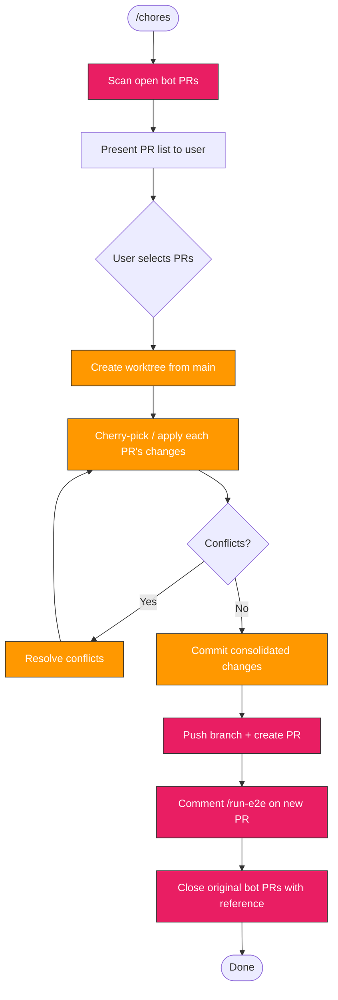

> Follow this diagram as the workflow.

# Chores: Consolidate Bot PRs

Scan open bot/dependency PRs, consolidate them into a single PR in a local worktree, trigger E2E, and close the originals.

## When to Use

- Dependabot or Renovate PRs are piling up
- Want to batch-test multiple dependency bumps together
- Weekly dependency grooming

## Step 1: Scan Bot PRs

Find all open PRs from bots (dependabot, renovate, github-actions):

```bash
gh pr list --repo kagenti/kagenti --state open \
  --json number,title,author,headRefName,createdAt,files \
  --jq '.[] | select(
    .author.login == "app/dependabot" or
    .author.login == "dependabot[bot]" or
    .author.login == "app/renovate" or
    .author.login == "renovate[bot]" or
    (.title | test("^(chore|build|ci)\\(deps"; "i"))
  )'
```

### Present to User

Format the results as a table:

```markdown
## Bot PRs Found

| # | PR | Title | Branch | Created |
|---|-----|-------|--------|---------|
| 1 | #NNN | chore(deps): Bump X from A to B | dependabot/... | YYYY-MM-DD |
| 2 | #NNN | chore(deps-dev): Bump Y from C to D | dependabot/... | YYYY-MM-DD |

**Total**: N PRs

Select which PRs to consolidate (default: all), or type PR numbers to exclude.
```

Wait for user confirmation before proceeding. The user may exclude some PRs (e.g., major version bumps that need manual review).

## Step 2: Create Worktree

Create a worktree from latest main for the consolidated work:

```bash
git fetch upstream main
git worktree add .worktrees/chores-deps -b chores/consolidate-deps upstream/main
```

Use date-based branch name if doing this regularly:

```bash
git worktree add .worktrees/chores-deps -b chores/deps-$(date +%Y-%m-%d) upstream/main
```

## Step 3: Apply Each PR's Changes

For each selected bot PR, fetch and cherry-pick or merge its changes into the worktree:

```bash
cd .worktrees/chores-deps

# For each PR, fetch its branch and cherry-pick
for PR_NUM in <selected-prs>; do
  BRANCH=$(gh pr view $PR_NUM --json headRefName --jq '.headRefName')
  git fetch origin $BRANCH

  # Cherry-pick the PR's commits (usually 1 commit for bot PRs)
  git cherry-pick FETCH_HEAD --no-commit
done

# Stage everything and create a single commit
git add -A
```

### Handling Conflicts

If cherry-picks conflict (e.g., two PRs touch the same lockfile):

1. Accept both changes — bot PRs are typically additive
2. For lockfile conflicts, regenerate: `cd kagenti/ui-v2 && npm install`
3. For Go modules: `go mod tidy`
4. Stage resolved files and continue

### Lockfile Strategy

When multiple PRs touch the same lockfile (package-lock.json, uv.lock):

```bash
# After cherry-picking all dependency changes to package.json / pyproject.toml:
cd kagenti/ui-v2 && npm install   # Regenerate package-lock.json
# or
uv lock                           # Regenerate uv.lock
```

This is cleaner than trying to merge lockfile diffs.

## Step 4: Commit

Create a single consolidated commit:

```bash
git commit -s -m "$(cat <<'EOF'
🌱 Consolidate dependency updates

Batched dependency bumps:
- <list each bump from PR titles>

Consolidates: #N1, #N2, #N3

Assisted-By: Claude (Anthropic AI) <noreply@anthropic.com>
EOF
)"
```

## Step 5: Push and Create PR

```bash
git push -u origin chores/deps-$(date +%Y-%m-%d)
```

Create the PR targeting main:

```bash
gh pr create --repo kagenti/kagenti --base main \
  --title "🌱 Consolidate dependency updates ($(date +%Y-%m-%d))" \
  --body "$(cat <<'EOF'
## Summary

Consolidates N bot dependency PRs into a single testable PR.

Batched updates:
- <bullet per original PR: #NNN title>

## Original PRs

These PRs will be closed after this PR passes CI:
- #N1
- #N2
- #N3

## Test plan

- [ ] CI passes (Kind E2E)
- [ ] HyperShift E2E passes (/run-e2e)
- [ ] No breaking changes in dependency updates
EOF
)"
```

## Step 6: Trigger E2E

Comment on the new PR to trigger E2E testing:

```bash
PR_NUMBER=$(gh pr view --json number --jq '.number')
gh pr comment $PR_NUMBER --body "/run-e2e"
```

## Step 7: Close Original PRs

After the consolidated PR is created (not merged — just created), close the original bot PRs with a reference:

```bash
for PR_NUM in <selected-prs>; do
  gh pr close $PR_NUM \
    --comment "Consolidated into #<new-pr-number>. Closing in favor of batched dependency update."
done
```

**IMPORTANT**: Ask user for confirmation before closing the original PRs. Some users may prefer to wait until the consolidated PR passes CI.

## Cleanup

After the consolidated PR is merged:

```bash
# Remove worktree
git worktree remove .worktrees/chores-deps

# Prune stale refs
git worktree prune
```

## Edge Cases

### Major Version Bumps

Major version bumps (e.g., vite 7.x -> 8.x) may need manual review. Flag these to the user:

```markdown
**Warning**: PR #NNN is a MAJOR version bump (X v7 -> v8).
This may require code changes. Include anyway? [y/N]
```

### PRs with CI Failures

Bot PRs that already fail CI should be flagged:

```bash
gh pr checks <PR_NUM> --json name,conclusion --jq '.[] | select(.conclusion == "FAILURE") | .name'
```

If a bot PR's CI is already failing, warn the user before including it.

### Non-Dependency Bot PRs

Some bot PRs are not dependency bumps (e.g., GitHub Actions version pins). Include them only if they're low-risk and the user agrees.

## Related Skills

- `github:prs` - PR health analysis
- `git:worktree` - Worktree management
- `git:commit` - Commit conventions
- `repo:pr` - PR format
- `ci:status` - Check CI results
- `git:rebase` - Rebase if needed
