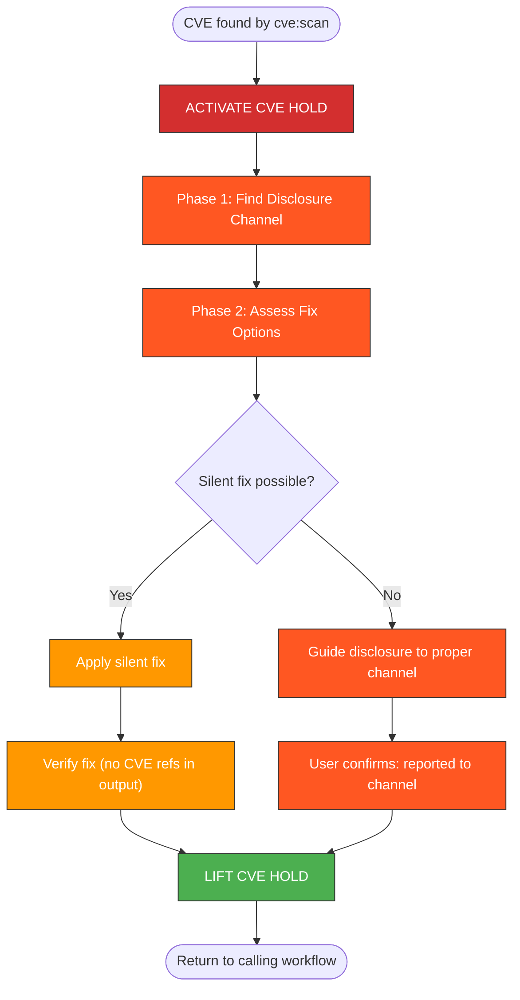

# CVE Brainstorm — Responsible Disclosure & Public Output Gate

When a CVE is detected by `cve:scan`, this skill guides responsible disclosure
and **blocks all public output** until the vulnerability is properly handled.

## CRITICAL SAFETY RULE

```
+===========================================================+
|                                                             |
|   CVE DISCLOSURE HOLD IS ACTIVE                             |
|                                                             |
|   ALL public GitHub actions are BLOCKED:                    |
|   - gh pr create / gh pr comment                            |
|   - gh issue create / gh issue comment                      |
|   - Commit messages containing CVE IDs                      |
|   - Any text containing vulnerability descriptions          |
|                                                             |
|   Accidental CVE disclosure:                                |
|   - Enables exploitation before patches exist               |
|   - Violates responsible disclosure agreements              |
|   - Causes legal and reputational harm                      |
|                                                             |
+===========================================================+
```

**This hold is NOT optional. It cannot be skipped or deferred.**

## Workflow



> Follow this diagram as the workflow.

## Phase 1: Disclosure Channel Discovery

For each affected dependency with a confirmed CVE:

### Step 1: Search for security policy

```
WebSearch: "<project-name> SECURITY.md responsible disclosure vulnerability report"
```

### Step 2: Check GitHub repo directly

```bash
# If the dependency is on GitHub
gh api repos/<owner>/<repo>/contents/SECURITY.md --jq '.content' | base64 -d 2>/dev/null
```

### Step 3: Present disclosure channel to user

For each CVE, present:

```
Disclosure Channel for <package>
================================
Project: <name> (<repo-url>)
Security policy: <SECURITY.md URL or "not found">
Report via: <email / form / GitHub Security Advisory>
Embargo: <timeline if documented, or "not specified">
```

If no security policy found:
```
No formal security policy found for <package>.
Options:
  1. Open a GitHub Security Advisory (private by default)
  2. Email the maintainer directly (check package metadata)
  3. Report to the ecosystem registry (PyPI, npm, etc.)
```

## Phase 2: Fix Assessment

Interactive brainstorm with user, one question at a time:

### Question 1: Fixed version available?

```
The CVE affects <package> <version>.

A fixed version exists: <fixed-version>
  -> Can we bump to <fixed-version> in this repo?

OR

No fixed version is available yet.
  -> We need to report and wait, or apply a workaround.
```

### Question 2: Can the fix be applied silently?

If a fix is available:

```
Silent fix options (commit messages that DON'T reference the CVE):

  1. Dependency bump:
     Commit: "Bump <package> to <version>"
     (No CVE reference - just a version update)

  2. Configuration change:
     Commit: "Update <config> for <package> compatibility"
     (Describes the config change, not the vulnerability)

  3. Code workaround:
     Commit: "Refactor <component> to use <alternative>"
     (Describes the behavior change, not the security issue)

Which approach fits this situation?
```

### Question 3: Does the fix change behavior?

```
Will bumping <package> from <old> to <new> change any behavior?

  If yes:
  - Tests must verify the new behavior
  - Test descriptions must NOT reference the CVE
  - Use neutral language: "test compatibility with <package> <version>"

  If no:
  - Straightforward bump, minimal risk
```

## Phase 3: Public Output Blocking (HARD GATE)

While the CVE hold is active, **REFUSE** the following actions:

### Blocked Actions

| Action | How to Block |
|--------|-------------|
| `gh pr create` | Do not run. Say: "CVE hold active. Cannot create PR until resolved." |
| `gh pr comment` | Do not run. Say: "CVE hold active. Cannot comment on PR until resolved." |
| `gh issue create` | Do not run. Say: "CVE hold active. Cannot create issue until resolved." |
| `gh issue comment` | Do not run. Say: "CVE hold active. Cannot comment on issue until resolved." |
| Commit with CVE ID | Scan commit message for `CVE-\d{4}-\d+` pattern. If found, refuse and suggest neutral wording. |
| Write CVE to git-tracked file | Before any Write/Edit to a git-tracked file, scan content for CVE references. Block if found. |

### Allowed Actions

| Action | Why Allowed |
|--------|-------------|
| Local code changes | Not public |
| `git commit` with clean message | No CVE exposure if message is neutral |
| `git push` of clean commits | Pushing a dependency bump is fine |
| Write to `/tmp/` | Not public, not git-tracked |
| Local test runs | Not public |
| WebSearch for disclosure info | Research, not publication |

### CVE Reference Detection

Before ANY public output, scan for these patterns:
- `CVE-\d{4}-\d+` (CVE IDs)
- Words: "vulnerability", "exploit", "security flaw", "attack vector"
- Specific vulnerability class names when combined with the affected package name

If detected, **STOP** and rewrite using neutral language.

## Phase 4: Resolution

The CVE hold is resolved when the user confirms ONE of:

### Resolution 1: Reported to proper channel

```
User: "CVE reported to <channel>"

Response:
  CVE hold lifted.
  - Reported to: <channel>
  - Embargo: <timeline if known>

  You may now proceed with public GitHub actions.
  REMINDER: Do NOT reference the CVE in public until the embargo lifts.
```

### Resolution 2: Fixed silently

```
User: "CVE fixed, bumped to <version>"

Response:
  CVE hold lifted.
  - Fix: bumped <package> to <version>
  - Commit message: <the neutral message used>

  Verify: commit message and PR description contain no CVE references.
  You may now proceed.
```

### Resolution 3: False positive

```
User: "False positive, not a real CVE"

Response:
  CVE hold lifted.
  - Reason: false positive
  - Evidence: <user's explanation>

  You may now proceed.
```

### Resolution 4: User override

```
User: "CVE hold resolved" (explicit override)

Response:
  WARNING: Lifting CVE hold by user override.
  - No disclosure confirmed
  - No fix confirmed

  Ensure you have handled this CVE through appropriate channels
  before publishing any related work.

  CVE hold lifted.
```

## Anti-Patterns

| Don't | Do Instead |
|-------|------------|
| Include CVE ID in commit message | Use neutral wording: "Bump X to Y" |
| Describe vulnerability in PR | Describe the change: "Update dependency" |
| Post CVE details in issue comment | Report through security channel first |
| Skip the hold because "it's just a bump" | Even bumps need clean messages |
| Mention "security fix" in public | Say "compatibility update" or "dependency update" |
| Link to NVD/advisory in PR | Keep links in `/tmp/` notes only |

## Related Skills

- `cve:scan` - Detection engine that triggers this skill
- `tdd:ci` - Calling workflow (Phase 3.5 gate)
- `git:commit` - Commit conventions (CVE ID check added)
