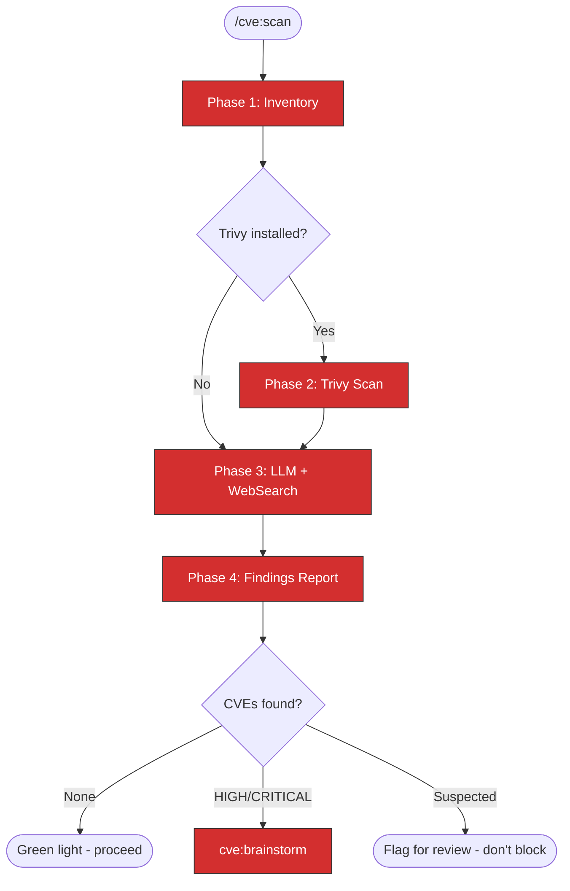

# CVE Scan

Hybrid CVE scanning that combines Trivy (when available), LLM knowledge, and
web searches to detect known vulnerabilities in project dependencies.

## IMPORTANT: Output Safety

- Scan results are written to `/tmp/kagenti/cve/` ONLY
- **NEVER** write CVE details to git-tracked files
- **NEVER** include CVE IDs in commit messages, PR descriptions, or issue comments
- Display findings to user in terminal only

## Workflow



> Follow this diagram as the workflow.

## Phase 1: Inventory

Identify all dependency sources in the working tree.

### Step 1: Create working directory

```bash
mkdir -p /tmp/kagenti/cve
```

### Step 2: Find dependency files

Search for dependency manifests:

```bash
# Python
find . -maxdepth 3 -name "pyproject.toml" -o -name "requirements*.txt" -o -name "uv.lock" | head -20
```

```bash
# Node
find . -maxdepth 3 -name "package.json" -o -name "package-lock.json" | head -20
```

```bash
# Go
find . -maxdepth 3 -name "go.mod" -o -name "go.sum" | head -20
```

```bash
# Containers
find . -maxdepth 3 -name "Dockerfile" -o -name "Containerfile" | head -20
```

```bash
# Helm
find . -maxdepth 3 -path "*/charts/*/Chart.yaml" | head -20
```

### Step 3: Extract dependency list

Read each dependency file found. For each, extract:
- Package name
- Pinned version (or version constraint)
- Ecosystem (PyPI, npm, Go, container base image, Helm chart)

Save inventory to `/tmp/kagenti/cve/inventory.txt` (local only).

## Phase 2: Trivy Scan (if available)

### Step 1: Check for Trivy

```bash
which trivy 2>/dev/null && trivy --version
```

If not installed, log: "Trivy not available, skipping to Phase 3 (LLM + WebSearch)."

### Step 2: Run filesystem scan

```bash
trivy fs --severity HIGH,CRITICAL --format json --output /tmp/kagenti/cve/trivy-fs.json .
```

### Step 3: Run container image scan (if Dockerfiles found)

For each Dockerfile found in Phase 1, extract the base image and scan:

```bash
# Extract base image
grep "^FROM" Dockerfile | awk '{print $2}'
```

```bash
trivy image --severity HIGH,CRITICAL --format json --output /tmp/kagenti/cve/trivy-image.json <image>
```

### Step 4: Parse Trivy results

Read the JSON output. For each finding, extract:
- Package name and version
- CVE ID
- Severity (HIGH/CRITICAL)
- Fixed version (if available)
- Description (store locally only)

## Phase 3: LLM + WebSearch Analysis

For each dependency + version from Phase 1 inventory:

### Step 1: LLM knowledge check

Review the dependency name and version against training data. Flag any packages
with known CVE history in the version range being used.

### Step 2: WebSearch verification

For each dependency flagged by LLM or Trivy, and for all HIGH-risk dependencies
(crypto libraries, auth libraries, serialization libraries, network libraries):

```
WebSearch: "<package-name> <version> CVE site:nvd.nist.gov OR site:osv.dev OR site:github.com/advisories"
```

### Step 3: Cross-reference

- If Trivy found a CVE, verify with WebSearch (confirm it's real and active)
- If LLM suspects a CVE, verify with WebSearch (confirm or eliminate)
- If WebSearch finds something new, add to findings

### Step 4: Classify findings

| Confidence | Criteria | Action |
|------------|----------|--------|
| Confirmed | Trivy + WebSearch agree, or WebSearch finds NVD entry | Report as confirmed |
| Suspected | LLM flags but WebSearch inconclusive | Report as suspected |
| False positive | WebSearch shows fixed/not-applicable | Exclude from report |

## Phase 4: Findings Report

### Step 1: Generate report

Write findings to `/tmp/kagenti/cve/scan-<timestamp>.json`:

```json
{
  "timestamp": "<ISO-8601>",
  "working_directory": "<path>",
  "trivy_available": true,
  "findings": [
    {
      "package": "<name>",
      "version": "<installed-version>",
      "ecosystem": "pypi|npm|go|container|helm",
      "cve_id": "CVE-YYYY-NNNNN",
      "severity": "HIGH|CRITICAL",
      "confidence": "confirmed|suspected",
      "fixed_version": "<version-or-null>",
      "source_url": "<NVD/OSV/advisory-URL>",
      "description": "<brief-description>"
    }
  ],
  "summary": {
    "total_dependencies": 0,
    "critical_cves": 0,
    "high_cves": 0,
    "suspected": 0
  }
}
```

### Step 2: Display summary to user

Show in terminal (NOT in any file that gets committed):

```
CVE Scan Results
================
Scanned: <N> dependencies
Trivy: <available/not-available>

CRITICAL: <N> findings
HIGH:     <N> findings
Suspected: <N> (need manual review)

[For each confirmed finding:]
  <package> <version> - <severity> - fixed in <version>
```

### Step 3: Route based on results

| Result | Action |
|--------|--------|
| No findings | "No CVEs detected. Proceeding." |
| Confirmed HIGH/CRITICAL | Invoke `cve:brainstorm` immediately |
| Suspected only | "Suspected CVEs flagged for review. Proceed with caution." |

## When Invoked as a Gate

When `cve:scan` is invoked by another skill (tdd:ci, rca:*, etc.) as a gate:

- **Clean scan** -> return control to the calling skill, proceed
- **Findings detected** -> invoke `cve:brainstorm`, **BLOCK** the calling skill
  from proceeding to public output until the hold is resolved
- The calling skill must NOT proceed past the CVE gate until `cve:brainstorm`
  resolves the hold

## Related Skills

- `cve:brainstorm` - Disclosure planning when CVEs are found
- `tdd:ci` - Invokes this at Phase 3.5
- `tdd:hypershift` - Invokes this pre-deploy
- `tdd:kind` - Invokes this pre-deploy
- `rca:ci` - Invokes this at Phase 5
