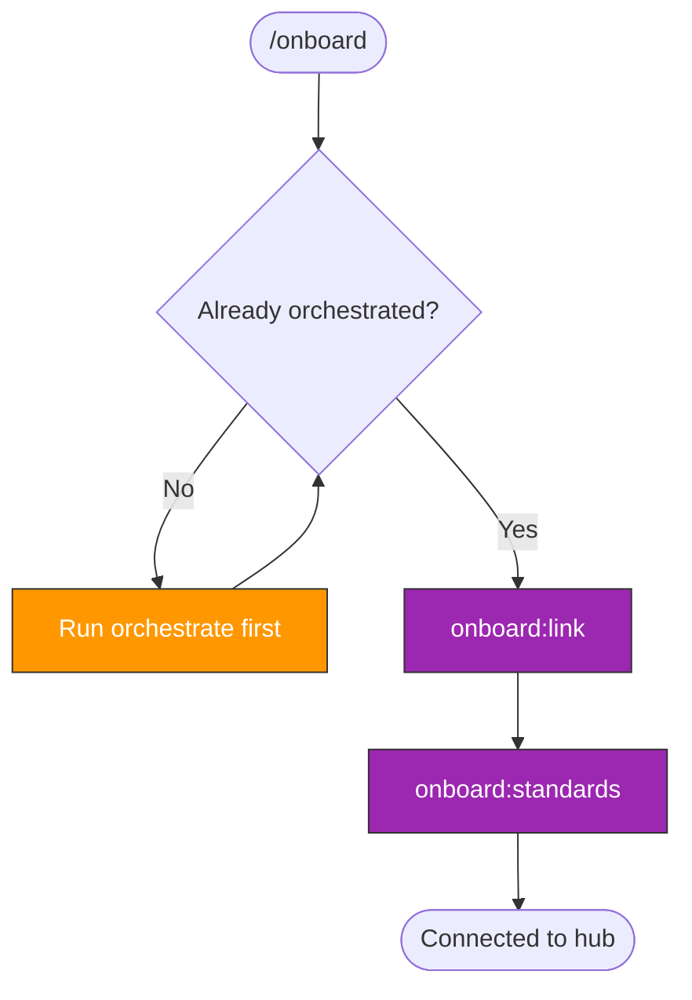

> Follow this diagram as the workflow.

# Onboard

Connect an orchestrated repository to kagenti/kagenti as the hub.

## Onboard vs Orchestrate

- **orchestrate** is generic — works on any repository to add CI, tests, skills.
  Does not assume the target is related to kagenti.
- **onboard** is kagenti-specific — clones the repo into `.repos/`, applies
  kagenti conventions, and registers it in the hub inventory.

Run `orchestrate` first, then `onboard` to complete the connection.

## Prerequisites

Target repo must have completed at least:

1. `orchestrate:scan` — CLAUDE.md exists
2. `orchestrate:precommit` — pre-commit hooks installed

## Sub-Skills

| Skill | Description |
|-------|-------------|
| `onboard:link` | Clone into `.repos/`, verify skill discovery |
| `onboard:standards` | Apply kagenti commit format, PR/issue templates |

## Workflow

1. Verify the target repo has been orchestrated
2. Run `onboard:link` — clone into `.repos/`, register in inventory
3. Run `onboard:standards` — apply kagenti conventions via PR

## Related Skills

- `onboard:link` — Clone and register in hub
- `onboard:standards` — Apply kagenti conventions
- `orchestrate` — Generic repo enhancement (prerequisite)
