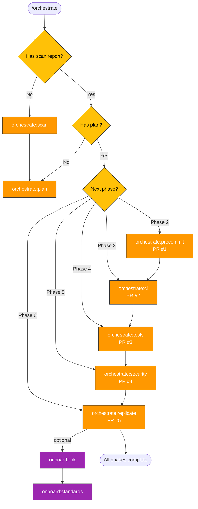

> Follow this diagram as the workflow.

# Orchestrate Skills

Enhance any repository with CI, tests, skills, and security through a series of phased PRs. Each phase produces a focused, reviewable PR of 600-700 lines.

## Entry Point Routing

When `/orchestrate` is invoked, determine the action:

```
What was provided?
    |
    +-- /orchestrate <repo-path>
    |     New target. Clone or locate the repo, then start from scan.
    |     Example: /orchestrate .repos/my-service
    |
    +-- /orchestrate <phase>
    |     Jump to a specific phase. Requires scan + plan to already exist.
    |     Example: /orchestrate ci
    |
    +-- /orchestrate status
          Show current orchestration state for all tracked targets.
```

### Route logic

1. **`/orchestrate <repo-path>`** -- If the path points to a git repository, derive the target name from the directory basename. Check `/tmp/kagenti/orchestrate/<target>/` for existing state. If no scan report exists, invoke `orchestrate:scan`. If scan exists but no plan, invoke `orchestrate:plan`. If both exist, determine the next incomplete phase and invoke it.

2. **`/orchestrate <phase>`** -- Validate that `scan-report.md` and `plan.md` exist for the current target. If missing, instruct the user to run `/orchestrate <repo-path>` first. Otherwise invoke the requested phase skill directly (e.g., `orchestrate:precommit`).

3. **`/orchestrate status`** -- List all directories under `/tmp/kagenti/orchestrate/`, read each target's `phase-status.md`, and display a summary table showing target name, current phase, and completion percentage.

## Phase Status Tracking

All orchestration state is persisted under `/tmp/kagenti/orchestrate/<target>/`:

| File | Purpose |
|------|---------|
| `scan-report.md` | Output of `orchestrate:scan` -- repo structure, tech stack, gaps |
| `plan.md` | Output of `orchestrate:plan` -- enhancement plan with phases and PR scope |
| `phase-status.md` | Tracks which phases are complete, in-progress, or pending |

The `phase-status.md` file uses this format:

```markdown
# Orchestration Status: <target>

| Phase | Status | PR | Updated |
|-------|--------|----|---------|
| scan | complete | -- | 2025-01-15 |
| plan | complete | -- | 2025-01-15 |
| precommit | complete | #42 | 2025-01-16 |
| ci | in-progress | #43 | 2025-01-17 |
| tests | pending | -- | -- |
| security | pending | -- | -- |
| replicate | pending | -- | -- |
```

Each phase skill is responsible for updating `phase-status.md` when it starts and completes.

## Phase Overview

| Phase | Skill | PR | Description |
|-------|-------|-----|-------------|
| 0 | orchestrate:scan | -- | Assess target repo structure, tech stack, and gaps |
| 1 | orchestrate:plan | -- | Brainstorm enhancements and produce a phased plan |
| 2 | orchestrate:precommit | PR #1 | Pre-commit hooks, linting, and code formatting |
| 3 | orchestrate:ci | PR #2 | CI workflows (GitHub Actions or equivalent) |
| 4 | orchestrate:tests | PR #3 | Test infrastructure and initial test coverage |
| 5 | orchestrate:security | PR #4 | Security hardening (CODEOWNERS, scanning, policies) |
| 6 | orchestrate:replicate | PR #5 | Bootstrap Claude Code skills into the target repo |

Phases are sequential. Each PR builds on the previous one. The scan and plan phases do not produce PRs -- they produce artifacts that guide all subsequent phases.

## Self-Replication

Phase 6 (`orchestrate:replicate`) is what makes this system fractal. It copies a starter set of Claude Code skills into the target repository, including a tailored version of the orchestrate skill itself. Once replicated, the target repo can orchestrate other repos using the same phased approach.

This means every repository that goes through orchestration gains the ability to orchestrate others. The skills adapt to the target's tech stack (the scan report informs what language-specific linters, test frameworks, and CI patterns to use).

## Quick Start

```bash
# Clone target repo into a working directory
git clone git@github.com:org/repo.git .repos/repo-name

# Run the full orchestration pipeline
# /orchestrate .repos/repo-name

# Or jump to a specific phase (if scan + plan already exist)
# /orchestrate precommit

# Check status across all targets
# /orchestrate status
```

## Related Skills

### Orchestrate sub-skills

| Skill | Description |
|-------|-------------|
| `orchestrate:scan` | Assess target repo structure and identify gaps |
| `orchestrate:plan` | Produce a phased enhancement plan |
| `orchestrate:precommit` | Add pre-commit hooks, linters, formatters |
| `orchestrate:ci` | Add CI workflows and pipeline configuration |
| `orchestrate:tests` | Add test infrastructure and initial test coverage |
| `orchestrate:security` | Add security hardening (CODEOWNERS, scanning) |
| `orchestrate:replicate` | Bootstrap Claude Code skills into the target |

### Onboard skills

| Skill | Description |
|-------|-------------|
| `onboard:link` | Link a newly-orchestrated repo to Kagenti |
| `onboard:standards` | Apply organizational standards and conventions |
