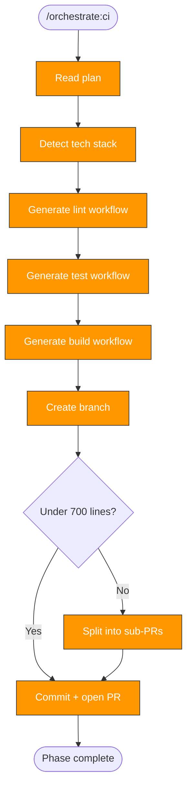

> Follow this diagram as the workflow.

# Orchestrate: CI

Add GitHub Actions CI workflows to a target repository. This is Phase 4 and
produces PR #3 — automated checks on every push and PR. Comes after tests
so CI can run the test suite established in the previous phase.

## When to Use

- After `orchestrate:plan` identifies CI as a needed phase
- After precommit and tests phases (so CI can run the test suite)

## Prerequisites

- Plan exists at `/tmp/kagenti/orchestrate/<target>/plan.md`
- Target repo in `.repos/<target>/`

## Workflow Templates by Language

### Python

**`.github/workflows/lint.yml`**
- Trigger: PR and push to main
- Steps: checkout, setup-python, install deps, `ruff check .`
- Cache: pip cache

**`.github/workflows/test.yml`**
- Trigger: PR and push to main
- Steps: checkout, setup-python, install deps, `pytest -v`
- Cache: pip cache
- Optional: coverage report upload

**`.github/workflows/build.yml`**
- Trigger: PR and push to main
- Steps: checkout, setup-python, `uv build`

### Go

**`.github/workflows/lint.yml`**
- Trigger: PR and push to main
- Steps: checkout, setup-go, `golangci-lint run`
- Cache: go module cache

**`.github/workflows/test.yml`**
- Trigger: PR and push to main
- Steps: checkout, setup-go, `go test ./... -v`
- Cache: go module cache

**`.github/workflows/build.yml`**
- Trigger: PR and push to main
- Steps: checkout, setup-go, `go build ./...`

### Node

**`.github/workflows/lint.yml`**
- Steps: checkout, setup-node, `npm ci`, `npm run lint`
- Cache: npm cache

**`.github/workflows/test.yml`**
- Steps: checkout, setup-node, `npm ci`, `npm test`

**`.github/workflows/build.yml`**
- Steps: checkout, setup-node, `npm ci`, `npm run build`

### Ansible

**`.github/workflows/lint.yml`**
- Steps: checkout, setup-python, `pip install ansible-lint`, `ansible-lint`

**`.github/workflows/test.yml`**
- Steps: checkout, setup-python, install molecule, `molecule test`

## Common Patterns

All workflows should include:

- **Trigger**: `on: pull_request` and `on: push: branches: [main]`
- **Caching**: Language-appropriate dependency caching
- **Permissions**: Minimal `contents: read`
- **Timeout**: `timeout-minutes: 15` (prevent hung jobs)

For simpler repos, combine lint + test + build into a single `ci.yml`.

## Skills to Push Alongside

Include in the target's `.claude/skills/`:
- `ci:status` — Check CI pipeline status
- `rca:ci` — Root cause analysis from CI logs

## Branch and PR Workflow

```bash
git -C .repos/<target> checkout -b orchestrate/ci
```

### PR size check

```bash
git -C .repos/<target> diff --stat | tail -1
```

Target ~600-700 lines. If over 700, split lint + test + build into separate PRs.

### Commit and push

```bash
git -C .repos/<target> add -A
```

```bash
git -C .repos/<target> commit -s -m "feat: add CI workflows for lint, test, and build"
```

```bash
git -C .repos/<target> push -u origin orchestrate/ci
```

### Create PR

```bash
gh pr create --repo org/repo --title "Add CI workflows" --body "Phase 3 of repo orchestration. Adds GitHub Actions for lint, test, and build."
```

## Update Phase Status

Set ci to `complete` in `/tmp/kagenti/orchestrate/<target>/phase-status.md`.

## Related Skills

- `orchestrate` — Parent router
- `orchestrate:tests` — Previous phase (test suite to run in CI)
- `orchestrate:plan` — Defines CI phase tasks
- `orchestrate:security` — Next phase: security hardening
- `ci:status` — Monitor CI pipelines
- `rca:ci` — Debug CI failures
