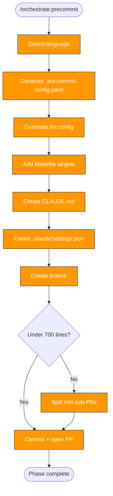

> Follow this diagram as the workflow.

# Orchestrate: Pre-commit

Establish the code quality baseline for a target repo. This is Phase 2 and
produces PR #1 — the foundation that validates all subsequent PRs.

## When to Use

- After `orchestrate:plan` identifies precommit as a needed phase
- Always the first PR-producing phase

## Prerequisites

- Plan exists at `/tmp/kagenti/orchestrate/<target>/plan.md`
- Target repo cloned in `.repos/<target>/`

## Step 1: Detect Language

Use the scan report or check directly:

```bash
ls .repos/<target>/go.mod .repos/<target>/pyproject.toml .repos/<target>/package.json .repos/<target>/requirements.yml 2>/dev/null
```

## Step 2: Generate Pre-commit Config

Create `.pre-commit-config.yaml` with language-appropriate hooks.

### Python hooks

- `ruff` — lint + format
- `trailing-whitespace`, `end-of-file-fixer`, `check-yaml`
- `check-added-large-files`

### Go hooks

- `golangci-lint`
- `gofmt`, `govet`
- `trailing-whitespace`, `end-of-file-fixer`

### Node hooks

- `eslint`, `prettier`
- `trailing-whitespace`, `end-of-file-fixer`

### Ansible hooks

- `ansible-lint`, `yamllint`
- `trailing-whitespace`, `end-of-file-fixer`

## Step 3: Generate Lint Config

### Python (`pyproject.toml`)

```toml
[tool.ruff]
line-length = 120
target-version = "py311"

[tool.ruff.lint]
select = ["E", "F", "I", "W"]
```

### Go (`.golangci.yml`)

```yaml
linters:
  enable:
    - errcheck
    - govet
    - staticcheck
    - unused
run:
  timeout: 5m
```

### Node (`.eslintrc.json`)

```json
{
  "extends": ["eslint:recommended"],
  "env": { "node": true, "es2022": true }
}
```

## Step 4: Add Makefile Targets

If no Makefile exists, create one. If it exists, add targets:

```makefile
.PHONY: lint fmt

lint:
	pre-commit run --all-files

fmt:
	# language-specific formatter command
```

## Step 5: Create CLAUDE.md

Template for the target repo:

```markdown
# <Repo Name>

## Overview
<brief description from README or scan>

## Repository Structure
<key directories and their purpose>

## Key Commands
| Task | Command |
|------|---------|
| Lint | `make lint` |
| Format | `make fmt` |
| Test | <detected test command> |
| Build | <detected build command> |

## Code Style
- <language> with <linter>
- Pre-commit hooks: `pre-commit install`
- Sign-off required: `git commit -s`
```

## Step 6: Create .claude/settings.json

```json
{
  "permissions": {
    "allow": [
      "Bash(git status:*)",
      "Bash(git log:*)",
      "Bash(git diff:*)",
      "Bash(git branch:*)",
      "Bash(ls:*)",
      "Bash(cat:*)",
      "Bash(find:*)",
      "Bash(make lint:*)",
      "Bash(make fmt:*)",
      "Bash(pre-commit run:*)"
    ]
  }
}
```

## Step 7: Create Branch and PR

Create branch in the target repo:

```bash
git -C .repos/<target> checkout -b orchestrate/precommit
```

### PR size check

```bash
git -C .repos/<target> diff --stat | tail -1
```

Target ~600-700 lines. Split if over 700.

### Skills to push alongside

Include initial skills in `.claude/skills/` within the target repo:
- `repo:commit` — commit message conventions adapted for the target

### Commit and push

```bash
git -C .repos/<target> add -A
```

```bash
git -C .repos/<target> commit -s -m "feat: add pre-commit hooks, linting, and Claude Code setup"
```

```bash
git -C .repos/<target> push -u origin orchestrate/precommit
```

### Create PR

```bash
gh pr create --repo org/repo --title "Add pre-commit hooks and code quality baseline" --body "Phase 2 of repo orchestration. Adds pre-commit hooks, linting config, CLAUDE.md, and .claude/ setup."
```

## Update Phase Status

Update `/tmp/kagenti/orchestrate/<target>/phase-status.md`:
- Set precommit to `complete`
- Record PR number and date

## Related Skills

- `orchestrate` — Parent router
- `orchestrate:scan` — Provides tech stack detection
- `orchestrate:plan` — Defines precommit phase tasks
- `orchestrate:tests` — Next phase: test infrastructure
