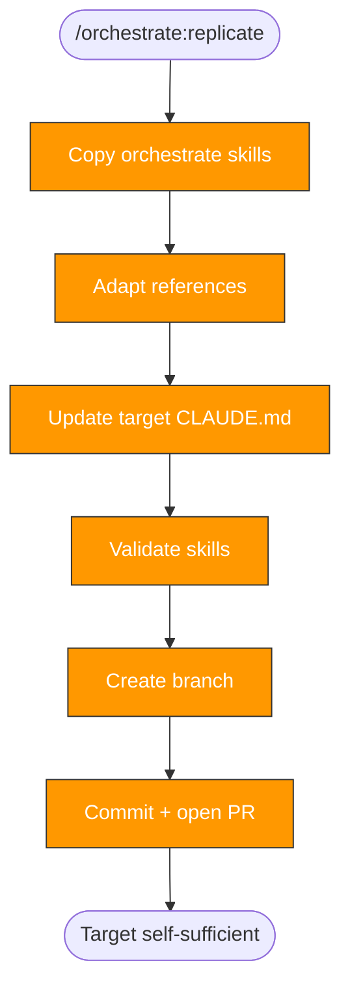

> Follow this diagram as the workflow.

# Orchestrate: Replicate

The final orchestration phase. Copies orchestrate skills into the target repo,
making it fully self-sufficient. This is Phase 6.

## When to Use

- Final phase of orchestration
- After at least precommit + CI phases are complete
- When you want the target repo to orchestrate its own related repos

## Prerequisites

- `orchestrate:precommit` and `orchestrate:ci` complete (at minimum)
- Target repo has `.claude/` directory

## What Gets Copied

| Skill | Purpose |
|-------|---------|
| `orchestrate/` | Router — entry point |
| `orchestrate:scan/` | Assess repos |
| `orchestrate:plan/` | Create phased plans |
| `orchestrate:precommit/` | Add pre-commit hooks |
| `orchestrate:ci/` | Add CI workflows |
| `orchestrate:tests/` | Add test infrastructure |
| `orchestrate:security/` | Add security hardening |
| `orchestrate:replicate/` | This skill (self!) |
| `skills:scan/` | Discover skills in a repo |
| `skills:write/` | Author new skills |
| `skills:validate/` | Validate skill structure |

## Adaptation Steps

After copying, adapt the skills:

1. **Remove source-specific references** — strip kagenti-specific paths or
   assumptions that don't apply
2. **Verify frontmatter** — every `name:` field must match its directory name
3. **Update Related Skills** — only reference skills that exist in the copied set
4. **Preserve generality** — skills should work in any repo context

## Update Target CLAUDE.md

Add an orchestration section:

```markdown
## Orchestration

This repo includes orchestrate skills for enhancing related repos:

| Skill | Description |
|-------|-------------|
| `orchestrate` | Run `/orchestrate <repo-path>` to start |
| `orchestrate:scan` | Assess repo structure and gaps |
| `orchestrate:plan` | Create phased enhancement plan |
| `orchestrate:replicate` | Bootstrap skills into target |
```

## The Fractal Concept

This phase makes the system self-replicating:

1. **Repo A** orchestrates **Repo B** through all phases
2. Phase 6 copies orchestrate skills into **Repo B**
3. **Repo B** can now orchestrate **Repo C**
4. **Repo C** can orchestrate **Repo D**, and so on

Each copy is independent. No runtime dependency on the original hub. The
skills adapt to whatever tech stack the scan discovers.

## Validation

After copying, verify:

1. **Frontmatter match** — `name:` matches directory for each skill
2. **No broken references** — Related Skills point to existing skills
3. **No source-specific content** — grep for original repo name
4. **Structure** — every directory has exactly one `SKILL.md`

## Branch and PR Workflow

```bash
git -C .repos/<target> checkout -b orchestrate/replicate
```

```bash
git -C .repos/<target> add .claude/skills/orchestrate* .claude/skills/skills*
```

```bash
git -C .repos/<target> commit -s -m "feat: bootstrap orchestrate skills for self-sufficient orchestration"
```

```bash
git -C .repos/<target> push -u origin orchestrate/replicate
```

## Related Skills

- `orchestrate` — Parent router
- `orchestrate:security` — Previous phase
- `skills:scan` — Discover skills (gets copied)
- `skills:write` — Author skills (gets copied)
- `skills:validate` — Validate skills (gets copied)
