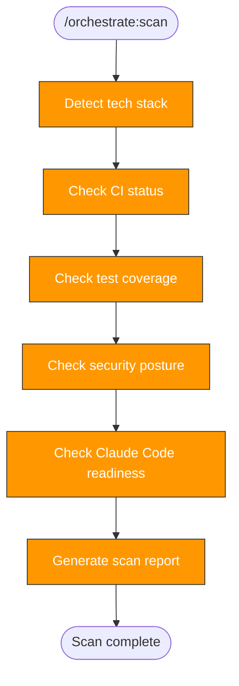

> Follow this diagram as the workflow.

# Orchestrate: Scan

Assess a target repository's current state to determine what orchestration
phases are needed. This is Phase 0 — produces artifacts only, no PRs.

## When to Use

- First step when orchestrating a new repo
- Re-run after major changes to reassess gaps
- Before running `orchestrate:plan`

## Prerequisites

Target repo cloned into `.repos/<target>/`:

```bash
git clone git@github.com:org/repo.git .repos/<target>
```

## Technology Detection

Check for marker files to identify the tech stack:

```bash
ls .repos/<target>/go.mod .repos/<target>/pyproject.toml .repos/<target>/package.json .repos/<target>/Cargo.toml .repos/<target>/requirements.yml 2>/dev/null
```

| Marker | Language | Lint Tool | Test Tool | Build Tool |
|--------|----------|-----------|-----------|------------|
| `go.mod` | Go | golangci-lint | go test | go build |
| `pyproject.toml` | Python | ruff | pytest | uv build |
| `package.json` | Node.js | eslint | jest/vitest | npm build |
| `Cargo.toml` | Rust | clippy | cargo test | cargo build |
| `requirements.yml` | Ansible | ansible-lint | molecule | — |

## Scan Checks

### CI Status

```bash
ls .repos/<target>/.github/workflows/ 2>/dev/null
```

Check what each workflow covers (lint, test, build, security).

### Test Coverage

```bash
find .repos/<target> -type d \( -name "tests" -o -name "test" -o -name "__tests__" \) 2>/dev/null
```

```bash
find .repos/<target> -type f \( -name "test_*.py" -o -name "*_test.go" -o -name "*.test.*" \) 2>/dev/null | wc -l
```

### Pre-commit Hooks

```bash
ls .repos/<target>/.pre-commit-config.yaml 2>/dev/null
```

### Security Posture

```bash
ls .repos/<target>/CODEOWNERS .repos/<target>/.github/dependabot.yml .repos/<target>/.github/workflows/scorecard.yml 2>/dev/null
```

### Claude Code Readiness

```bash
ls .repos/<target>/CLAUDE.md .repos/<target>/.claude/settings.json 2>/dev/null
```

```bash
ls .repos/<target>/.claude/skills/ 2>/dev/null
```

### Git Health

```bash
git -C .repos/<target> log --oneline -5
```

```bash
git -C .repos/<target> remote -v
```

## Output Format

Save scan report to `/tmp/kagenti/orchestrate/<target>/scan-report.md`:

```bash
mkdir -p /tmp/kagenti/orchestrate/<target>
```

Report template:

```markdown
# Scan Report: <target>

**Date:** YYYY-MM-DD
**Tech Stack:** <language>

## CI Status
- Workflows found: [list or "none"]
- Covers: lint / test / build / security

## Test Coverage
- Test directories: [list or "none"]
- Test file count: N
- Framework: [detected or "none"]

## Pre-commit
- Config found: yes/no
- Hooks: [list or "none"]

## Security Posture
- CODEOWNERS: yes/no
- Dependabot: yes/no
- Scorecard: yes/no
- .gitignore secrets patterns: adequate/needs-review

## Claude Code Readiness
- CLAUDE.md: yes/no
- .claude/settings.json: yes/no
- Skills count: N

## Gap Summary
| Area | Status | Action Needed |
|------|--------|---------------|
| Pre-commit | missing/partial/ok | orchestrate:precommit |
| CI | missing/partial/ok | orchestrate:ci |
| Tests | missing/partial/ok | orchestrate:tests |
| Security | missing/partial/ok | orchestrate:security |
| Skills | missing/partial/ok | orchestrate:replicate |

## Recommended Phases
1. [ordered list of phases based on gaps]
```

## Gap Analysis

Determine which phases are needed based on findings:

| Finding | Phase Needed |
|---------|-------------|
| No `.pre-commit-config.yaml` | `orchestrate:precommit` |
| No CI workflows or missing lint/test | `orchestrate:ci` |
| No test directory or <5 test files | `orchestrate:tests` |
| No CODEOWNERS or dependabot | `orchestrate:security` |
| No `.claude/skills/` | `orchestrate:replicate` |

All repos get `orchestrate:precommit` (foundation) and `orchestrate:replicate`
(self-sufficiency). Other phases depend on the scan results.

## Related Skills

- `orchestrate` — Parent router
- `orchestrate:plan` — Next step: create phased plan from scan results
- `skills:scan` — Similar pattern for scanning skills specifically
