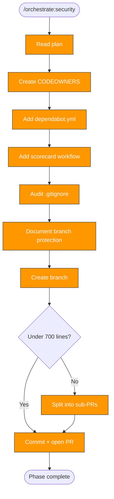

> Follow this diagram as the workflow.

# Orchestrate: Security

Add security hardening to a target repository. This is Phase 5 and produces
PR #4.

## When to Use

- After `orchestrate:plan` identifies security as a needed phase
- After precommit, tests, and CI phases (test coverage provides safety net for code changes)

## Prerequisites

- Plan exists with security phase
- Target repo in `.repos/<target>/`

## Step 1: CODEOWNERS

Create `CODEOWNERS` at repo root or `.github/CODEOWNERS`:

```
# Default owners for everything
* @org/team-leads

# Platform and CI
.github/ @org/platform
Makefile @org/platform

# Documentation
docs/ @org/docs-team
```

Adapt teams and paths based on the scan report.

## Step 2: Dependabot Configuration

Create `.github/dependabot.yml`:

```yaml
version: 2
updates:
  - package-ecosystem: "github-actions"
    directory: "/"
    schedule:
      interval: "weekly"
```

Add language-specific ecosystems detected in the scan:
- Python: `pip`
- Go: `gomod`
- Node: `npm`
- Only include ecosystems present in the repo

## Step 3: OpenSSF Scorecard Workflow

Create `.github/workflows/scorecard.yml`:

```yaml
name: Scorecard
on:
  push:
    branches: [main]
  schedule:
    - cron: "30 1 * * 1"

permissions: read-all

jobs:
  analysis:
    runs-on: ubuntu-latest
    permissions:
      security-events: write
      id-token: write
    steps:
      - uses: actions/checkout@v4
        with:
          persist-credentials: false
      - uses: ossf/scorecard-action@v2
        with:
          results_file: results.sarif
          results_format: sarif
          publish_results: true
      - uses: actions/upload-artifact@v4
        with:
          name: scorecard-results
          path: results.sarif
```

## Step 4: .gitignore Audit

Check for missing secrets patterns and add them:

**Secrets and credentials:**
- `.env`, `.env.*`, `.env.local`
- `*.key`, `*.pem`, `*.p12`, `*.jks`
- `credentials.*`, `secrets.*`

**IDE and OS files:**
- `.idea/`, `.vscode/`
- `.DS_Store`, `Thumbs.db`

Do not remove existing patterns. Only add missing ones.

## Step 5: Branch Protection Recommendations

Document in the PR description (can't auto-apply via PR):

- Require PR reviews (minimum 1 approval)
- Require status checks to pass
- Require signed commits
- Disable force push to main
- Require branches to be up to date

## Branch and PR Workflow

```bash
git -C .repos/<target> checkout -b orchestrate/security
```

### PR size check

```bash
git -C .repos/<target> diff --stat | tail -1
```

### Commit and push

```bash
git -C .repos/<target> add -A
```

```bash
git -C .repos/<target> commit -s -m "feat: add security hardening (CODEOWNERS, dependabot, scorecard)"
```

```bash
git -C .repos/<target> push -u origin orchestrate/security
```

## Update Phase Status

Set security to `complete` in phase-status.md.

## Related Skills

- `orchestrate` — Parent router
- `orchestrate:ci` — Previous phase
- `orchestrate:plan` — Defines security phase tasks
- `orchestrate:replicate` — Next phase: bootstrap skills
