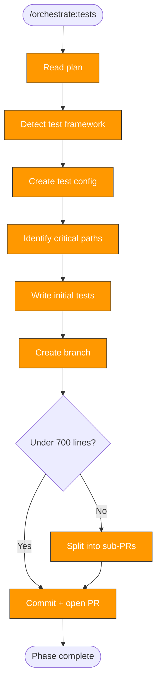

> Follow this diagram as the workflow.

# Orchestrate: Tests

Add test infrastructure and initial test coverage. This is Phase 3 and
produces PR #2. Tests come before CI and security — good test coverage is
a safety net for the code refactoring that security/quality fixes require.

## When to Use

- After `orchestrate:plan` identifies tests as a needed phase
- After precommit phase (linting is the foundation)

## Prerequisites

- Plan exists with tests phase
- Target repo in `.repos/<target>/`

## Step 1: Detect Test Framework

| Marker | Language | Framework | Assertion |
|--------|----------|-----------|-----------|
| `pyproject.toml` | Python | pytest | built-in assert |
| `go.mod` | Go | testing (stdlib) | testify |
| `package.json` | Node | jest or vitest | built-in expect |
| `requirements.yml` | Ansible | molecule | testinfra |

Check existing tests:

```bash
find .repos/<target> -type f \( -name "test_*.py" -o -name "*_test.go" -o -name "*.test.*" \) 2>/dev/null
```

## Step 2: Create Test Configuration

### Python

- `tests/conftest.py` — shared fixtures
- `tests/__init__.py` — package marker
- `pyproject.toml` — add `[tool.pytest.ini_options]` with `testpaths = ["tests"]`

### Go

- `*_test.go` files alongside source
- `testdata/` for fixtures
- `internal/testutil/` for shared helpers

### Node

- `jest.config.ts` or `vitest.config.ts` at root
- `__tests__/` directory or `*.test.ts` alongside source

### Ansible

- `molecule/default/` with `molecule.yml`, `converge.yml`, `verify.yml`

## Step 3: Identify Critical Paths

From the scan report, find highest-impact areas:

1. **API endpoints** — HTTP handlers, REST routes
2. **Core logic** — main algorithms, data transformations
3. **Integration points** — database, external APIs
4. **Config parsing** — loading, validation, defaults
5. **Error handling** — paths affecting users or data

Prioritize smoke tests across areas over exhaustive coverage of one area.

## Step 4: Write Initial Tests

### Strategy

- Start with smoke tests (happy path)
- Add edge cases for most critical functions
- Target 5-15 test functions
- Do not aim for 100% coverage
- Each test must be independent

### Test naming

| Language | Convention | Example |
|----------|-----------|---------|
| Python | `test_<what>_<condition>` | `test_create_user_returns_201` |
| Go | `Test<What><Condition>` | `TestCreateUserReturns201` |
| Node | `describe/it` blocks | `it('returns 201 when creating user')` |

### Test structure (AAA)

1. **Arrange** — set up test data
2. **Act** — call function under test
3. **Assert** — verify with specific assertions

## Step 5: Branch and PR

```bash
git -C .repos/<target> checkout -b orchestrate/tests
```

### PR size check

```bash
git -C .repos/<target> diff --stat | tail -1
```

If over 700 lines, split: framework setup in PR #3a, tests in PR #3b.

### Skills to push alongside

- `test:write` — guide for writing new tests
- `tdd:ci` — workflow for iterating on CI test failures

### Commit and push

```bash
git -C .repos/<target> add -A
```

```bash
git -C .repos/<target> commit -s -m "feat: add test infrastructure and initial test coverage"
```

```bash
git -C .repos/<target> push -u origin orchestrate/tests
```

## Update Phase Status

Set tests to `complete` in phase-status.md.

## Related Skills

- `orchestrate` — Parent router
- `orchestrate:precommit` — Previous phase (linting foundation)
- `orchestrate:plan` — Defines test phase tasks
- `orchestrate:ci` — Next phase (automates running these tests)
- `test:write` — Detailed test writing guide
- `tdd:ci` — CI-driven TDD workflow
