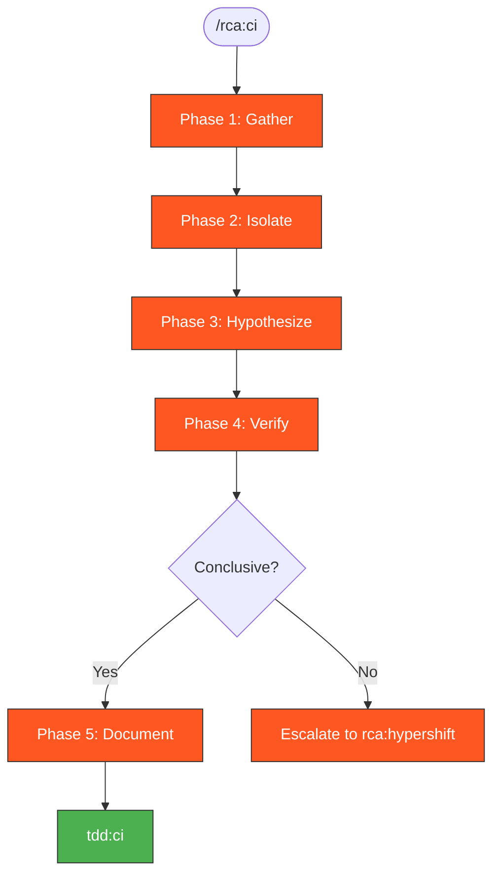

# RCA-CI: Root Cause Analysis from CI Logs

Systematic root cause analysis when you only have access to CI logs and artifacts.

## Context-Safe Execution (MANDATORY)

**CI logs are the single largest source of context pollution.** A single `gh run view --log-failed`
can dump thousands of lines into context. ALL CI log analysis MUST happen in subagents.

```bash
# Session-scoped log directory
export LOG_DIR=/tmp/kagenti/rca/$(basename $(git rev-parse --show-toplevel))
mkdir -p $LOG_DIR
```

**Rules:**
1. **Download CI logs to files** — never let `gh run view --log-failed` output hit the context
2. **ALL log analysis in subagents** — use `Task(subagent_type='Explore')` to read and analyze
3. The subagent reads the file, finds errors, and returns a concise summary
4. Main context only sees: file paths, exit codes, and subagent summaries

## rca:ci vs rca:hypershift

| Aspect | `rca:ci` | `rca:hypershift` |
|--------|----------|------------------|
| **Access** | CI logs only | Full cluster access |
| **Data** | Static artifacts | Live state + logs |
| **When** | CI failure, no cluster | Have running cluster |
| **Escalate** | → `rca:hypershift` if need live debugging | N/A |

## When to Use

- CI pipeline failed
- No HyperShift cluster available
- Need to understand failure before deciding on fix
- Before using `tdd:ci` to iterate on fixes

> **Auto-approved**: `gh` commands for downloading CI logs and artifacts are auto-approved.
> Analysis output is saved to `/tmp/kagenti/rca/`.

## RCA Workflow



> Follow this diagram as the workflow.

## Phase 1: Gather CI Artifacts

```bash
# Get failed run ID (small output, OK inline)
gh run list --status failure --limit 5
```

```bash
# Download logs to session-scoped directory
gh run view <run-id> --log-failed > $LOG_DIR/ci-run-<run-id>.log 2>&1; echo "EXIT:$?"
```

```bash
# View in browser (minimal context — just prints URL)
gh run view <run-id> --web
```

```bash
# Download all artifacts to session-scoped directory
gh run download <run-id> -D $LOG_DIR/artifacts
```

**Analyze logs in subagent** — use `Task(subagent_type='Explore')` to read `$LOG_DIR/ci-run-<run-id>.log`.

## Phase 2: Isolate the Failure

**Do this in a subagent** — use `Task(subagent_type='Explore')` with instructions to:
1. Use `Grep` with context (`-C 3`) on `$LOG_DIR/ci-run-<run-id>.log` — do NOT read the whole file
2. Search patterns: `FAILED|ERROR|AssertionError|assert.*False` with `head_limit: 30`
3. If grep finds matches, read only those specific line ranges for context
4. Return: first error, test name, assertion message, and 2-3 lines of surrounding context

### Error Chain Analysis

Work backwards from the failure:
1. What test failed?
2. What assertion failed?
3. What was the actual vs expected value?
4. What API/operation produced the wrong result?
5. What component is responsible?

## Phase 3: Hypothesize Causes

### Common CI Failure Categories

| Category | Signs | Check |
|----------|-------|-------|
| **Timing** | "timeout", flaky results | Race conditions, slow startup |
| **Config** | "not found", "invalid" | Missing env vars, wrong paths |
| **Auth** | "401", "403", "unauthorized" | Token issues, client config |
| **Network** | "connection refused", "timeout" | Service not ready, DNS |
| **State** | Works locally, fails CI | Order dependency, cleanup |
| **Resource** | "OOM", "evicted" | Memory/CPU limits |

### Hypothesis Template

```markdown
## Hypothesis 1: [Brief description]
- **Likelihood**: High/Medium/Low
- **Evidence needed**: [What to look for]
- **Found**: [Yes/No/Partial]
- **Conclusion**: [Confirmed/Eliminated/Inconclusive]
```

## Phase 4: Verify with Evidence

### Search Patterns

```bash
# Auth issues
grep -i "oauth\|token\|401\|403\|unauthorized" logs/*.txt

# Timing issues
grep -i "timeout\|timed out\|deadline\|retry" logs/*.txt

# Connection issues
grep -i "connection\|refused\|unreachable\|dns" logs/*.txt

# Resource issues
grep -i "oom\|memory\|evict\|limit" logs/*.txt
```

### Cross-Reference

- Compare with last successful run
- Check if same test passed before
- Look for recent code changes in affected area

## Phase 5: Document Findings

```markdown
## Root Cause Analysis

**Failure**: [Test name / description]
**Run ID**: [gh run id]

### Root Cause
[Clear statement of what caused the failure]

### Evidence
1. [Log line / artifact showing the issue]
2. [Supporting evidence]

### Contributing Factors
- [Any secondary causes]

### Fix
[Proposed solution]

### Prevention
[How to prevent recurrence]
```

## Escalation to rca:hypershift

Escalate when:
- Logs are insufficient to determine root cause
- Need to inspect live state (secrets, configs, pod status)
- Need to reproduce with debugging enabled
- Multiple hypotheses remain after log analysis

```
rca:ci inconclusive? → Create cluster → rca:hypershift
```

## Quick Reference

| Task | Command |
|------|---------|
| List failed runs | `gh run list --status failure` |
| View failed logs | `gh run view <id> --log-failed` |
| Download artifacts | `gh run download <id>` |
| Open in browser | `gh run view <id> --web` |

## Related Skills

- `rca:hypershift` - RCA with live cluster access
- `tdd:ci` - Fix iteration after RCA
- `superpowers:systematic-debugging` - General debugging approach
