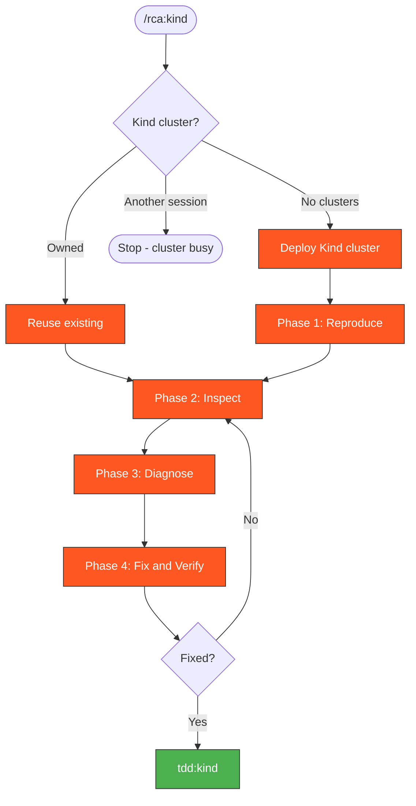

# RCA Kind

Root cause analysis workflow for failures on local Kind clusters.

## Context-Safe Execution (MANDATORY)

**All diagnostic commands MUST redirect output to files.**

```bash
export LOG_DIR=/tmp/kagenti/rca/$(basename $(git rev-parse --show-toplevel))
mkdir -p $LOG_DIR
```

**Rules:**
1. **ALL kubectl/oc commands** redirect to `$LOG_DIR/<name>.log`
2. **ALL analysis** in subagents: `Task(subagent_type='Explore')` with `Grep` (not full file reads)
3. Main context only sees: OK/FAIL status and subagent summaries

## When to Use

- Kind E2E tests failed locally or in CI
- Need to reproduce and debug CI Kind failures
- Ollama/agent issues specific to the Kind environment

> **Auto-approved**: All read and debug operations on Kind clusters are auto-approved.

## Cluster Concurrency Guard

**Only one Kind cluster at a time.** Before any cluster operation, check:

```bash
kind get clusters 2>/dev/null
```

- **No clusters** → proceed normally (create cluster)
- **Cluster exists AND this session owns it** → reuse it (skip creation, inspect directly)
- **Cluster exists AND another session owns it** → **STOP**. Do not proceed. Inform the user:
  > A Kind cluster is already running (likely from another session).
  > Options: (a) wait for that session to finish, (b) switch to `rca:ci` for log-only analysis, (c) explicitly destroy the existing cluster first with `kind delete cluster --name kagenti`.

To determine ownership: if the current task list or conversation created this cluster, it's yours. Otherwise assume another session owns it.



> Follow this diagram as the workflow.

## Workflow

```
Failure → Reproduce locally → Inspect cluster → Identify root cause → Fix → Verify
```

### Phase 1: Reproduce

Deploy the cluster if not running:

```bash
./.github/scripts/local-setup/kind-full-test.sh --skip-cluster-destroy > $LOG_DIR/kind-deploy.log 2>&1; echo "EXIT:$?"
```

### Phase 2: Inspect

All kubectl output redirected to files:

```bash
kubectl get pods -n kagenti-system > $LOG_DIR/pods-system.log 2>&1 && echo "OK" || echo "FAIL"
kubectl get pods -n kagenti-system --field-selector=status.phase!=Running > $LOG_DIR/failed-pods.log 2>&1 && echo "OK" || echo "FAIL"
kubectl get events -n kagenti-system --sort-by='.lastTimestamp' > $LOG_DIR/events.log 2>&1 && echo "OK" || echo "FAIL"
```

Use `Task(subagent_type='Explore')` with `Grep` to analyze the logs for errors.

### Phase 3: Diagnose

```bash
kubectl logs -n kagenti-system deployment/kagenti-ui --tail=50 > $LOG_DIR/ui.log 2>&1 && echo "OK" || echo "FAIL"
kubectl logs -n kagenti-system deployment/ollama --tail=50 > $LOG_DIR/ollama.log 2>&1 && echo "OK" || echo "FAIL"
kubectl get pods -n team1 > $LOG_DIR/pods-team1.log 2>&1 && echo "OK" || echo "FAIL"
kubectl logs -n team1 deployment/weather-service --tail=50 > $LOG_DIR/agent.log 2>&1 && echo "OK" || echo "FAIL"
```

Use `Task(subagent_type='Explore')` with `Grep` to find errors in the log files.

### Phase 4: Fix and Verify

After fixing, re-run the specific failing test:

```bash
uv run pytest kagenti/tests/e2e/ -v -k "test_name" > $LOG_DIR/retest.log 2>&1; echo "EXIT:$?"
```

## Kind-Specific Issues

| Issue | Cause | Fix |
|-------|-------|-----|
| Ollama OOM | Model too large for Kind | Use smaller model or increase Docker memory |
| DNS resolution | CoreDNS not ready | Wait or restart CoreDNS pod |
| Port conflicts | 8080 already in use | `lsof -i :8080` and kill process |
| Image pull errors | Local registry not configured | Check `kind-registry` container is running |

## Escalation

If the issue can't be reproduced locally, escalate:
- **CI-only failure** → Use `rca:ci` to analyze from logs
- **Need real OpenShift** → Use `rca:hypershift` with a live cluster

## Related Skills

- `rca:ci` - RCA from CI logs only
- `rca:hypershift` - RCA with live HyperShift cluster
- `tdd:kind` - TDD workflow on Kind
- `kind:cluster` - Create/destroy Kind clusters
- `k8s:pods` - Debug pod issues
- `kagenti:ui-debug` - Debug UI issues (502, API, proxy)
