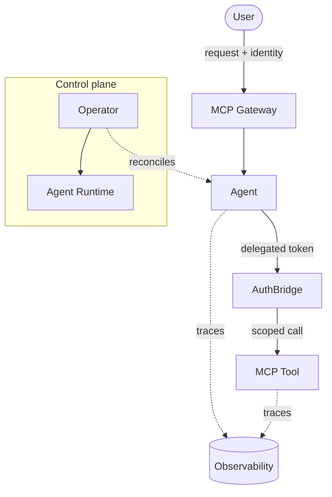

:::danger Placeholder content
This content is placeholder and should be replaced, edited, or deleted by the content owners.
:::

# Architecture

Rossoctl is organized around four pillars — **Lifecycle, Networking, Security, and Observability** — that together turn a Kubernetes cluster into a place where agents can run safely. This page gives you the mental model; the rest of the Concepts section drills into each piece.

## The four pillars

| Pillar | What it does | Backed by |
|--------|--------------|-----------|
| **Lifecycle** | Deploy, build, scale, and retire agents and tools | The operator + `AgentRuntime` resources, in-cluster builds |
| **Networking** | Route A2A and MCP traffic, mTLS between workloads, ingress | Istio (ambient mesh), the MCP Gateway, Gateway API |
| **Security** | Cryptographic identity, auth, delegation, isolation | SPIFFE/SPIRE, Keycloak, AuthBridge, sandboxing |
| **Observability** | Traces, metrics, cost, and network topology | OpenTelemetry, MLflow/Phoenix, Kiali |

## How the pieces fit

- **Control plane** — the operator watches `AgentRuntime` resources and reconciles the workloads, wiring in identity and policy as it goes.
- **Runtime** — where your agent process actually runs, with identity and (optionally) a sandbox around it.
- **Gateway** — the single front door for tool calls; it authenticates, routes, and records every request.
- **AuthBridge** — issues and exchanges short-lived, audience-scoped tokens so an agent acts *as the user* toward a tool, without holding long-lived secrets.

## Design principles

- **Framework-neutral** — agents speak open protocols (A2A, MCP); Rossoctl doesn't care how they were built.
- **Zero static credentials** — identity is cryptographic and issued at runtime.
- **Governed by default** — policy, audit, and observability are part of the platform, not an add-on.

---

## Where to go next

- [Agents](agents.md) and [Tools & MCP](tools-and-mcp.md) — the workloads.
- [Identity & Security](identity-and-security.md) — the trust model.

:::note For contributors
Expand from `kagenti/docs/tech-details.md` and `kagenti/docs/components.md` — both have fuller
architecture diagrams and a component catalog. Keep this page conceptual; deep component detail belongs
in Reference.
:::
