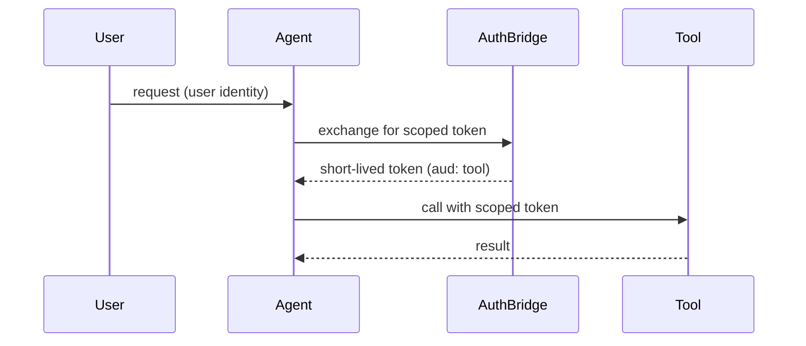

# Identity & Security

Security is the reason Rossoctl exists as a platform and not a library. Autonomous agents act on their own and touch sensitive systems, so *who is this agent, what is it allowed to do, and what did it actually do* has to be answerable at all times. This page is the conceptual overview; the [Security & Identity](../security/overview.md) section covers each mechanism in depth.

## Zero trust, no static credentials

Every workload gets a **cryptographic identity** at deploy time via [SPIFFE/SPIRE](../security/workload-identity.md) — an X.509 or JWT SVID, not a shared API key. Nothing on the platform trusts another component because of a password; it trusts a verifiable identity.

## Acting on behalf of a user

When a user asks an agent to do something, the agent shouldn't get broad, standing access. Instead, Rossoctl uses **OAuth2 token exchange (RFC 8693)** through [AuthBridge](../security/token-exchange-and-authbridge.md) to mint a short-lived, audience-scoped token so the agent acts *as that user*, for *that call*, against *that tool* — and nothing more.

## The guarantees

| Question | How Rossoctl answers it |
|----------|----------------------|
| Who is this agent? | Cryptographic workload identity (SPIFFE/SPIRE) |
| Who is it acting for? | Delegated user identity via token exchange |
| What may it do? | Scoped permissions + policy at the gateway |
| What did it do? | Full audit trail of tool calls |
| Can it hurt the host? | Sandboxing and workspace isolation |

:::note For contributors
Keep this page conceptual. The detailed flows, diagrams, and configuration live under Security &
Identity; source material is `kagenti/docs/identity-guide.md` and the `authbridge/` docs.
:::
