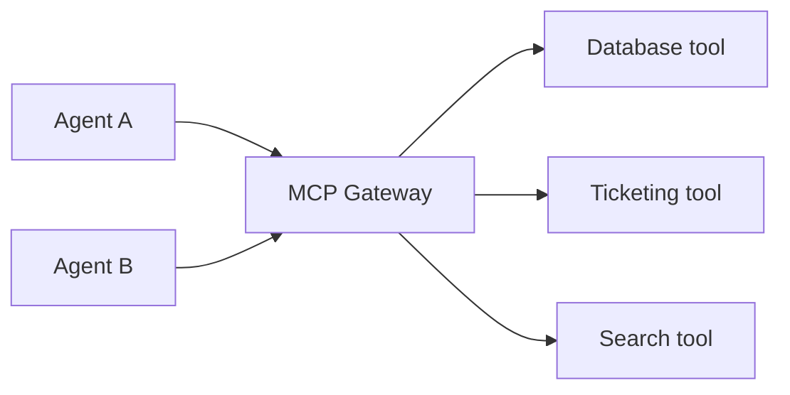

# Tools & MCP

Tools are how agents affect the world — query a database, call an API, file a ticket. Rosso standardizes tools on the [Model Context Protocol (MCP)](https://modelcontextprotocol.io/) and puts a **gateway** in front of them so that access is discoverable, authenticated, and audited.

## The MCP Gateway

Rather than each agent connecting directly to each tool, agents call the **MCP Gateway** — a single front door for every registered MCP server. The gateway:

- **Routes** calls to the right tool by name or prefix.
- **Authenticates** the caller and exchanges tokens so the tool sees the right identity.
- **Filters and audits** every request, giving you a complete record of what was called and by whom.



## Registering a tool

A tool is registered with the gateway through a registration resource that points at the MCP server and gives it a routing prefix:

```yaml
apiVersion: rossoctl.dev/v1
kind: MCPServerRegistration
metadata:
  name: ticketing
  namespace: team1
spec:
  toolPrefix: ticketing
  url: http://ticketing-mcp.team1.svc/mcp
```

## Why route through a gateway

- **One place to enforce policy.** Which agent may call which tool is decided at the gateway — not scattered across agents.
- **No credential sprawl.** The agent never holds the tool's credentials; the gateway and AuthBridge handle delegated, short-lived tokens.
- **Complete audit.** Every tool call is attributable to a user and an agent.

See [Configure the MCP Gateway](../guides/configure-the-mcp-gateway.md) for the hands-on version and [Token exchange & AuthBridge](../security/token-exchange-and-authbridge.md) for how identity flows through a call.

:::note For contributors
Expand from `kagenti/docs/gateway.md` and `kagenti/docs/components.md`. Confirm the
`MCPServerRegistration` group/version and `toolPrefix` semantics (Kuadrant mcp-gateway upstream).
:::
