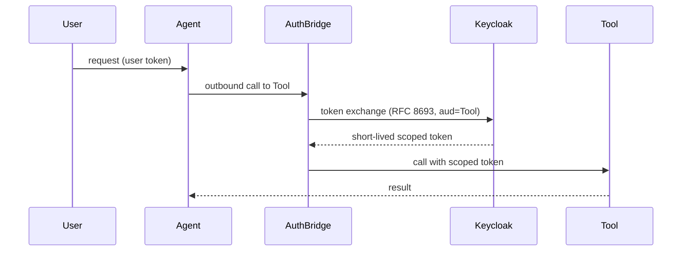

:::danger Placeholder content
This content is placeholder and should be replaced, edited, or deleted by the content owners.
:::

# Token Exchange & AuthBridge

When a user asks an agent to do something, the agent should act *as that user* toward the tools it calls — not with its own broad, standing access. Rossoctl achieves this with **OAuth2 token exchange (RFC 8693)**, applied transparently by **AuthBridge**.

## The problem it solves

Without delegation, you're left with bad options: give every agent a powerful service account (over-privileged, hard to audit), or copy user credentials into agents (a leak waiting to happen). Token exchange avoids both — the agent gets a short-lived token, scoped to one tool, carrying the user's identity, valid for one call.

## How AuthBridge works

AuthBridge is a small, unprivileged proxy that sits alongside agents and the gateway. It:

- **Validates inbound tokens** — checks the JWT on requests coming in (JWKS validation).
- **Exchanges tokens outbound** — swaps the caller's token for a new one scoped to the target tool (`aud`), via Keycloak's RFC 8693 endpoint.
- **Enforces tool access** — only permitted delegation chains succeed.

## What you configure

Mostly nothing at the call site — AuthBridge applies exchange transparently. You define *which delegations are allowed* as [policy](authorization-and-policy.md), and mark tools that require authentication when you [register them with the gateway](../guides/configure-the-mcp-gateway.md).

:::tip Delegation chains
Exchange composes: a supervisor agent can delegate to a specialist, which delegates to a tool, with the
user's identity preserved end-to-end and each hop scoped down.
:::

:::note For contributors
Expand from `kagenti/docs/identity-guide.md` and `kagenti/docs/authbridge/README.md`. Note AuthBridge's
two forms (the unprivileged proxy vs. the Envoy ext-proc `AuthProxy` sidecar) and when each is used.
:::
