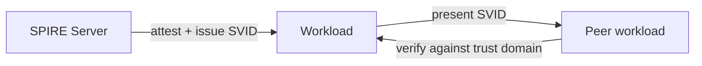

# Workload Identity

Every workload on Rosso — agent, tool, or platform service — has a cryptographic identity issued by [SPIFFE/SPIRE](https://spiffe.io/). This is the foundation everything else rests on: authentication, delegation, and audit all start from "which workload is this, provably?"

## SPIFFE IDs and SVIDs

A workload's identity is a **SPIFFE ID** — a URI that names it within a trust domain:

```text
spiffe://rosso.example.com/ns/team1/sa/orders-agent
```

SPIRE attests the workload and issues it a short-lived **SVID** (an X.509 certificate or JWT) that proves that identity. Because SVIDs are short-lived and automatically rotated, there's no credential to steal and reuse for long.

## Why this matters

- **mTLS everywhere.** Workloads authenticate to each other with their SVIDs, so traffic between agents, tools, and the gateway is mutually authenticated — no shared secrets.
- **A stable subject for policy.** Authorization rules reference SPIFFE IDs, not IP addresses or passwords.
- **Attribution.** Every action traces back to a verifiable identity.



## What you need to do

For most users, nothing — the platform issues and rotates identities automatically when you deploy an agent or tool. You reference these identities when you write [authorization policy](authorization-and-policy.md).

:::note For contributors
Expand from `kagenti/docs/identity-guide.md` and `kagenti/docs/components.md`. Confirm the trust-domain
naming, SVID types in use (X.509 vs JWT), and how Istio ambient (Ztunnel) consumes them.
:::
