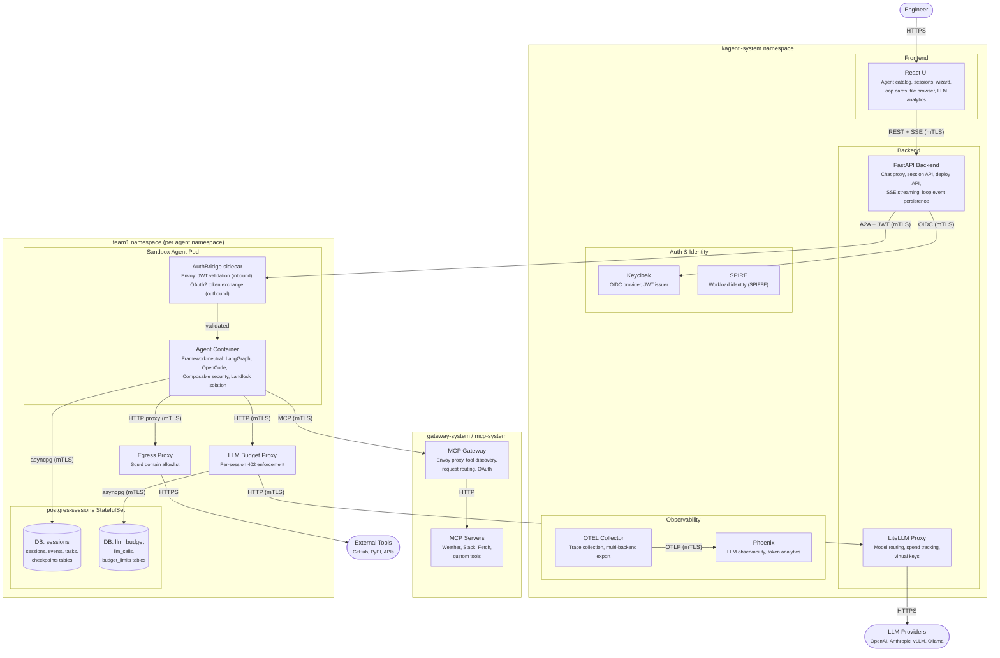

# Agentic Runtime

The Agentic Runtime extends Kagenti with secure, isolated environments for
running AI coding agents. Agents operate in Kubernetes pods with composable
security layers, persistent workspaces, and human-in-the-loop approval gates.

The runtime is **framework-neutral** — any agent framework that speaks
[A2A JSON-RPC 2.0](https://google.github.io/A2A/) gets the full platform
feature set for free: authentication, authorization, budget enforcement,
observability, and service mesh encryption.

> **Status:** Active development. See [PR Dashboard](#pr-dashboard) for merge progress.
> **Epic:** [#820](https://github.com/kagenti/kagenti/issues/820)

---

## Architecture



> All internal edges use **Istio Ambient mTLS** (ztunnel) -- zero-config,
> no sidecars. External edges use HTTPS.

---

## Documentation

| Document | Description |
|----------|-------------|
| [Concepts](./concepts.md) | Core concepts: sessions, reasoning loops, event pipeline, graph card, sidecars |
| [Quick Start](./quickstart.md) | Deploy a sandbox agent on Kind in 5 minutes |
| [A2A Integration](./a2a-integration.md) | A2A protocol: proxied vs direct access, extensions, SDK version |
| [Pluggable Architecture](./pluggability.md) | 9 pluggable layers, contracts, standards landscape (AG-UI, MCP, OTel) |
| [Configuration](./configuration.md) | Feature flags, Helm values, environment variables |
| [Security](./security.md) | Defense-in-depth layers, Landlock, composable profiles, Istio Ambient |
| [Zero-Secret Agents](./zero-secret-agents.md) | Three pillars: Budget Proxy + AuthBridge + Vault = no leaked secrets |
| [Sandboxing Models](./sandboxing-models.md) | Isolation spectrum: minimal to maximum, use cases, three non-negotiable pillars |
| [Sandboxing Layers](./sandboxing-layers.md) | Technical reference: OS, runtime, container, network layer details |
| [Writing Agents](./agents.md) | Agent authoring: graph structure, tools, event serialization, graph card |
| [Multi-Framework Runtime](./multi-framework.md) | Framework adapters: LangGraph, OpenCode, Claude SDK, CrewAI, AG2 *(WIP)* |
| [API Reference](./api-reference.md) | Backend routes: sandbox, sessions, events, deploy, sidecars, budget |
| [TUI Integration](./tui.md) | Terminal client: agent chat, sessions, HITL, dev workflows, CI mode |
| [Operator Alignment](./operator-alignment.md) | AgentRuntime CR, script→CR migration, composable security in CRDs |
| [Deployment](./deployment.md) | Manifests, platform base, database, budget proxy, deploy scripts |
| [Troubleshooting](./troubleshooting.md) | Common issues, debugging, log locations |

---

## Key Design Decisions

| Area | Design | Rationale |
|------|--------|-----------|
| Framework neutrality | A2A JSON-RPC 2.0 composability boundary | Any framework gets full platform features via plugin contract |
| Feature flags | `KAGENTI_FEATURE_FLAG_*` gates all sandbox routes | Zero footprint when disabled; gradual rollout |
| Composable security | Layers L1-L8, assembled by wizard into named profiles | Operators choose exactly which layers to enable per agent |
| LLM budget | Per-namespace proxy between agent and LiteLLM | Enforces per-session token budgets at the network layer (HTTP 402) |
| DB isolation | Per-namespace PostgreSQL; target: schema-per-agent | Agents cannot read each other's checkpoints |
| Event pipeline | Background consumer + gap-fill reconnect | Events persisted independently of UI connection |
| Graph card | Self-describing `/.well-known/agent-graph-card.json` | UI renders graph views without hardcoded agent knowledge |
| Service mesh | Istio Ambient (no sidecars) | Zero-overhead mTLS between all pods |

---

## PR Dashboard

### Merge Strategy

```
Phase 1: #996 (feature flags) -- merge first
Phase 2 (parallel): #979, #980, #984, #985, #986-#990, #993, #182-#184
Phase 3 (sequential): #981 -> #983 -> #982 (backend chain)
Phase 4: #991, #992 (tests, flags on)
```

### kagenti/kagenti

| PR | Title | Phase |
|----|-------|-------|
| [#996](https://github.com/kagenti/kagenti/pull/996) | Feature flags (SANDBOX, INTEGRATIONS, TRIGGERS) | 1 |
| [#979](https://github.com/kagenti/kagenti/pull/979) | Infrastructure -- CI, Helm, Ansible, scripts | 2 |
| [#980](https://github.com/kagenti/kagenti/pull/980) | Skills -- portable LOG_DIR | 2 |
| [#984](https://github.com/kagenti/kagenti/pull/984) | LLM budget proxy | 2 |
| [#985](https://github.com/kagenti/kagenti/pull/985) | Sandbox deployments & platform base | 2 |
| [#986](https://github.com/kagenti/kagenti/pull/986) | UI types, API, utilities | 2 |
| [#987](https://github.com/kagenti/kagenti/pull/987) | Sandbox core UI components | 2 |
| [#988](https://github.com/kagenti/kagenti/pull/988) | Graph visualization views | 2 |
| [#989](https://github.com/kagenti/kagenti/pull/989) | Supporting UI -- files, events, metrics | 2 |
| [#990](https://github.com/kagenti/kagenti/pull/990) | Pages & navigation | 2 |
| [#993](https://github.com/kagenti/kagenti/pull/993) | UI build config, cleanup | 2 |
| [#981](https://github.com/kagenti/kagenti/pull/981) | Session DB (PostgreSQL) | 3 |
| [#983](https://github.com/kagenti/kagenti/pull/983) | Sidecar agent lifecycle | 3 |
| [#982](https://github.com/kagenti/kagenti/pull/982) | Sandbox API routes | 3 |
| [#991](https://github.com/kagenti/kagenti/pull/991) | UI E2E tests | 4 |
| [#992](https://github.com/kagenti/kagenti/pull/992) | Backend E2E tests | 4 |

### kagenti/agent-examples

| PR | Title | Phase |
|----|-------|-------|
| [#182](https://github.com/kagenti/agent-examples/pull/182) | Sandbox agent core | 2 |
| [#183](https://github.com/kagenti/agent-examples/pull/183) | Agent test suite | 2 |
| [#184](https://github.com/kagenti/agent-examples/pull/184) | Agent packaging | 2 |

---

## Design Documents

For internal design history and architecture decisions, see the
[design documents index](../plans/2026-03-16-issue-820-sandbox-agent-design-v3.md#72-sub-design-document-index)
in the plans directory.
