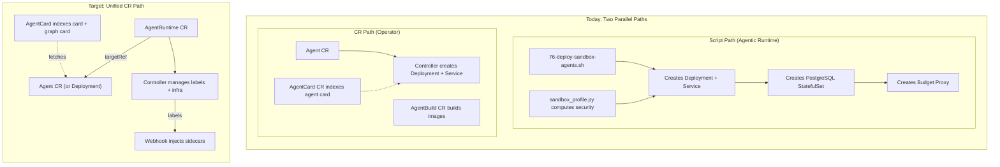
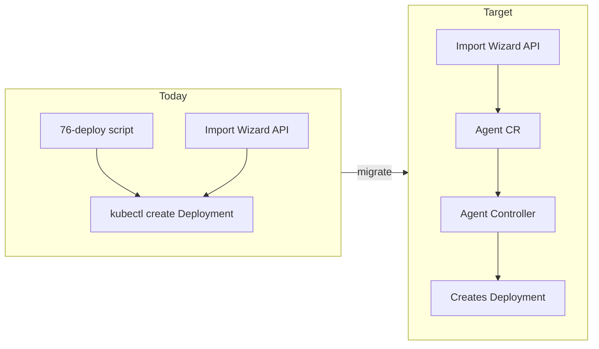
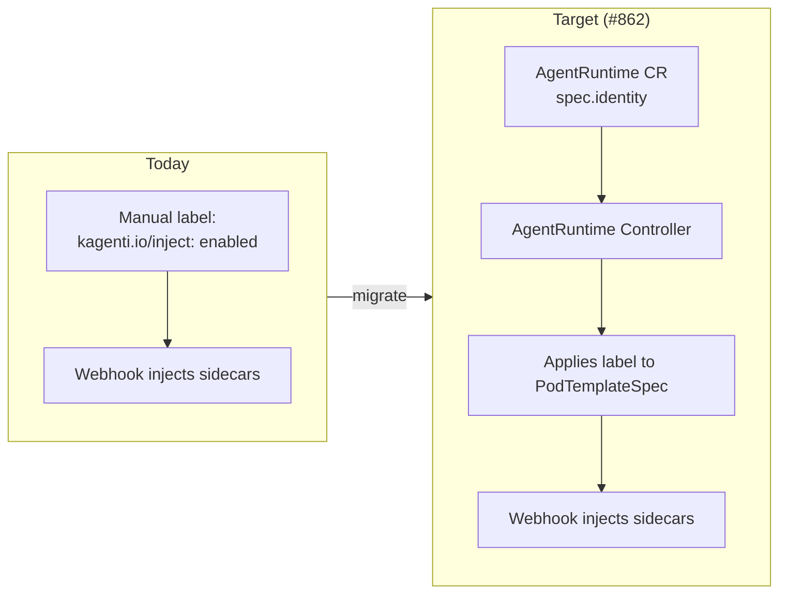
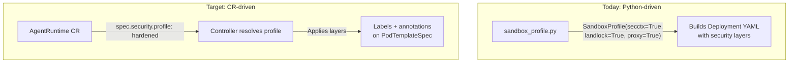
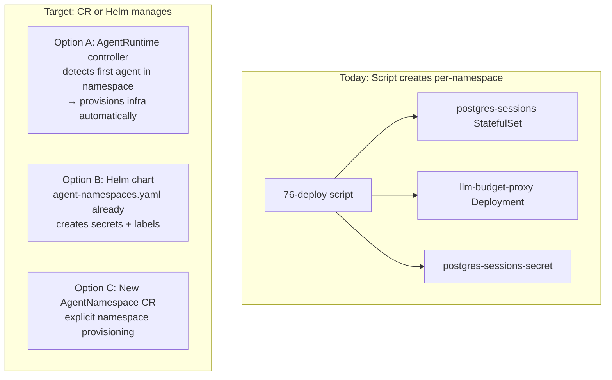
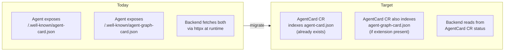
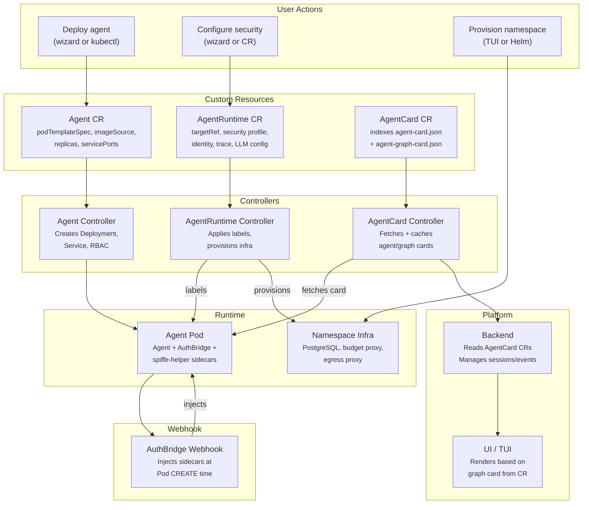

# Operator Alignment

How the Agentic Runtime connects to the kagenti-operator CRDs and what
needs to change to make agent deployment declarative.

> **Epic:** [#862 — AgentRuntime CR](https://github.com/kagenti/kagenti/issues/862)
> **Operator repo:** kagenti/kagenti-operator

---

## The Problem

The Agentic Runtime is currently **script-driven** (imperative). The
operator is **CR-driven** (declarative). They need to converge.



---

## What the Operator Has Today

| CRD | Purpose | Status |
|-----|---------|--------|
| **Agent** | Deployment wrapper (podTemplateSpec, imageSource, replicas, servicePorts) | Complete |
| **AgentBuild** | Source-to-image via Tekton pipelines | Complete |
| **AgentCard** | Indexes `/.well-known/agent-card.json` from agents | Complete |
| **AgentRuntime** | Declarative sidecar injection + config | **Not yet implemented** (#862) |

## What the Agentic Runtime Deploys Today

### Per-Namespace Resources (created by deploy script)

| Resource | Type | Purpose |
|----------|------|---------|
| `postgres-sessions` | StatefulSet + Service + PVC | Two databases: `sessions` (session/event/checkpoint tables) and `llm_budget` (call tracking + limits) |
| `postgres-sessions-secret` | Secret | Connection strings for both databases |
| `llm-budget-proxy` | Deployment + Service | Per-session token enforcement (HTTP 402) |
| `authbridge-config` | ConfigMap | Keycloak token URL, issuer, audience |
| `envoy-config` | ConfigMap | Envoy listener config for AuthBridge sidecar |
| `litellm-virtual-keys` | Secret | Per-namespace LLM API key |

### Per-Agent Resources (created by deploy script per variant)

| Resource | Type | Purpose |
|----------|------|---------|
| Agent Deployment | Deployment | Agent pod (1 replica, workspace volume) |
| Agent Service | Service | ClusterIP on port 8000 |
| Egress Proxy | Deployment + Service | **Optional** — Squid domain allowlist (only for hardened/restricted profiles) |
| Route | Route (OpenShift only) | External access with TLS edge termination |

### Database Schemas (auto-created at startup, not by scripts)

Each component creates its own tables — **the agent deploys its own DB schema**:

| Component | Database | Tables Created | Created By |
|-----------|----------|---------------|------------|
| **Backend** | `sessions` | `sessions`, `events` | Auto-migration on backend startup |
| **A2A SDK** | `sessions` | `tasks` | `DatabaseTaskStore` on first task |
| **Agent (LangGraph)** | `sessions` | `langgraph_checkpoint`, `langgraph_checkpoint_blobs`, `langgraph_writes` | `AsyncPostgresSaver.setup()` on agent startup |
| **Budget Proxy** | `llm_budget` | `llm_calls`, `budget_limits` | Auto-migration on proxy startup |

This means **8 tables across 2 databases** are auto-created by 4 different
components. No manual schema management. The operator needs to be aware that
agents bring their own schema — it's not just a pod, it's a pod that
provisions database tables on startup.

### Per-Session Resources (created at runtime by agent)

| Resource | Location | Purpose |
|----------|----------|---------|
| Workspace directory | `/workspace/{context_id}/` | Per-session file isolation |
| Workspace subdirs | `scripts/`, `data/`, `repos/`, `output/` | Organized workspace |
| Context metadata | `.context.json` | Created timestamp, TTL, disk usage |
| Checkpoint rows | `langgraph_checkpoint` table | LangGraph state snapshots for session resume |

### Skills (loaded at agent startup)

Agents clone skill repos from `SKILL_REPOS` env var at startup. Skills
are git repositories containing prompts, tools, and workflow definitions.
This is agent-side and doesn't need operator support.

## What the Agentic Runtime Adds (Not in Operator)

| Component | How It's Managed Today | Where It Should Live |
|-----------|----------------------|---------------------|
| Composable security (L4-L7) | `sandbox_profile.py` (Python, backend) | AgentRuntime CR `spec.security` |
| PostgreSQL per namespace | `76-deploy-sandbox-agents.sh` (script) | Namespace CR or AgentRuntime controller |
| LLM Budget Proxy per namespace | `76-deploy-sandbox-agents.sh` (script) | Namespace CR or AgentRuntime controller |
| Egress Proxy per agent | `sandbox_profile.py` (optional, per profile) | AgentRuntime CR `spec.security.egressProxy` |
| Agent DB schema (checkpoints) | Agent auto-creates tables on startup | Agent-side (stay — operator doesn't need to manage) |
| Budget DB schema | Budget proxy auto-creates tables on startup | Budget proxy side (stay) |
| Session DB schema | Backend auto-creates tables on startup | Backend side (stay) |
| Workspace directories | Agent creates per-session at runtime | Agent-side (stay) |
| Feature flags | Helm values → backend env → UI config | Helm values (stay) |
| Agent import wizard | Backend REST API → kubectl | Backend → creates Agent CR |
| Event serialization | Agent-side `FrameworkEventSerializer` | Agent-side (stay) |
| AgentGraphCard | Agent-side `/.well-known/agent-graph-card.json` | AgentCard CR could index it |
| Skills loading | Agent clones git repos at startup | Agent-side (stay) |

---

## Alignment Map

### 1. Agent Deployment



**Today:** Scripts and the backend import wizard create raw Kubernetes
Deployments. The operator has an `Agent` CRD that does the same thing
declaratively, but the Agentic Runtime doesn't use it.

**Target:** The import wizard should create `Agent` CRs. The operator
controller creates the Deployment, Service, and RBAC. The backend
watches Agent CRs for discovery instead of DNS-based resolution.

**Changes needed:**
- Backend import wizard: `POST /sandbox/{ns}/create` → creates Agent CR
- Backend agent discovery: watch Agent CRs (or continue DNS, both work)
- Deploy scripts: create Agent CRs instead of raw Deployments

### 2. AuthBridge Injection



**This is well-designed in #862.** AgentRuntime CR replaces manual labels
with declarative config. The webhook behavior stays the same — only the
label management changes from manual to controller-driven.

**Our docs impact:** `security.md` should mention AgentRuntime CR as the
declarative way to configure AuthBridge instead of manual labels.

### 3. Composable Security Profiles



**Gap in #862:** The AgentRuntime CR has `spec.identity` and `spec.trace`
but **no `spec.security` section** for composable layers (L4-L7). This
is critical for the Agentic Runtime.

**Proposed addition to AgentRuntime spec:**

```yaml
apiVersion: agent.kagenti.dev/v1alpha1
kind: AgentRuntime
metadata:
  name: sandbox-legion
  namespace: team1
spec:
  type: agent
  targetRef:
    kind: Deployment
    name: sandbox-legion
  security:
    profile: hardened              # preset: legion|basic|hardened|restricted
    # OR individual layer toggles:
    securityContext: true           # L4: non-root, drop ALL
    landlock: true                  # L6: per-tool-call filesystem isolation
    egressProxy:                    # L7: Squid domain allowlist
      enabled: true
      allowedDomains:
        - api.github.com
        - pypi.org
  identity:
    spiffe:
      trustDomain: kagenti.io
    clientRegistration:
      provider: keycloak
      realm: kagenti
  trace:
    endpoint: otel-collector.kagenti-system:4317
    sampling:
      rate: 1.0
```

### 4. Per-Namespace Infrastructure



**Gap in #862:** No mechanism for per-namespace infrastructure (PostgreSQL,
budget proxy). The AgentRuntime CR is per-workload, not per-namespace.

**Options:**
- **A: Controller auto-provisions** — When first AgentRuntime CR is created
  in a namespace, controller ensures postgres + budget proxy exist. Simple
  but implicit.
- **B: Helm chart (current)** — `agent-namespaces.yaml` already creates
  per-namespace resources. Works but requires Helm upgrade to add namespaces.
- **C: AgentNamespace CRD** — Explicit namespace provisioning with quotas,
  features, members. Matches the TUI's `kagenti team create` flow.

**Recommendation:** Option B (Helm) for near-term, Option C for full
declarative lifecycle. Option A is too magical.

### 5. AgentCard + AgentGraphCard



**The operator already indexes agent cards** via the AgentCard CRD. But
it doesn't index graph cards. The controller could check for the
`urn:kagenti:agent-graph-card:v1` extension in the agent card, fetch the
graph card endpoint, and cache it in the AgentCard status.

**Changes needed in operator:**
- AgentCard controller: if `extensions` contains graph card URI, also fetch
  `/.well-known/agent-graph-card.json` and store in `status.graphCard`
- Backend: read graph card from AgentCard CR status instead of runtime fetch

---

## What #862 Is Missing for Sandbox Agents

| Missing from #862 | Why It Matters | Priority |
|-------------------|---------------|----------|
| `spec.security.profile` | Composable L4-L7 layers (secctx, landlock, egress proxy) | P0 |
| `spec.security.egressProxy` | Per-agent Squid allowlist | P1 |
| `spec.llm.model` | Default LLM model for the agent | P1 |
| `spec.llm.budgetProxy` | Link to budget proxy service | P2 |
| `spec.workspace.storage` | EmptyDir vs PVC for workspace | P2 |
| `spec.workspace.ttlDays` | Workspace TTL | P2 |
| Per-namespace infra provisioning | PostgreSQL, budget proxy, secrets | P1 |
| Graph card indexing in AgentCard | Cache graph card in CR status | P2 |

**What #862 already covers well:**
- AuthBridge injection via labels (the core problem)
- Config hash for rolling updates (clean GitOps)
- Duck-typed targetRef (works with any workload kind)
- Identity overrides (SPIFFE trust domain, Keycloak realm)
- Trace config (OTel endpoint, sampling rate)
- Finalizer handling (graceful cleanup)

---

## What Changes on Our Side

### Docs Changes

| File | Change |
|------|--------|
| `deployment.md` | Add CR-based deployment path alongside scripts |
| `security.md` | Show AgentRuntime CR as declarative security config |
| `configuration.md` | Add AgentRuntime CR as config mechanism |
| `agents.md` | Show Agent CRD as deployment target |
| `quickstart.md` | Keep script path (quickest for Kind dev) |

### Code Changes (Future)

| Component | Change | Priority |
|-----------|--------|----------|
| Import wizard | Create Agent CR instead of raw Deployment | P1 |
| Backend agent discovery | Watch Agent/AgentCard CRs (optional, DNS still works) | P2 |
| Deploy scripts | Create Agent CRs + AgentRuntime CRs | P1 |
| `sandbox_profile.py` | Move logic to AgentRuntime controller (Go) | P2 |
| TUI `kagenti team create` | Create AgentNamespace CR (if Option C) | P2 |

---

## The Full Picture



---

## Phased Convergence

| Phase | What | Owner |
|-------|------|-------|
| **Now** | Script-based deployment works, docs describe current state | Agentic Runtime team |
| **#862 Phase 1** | AgentRuntime CRD + controller for label management | Operator team |
| **#862 Phase 2** | Webhook coordination (inject at Pod CREATE) | Extensions team |
| **Post-#862** | Add `spec.security` to AgentRuntime for composable layers | Both teams |
| **Post-#862** | Import wizard creates Agent CRs, not raw Deployments | Agentic Runtime team |
| **Post-#862** | AgentCard controller indexes graph cards | Operator team |
| **Post-#862** | Namespace provisioning (Helm or AgentNamespace CRD) | Platform team |
| **Post-#862** | `sandbox_profile.py` logic moves to AgentRuntime controller | Both teams |
