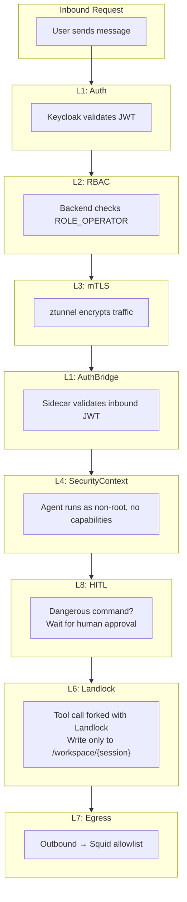

# Sandboxing Layers — Technical Reference

A layer-by-layer technical reference for the Kagenti agent sandboxing
architecture. Companion to the [Sandboxing Strategy](./sandboxing-strategy.md)
(use-case-driven) and [Security](./security.md) (L1-L8 summary).

---

## Layer Architecture

```mermaid
flowchart TB
    subgraph os_layer["Layer 1: Operating System"]
        direction LR
        Landlock["Landlock LSM<br/><small>Filesystem scoping<br/>Per-tool-call fork</small>"]
        Seccomp["seccomp<br/><small>Syscall filtering<br/>RuntimeDefault profile</small>"]
        SELinux["SELinux<br/><small>MAC enforcement<br/>OpenShift SCC</small>"]
    end

    subgraph runtime_layer["Layer 2: Application Runtime"]
        direction LR
        Permissions["PermissionChecker<br/><small>ALLOW / DENY / HITL<br/>per command prefix</small>"]
        CodeAudit["Code Audit<br/><small>events table persistence<br/>full args + output</small>"]
        Limits["Resource Limits<br/><small>CPU, memory, timeout<br/>per sources.json</small>"]
    end

    subgraph container_layer["Layer 3: Container / Orchestration"]
        direction LR
        SecCtx["SecurityContext<br/><small>non-root, drop ALL,<br/>readOnlyRootFS, seccomp</small>"]
        ZeroSecret["Zero-Secret<br/><small>Budget Proxy +<br/>AuthBridge + Vault</small>"]
        Persona["Persona Separation<br/><small>ROLE_OPERATOR vs<br/>ROLE_ADMIN via RBAC</small>"]
    end

    subgraph network_layer["Layer 4: Network"]
        direction LR
        NetPol["NetworkPolicy<br/><small>deny-all egress<br/>+ DNS allow</small>"]
        EgressProxy["Egress Proxy<br/><small>Squid domain allowlist<br/>per-agent config</small>"]
        Mesh["Istio Ambient<br/><small>ztunnel mTLS<br/>zero-config</small>"]
    end

    os_layer --> runtime_layer --> container_layer --> network_layer
```



---

## Layer 1: Operating System

### Landlock LSM

Kernel-level filesystem access control. Kagenti uses pure ctypes syscalls
(zero external dependencies) to apply Landlock restrictions per tool call.

| Aspect | Detail |
|--------|--------|
| Implementation | `landlock_ctypes.py` (193 lines), raw syscalls via Python `ctypes` |
| ABI support | v1, v2, v3 (adapts to kernel version) |
| Architecture | x86_64 and aarch64 syscall numbers |
| Application model | Fork per tool call → apply Landlock → execute → exit |
| Write scope | `/workspace/{context_id}/` only |
| Read scope | System libraries, Python packages |
| Startup probe | Forks child to test kernel support. Pod fails assertively if unavailable. |
| Overhead | ~7ms per tool call |
| Irreversibility | Once applied, restrictions cannot be lifted (kernel guarantee) |

**Key design:** Landlock is applied per-tool-call in a forked subprocess,
not per-pod. This means the agent process itself is not Landlock-restricted
(it needs to read its own code), but every tool execution is isolated.

### seccomp

Syscall filtering via Linux seccomp-BPF. Applied via pod SecurityContext.

| Aspect | Detail |
|--------|--------|
| Profile | `RuntimeDefault` (Kubernetes default seccomp profile) |
| Custom profiles | Not yet. `RuntimeDefault` blocks most dangerous syscalls. |
| Application | `securityContext.seccompProfile.type: RuntimeDefault` |

### SELinux

Mandatory Access Control via SELinux. On OpenShift, enforced through
Security Context Constraints (SCCs).

| Aspect | Detail |
|--------|--------|
| OpenShift | SCCs enforce SELinux labels. Agents use `kagenti-authbridge` SCC. |
| Kind / vanilla K8s | SELinux not enforced (typically permissive or disabled). |
| Custom policy | Not custom-profiled. Uses platform-default SELinux types. |
| Future | Agent-specific SELinux policy for finer-grained MAC. |

---

## Layer 2: Application Runtime

### PermissionChecker

Three-tier permission system for tool/command execution. Configured via
`settings.json` per agent.

```
Rule format: type(prefix:glob)

Examples:
  allow: shell(grep:*)         # allow grep with any args
  allow: file(read:/workspace/**)  # allow reading workspace
  deny:  shell(rm:-rf *)       # block rm -rf
  deny:  network(outbound:*)   # block all network
  # Everything else → HITL (human approval)
```

| Tier | Behavior |
|------|----------|
| ALLOW | Execute immediately |
| DENY | Reject immediately |
| HITL | Pause execution, wait for human approval |

Interpreter bypass detection: `bash -c "curl ..."` is caught even if
`curl` is denied — the checker detects shell wrappers.

### Code Audit Trail

Every tool call is persisted in the `events` table with full context:

| Field | Content |
|-------|---------|
| `event_type` | `tool_call` or `tool_result` |
| `langgraph_node` | Which graph node initiated the call |
| `payload.name` | Tool name (e.g. `shell`) |
| `payload.args` | Full arguments (e.g. `ls -la /workspace`) |
| `payload.output` | Full output (truncated to 2000 chars) |
| `payload.status` | `success` or `error` |

This creates the forensic trail needed for compliance. Every action the
agent took is recorded, attributable, and queryable.

**Gap:** Generated code is captured as tool_call args (shell commands, file
writes) but not security-scanned before execution. Pre-execution scanning
is an open problem.

### Resource Limits

Declared in `sources.json`, enforced by the platform:

| Limit | Default | Enforcement |
|-------|---------|-------------|
| `max_execution_time_seconds` | 300 | Per-command timeout |
| `max_memory_mb` | 4096 | Container memory limit |
| `max_session_tokens` | 1,000,000 | Budget Proxy (HTTP 402) |
| `max_daily_tokens` | 5,000,000 | Budget Proxy (rolling window) |

---

## Layer 3: Container / Orchestration

### SecurityContext (L4)

Applied via pod spec. Drops all Linux capabilities and enforces non-root.

```yaml
securityContext:
  allowPrivilegeEscalation: false
  readOnlyRootFilesystem: true
  runAsNonRoot: true
  runAsUser: 1001
  capabilities:
    drop: [ALL]
  seccompProfile:
    type: RuntimeDefault
```

| Control | Effect |
|---------|--------|
| `runAsNonRoot: true` | Cannot run as root (UID 0) |
| `drop: [ALL]` | No Linux capabilities (no mount, no raw socket, no chown) |
| `readOnlyRootFilesystem` | Cannot write to container image filesystem |
| `allowPrivilegeEscalation: false` | Cannot gain more privileges than parent |
| `seccompProfile: RuntimeDefault` | Blocks dangerous syscalls |

### Zero-Secret Credential Architecture

Three components ensure the agent container has zero long-lived secrets:

| Component | What It Replaces | How |
|-----------|-----------------|-----|
| **LLM Budget Proxy** | `OPENAI_API_KEY` env var | Agent calls localhost:8080. Proxy holds LiteLLM key. |
| **AuthBridge sidecar** | `GITHUB_TOKEN` etc in env var | Envoy intercepts outbound. SPIFFE→OAuth exchange. |
| **Vault** (planned) | `DB_PASSWORD` in secret | SPIFFE auth → dynamic 1h PostgreSQL credentials. |

See [Zero-Secret Agents](./zero-secret-agents.md) for complete architecture.

### Persona Separation

| Persona | Role | What They Can Do |
|---------|------|-----------------|
| **Consumer** (developer/user) | `ROLE_OPERATOR` | Invoke agents, view sessions, chat |
| **Security Admin** | `ROLE_ADMIN` | Configure security profiles, manage namespaces, view all sessions |
| **Platform** (controller) | Service account | Apply labels, inject sidecars, manage CRDs |

Today this is enforced via Keycloak RBAC. Future: AgentRuntime CR (#862)
separates deployment (consumer) from security configuration (admin).

---

## Layer 4: Network

### NetworkPolicy (L5)

Default-deny egress baseline for all agent namespaces:

```yaml
apiVersion: networking.k8s.io/v1
kind: NetworkPolicy
metadata:
  name: deny-all-egress
  namespace: team1
spec:
  podSelector: {}
  policyTypes: [Egress]
  egress:
    - to: []
      ports:
        - port: 53    # DNS only
          protocol: UDP
```

Agents can only reach:
- DNS (port 53) — for service discovery
- Other pods in the same namespace — via explicit allow rules
- Egress proxy — for approved outbound traffic

### Egress Proxy (L7) — Squid

Per-agent Squid proxy enforcing domain allowlist:

| Aspect | Detail |
|--------|--------|
| Deployment | Separate Deployment per agent (`{agent}-egress-proxy`) |
| Port | 3128 (agent sets `HTTP_PROXY=http://localhost:3128`) |
| Allowlist | `ALLOWED_DOMAINS` env var (space-separated) |
| Default domains | `.anthropic.com`, `.openai.com`, `.pypi.org`, `.github.com` |
| Methods | GET, POST, HEAD, CONNECT on ports 80, 443 |
| Default policy | Deny all unlisted domains |
| Bypass | `NO_PROXY=localhost,127.0.0.1,.svc,.cluster.local` (K8s services) |

**Why Squid, not NetworkPolicy alone?** NetworkPolicy operates at L3/L4
(IP + port). Squid operates at L7 (domain names). An agent could bypass
IP-based rules by resolving different IPs for the same domain. Squid's
domain-based filtering catches this.

### Istio Ambient Mesh (L3)

Zero-config mTLS for all pod-to-pod traffic:

| Aspect | Detail |
|--------|--------|
| Mode | Ambient (no sidecars — ztunnel handles L4) |
| Enrollment | Namespace label `istio.io/dataplane-mode: ambient` |
| mTLS | Automatic between all enrolled pods |
| L7 policies | Waypoint proxies (one per namespace, on-demand) |
| AuthorizationPolicy | MLflow `/v1/traces` restricted to otel-collector identity |
| Target | STRICT mode + deny-all baseline with per-service ALLOW |

**All internal communication is encrypted.** Application-level SSL is
disabled (not needed — ztunnel handles encryption transparently).

---

## Cross-Layer Integration



Each layer is independent. If one fails open (e.g. Landlock unavailable),
the others still contain the blast radius. This is defense-in-depth — no
single layer is sufficient, and the combination is stronger than any
individual control.
