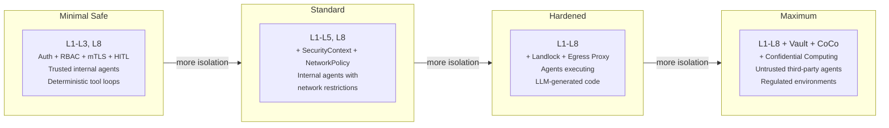
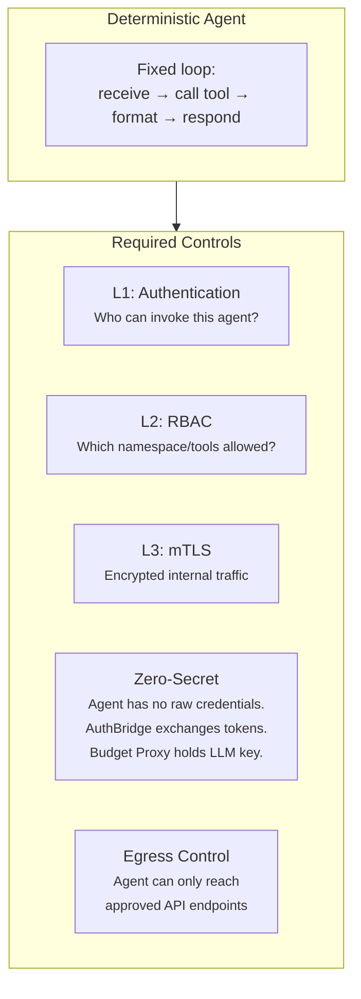
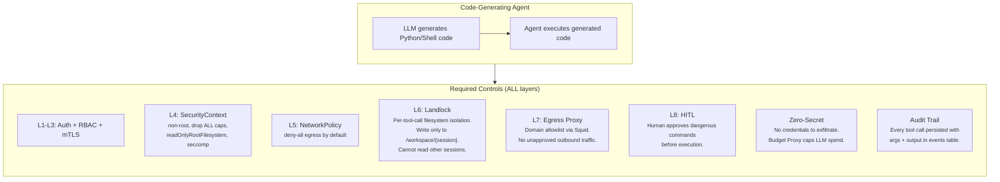
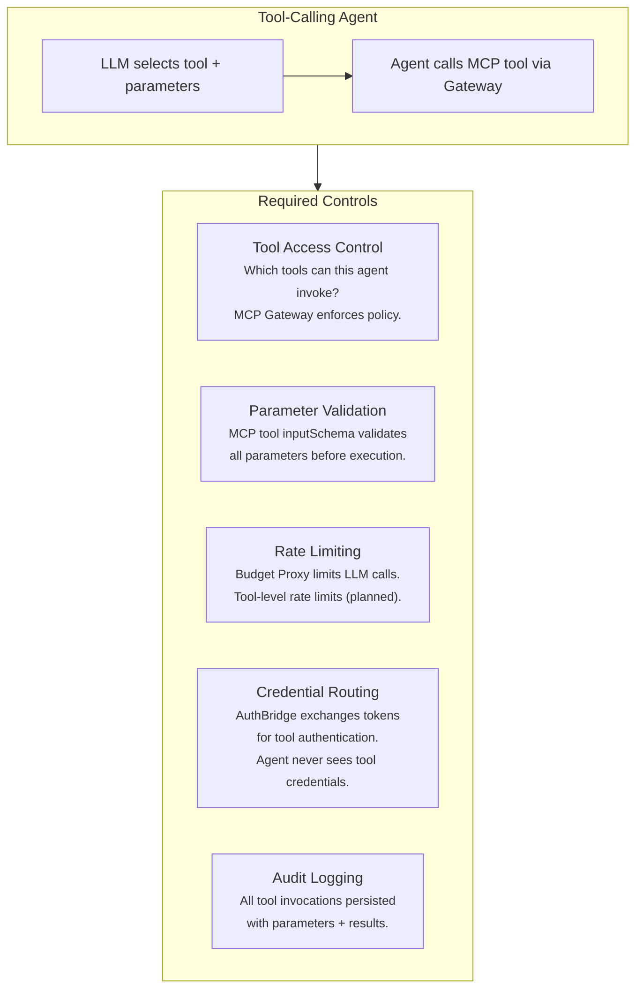
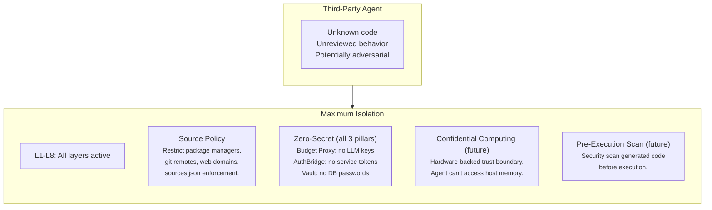
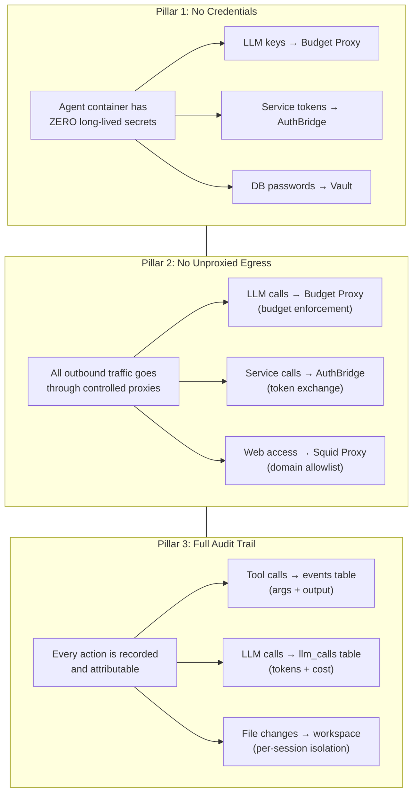

# Sandboxing Models

Different workloads require different levels of isolation. This guide explains
the sandboxing spectrum — from minimal safe configurations for trusted internal
agents to maximum isolation for executing untrusted, AI-generated code on
bare metal.

> **Related:** [Security](./security.md) for layer details,
> [Zero-Secret Agents](./zero-secret-agents.md) for the credential architecture.

---

## The Sandboxing Spectrum

---

## Four Use Cases

### Use Case 1: Deterministic Agent (Fixed Tool Loop)

An agent following a predictable pattern — call a weather API, format the
response, return to user. No code generation. Behavior is auditable.

**Profile:** `basic` (L1-L5, L8)

**Why not less?** Even a deterministic agent can be socially engineered through
prompt manipulation to misuse its tool access. An agent with GitHub access
could be persuaded to leak repository information. Zero-secret architecture
ensures there are no credentials to exfiltrate, and the egress proxy limits
what endpoints the agent can reach.

**Why not more?** Landlock filesystem isolation adds overhead (~7ms per tool call)
that isn't necessary when the agent doesn't generate or execute code. The
agent's behavior is predictable and auditable through conventional means.

### Use Case 2: AI-Generated Code Execution

An agent that writes and executes code produced by an LLM. The code is
late-bound, non-deterministic, and potentially adversarial. This is where
the security model fundamentally changes.

**Profile:** `hardened` (L1-L8)

**Why all layers?** Generated code can attempt to:
- Read files from other sessions → **Landlock** prevents cross-session access
- Establish reverse shells → **Egress Proxy** blocks unauthorized outbound
- Exfiltrate secrets from environment → **Zero-Secret** means nothing to steal
- Mine cryptocurrency → **Budget Proxy** caps compute via token limits
- Escalate privileges → **SecurityContext** drops all capabilities

**Audit requirement:** Every tool call (shell command, file write, web fetch) is
persisted in the `events` table with full arguments and output. This creates
the forensic trail needed for compliance (SOC 2, FedRAMP).

### Use Case 3: Tool Execution (MCP Services)

An agent invoking pre-defined tools via MCP (Model Context Protocol). The tools
are deterministic, but the agent's selection and parameterization is LLM-driven.

**Profile:** `basic` or `hardened` depending on tool sensitivity

**Key control:** MCP Gateway enforces which tools each agent can invoke. Tool
metadata (`annotations.destructiveHint`, `readOnlyHint`) drives UI decisions
(confirm before destructive operations, skip approval for read-only).

### Use Case 4: Untrusted / Third-Party Agents

Agents imported from external sources where the code hasn't been reviewed.
Maximum isolation — assume the agent is adversarial.

**Profile:** `restricted` (L1-L8 + source policy)

**Future:** Confidential computing (Kata Containers / CoCo) adds hardware-backed
isolation where even the cluster administrator cannot access the agent's memory.

---

## The Three Non-Negotiable Pillars

Regardless of sandboxing profile, three properties must **always** hold:

**Pillar 1: No Credentials** — A compromised agent cannot exfiltrate any secret
usable outside its own session. See [Zero-Secret Agents](./zero-secret-agents.md).

**Pillar 2: No Unproxied Egress** — The agent cannot reach any endpoint without
going through a proxy that enforces policy (budget, domain allowlist, token
exchange). A reverse shell cannot bypass the egress proxy.

**Pillar 3: Full Audit Trail** — Every tool call, LLM call, and file change is
persisted with full context. This creates the forensic trail needed for
compliance frameworks (SOC 2, FedRAMP, HIPAA).

**These three pillars are independent of the sandboxing profile.** A `legion`
agent (minimal isolation) and a `restricted` agent (maximum isolation) both
must satisfy all three.

---

## Profile Comparison

| Capability | `legion` | `basic` | `hardened` | `restricted` |
|-----------|---------|---------|-----------|-------------|
| Authentication (L1) | Yes | Yes | Yes | Yes |
| RBAC (L2) | Yes | Yes | Yes | Yes |
| mTLS (L3) | Yes | Yes | Yes | Yes |
| SecurityContext (L4) | -- | Yes | Yes | Yes |
| NetworkPolicy (L5) | -- | Yes | Yes | Yes |
| Landlock (L6) | -- | -- | Yes | Yes |
| Egress Proxy (L7) | -- | -- | Yes | Yes |
| HITL (L8) | Yes | Yes | Yes | Yes |
| Source Policy | -- | -- | -- | Yes |
| **Zero-Secret** | **Yes** | **Yes** | **Yes** | **Yes** |
| **Egress Proxy** | *planned* | *planned* | **Yes** | **Yes** |
| **Audit Trail** | **Yes** | **Yes** | **Yes** | **Yes** |

---

## Deployment Model: Shared Pod vs Pod-per-Session

| Model | Isolation | Overhead | Use Case |
|-------|----------|----------|----------|
| **Shared pod** (current) | Workspace dirs + Landlock | Low (one pod per agent) | Multiple sessions in one agent pod, separated by workspace + Landlock |
| **Pod-per-session** (future) | Full pod isolation | High (one pod per session) | Sensitive data processing, compliance environments |

The current model uses **Landlock per-tool-call** to isolate sessions within a
shared pod. Each session gets its own workspace directory at `/workspace/{context_id}/`.
Landlock restricts tool call execution to that directory — the agent cannot read
other sessions' workspaces.

For environments processing personal or sensitive data, pod-per-session provides
full kernel-level isolation. This is achieved by creating a new agent pod for
each session, with a dedicated workspace volume.

---

## Platform Coverage

| Layer | Kubernetes / OpenShift | Podman (local) | Gap |
|-------|----------------------|----------------|-----|
| L1 Auth | Keycloak + AuthBridge | -- | Local auth TBD |
| L2 RBAC | K8s RBAC | -- | No RBAC on Podman |
| L3 mTLS | Istio Ambient | -- | No mesh on Podman |
| L4 SecurityContext | Pod securityContext | Podman `--security-opt` | Similar controls |
| L5 NetworkPolicy | K8s NetworkPolicy | -- | **Open problem** |
| L6 Landlock | Landlock LSM (in-pod) | Landlock LSM (in-container) | Works on both |
| L7 Egress Proxy | Squid sidecar + iptables | Squid container + pod network | Needs work |
| L8 HITL | Backend API + UI | TUI | Works on both |
| Zero-Secret | Budget Proxy + AuthBridge + Vault | -- | Local secret mgmt TBD |

**Network isolation on developer laptops** is the hardest unsolved problem.
Kubernetes NetworkPolicy has no equivalent in Podman. The current mitigation
is Landlock (filesystem) + Squid (egress), which work in both environments.

**Policy portability** — defining one policy that works across Podman and
Kubernetes — is the subject of active upstream work in the Kubernetes Agentic
Networking proposal.
