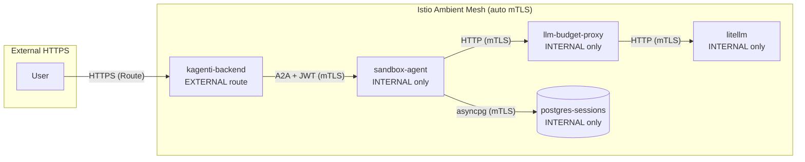

# Security

The Agentic Runtime uses a defense-in-depth model with 8 composable security
layers. Layers L1-L3 and L8 are always on. Layers L4-L7 are toggles exposed
through the import wizard.

**Key milestone: [Zero-Secret Agents](./zero-secret-agents.md)** — three pillars
eliminate all long-lived secrets from agent containers:
1. **LLM Budget Proxy** (shipped) — agent has no LLM API keys
2. **AuthBridge sidecar** (shipped) — agent has no service tokens
3. **Vault integration** (planned) — agent has no database passwords

When complete, a compromised agent cannot exfiltrate any credential usable
beyond its own budget-bounded, time-limited session.

---

## Defense-in-Depth Layers

| Layer | Mechanism | Threat Addressed | Overhead |
|-------|-----------|-----------------|----------|
| **L1** Keycloak + AuthBridge | OIDC JWT auth. AuthBridge sidecar validates inbound JWTs and exchanges outbound tokens via OAuth2 (RFC 8693). Injected by mutating webhook. | Unauthorized access, token forgery | Zero (sidecar) |
| **L2** RBAC | Kubernetes RBAC per namespace + feature flag scoping | Privilege escalation | Zero |
| **L3** mTLS | Istio Ambient ztunnel | Network eavesdropping, spoofing | Zero (ambient) |
| **L4** SecurityContext | non-root, drop ALL caps, seccomp, readOnlyRootFilesystem | Container breakout | Zero |
| **L5** NetworkPolicy | Default-deny + DNS allow | Lateral movement | Zero |
| **L6** Landlock | Per-tool-call Landlock via ctypes (zero deps). Startup probe verifies kernel. Pod fails if unavailable. | Filesystem escape | ~7ms/call |
| **L7** Egress Proxy | Squid domain allowlist (separate Deployment) | Data exfiltration | ~50MB RAM |
| **L8** HITL | Approval gates for dangerous operations | Unchecked autonomy | Human latency |

---

## Composable Security Profiles

Security layers are assembled by the wizard into named profiles. The
naming pattern reflects active layers:

```
sandbox-legion                         # legion profile (L1-L3, L8 only)
sandbox-legion-secctx                  # + L4 SecurityContext
sandbox-legion-secctx-landlock         # + L4 + L6 Landlock
sandbox-legion-secctx-landlock-proxy   # + L4 + L6 + L7 Egress Proxy (= hardened)
```

### Profiles

| Profile | Active Layers | Use Case |
|---------|--------------|----------|
| `legion` | L1-L3, L8 | Local dev, rapid prototyping, persistent sessions |
| `basic` | L1-L5, L8 | Trusted internal agents |
| `hardened` | L1-L8 | Production agents running own code |
| `restricted` | L1-L8 + source policy | Imported / third-party agents |

The wizard UI allows operators to toggle individual layers regardless of
profile, creating custom combinations.

---

## Landlock Filesystem Isolation

[Landlock](https://landlock.io/) is a Linux security module that restricts
filesystem access at the process level. The Agentic Runtime uses Landlock
to isolate each tool call to the agent's workspace directory.

### Implementation

- **Pure ctypes** -- `landlock_ctypes.py` (193 lines) makes raw syscalls
  via Python's `ctypes` module. Zero external dependencies.
- **Architecture-aware** -- supports x86_64 and aarch64 syscall numbers
- **ABI v1/v2/v3** -- handles kernel version differences
- **Irreversible** -- once applied, Landlock restrictions cannot be undone

### How It Works

1. On startup, `landlock_probe.py` forks a child process to test kernel
   Landlock support. If the kernel doesn't support Landlock, the pod
   **fails assertively** (no silent degradation).

2. For each tool call, the executor forks a new subprocess with Landlock
   applied:
   - Write access: only the session workspace (`/workspace/{context_id}/`)
   - Read access: system libraries, Python packages
   - No access: other sessions' workspaces, host filesystem

3. The overhead is ~7ms per tool call (fork + Landlock setup).

### Environment Variable

Set `SANDBOX_LANDLOCK=true` on the agent container to enable Landlock.
The startup probe will verify kernel support and fail the pod if unavailable.

---

## AuthBridge — Zero-Trust Agent Identity

AuthBridge provides transparent authentication for agent pods via a
**sidecar pattern**. It is NOT a standalone service — it is injected into
agent pods by a mutating admission webhook.

### How It Works

1. A **mutating webhook** (`kagenti-webhook-system`) watches for workloads
   in namespaces labeled `kagenti-enabled: "true"`
2. When a pod has the label `kagenti.io/inject: enabled`, the webhook
   injects sidecar containers:
   - **proxy-init** (init container) — sets up iptables traffic redirection
   - **envoy-proxy** — Envoy sidecar handling auth on two ports
   - **kagenti-client-registration** — registers workload with Keycloak
   - **spiffe-helper** (optional, if `kagenti.io/spire: enabled`) — fetches
     SPIFFE credentials from SPIRE
3. All traffic is intercepted transparently via iptables — the agent code
   is completely unaware of AuthBridge

### Traffic Flow

```
Inbound:  Backend -> envoy-proxy:15124 -> JWT validation -> agent container
Outbound: agent container -> envoy-proxy:15123 -> OAuth2 token exchange -> target service
```

- **Inbound (port 15124):** Validates JWT signatures using JWKS from Keycloak.
  Rejects invalid tokens with HTTP 401.
- **Outbound (port 15123):** Performs RFC 8693 OAuth2 token exchange with
  Keycloak. The agent's SPIFFE identity (or static client ID) is exchanged
  for a scoped access token.

### Pod Labels

| Label | Value | Effect |
|-------|-------|--------|
| `kagenti.io/inject` | `enabled` | Enables AuthBridge sidecar injection |
| `kagenti.io/inject` | `disabled` | Skips injection |
| `kagenti.io/spire` | `enabled` | Uses SPIFFE-based identity |
| `kagenti.io/spire` | `disabled` | Uses static client ID |

### Namespace Configuration

Each agent namespace has two ConfigMaps created by the Helm chart:
- `authbridge-config` — Keycloak token URL, issuer, target audience/scopes
- `envoy-config` — Envoy listener configuration for both ports

---

## RBAC Scoping

When `KAGENTI_FEATURE_FLAG_SANDBOX` is `false`, the backend ClusterRole
does NOT include:
- `pods/exec` (used for file browsing and agent introspection)
- `secrets` access (used for PostgreSQL credentials)
- `configmaps` access (used for agent configuration)

These permissions are only added when the sandbox flag is enabled. This
prevents cluster-wide privilege escalation when the Agentic Runtime is
not in use.

---

## Service Mesh -- Istio Ambient

All agent namespaces are enrolled in Istio Ambient mesh with automatic mTLS.
No sidecars -- ztunnel handles L4 encryption, waypoint proxies handle L7.



**Key points:**
- Agents, budget proxy, LiteLLM, and PostgreSQL are **internal-only**
- Only `kagenti-ui`, `kagenti-backend`, `keycloak`, `mlflow`, `phoenix` have external routes
- SSL is disabled at the application level -- Istio ztunnel provides mTLS
- Target: STRICT mTLS mode + deny-all baseline with per-service ALLOW policies

---

## Egress Proxy

Each agent can optionally have a **Squid egress proxy** that restricts
outbound HTTP(S) traffic to an allowlist of domains.

- Deployed as a separate Deployment (`{agent}-egress-proxy`)
- Agent's `HTTP_PROXY`/`HTTPS_PROXY` env vars point to the proxy
- Only domains in `ALLOWED_DOMAINS` can be reached
- All other outbound traffic is blocked

This prevents data exfiltration and unauthorized API calls from agent
workspaces.
