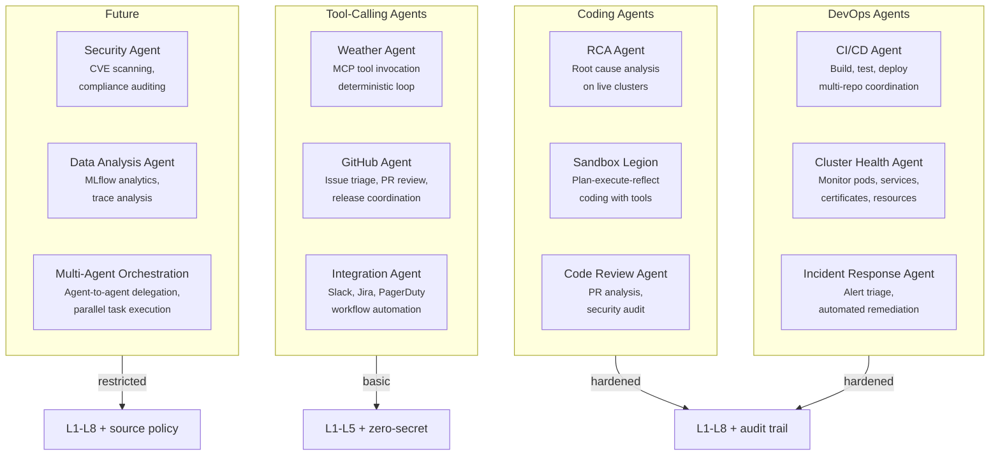
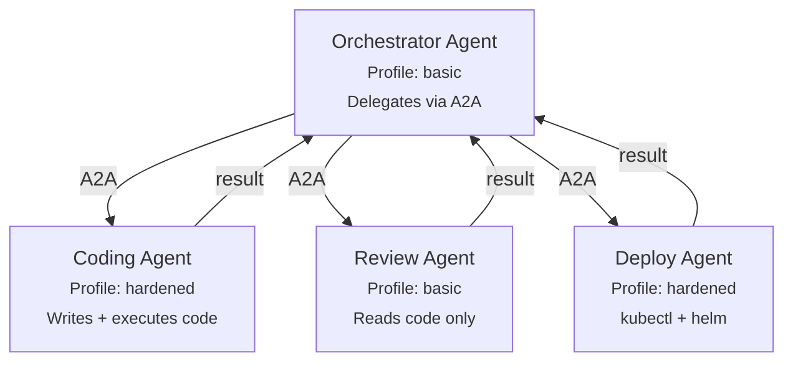
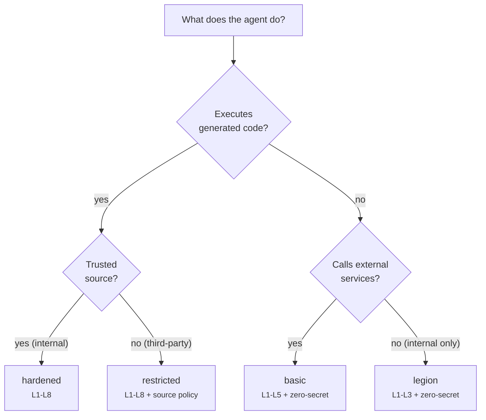

# Use Cases

What agents do on the Kagenti Agentic Runtime — from coding assistants
to DevOps automation. Each use case maps to a sandboxing profile, a set
of tools, and a skill pack configuration.

---

## Use Case Map



---

## Coding Agents

### RCA Agent (Root Cause Analysis)

Investigates failures on live Kubernetes clusters. Reads logs, checks pod
status, analyzes events, and produces a root cause report.

| Aspect | Detail |
|--------|--------|
| **Framework** | LangGraph (plan-execute-reflect) |
| **Profile** | `hardened` (executes kubectl/oc commands) |
| **Tools** | `shell` (kubectl, oc), `file_read`, `web_fetch` |
| **Skills** | `rca:kind`, `rca:hypershift`, `k8s:pods`, `k8s:logs` |
| **Egress** | Cluster API only (no external) |
| **HITL** | Approve before `kubectl delete`, `kubectl scale` |
| **Sessions** | Multi-turn — iterative investigation across messages |
| **Budget** | 500K tokens per session (analysis-heavy) |

**Example flow:**
```
User: "The weather agent is failing on sandbox47"
  → Planner: 3 steps (check pods, read logs, analyze events)
  → Executor: kubectl get pods, kubectl logs, kubectl describe
  → Reflector: root cause identified (image pull error)
  → Reporter: "The weather-agent pod is in ImagePullBackOff..."
```

### Sandbox Legion (General Coding)

Full-featured coding agent with persistent sessions, file operations,
shell execution, and multi-turn conversations.

| Aspect | Detail |
|--------|--------|
| **Framework** | LangGraph (plan-execute-reflect with micro-reasoning) |
| **Profile** | `hardened` (executes generated code) |
| **Tools** | `shell`, `file_read`, `file_write`, `web_fetch`, `explore`, `delegate` |
| **Skills** | Loaded from git repos via `SKILL_REPOS` env var |
| **Egress** | pypi.org, github.com, api.github.com (configurable) |
| **HITL** | Approve before destructive shell commands |
| **Sessions** | Persistent (PostgreSQL checkpoints, resume across restarts) |
| **Budget** | 1M tokens per session, 5M daily, 50M monthly |
| **Workspace** | Per-session at `/workspace/{context_id}/` with Landlock isolation |

**Why hardened?** The agent generates and executes shell commands and Python
code. Generated code is non-deterministic and potentially adversarial.
Landlock isolates each tool call to the session workspace. Egress proxy
restricts outbound traffic to approved domains.

### Code Review Agent

Analyzes pull requests for quality, security, conventions, and test coverage.

| Aspect | Detail |
|--------|--------|
| **Framework** | LangGraph or Claude Agent SDK |
| **Profile** | `basic` (reads code, doesn't execute) |
| **Tools** | `file_read`, `web_fetch` (GitHub API) |
| **Skills** | `github:pr-review`, `test:review`, `cve:scan` |
| **Egress** | api.github.com only |
| **HITL** | None needed (read-only) |
| **Budget** | 200K tokens per review |

**Why basic, not hardened?** The agent only reads files and calls GitHub API.
It doesn't execute generated code. The reduced profile avoids Landlock
overhead on a read-heavy workload.

---

## DevOps Agents

### CI/CD Agent

Coordinates multi-repository builds, tests, and releases. Runs E2E tests
with dependency overrides.

| Aspect | Detail |
|--------|--------|
| **Framework** | LangGraph |
| **Profile** | `hardened` (executes build scripts) |
| **Tools** | `shell` (git, gh, helm, kubectl), `file_read`, `file_write` |
| **Skills** | `ci:status`, `ci:monitoring`, `tdd:kind`, `tdd:hypershift` |
| **Egress** | github.com, registry access, cluster API |
| **HITL** | Approve before `git push`, `helm upgrade`, tag creation |
| **Sessions** | Long-running (test cycles can take 30+ minutes) |
| **Budget** | 2M tokens per session (complex multi-step workflows) |

**Example flow:**
```
User: "Run E2E tests on Kind with extensions from main"
  → Planner: 5 steps (create cluster, build deps, install, deploy, test)
  → Executor: kind-full-test.sh --build kagenti-extensions=main
  → Reflector: 35 passed, 0 failed
  → Reporter: "All tests passed. Ready for release."
```

### Cluster Health Agent

Continuously monitors cluster health — pods, services, certificates,
resource usage. Alerts on anomalies.

| Aspect | Detail |
|--------|--------|
| **Framework** | LangGraph (simple observe-report loop) |
| **Profile** | `basic` (read-only cluster access) |
| **Tools** | `shell` (kubectl get, kubectl describe — read only) |
| **Skills** | `k8s:health`, `k8s:pods`, `k8s:logs` |
| **Egress** | Cluster API only |
| **HITL** | None (read-only) |
| **Budget** | 100K tokens per check |

### Incident Response Agent

Responds to alerts — triages, investigates, and optionally remediates.
Escalates to human via HITL for destructive actions.

| Aspect | Detail |
|--------|--------|
| **Framework** | LangGraph |
| **Profile** | `hardened` (may execute remediation commands) |
| **Tools** | `shell`, `web_fetch` (PagerDuty/Slack API) |
| **Skills** | `rca:kind`, `rca:hypershift`, `k8s:live-debugging` |
| **Egress** | Cluster API, PagerDuty, Slack |
| **HITL** | **Required** before any remediation (scale, restart, delete) |
| **Sessions** | Multi-turn — investigation → remediation → verification |
| **Budget** | 1M tokens per incident |

---

## Tool-Calling Agents

### Weather Agent (Reference Implementation)

The simplest agent — deterministic tool loop. Calls a weather MCP tool,
formats the response, returns to user.

| Aspect | Detail |
|--------|--------|
| **Framework** | LangGraph (single-node ReAct) |
| **Profile** | `legion` (minimal, trusted) |
| **Tools** | `weather` MCP tool (via MCP Gateway) |
| **Egress** | MCP Gateway only (internal) |
| **HITL** | None |
| **Budget** | 50K tokens per session |

**Why legion?** Fully deterministic. Fixed tool set. No code generation.
Predictable behavior. The three non-negotiable pillars (zero-secret,
egress control, audit trail) still apply.

### GitHub Agent

Manages GitHub repositories — issue triage, PR review, release coordination,
weekly reports.

| Aspect | Detail |
|--------|--------|
| **Framework** | LangGraph |
| **Profile** | `basic` (API calls, no code execution) |
| **Tools** | `web_fetch` (GitHub API via AuthBridge token exchange) |
| **Skills** | `github:issues`, `github:prs`, `github:last-week`, `github:pr-review` |
| **Egress** | api.github.com only |
| **HITL** | Approve before creating/closing issues, posting comments |
| **Budget** | 300K tokens per session |

**Zero-secret critical:** AuthBridge exchanges SPIFFE identity for a scoped
GitHub token. The agent never possesses a `GITHUB_TOKEN`. Even if the agent
is socially engineered via prompt manipulation, there's no credential to leak.

### Integration Agent

Connects to external services (Slack, Jira, PagerDuty) for workflow automation.

| Aspect | Detail |
|--------|--------|
| **Framework** | Any (OpenCode, Claude SDK, custom) |
| **Profile** | `basic` (API calls via AuthBridge) |
| **Tools** | MCP tools for each service (via MCP Gateway) |
| **Egress** | Service-specific domains via egress proxy |
| **HITL** | Approve before sending messages, creating tickets |
| **Budget** | 200K tokens per workflow |

---

## Future Use Cases

### Security Agent

Automated CVE scanning, dependency auditing, compliance checking.
Reads code and dependencies, produces reports.

| Aspect | Detail |
|--------|--------|
| **Framework** | LangGraph or AG2 |
| **Profile** | `restricted` (untrusted scan targets) |
| **Tools** | `shell` (trivy, grype), `file_read`, `web_fetch` (NVD API) |
| **Skills** | `cve:scan`, `cve:brainstorm` |
| **Egress** | NVD, GitHub advisory database only |
| **Source policy** | Blocked packages, restricted git remotes |

### Data Analysis Agent

Analyzes MLflow traces, LLM observability data, and platform metrics.
Produces reports and visualizations.

| Aspect | Detail |
|--------|--------|
| **Framework** | LangGraph or CrewAI (multi-agent for complex analysis) |
| **Profile** | `basic` (read-only data access) |
| **Tools** | `web_fetch` (MLflow API, Phoenix API), `file_write` (reports) |
| **Egress** | MLflow, Phoenix (internal services) |

### Multi-Agent Orchestration

An orchestrator agent delegates tasks to specialized sub-agents.
Each sub-agent has its own sandboxing profile.



Each sub-agent runs in its own pod with its own sandboxing profile.
The orchestrator uses the `delegate` tool which calls peer agents via A2A.
AuthBridge handles inter-agent authentication transparently.

---

## Skills & Use Case Mapping

Skills are loaded from git repos at agent startup via `SKILL_REPOS`.
Each skill defines prompts, tools, and workflows for a specific task.

| Skill Category | Skills | Use Cases |
|---------------|--------|-----------|
| **Kubernetes** | `k8s:health`, `k8s:pods`, `k8s:logs` | RCA, Cluster Health, Incident Response |
| **CI/CD** | `ci:status`, `ci:monitoring`, `tdd:kind`, `tdd:hypershift` | CI/CD Agent |
| **GitHub** | `github:issues`, `github:prs`, `github:pr-review`, `github:last-week` | GitHub Agent, Code Review |
| **Security** | `cve:scan`, `cve:brainstorm` | Security Agent |
| **RCA** | `rca:kind`, `rca:hypershift`, `rca:ci` | RCA Agent, Incident Response |
| **Deployment** | `kagenti:deploy`, `kagenti:operator`, `helm:debug` | CI/CD Agent, Deploy Agent |
| **Testing** | `test:write`, `test:review`, `test:run-kind` | CI/CD Agent, Code Review |

---

## Sandboxing Profile Selection Guide



**Always apply:** Zero-secret (3 pillars), egress control, audit trail.
These are non-negotiable regardless of profile.
