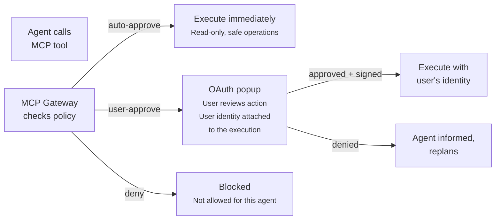
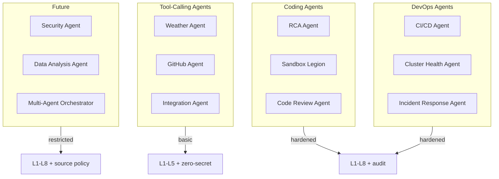
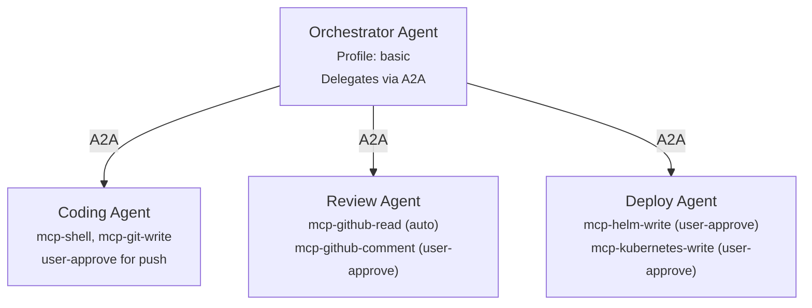
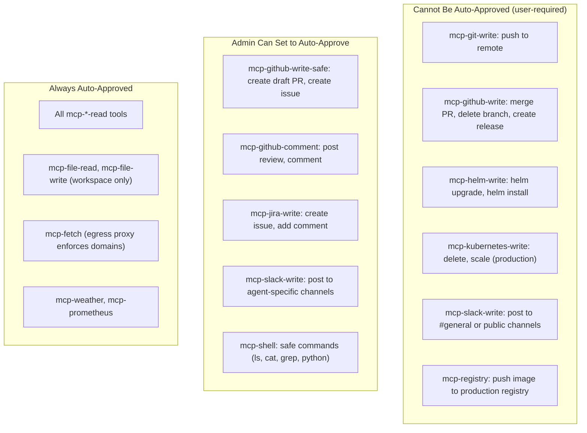
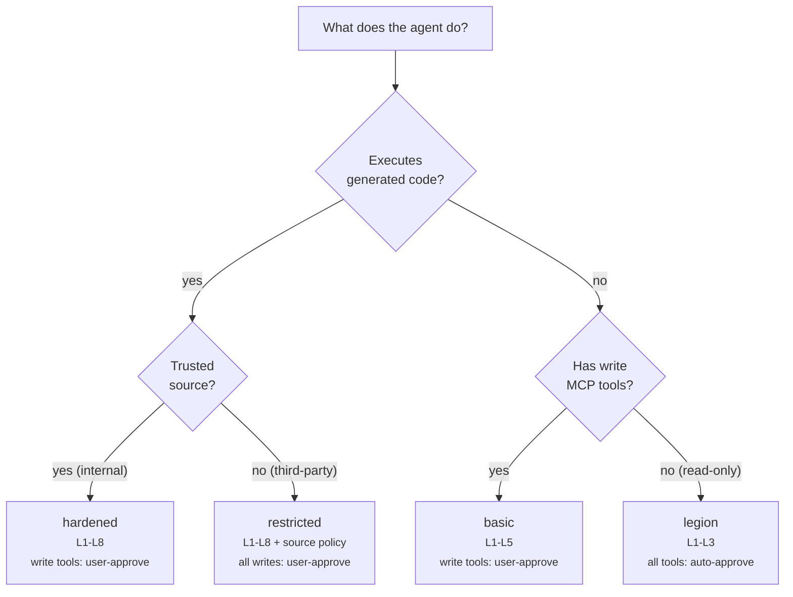

# Use Cases

What agents do on the Kagenti Agentic Runtime — from coding assistants
to DevOps automation. Each use case maps to a sandboxing profile, explicit
MCP tool configuration, and HITL approval policies.

---

## MCP Tool Approval Model

Every unsafe action flows through MCP tools with three approval levels.
User approval is **identity-bound** — the approving user's OAuth identity
is attached to the action, creating accountability and an audit trail.



**Three approval levels:**

| Level | When | User Action | Identity |
|-------|------|-------------|----------|
| **auto-approve** | Read-only, safe operations (list, get, read) | None | Agent's SPIFFE identity |
| **user-approve** | Write operations (create, update, push, send) | OAuth popup — review + approve | **User's OAuth identity** attached to the action |
| **deny** | Dangerous or out-of-scope operations | None (blocked by policy) | N/A |

**User approval with OAuth identity** means:
- The user sees exactly what the agent wants to do (tool name, parameters)
- The user clicks "Approve" in an OAuth consent popup
- The action executes with **the user's scoped OAuth token**, not the agent's
- The audit trail records: who approved, when, what parameters
- The external service (GitHub, Slack) sees the user's identity as the actor

This is critical for compliance — an agent creating a PR on GitHub does so
**as the approving user**, not as a service account.

---

## Use Case Map



---

## Coding Agents

### RCA Agent (Root Cause Analysis)

Investigates failures on live Kubernetes clusters.

| Aspect | Detail |
|--------|--------|
| **Framework** | LangGraph (plan-execute-reflect) |
| **Profile** | `hardened` |
| **Skills** | `rca:kind`, `rca:hypershift`, `k8s:pods`, `k8s:logs` |
| **Egress** | Cluster API only |
| **Budget** | 500K tokens/session |

**MCP Tools:**

| MCP Tool | Operations | Approval |
|----------|-----------|----------|
| `mcp-kubernetes-read` | `kubectl get pods`, `kubectl describe`, `kubectl logs`, `kubectl get events` | auto-approve |
| `mcp-kubernetes-write` | `kubectl delete pod`, `kubectl scale`, `kubectl rollout restart` | **user-approve** (OAuth — action runs as approving user) |
| `mcp-file-read` | Read files from agent workspace | auto-approve |
| `mcp-fetch` | Fetch cluster API endpoints | auto-approve |

### Sandbox Legion (General Coding)

Full-featured coding agent with persistent sessions.

| Aspect | Detail |
|--------|--------|
| **Framework** | LangGraph (plan-execute-reflect with micro-reasoning) |
| **Profile** | `hardened` |
| **Skills** | Loaded from git repos via `SKILL_REPOS` |
| **Egress** | pypi.org, github.com, api.github.com |
| **Budget** | 1M tokens/session, 5M daily |
| **Workspace** | `/workspace/{context_id}/` with Landlock |

**MCP Tools:**

| MCP Tool | Operations | Approval |
|----------|-----------|----------|
| `mcp-shell` | Execute shell commands in workspace | auto-approve for safe commands (`ls`, `cat`, `grep`, `find`, `python`). **user-approve** for destructive (`rm`, `chmod`, `curl`, `wget`). deny for system commands (`sudo`, `mount`, `iptables`). |
| `mcp-file-read` | Read files in workspace + system libs | auto-approve |
| `mcp-file-write` | Write files in workspace only | auto-approve (Landlock enforces scope) |
| `mcp-git-read` | `git clone`, `git log`, `git diff`, `git status` | auto-approve |
| `mcp-git-write` | `git commit`, `git push`, `git branch`, `git tag` | **user-approve** (OAuth — commit/push runs as user) |
| `mcp-github-read` | List repos, PRs, issues, reviews | auto-approve |
| `mcp-github-write` | Create PR, create issue, post comment, merge PR, close issue | **user-approve** (OAuth — PR created as approving user) |
| `mcp-fetch` | HTTP GET to allowed domains | auto-approve (egress proxy enforces domains) |
| `mcp-pypi` | `pip install` from allowed packages | auto-approve (source policy blocks dangerous packages) |

**Example approval flow:**
```
Agent: "I need to push these changes to the feature branch"
  → calls mcp-git-write: git push origin feat/fix-bug-123

  ┌─────────────────────────────────────────────┐
  │  Approve Agent Action                       │
  │                                             │
  │  Tool: mcp-git-write                        │
  │  Action: git push origin feat/fix-bug-123   │
  │  Repository: kagenti/kagenti                │
  │                                             │
  │  This will push as: lsmola@redhat.com       │
  │                                             │
  │  [Approve]  [Deny]  [Always approve pushes] │
  └─────────────────────────────────────────────┘

  → User clicks Approve
  → OAuth token exchange: user's scoped token used for push
  → Git push runs with user's identity
  → Audit: lsmola approved git push at 2026-03-19T14:23:00Z
```

### Code Review Agent

Analyzes pull requests for quality, security, and conventions.

| Aspect | Detail |
|--------|--------|
| **Framework** | LangGraph or Claude Agent SDK |
| **Profile** | `basic` (read-only) |
| **Skills** | `github:pr-review`, `test:review`, `cve:scan` |
| **Egress** | api.github.com only |
| **Budget** | 200K tokens/review |

**MCP Tools:**

| MCP Tool | Operations | Approval |
|----------|-----------|----------|
| `mcp-github-read` | Get PR diff, list files, read comments, list checks | auto-approve |
| `mcp-github-write` | Post review comment, submit review, request changes | **user-approve** (OAuth — review posted as user) |
| `mcp-file-read` | Read PR files | auto-approve |
| `mcp-fetch` | Fetch GitHub API, NVD API (for CVE checks) | auto-approve |

---

## DevOps Agents

### CI/CD Agent

Coordinates multi-repository builds, tests, and releases.

| Aspect | Detail |
|--------|--------|
| **Framework** | LangGraph |
| **Profile** | `hardened` |
| **Skills** | `ci:status`, `ci:monitoring`, `tdd:kind` |
| **Egress** | github.com, container registries, cluster API |
| **Budget** | 2M tokens/session |

**MCP Tools:**

| MCP Tool | Operations | Approval |
|----------|-----------|----------|
| `mcp-shell` | `make build`, `make test`, `pytest`, `go test` | auto-approve (build commands) |
| `mcp-git-read` | Clone repos, read logs, diff branches | auto-approve |
| `mcp-git-write` | `git tag`, `git push --tags` | **user-approve** (OAuth — tag as user) |
| `mcp-github-read` | Check CI status, list runs, read artifacts | auto-approve |
| `mcp-github-write` | Create release PR, post CI summary comment | **user-approve** (OAuth — PR as user) |
| `mcp-helm` | `helm template` (render), `helm lint` | auto-approve |
| `mcp-helm-write` | `helm upgrade`, `helm install` | **user-approve** (OAuth — deploy as user. **Cannot be auto-approved.**) |
| `mcp-kubernetes-read` | Check deployment status, pod health | auto-approve |
| `mcp-kubernetes-write` | Apply manifests, create namespaces | **user-approve** |
| `mcp-registry` | Push images to container registry | **user-approve** (OAuth — push as user) |

### Cluster Health Agent

Monitors cluster health — read-only, no approvals needed.

| Aspect | Detail |
|--------|--------|
| **Framework** | LangGraph (observe-report loop) |
| **Profile** | `basic` (read-only) |
| **Budget** | 100K tokens/check |

**MCP Tools:**

| MCP Tool | Operations | Approval |
|----------|-----------|----------|
| `mcp-kubernetes-read` | Get pods, services, nodes, events, certificates | auto-approve |
| `mcp-prometheus` | Query metrics (CPU, memory, request rate) | auto-approve |
| `mcp-alertmanager-read` | List active alerts | auto-approve |

### Incident Response Agent

Triages alerts and optionally remediates with human approval.

| Aspect | Detail |
|--------|--------|
| **Framework** | LangGraph |
| **Profile** | `hardened` |
| **Skills** | `rca:kind`, `rca:hypershift`, `k8s:live-debugging` |
| **Budget** | 1M tokens/incident |

**MCP Tools:**

| MCP Tool | Operations | Approval |
|----------|-----------|----------|
| `mcp-kubernetes-read` | Get pods, logs, events, describe | auto-approve |
| `mcp-kubernetes-write` | Restart pod, scale deployment, cordon node | **user-approve** (OAuth — **cannot be auto-approved** for remediation) |
| `mcp-pagerduty-read` | Get incident details, list alerts | auto-approve |
| `mcp-pagerduty-write` | Acknowledge incident, add note | **user-approve** (OAuth — ack as user) |
| `mcp-slack-read` | Read channel messages (for context) | auto-approve |
| `mcp-slack-write` | Post incident update, notify channel | **user-approve** (OAuth — post as user) |

---

## Tool-Calling Agents

### Weather Agent (Reference)

Simplest agent — deterministic tool loop, no approvals.

| Aspect | Detail |
|--------|--------|
| **Profile** | `legion` |
| **Budget** | 50K tokens/session |

**MCP Tools:**

| MCP Tool | Operations | Approval |
|----------|-----------|----------|
| `mcp-weather` | Get current weather, forecast | auto-approve |

### GitHub Agent

Manages GitHub repositories with identity-bound write operations.

| Aspect | Detail |
|--------|--------|
| **Framework** | LangGraph |
| **Profile** | `basic` |
| **Skills** | `github:issues`, `github:prs`, `github:last-week` |
| **Budget** | 300K tokens/session |

**MCP Tools:**

| MCP Tool | Operations | Approval |
|----------|-----------|----------|
| `mcp-github-read` | List repos, PRs, issues, reviews, CI checks, releases | auto-approve |
| `mcp-github-write-safe` | Create draft PR, create issue (draft), add label, assign reviewer | user-approve (can be set to **auto-approve** by admin) |
| `mcp-github-write-destructive` | Merge PR, close issue, delete branch, create release | **user-approve** (OAuth — **cannot be auto-approved**) |
| `mcp-github-comment` | Post PR review, issue comment | user-approve (can be set to auto-approve) |

**Auto-approve policy:** An admin can configure certain write operations
as auto-approved for trusted agents:

```yaml
# MCP Gateway tool policy for github-agent in team1
tools:
  mcp-github-read:
    approval: auto
  mcp-github-write-safe:
    approval: auto          # admin opted in
  mcp-github-write-destructive:
    approval: user-required  # cannot be overridden to auto
  mcp-github-comment:
    approval: auto          # admin opted in — agent can comment freely
```

Some operations have `approval: user-required` which **cannot be changed
to auto-approve** even by admins. These are the operations where the
user's identity is essential (merge, delete, release).

### Integration Agent

Connects to Slack, Jira, PagerDuty.

| Aspect | Detail |
|--------|--------|
| **Profile** | `basic` |
| **Budget** | 200K tokens/workflow |

**MCP Tools:**

| MCP Tool | Operations | Approval |
|----------|-----------|----------|
| `mcp-slack-read` | List channels, read messages, search | auto-approve |
| `mcp-slack-write` | Post message, update message, react | **user-approve** (OAuth — post as user) |
| `mcp-jira-read` | List issues, search, get status | auto-approve |
| `mcp-jira-write` | Create issue, transition status, add comment | **user-approve** (OAuth — create as user) |
| `mcp-pagerduty-read` | List incidents, get on-call | auto-approve |
| `mcp-pagerduty-write` | Acknowledge, escalate, create incident | **user-approve** |

---

## Future Use Cases

### Security Agent

| **MCP Tools:** | `mcp-trivy` (auto), `mcp-grype` (auto), `mcp-nvd-read` (auto), `mcp-github-advisory` (auto), `mcp-github-write` (create security advisory — **user-approve, cannot auto**) |

### Data Analysis Agent

| **MCP Tools:** | `mcp-mlflow-read` (auto), `mcp-phoenix-read` (auto), `mcp-prometheus` (auto), `mcp-file-write` (auto — reports only) |

### Multi-Agent Orchestration



Each sub-agent has its own MCP tool configuration and approval policies.
The orchestrator cannot escalate — if a sub-agent needs user approval,
the approval request bubbles up to the user regardless of the orchestrator.

---

## Approval Policy Tiers



---

## Skills & MCP Tool Mapping

| Skill | MCP Tools Used | Approval Pattern |
|-------|---------------|-----------------|
| `rca:kind` | `mcp-kubernetes-read` (auto), `mcp-kubernetes-write` (user) | Investigate auto, remediate user-approve |
| `github:pr-review` | `mcp-github-read` (auto), `mcp-github-comment` (user/auto) | Read auto, comment configurable |
| `ci:status` | `mcp-github-read` (auto) | All auto |
| `tdd:kind` | `mcp-shell` (auto/user), `mcp-kubernetes-read` (auto), `mcp-git-write` (user) | Build auto, push user-approve |
| `cve:scan` | `mcp-trivy` (auto), `mcp-nvd-read` (auto) | All auto |
| `kagenti:deploy` | `mcp-helm-write` (user), `mcp-kubernetes-write` (user) | All user-approve |
| `k8s:health` | `mcp-kubernetes-read` (auto), `mcp-prometheus` (auto) | All auto |

---

## Sandboxing Profile Selection Guide



**Always apply:** Zero-secret (3 pillars), egress proxy, audit trail.
**Always enforce:** Write MCP tools require user-approve (with OAuth identity).
**Never auto-approve:** Push, merge, delete, deploy, post to public channels.
