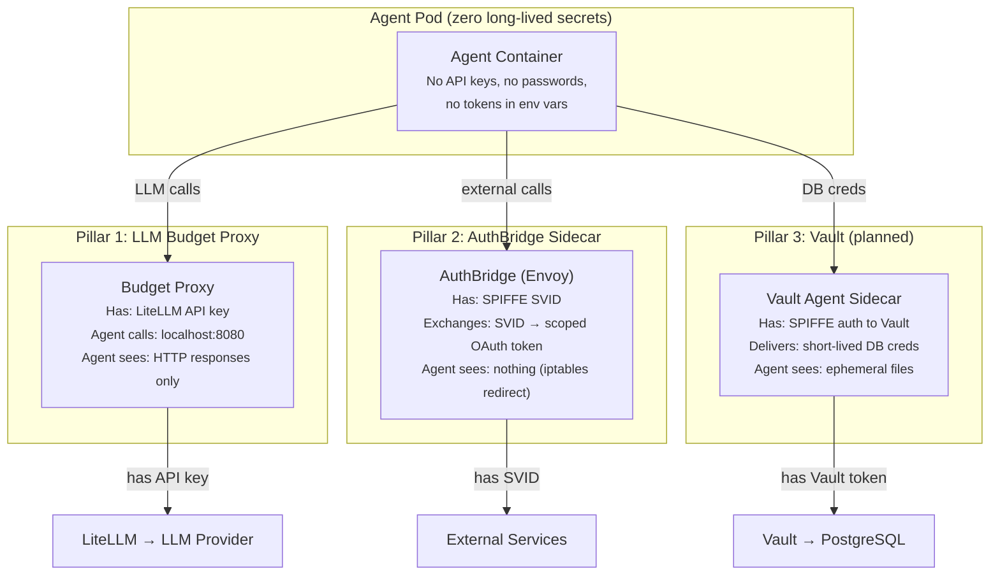
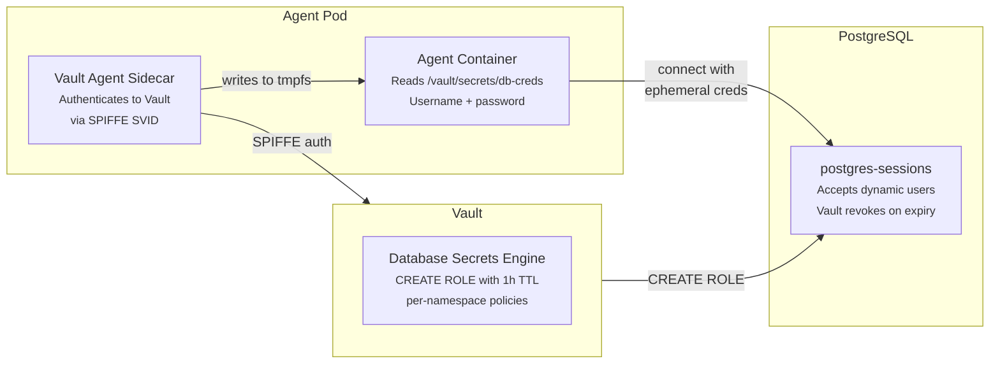
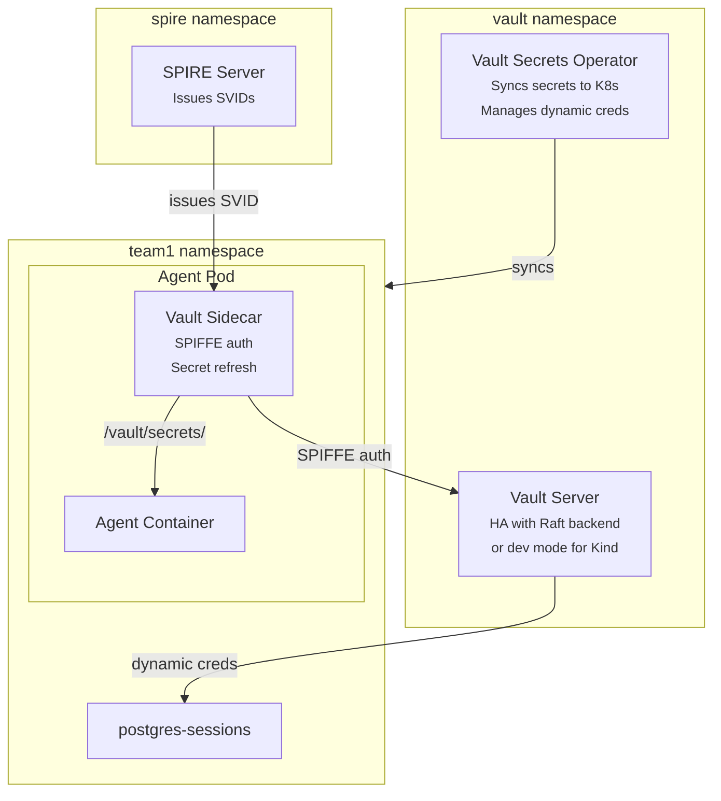
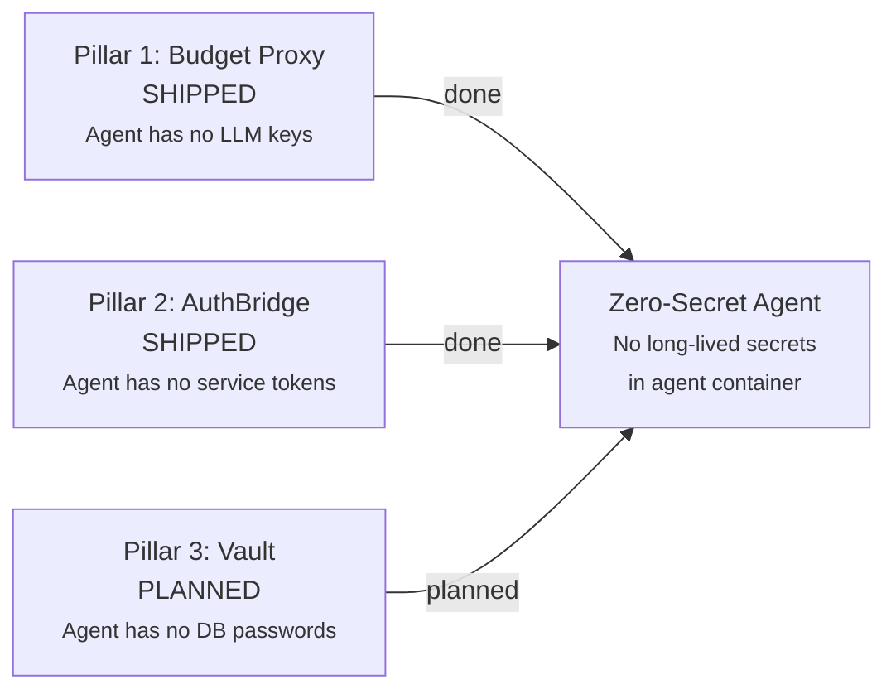

# Zero-Secret Agents

The most critical security property of the Agentic Runtime: **the agent
container has zero access to long-lived secrets**. Even if an agent is
compromised (prompt injection, code execution exploit), there are no
credentials to exfiltrate.

---

## The Three Pillars

Three components achieve zero-secret agents. Each handles a different
class of secret that the agent would otherwise need:



### Pillar 1: LLM Budget Proxy — No LLM API Keys

**Status: Shipped** ([#984](https://github.com/kagenti/kagenti/pull/984))

| Without | With |
|---------|------|
| Agent has `OPENAI_API_KEY` in env var | Agent has `LLM_API_BASE=http://llm-budget-proxy:8080` |
| Compromised agent → leaked API key → unlimited spend | Compromised agent → no key to steal, budget enforced |

The agent calls the budget proxy at `localhost:8080`. The proxy holds the
LiteLLM virtual key and forwards to LiteLLM. The agent never sees any
LLM API key. Even if the agent is compromised, it can only make LLM calls
through the proxy — which enforces per-session budgets (HTTP 402 on exceed).

### Pillar 2: AuthBridge — No Service Tokens

**Status: Shipped** (kagenti-extensions webhook)

| Without | With |
|---------|------|
| Agent has `GITHUB_TOKEN` in env var | AuthBridge exchanges SPIFFE SVID → scoped OAuth token |
| Compromised agent → leaked token → full repo access | Compromised agent → no token to steal |

AuthBridge is an Envoy sidecar injected by mutating webhook. Iptables
redirect all outbound traffic through Envoy. The sidecar performs RFC 8693
OAuth2 token exchange: the agent's SPIFFE identity (X.509 certificate
from SPIRE) is exchanged for a short-lived, scoped OAuth token. The agent
container never possesses any service credential.

### Pillar 3: Vault — No Database Passwords

**Status: Planned**

| Without | With |
|---------|------|
| Agent has `DB_PASSWORD=kagenti-sessions-dev` in env var | Vault issues ephemeral credentials (1h TTL, unique per pod) |
| Compromised agent → leaked shared password → all namespace data | Compromised agent → credential expires in 1h, scoped to one agent |

Today, the PostgreSQL password is a shared secret in `postgres-sessions-secret`.
With Vault, each agent pod gets unique, short-lived database credentials:



---

## Vault Integration Plan

### Architecture



### Vault Engines

| Engine | Purpose | Agent Access |
|--------|---------|-------------|
| **Database** | Ephemeral PostgreSQL credentials (1h TTL) | Read file `/vault/secrets/db-creds` |
| **KV v2** | Static config (non-secret data) | Read file `/vault/secrets/config` |
| **Transit** | Token signing without key exposure | API call → get signature (never see key) |
| **PKI** | TLS certificates for mTLS | Handled by SPIRE (existing) |

### Authentication: SPIFFE

Vault authenticates agents via SPIFFE SVIDs (leveraging existing SPIRE
deployment):

```
SPIFFE ID: spiffe://kagenti.io/ns/team1/sa/sandbox-legion
    ↓ (X.509 certificate)
Vault SPIFFE Auth Method
    ↓ (maps SPIFFE ID → Vault role)
Vault Role: team1-agent-readonly
    ↓ (scoped policies)
Policy: read database/creds/team1-*, encrypt transit/team1-key
```

No Kubernetes ServiceAccount tokens needed. The same SVID that provides
Istio Ambient mTLS also authenticates to Vault.

### Per-Namespace Policies

```hcl
# Policy: team1-agent
path "database/creds/team1-readonly" {
  capabilities = ["read"]
}

path "transit/encrypt/team1-key" {
  capabilities = ["update"]
}

path "transit/decrypt/team1-key" {
  capabilities = ["update"]
}

# Deny everything else
path "*" {
  capabilities = ["deny"]
}
```

### Deployment Options

| Approach | Mechanism | Agent Sees | Best For |
|----------|-----------|-----------|----------|
| **Vault Sidecar Injector** | Annotation-triggered sidecar | Files at `/vault/secrets/` | Existing SPIFFE pods |
| **Vault Secrets Operator (VSO)** | CRD syncs to K8s Secrets | Standard K8s Secret | New deployments, K8s-native |

**Recommendation:** VSO for new deployments (lower overhead, one operator
per cluster vs one sidecar per pod). Sidecar for agents that need Transit
engine access (crypto operations without K8s Secret intermediary).

### Implementation Phases

| Phase | What | Priority |
|-------|------|----------|
| 1 | Deploy Vault (dev mode for Kind, HA for production) | P1 |
| 2 | Configure SPIFFE auth method (use existing SPIRE) | P1 |
| 3 | Database secrets engine for postgres-sessions | P1 |
| 4 | Migrate agents from shared password → dynamic credentials | P1 |
| 5 | VSO CRDs for per-namespace credential delivery | P2 |
| 6 | Transit engine for token signing (future) | P2 |
| 7 | Remove all hardcoded passwords from Helm/scripts | P1 |

---

## Secret Audit: What Changes

| Secret | Today | With All Three Pillars | Agent Sees? |
|--------|-------|----------------------|-------------|
| LLM API key | Env var on agent pod | Budget Proxy holds key | **No** |
| Keycloak client secret | AuthBridge ConfigMap | AuthBridge sidecar exchanges SVID | **No** |
| PostgreSQL password | `postgres-sessions-secret` (shared) | Vault dynamic creds (1h TTL, unique) | **Ephemeral file** |
| MCP tool tokens | Env var or secret mount | AuthBridge outbound exchange | **No** |
| Git credentials | Env var on agent pod | Vault KV + sidecar delivery | **Ephemeral file** |
| PyPI/npm tokens | Env var on agent pod | Vault KV + sidecar delivery | **Ephemeral file** |
| OTEL auth token | Env var on collector | Backend-side only (not on agent) | **No** |

After all three pillars:
- **Zero long-lived secrets** in agent container env vars
- **Zero shared passwords** across namespaces
- **Ephemeral-only credentials** with automatic expiry and revocation
- **No credential to exfiltrate** that works beyond the agent's own session

---

## Threat Model: Compromised Agent

What happens when an agent is compromised (prompt injection, code execution):

| Attack Vector | Without Zero-Secret | With Zero-Secret |
|--------------|--------------------|--------------------|
| Read env vars | Gets API keys, DB passwords | Gets nothing useful |
| Read filesystem | Gets mounted secrets | Gets expired/expiring credentials |
| Call LLM | Unlimited with stolen key | Budget-capped via proxy (HTTP 402) |
| Call external services | Full access with stolen token | No token to steal (AuthBridge handles) |
| Access database | Shared password → all namespace data | Ephemeral creds → auto-revoked, scoped |
| Lateral movement | Stolen creds work on other pods | Creds are pod-unique, short-lived |

**The zero-secret architecture transforms a credential theft from a
persistent breach into a time-bounded, scope-limited incident.**

---

## Milestone Tracking



**When all three pillars are complete, we can make the assertion:**

> No long-lived credential exists in the agent container. A compromised
> agent cannot exfiltrate any secret usable beyond its own budget-bounded,
> time-limited session.

This is the security foundation for running untrusted third-party agents
in the `restricted` profile.
