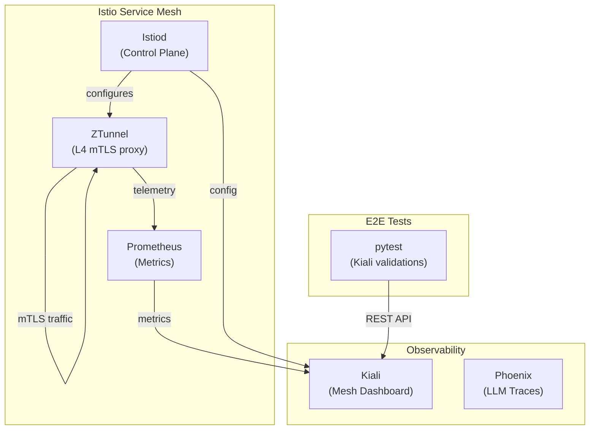
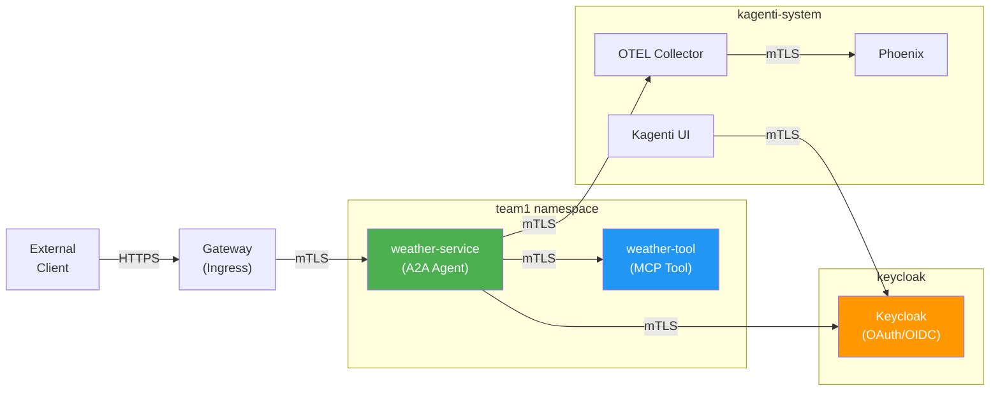
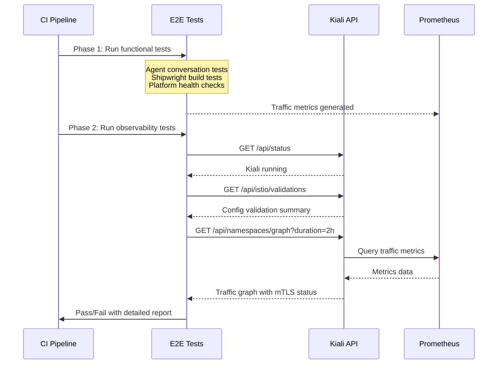

# Kiali Service Mesh Observability

Kiali provides real-time visualization and validation of the Istio service mesh in Kagenti. It is used both as a developer dashboard and as an automated E2E validation tool in CI.

## Architecture

### How Kiali Fits in Kagenti



### Kagenti Traffic Flow



All inter-service traffic within the mesh is encrypted via mTLS (mutual TLS) through Istio's ZTunnel in Ambient mode.

## What We Check

Our Kiali E2E validation tests run after all other tests complete (two-phase approach) and verify:

### 1. Istio Configuration Validation

Queries Kiali for misconfigurations in Istio resources across all Kagenti namespaces:

| Resource | What's Checked |
|----------|---------------|
| VirtualServices | Routes reference valid destinations |
| DestinationRules | Hosts exist in service registry |
| Gateways | Matching VirtualService exists |
| PeerAuthentication | Valid selector labels |
| AuthorizationPolicies | Valid principal/namespace references |

### 2. Traffic Error Detection (2h window)

Analyzes the service mesh traffic graph from the last 2 hours:
- Detects HTTP 5xx errors above threshold (default: 1%)
- Reports every service-to-service communication edge with pass/fail status
- Groups results by namespace for readability

### 3. mTLS Compliance

Verifies every observed traffic edge uses mutual TLS:
- Fails with a detailed list of unencrypted communications
- Critical for zero-trust security validation
- Reports all edges with their encryption status

### Test Execution Flow



## Configuration

| Variable | Default | Description |
|----------|---------|-------------|
| `KIALI_URL` | Auto-detect | Override Kiali endpoint |
| `KIALI_NAMESPACES` | Kagenti namespaces | Comma-separated list |
| `KIALI_IGNORE_NAMESPACES` | OpenShift AI, GPU | Namespaces to skip |
| `KIALI_SKIP_VALIDATION_CODES` | None | Validation codes to ignore |
| `KIALI_FAIL_ON_WARNINGS` | true | Fail on config warnings |
| `KIALI_TRAFFIC_DURATION` | 2h | Time window for traffic analysis |
| `KIALI_ERROR_RATE_THRESHOLD` | 0.01 | Max allowed error rate (1%) |

## Standalone Usage

The test file doubles as a CLI tool for ad-hoc scanning:

```bash
# Basic validation scan
python kagenti/tests/e2e/test_kiali_validations.py

# With traffic analysis over 2 hours
python kagenti/tests/e2e/test_kiali_validations.py --check-traffic --duration 2h

# JSON output for automation
python kagenti/tests/e2e/test_kiali_validations.py --json --check-traffic

# Scan specific namespaces
python kagenti/tests/e2e/test_kiali_validations.py --namespaces team1,team2
```

## Sample CI Output

### Traffic Health Report (all edges)
```
==========================================================================================
 Traffic Health Report
==========================================================================================

  STATUS   SOURCE                                   DEST                                     PROTO  REQS     ERR%     mTLS
  --------------------------------------------------------------------------------------------------------
  PASS     kagenti-system/otel-collector             kagenti-system/phoenix                   http   342      0.0%     yes
  PASS     team1/weather-service                     team1/weather-tool                       http   156      0.0%     yes
  PASS     team1/weather-service                     keycloak/keycloak                        http   48       0.0%     yes
  FAIL     team1/weather-service                     external/api-service                     http   12       8.3%     NO

  SUMMARY
  --------------------------------------------------------------------------------------------------------
  Total edges:         4
  Total requests:      558
  Edges with errors:   1
  Edges without mTLS:  1

  1 edge(s) have issues - see FAIL entries above
==========================================================================================
```

## Future Roadmap

### Phase 1: Expected Traffic Topology (Priority: High)
Define expected service-to-service connections and verify they exist in the graph. Alert on unexpected traffic patterns (e.g., agent directly calling external APIs without going through the gateway).

**Options:**
- A) YAML manifest defining expected edges -- simple, version-controlled
- B) Auto-generate baseline from healthy cluster -- less manual, risk of codifying bugs

### Phase 2: Baseline/Delta Mode (Priority: Medium)
Store a validation baseline in git and only fail on NEW issues. Useful for gradually improving mesh hygiene without blocking CI on pre-existing issues.

**Options:**
- A) JSON baseline file committed to repo -- transparent, easy to review
- B) Annotation-based suppression on Istio resources -- closer to source of truth

### Phase 3: Response Time SLO Validation (Priority: Medium)
Check p99 response times from Kiali graph against defined SLOs. Catch performance regressions in CI.

**Options:**
- A) Per-service SLO definitions in YAML -- flexible, per-service thresholds
- B) Global p99 threshold -- simpler, single threshold for all services

### Phase 4: AuthorizationPolicy Audit (Priority: Low)
Use Kiali to verify AuthorizationPolicies are correctly applied and no services have overly permissive access.

### Phase 5: CI Dashboard Screenshots (Priority: Low)
Capture Kiali graph screenshots in CI using headless browser, attach to PR as artifacts for visual review.

## Kiali Validation Codes Reference

| Code | Severity | Description |
|------|----------|-------------|
| KIA0101 | Warning | No matching workload for service |
| KIA0201 | Warning | Host not in service registry |
| KIA0301 | Warning | No matching Gateway for VirtualService |
| KIA1001 | Error | DestinationRule with no matching workloads |
| KIA1106 | Error | VirtualService references undefined route |
| KIA1201 | Error | PeerAuthentication with invalid selector |

See [Kiali Validation Documentation](https://kiali.io/docs/features/validations/) for the complete list.

## References

- [Kiali Official Documentation](https://kiali.io/docs/)
- [Kiali Validations Feature](https://kiali.io/docs/features/validations/)
- [Kiali Graph/Topology](https://kiali.io/docs/features/topology/)
- [Istio Ambient Mode](https://istio.io/latest/docs/ambient/overview/)
- [Istio mTLS Verification](https://istio.io/latest/docs/ambient/usage/verify-mtls-enabled/)
