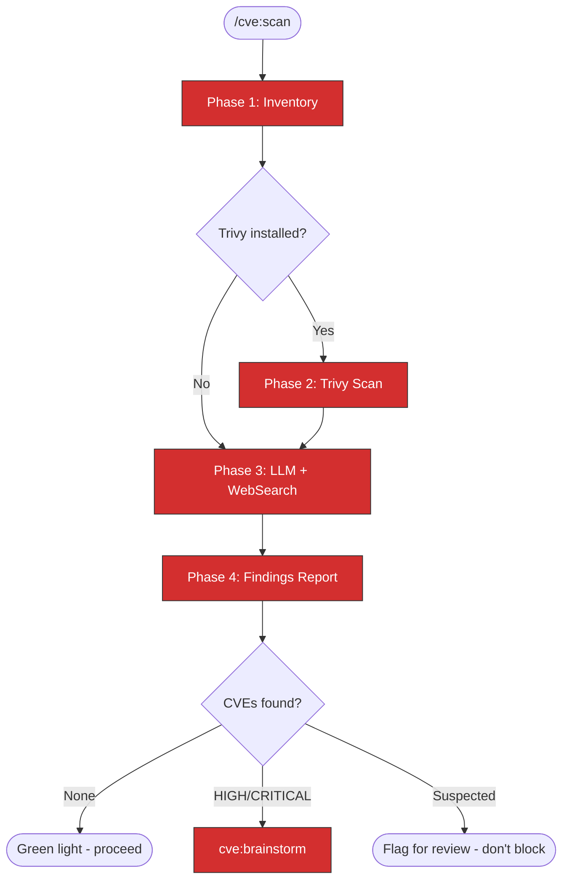
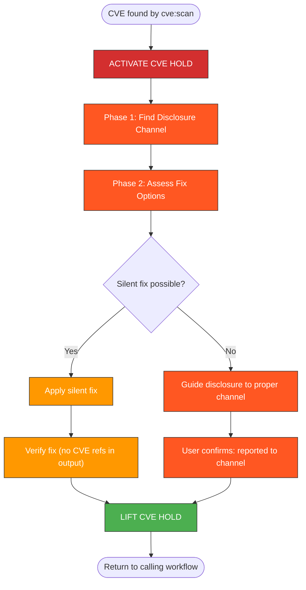

# CVE Awareness Skills Implementation Plan

> **For Claude:** REQUIRED SUB-SKILL: Use superpowers:executing-plans to implement this plan task-by-task.

**Goal:** Create `cve:scan` and `cve:brainstorm` skills that detect CVEs in dependencies and block public disclosure, integrated as mandatory gates into existing TDD, RCA, and publishing workflows.

**Architecture:** Three new skill files (`cve/`, `cve:scan/`, `cve:brainstorm/`) in `.claude/skills/`, plus amendments to 8 existing skills. The CVE skills follow the same SKILL.md format with mermaid diagrams and phase-based workflows.

**Tech Stack:** Claude Code skills (Markdown), Trivy CLI (optional), WebSearch, gh CLI

**Design Doc:** `docs/plans/2026-02-14-cve-awareness-design.md`

---

### Task 1: Create `cve/SKILL.md` parent router

**Files:**
- Create: `.claude/skills/cve/SKILL.md`

**Step 1: Create the skill directory**

```bash
mkdir -p .claude/skills/cve
```

**Step 2: Write the parent router skill**

Create `.claude/skills/cve/SKILL.md` with this content:

```markdown
---
name: cve
description: CVE awareness - scan dependencies for vulnerabilities, plan responsible disclosure, block public leaks
---

# CVE Awareness

Detect CVEs in project dependencies and ensure responsible disclosure before any
public communication.

## IMPORTANT

Accidental public CVE disclosure enables exploitation before patches exist,
violates responsible disclosure agreements, and causes legal and reputational harm.
**Never include CVE IDs, vulnerability descriptions, or exploit details in any
public output** (PRs, issues, comments, commit messages) until the CVE has been
reported through proper channels.

## Router

When `/cve` is invoked, determine the entry point:

```
What is needed?
    |
    +-- "Scan for CVEs" / "Check dependencies"
    |   -> cve:scan
    |
    +-- CVE was found, need response plan
    |   -> cve:brainstorm
    |
    +-- No specific request
        -> cve:scan (default: scan first)
```

## When This Runs Automatically

These skills are invoked as mandatory gates in other workflows:

| Workflow | Gate Location | Skill |
|----------|---------------|-------|
| `tdd:ci` | Phase 3.5 (after local checks, before push) | `cve:scan` |
| `tdd:hypershift` | Pre-deploy (before cluster deployment) | `cve:scan` |
| `tdd:kind` | Pre-deploy (before cluster deployment) | `cve:scan` |
| `rca:*` | Phase 5 addendum (before documenting findings) | `cve:scan` |
| `git:commit` | Pre-commit (scan for CVE IDs in message) | CVE ID check |
| Finishing branch | Step 2.5 (before PR creation options) | `cve:scan` |

## Related Skills

- `cve:scan` - Hybrid CVE scanning (Trivy + LLM + WebSearch)
- `cve:brainstorm` - Disclosure planning and public output blocking
```

**Step 3: Verify the skill file exists and has correct front-matter**

```bash
head -5 .claude/skills/cve/SKILL.md
```

Expected: shows `---`, `name: cve`, `description: ...`, `---`

**Step 4: Commit**

```bash
git add .claude/skills/cve/SKILL.md
git commit -s -m "🌱 Add cve parent router skill"
```

---

### Task 2: Create `cve:scan/SKILL.md` scanning skill

**Files:**
- Create: `.claude/skills/cve:scan/SKILL.md`

**Step 1: Create the skill directory**

```bash
mkdir -p ".claude/skills/cve:scan"
```

**Step 2: Write the scanning skill**

Create `.claude/skills/cve:scan/SKILL.md` with this content:

````markdown
---
name: cve:scan
description: Scan dependencies for known CVEs using Trivy, LLM knowledge, and web searches against NVD/OSV/GitHub Advisory Database
---

# CVE Scan

Hybrid CVE scanning that combines Trivy (when available), LLM knowledge, and
web searches to detect known vulnerabilities in project dependencies.

## IMPORTANT: Output Safety

- Scan results are written to `/tmp/kagenti/cve/` ONLY
- **NEVER** write CVE details to git-tracked files
- **NEVER** include CVE IDs in commit messages, PR descriptions, or issue comments
- Display findings to user in terminal only

## Workflow



> Follow this diagram as the workflow.

## Phase 1: Inventory

Identify all dependency sources in the working tree.

### Step 1: Create working directory

```bash
mkdir -p /tmp/kagenti/cve
```

### Step 2: Find dependency files

Search for dependency manifests:

```bash
# Python
find . -maxdepth 3 -name "pyproject.toml" -o -name "requirements*.txt" -o -name "uv.lock" | head -20
```

```bash
# Node
find . -maxdepth 3 -name "package.json" -o -name "package-lock.json" | head -20
```

```bash
# Go
find . -maxdepth 3 -name "go.mod" -o -name "go.sum" | head -20
```

```bash
# Containers
find . -maxdepth 3 -name "Dockerfile" -o -name "Containerfile" | head -20
```

```bash
# Helm
find . -maxdepth 3 -path "*/charts/*/Chart.yaml" | head -20
```

### Step 3: Extract dependency list

Read each dependency file found. For each, extract:
- Package name
- Pinned version (or version constraint)
- Ecosystem (PyPI, npm, Go, container base image, Helm chart)

Save inventory to `/tmp/kagenti/cve/inventory.txt` (local only).

## Phase 2: Trivy Scan (if available)

### Step 1: Check for Trivy

```bash
which trivy 2>/dev/null && trivy --version
```

If not installed, log: "Trivy not available, skipping to Phase 3 (LLM + WebSearch)."

### Step 2: Run filesystem scan

```bash
trivy fs --severity HIGH,CRITICAL --format json --output /tmp/kagenti/cve/trivy-fs.json .
```

### Step 3: Run container image scan (if Dockerfiles found)

For each Dockerfile found in Phase 1, extract the base image and scan:

```bash
# Extract base image
grep "^FROM" Dockerfile | awk '{print $2}'
```

```bash
trivy image --severity HIGH,CRITICAL --format json --output /tmp/kagenti/cve/trivy-image.json <image>
```

### Step 4: Parse Trivy results

Read the JSON output. For each finding, extract:
- Package name and version
- CVE ID
- Severity (HIGH/CRITICAL)
- Fixed version (if available)
- Description (store locally only)

## Phase 3: LLM + WebSearch Analysis

For each dependency + version from Phase 1 inventory:

### Step 1: LLM knowledge check

Review the dependency name and version against training data. Flag any packages
with known CVE history in the version range being used.

### Step 2: WebSearch verification

For each dependency flagged by LLM or Trivy, and for all HIGH-risk dependencies
(crypto libraries, auth libraries, serialization libraries, network libraries):

```
WebSearch: "<package-name> <version> CVE site:nvd.nist.gov OR site:osv.dev OR site:github.com/advisories"
```

### Step 3: Cross-reference

- If Trivy found a CVE, verify with WebSearch (confirm it's real and active)
- If LLM suspects a CVE, verify with WebSearch (confirm or eliminate)
- If WebSearch finds something new, add to findings

### Step 4: Classify findings

| Confidence | Criteria | Action |
|------------|----------|--------|
| Confirmed | Trivy + WebSearch agree, or WebSearch finds NVD entry | Report as confirmed |
| Suspected | LLM flags but WebSearch inconclusive | Report as suspected |
| False positive | WebSearch shows fixed/not-applicable | Exclude from report |

## Phase 4: Findings Report

### Step 1: Generate report

Write findings to `/tmp/kagenti/cve/scan-<timestamp>.json`:

```json
{
  "timestamp": "<ISO-8601>",
  "working_directory": "<path>",
  "trivy_available": true,
  "findings": [
    {
      "package": "<name>",
      "version": "<installed-version>",
      "ecosystem": "pypi|npm|go|container|helm",
      "cve_id": "CVE-YYYY-NNNNN",
      "severity": "HIGH|CRITICAL",
      "confidence": "confirmed|suspected",
      "fixed_version": "<version-or-null>",
      "source_url": "<NVD/OSV/advisory-URL>",
      "description": "<brief-description>"
    }
  ],
  "summary": {
    "total_dependencies": 0,
    "critical_cves": 0,
    "high_cves": 0,
    "suspected": 0
  }
}
```

### Step 2: Display summary to user

Show in terminal (NOT in any file that gets committed):

```
CVE Scan Results
================
Scanned: <N> dependencies
Trivy: <available/not-available>

CRITICAL: <N> findings
HIGH:     <N> findings
Suspected: <N> (need manual review)

[For each confirmed finding:]
  <package> <version> - <severity> - fixed in <version>
```

### Step 3: Route based on results

| Result | Action |
|--------|--------|
| No findings | "No CVEs detected. Proceeding." |
| Confirmed HIGH/CRITICAL | Invoke `cve:brainstorm` immediately |
| Suspected only | "Suspected CVEs flagged for review. Proceed with caution." |

## When Invoked as a Gate

When `cve:scan` is invoked by another skill (tdd:ci, rca:*, etc.) as a gate:

- **Clean scan** → return control to the calling skill, proceed
- **Findings detected** → invoke `cve:brainstorm`, **BLOCK** the calling skill
  from proceeding to public output until the hold is resolved
- The calling skill must NOT proceed past the CVE gate until `cve:brainstorm`
  resolves the hold

## Related Skills

- `cve:brainstorm` - Disclosure planning when CVEs are found
- `tdd:ci` - Invokes this at Phase 3.5
- `tdd:hypershift` - Invokes this pre-deploy
- `tdd:kind` - Invokes this pre-deploy
- `rca:ci` - Invokes this at Phase 5
````

**Step 3: Verify the skill file**

```bash
head -5 ".claude/skills/cve:scan/SKILL.md"
```

Expected: shows `---`, `name: cve:scan`, `description: ...`, `---`

**Step 4: Commit**

```bash
git add ".claude/skills/cve:scan/SKILL.md"
git commit -s -m "🌱 Add cve:scan skill for hybrid CVE detection"
```

---

### Task 3: Create `cve:brainstorm/SKILL.md` disclosure and blocking skill

**Files:**
- Create: `.claude/skills/cve:brainstorm/SKILL.md`

**Step 1: Create the skill directory**

```bash
mkdir -p ".claude/skills/cve:brainstorm"
```

**Step 2: Write the disclosure and blocking skill**

Create `.claude/skills/cve:brainstorm/SKILL.md` with this content:

````markdown
---
name: cve:brainstorm
description: Plan responsible CVE disclosure, guide silent fixes, and BLOCK all public GitHub actions until CVE is properly handled
---

# CVE Brainstorm — Responsible Disclosure & Public Output Gate

When a CVE is detected by `cve:scan`, this skill guides responsible disclosure
and **blocks all public output** until the vulnerability is properly handled.

## CRITICAL SAFETY RULE

```
+===========================================================+
|                                                             |
|   CVE DISCLOSURE HOLD IS ACTIVE                             |
|                                                             |
|   ALL public GitHub actions are BLOCKED:                    |
|   - gh pr create / gh pr comment                            |
|   - gh issue create / gh issue comment                      |
|   - Commit messages containing CVE IDs                      |
|   - Any text containing vulnerability descriptions          |
|                                                             |
|   Accidental CVE disclosure:                                |
|   - Enables exploitation before patches exist               |
|   - Violates responsible disclosure agreements              |
|   - Causes legal and reputational harm                      |
|                                                             |
+===========================================================+
```

**This hold is NOT optional. It cannot be skipped or deferred.**

## Workflow



> Follow this diagram as the workflow.

## Phase 1: Disclosure Channel Discovery

For each affected dependency with a confirmed CVE:

### Step 1: Search for security policy

```
WebSearch: "<project-name> SECURITY.md responsible disclosure vulnerability report"
```

### Step 2: Check GitHub repo directly

```bash
# If the dependency is on GitHub
gh api repos/<owner>/<repo>/contents/SECURITY.md --jq '.content' | base64 -d 2>/dev/null
```

### Step 3: Present disclosure channel to user

For each CVE, present:

```
Disclosure Channel for <package>
================================
Project: <name> (<repo-url>)
Security policy: <SECURITY.md URL or "not found">
Report via: <email / form / GitHub Security Advisory>
Embargo: <timeline if documented, or "not specified">
```

If no security policy found:
```
No formal security policy found for <package>.
Options:
  1. Open a GitHub Security Advisory (private by default)
  2. Email the maintainer directly (check package metadata)
  3. Report to the ecosystem registry (PyPI, npm, etc.)
```

## Phase 2: Fix Assessment

Interactive brainstorm with user, one question at a time:

### Question 1: Fixed version available?

```
The CVE affects <package> <version>.

A fixed version exists: <fixed-version>
  -> Can we bump to <fixed-version> in this repo?

OR

No fixed version is available yet.
  -> We need to report and wait, or apply a workaround.
```

### Question 2: Can the fix be applied silently?

If a fix is available:

```
Silent fix options (commit messages that DON'T reference the CVE):

  1. Dependency bump:
     Commit: "Bump <package> to <version>"
     (No CVE reference - just a version update)

  2. Configuration change:
     Commit: "Update <config> for <package> compatibility"
     (Describes the config change, not the vulnerability)

  3. Code workaround:
     Commit: "Refactor <component> to use <alternative>"
     (Describes the behavior change, not the security issue)

Which approach fits this situation?
```

### Question 3: Does the fix change behavior?

```
Will bumping <package> from <old> to <new> change any behavior?

  If yes:
  - Tests must verify the new behavior
  - Test descriptions must NOT reference the CVE
  - Use neutral language: "test compatibility with <package> <version>"

  If no:
  - Straightforward bump, minimal risk
```

## Phase 3: Public Output Blocking (HARD GATE)

While the CVE hold is active, **REFUSE** the following actions:

### Blocked Actions

| Action | How to Block |
|--------|-------------|
| `gh pr create` | Do not run. Say: "CVE hold active. Cannot create PR until resolved." |
| `gh pr comment` | Do not run. Say: "CVE hold active. Cannot comment on PR until resolved." |
| `gh issue create` | Do not run. Say: "CVE hold active. Cannot create issue until resolved." |
| `gh issue comment` | Do not run. Say: "CVE hold active. Cannot comment on issue until resolved." |
| Commit with CVE ID | Scan commit message for `CVE-\d{4}-\d+` pattern. If found, refuse and suggest neutral wording. |
| Write CVE to git-tracked file | Before any Write/Edit to a git-tracked file, scan content for CVE references. Block if found. |

### Allowed Actions

| Action | Why Allowed |
|--------|-------------|
| Local code changes | Not public |
| `git commit` with clean message | No CVE exposure if message is neutral |
| `git push` of clean commits | Pushing a dependency bump is fine |
| Write to `/tmp/` | Not public, not git-tracked |
| Local test runs | Not public |
| WebSearch for disclosure info | Research, not publication |

### CVE Reference Detection

Before ANY public output, scan for these patterns:
- `CVE-\d{4}-\d+` (CVE IDs)
- Words: "vulnerability", "exploit", "security flaw", "attack vector"
- Specific vulnerability class names when combined with the affected package name

If detected, **STOP** and rewrite using neutral language.

## Phase 4: Resolution

The CVE hold is resolved when the user confirms ONE of:

### Resolution 1: Reported to proper channel

```
User: "CVE reported to <channel>"

Response:
  CVE hold lifted.
  - Reported to: <channel>
  - Embargo: <timeline if known>

  You may now proceed with public GitHub actions.
  REMINDER: Do NOT reference the CVE in public until the embargo lifts.
```

### Resolution 2: Fixed silently

```
User: "CVE fixed, bumped to <version>"

Response:
  CVE hold lifted.
  - Fix: bumped <package> to <version>
  - Commit message: <the neutral message used>

  Verify: commit message and PR description contain no CVE references.
  You may now proceed.
```

### Resolution 3: False positive

```
User: "False positive, not a real CVE"

Response:
  CVE hold lifted.
  - Reason: false positive
  - Evidence: <user's explanation>

  You may now proceed.
```

### Resolution 4: User override

```
User: "CVE hold resolved" (explicit override)

Response:
  WARNING: Lifting CVE hold by user override.
  - No disclosure confirmed
  - No fix confirmed

  Ensure you have handled this CVE through appropriate channels
  before publishing any related work.

  CVE hold lifted.
```

## Anti-Patterns

| Don't | Do Instead |
|-------|------------|
| Include CVE ID in commit message | Use neutral wording: "Bump X to Y" |
| Describe vulnerability in PR | Describe the change: "Update dependency" |
| Post CVE details in issue comment | Report through security channel first |
| Skip the hold because "it's just a bump" | Even bumps need clean messages |
| Mention "security fix" in public | Say "compatibility update" or "dependency update" |
| Link to NVD/advisory in PR | Keep links in `/tmp/` notes only |

## Related Skills

- `cve:scan` - Detection engine that triggers this skill
- `tdd:ci` - Calling workflow (Phase 3.5 gate)
- `git:commit` - Commit conventions (CVE ID check added)
````

**Step 3: Verify the skill file**

```bash
head -5 ".claude/skills/cve:brainstorm/SKILL.md"
```

Expected: shows `---`, `name: cve:brainstorm`, `description: ...`, `---`

**Step 4: Commit**

```bash
git add ".claude/skills/cve:brainstorm/SKILL.md"
git commit -s -m "🌱 Add cve:brainstorm skill for disclosure planning and output blocking"
```

---

### Task 4: Amend `tdd:ci/SKILL.md` — add Phase 3.5 CVE Gate

**Files:**
- Modify: `.claude/skills/tdd:ci/SKILL.md`

**Step 1: Update the mermaid diagram**

In the mermaid diagram (around line 51-90), insert a CVE gate node between Phase 3 and Phase 4. Change:

```
    P3 -->|Checks pass| P4["Phase 4: Push to PR"]:::git
```

to:

```
    P3 -->|Checks pass| P3B["Phase 3.5: CVE Gate"]:::cve
    P3B -->|Clean| P4["Phase 4: Push to PR"]:::git
    P3B -->|CVE found| CVE_HOLD["cve:brainstorm (BLOCKS push)"]:::cve
    CVE_HOLD -->|Resolved| P4
```

Add `classDef cve fill:#D32F2F,stroke:#333,color:white` to the classDef section.

**Step 2: Add Phase 3.5 section**

Insert after the "## Phase 3: Local Checks" section (after line 302) and before "## Phase 4: Push to PR":

```markdown
## Phase 3.5: CVE Gate

**MANDATORY before pushing.** Scan dependencies for known CVEs before any public output.

Invoke `cve:scan` on the working tree:

1. If `cve:scan` returns clean → proceed to Phase 4
2. If `cve:scan` finds HIGH/CRITICAL CVEs → `cve:brainstorm` activates a CVE hold
   - **Do NOT proceed to Phase 4** until the hold is resolved
   - The hold blocks `gh pr create`, `gh pr comment`, `gh issue create/comment`
   - Silent fixes (dependency bumps with neutral commit messages) are allowed
   - See `cve:brainstorm` for resolution steps
```

**Step 3: Update the Table of Contents**

Add `- [Phase 3.5: CVE Gate](#phase-35-cve-gate)` between Phase 3 and Phase 4 entries.

**Step 4: Add `cve:scan` and `cve:brainstorm` to Related Skills**

Append to the Related Skills section:

```markdown
- `cve:scan` - CVE scanning gate (Phase 3.5)
- `cve:brainstorm` - CVE disclosure planning (if CVEs found)
```

**Step 5: Remove `repo:commit` reference**

In the Related Skills section, remove the line:
```
- `repo:commit` - Repository commit conventions
```

**Step 6: Verify the changes**

```bash
grep -n "Phase 3.5\|cve:scan\|cve:brainstorm" .claude/skills/tdd:ci/SKILL.md
```

Expected: multiple matches for Phase 3.5, cve:scan, cve:brainstorm

**Step 7: Commit**

```bash
git add ".claude/skills/tdd:ci/SKILL.md"
git commit -s -m "🌱 Add CVE gate (Phase 3.5) to tdd:ci workflow"
```

---

### Task 5: Amend `tdd:hypershift/SKILL.md` — add pre-deploy CVE gate

**Files:**
- Modify: `.claude/skills/tdd:hypershift/SKILL.md`

**Step 1: Update the mermaid diagram**

Insert a CVE gate node after `SETENV` and before `ITER`. Change:

```
    SETENV --> ITER{"Iteration level?"}
```

to:

```
    SETENV --> CVEGATE["CVE Gate: cve:scan"]:::cve
    CVEGATE -->|Clean| ITER{"Iteration level?"}
    CVEGATE -->|CVE found| CVE_HOLD["cve:brainstorm"]:::cve
    CVE_HOLD -->|Resolved| ITER
```

Add `classDef cve fill:#D32F2F,stroke:#333,color:white` to the classDef section.

**Step 2: Add CVE Gate section**

Insert after the "## Cluster Availability" section and before "## Key Pattern":

```markdown
## CVE Gate (Pre-Deploy)

**MANDATORY before deploying to cluster.** Container images may contain vulnerable dependencies.

Invoke `cve:scan` on the working tree before any deployment iteration:

1. If `cve:scan` returns clean → proceed to iteration selection
2. If `cve:scan` finds HIGH/CRITICAL CVEs → `cve:brainstorm` activates a CVE hold
   - Silent fixes (dependency bumps) are allowed
   - Deployment proceeds only after hold is resolved
   - See `cve:brainstorm` for resolution steps

This gate runs once per session, not on every iteration.
```

**Step 3: Add CVE skills to Related Skills**

Append:

```markdown
- `cve:scan` - CVE scanning gate (pre-deploy)
- `cve:brainstorm` - CVE disclosure planning (if CVEs found)
```

**Step 4: Commit**

```bash
git add ".claude/skills/tdd:hypershift/SKILL.md"
git commit -s -m "🌱 Add CVE gate to tdd:hypershift pre-deploy"
```

---

### Task 6: Amend `tdd:kind/SKILL.md` — add pre-deploy CVE gate

**Files:**
- Modify: `.claude/skills/tdd:kind/SKILL.md`

**Step 1: Update the mermaid diagram**

Insert a CVE gate node after cluster creation/reuse and before iteration. Change:

```
    CREATE --> ITER
    REUSE --> ITER
```

to:

```
    CREATE --> CVEGATE["CVE Gate: cve:scan"]:::cve
    REUSE --> CVEGATE
    CVEGATE -->|Clean| ITER
    CVEGATE -->|CVE found| CVE_HOLD["cve:brainstorm"]:::cve
    CVE_HOLD -->|Resolved| ITER
```

Add `classDef cve fill:#D32F2F,stroke:#333,color:white` to the classDef section.

**Step 2: Add CVE Gate section**

Insert after "## Cluster Concurrency Guard" and before "## Key Principle":

```markdown
## CVE Gate (Pre-Deploy)

**MANDATORY before deploying to Kind cluster.**

Invoke `cve:scan` on the working tree before the first deployment:

1. If `cve:scan` returns clean → proceed to iteration selection
2. If `cve:scan` finds HIGH/CRITICAL CVEs → `cve:brainstorm` activates a CVE hold
   - Silent fixes (dependency bumps) are allowed
   - Deployment proceeds only after hold is resolved

This gate runs once per session, not on every iteration.
```

**Step 3: Add CVE skills to Related Skills**

Append:

```markdown
- `cve:scan` - CVE scanning gate (pre-deploy)
- `cve:brainstorm` - CVE disclosure planning (if CVEs found)
```

**Step 4: Commit**

```bash
git add ".claude/skills/tdd:kind/SKILL.md"
git commit -s -m "🌱 Add CVE gate to tdd:kind pre-deploy"
```

---

### Task 7: Amend `rca:ci/SKILL.md` — add CVE check at Phase 5

**Files:**
- Modify: `.claude/skills/rca:ci/SKILL.md`

**Step 1: Add CVE check to Phase 5**

After the "## Phase 5: Document Findings" section (after the markdown template block ending around line 170), add:

```markdown
### CVE Check Before Publishing Findings

**Before posting RCA findings to any public destination** (issue comment, PR comment, etc.):

If the root cause involves a dependency bug, unexpected behavior, or version issue:

1. Invoke `cve:scan` to check if this is a known CVE
2. If a CVE is found → invoke `cve:brainstorm` **BEFORE** documenting findings publicly
3. Rewrite RCA documentation to use neutral language (no CVE IDs, no vulnerability descriptions)
4. Report the CVE through proper channels (see `cve:brainstorm`)

Example neutral RCA wording:
```
**Root Cause**: Incompatibility with <package> <version>.
**Fix**: Bump to <version> which resolves the behavior.
```

NOT:
```
**Root Cause**: CVE-2026-XXXXX in <package> allows remote code execution.
```
```

**Step 2: Add CVE skills to Related Skills**

Append:

```markdown
- `cve:scan` - CVE scanning (check if root cause is a known CVE)
- `cve:brainstorm` - Disclosure planning (if CVE found during RCA)
```

**Step 3: Commit**

```bash
git add ".claude/skills/rca:ci/SKILL.md"
git commit -s -m "🌱 Add CVE check to rca:ci before publishing findings"
```

---

### Task 8: Amend `rca:hypershift/SKILL.md` — add CVE check at Phase 5

**Files:**
- Modify: `.claude/skills/rca:hypershift/SKILL.md`

**Step 1: Add CVE check to Phase 5**

After the "## Phase 5: Document Findings" section (after the markdown template block ending around line 328), add the same CVE check section as Task 7:

```markdown
### CVE Check Before Publishing Findings

**Before posting RCA findings to any public destination** (issue comment, PR comment, etc.):

If the root cause involves a dependency bug, unexpected behavior, or version issue:

1. Invoke `cve:scan` to check if this is a known CVE
2. If a CVE is found → invoke `cve:brainstorm` **BEFORE** documenting findings publicly
3. Rewrite RCA documentation to use neutral language (no CVE IDs, no vulnerability descriptions)
4. Report the CVE through proper channels (see `cve:brainstorm`)
```

**Step 2: Add CVE skills to Related Skills**

Append:

```markdown
- `cve:scan` - CVE scanning (check if root cause is a known CVE)
- `cve:brainstorm` - Disclosure planning (if CVE found during RCA)
```

**Step 3: Commit**

```bash
git add ".claude/skills/rca:hypershift/SKILL.md"
git commit -s -m "🌱 Add CVE check to rca:hypershift before publishing findings"
```

---

### Task 9: Amend `rca:kind/SKILL.md` — add CVE check at Phase 4

**Files:**
- Modify: `.claude/skills/rca:kind/SKILL.md`

**Step 1: Add CVE check after Phase 4**

After "### Phase 4: Fix and Verify" section (around line 120-126), add:

```markdown
### CVE Check Before Publishing Findings

**Before posting RCA findings to any public destination:**

If the root cause involves a dependency bug or version issue:

1. Invoke `cve:scan` to check if this is a known CVE
2. If a CVE is found → invoke `cve:brainstorm` BEFORE documenting publicly
3. Use neutral language in all public documentation
```

**Step 2: Add CVE skills to Related Skills**

Append:

```markdown
- `cve:scan` - CVE scanning (check if root cause is a known CVE)
- `cve:brainstorm` - Disclosure planning (if CVE found during RCA)
```

**Step 3: Commit**

```bash
git add ".claude/skills/rca:kind/SKILL.md"
git commit -s -m "🌱 Add CVE check to rca:kind before publishing findings"
```

---

### Task 10: Amend `git:commit/SKILL.md` — add CVE ID check

**Files:**
- Modify: `.claude/skills/git:commit/SKILL.md`

**Step 1: Add CVE ID check section**

Insert after "## Quick Commit" section (after line 27) and before "## Sign All Commits in Branch":

```markdown
## CVE ID Check (Pre-Commit)

**Before every commit**, scan the commit message for CVE references:

- Pattern: `CVE-\d{4}-\d+` (e.g., CVE-2026-12345)
- Also check for: "vulnerability", "exploit", "security flaw" combined with a package name

If found in the commit message:

```
WARNING: Commit message contains CVE reference.
This will be visible in public git history.

Rewrite using neutral language:
  BAD:  "Fix CVE-2026-12345 in requests library"
  GOOD: "Bump requests to 2.32.0"

  BAD:  "Patch security vulnerability in auth module"
  GOOD: "Update auth module for compatibility"
```

If a `cve:brainstorm` hold is active, also verify the staged file diffs don't
contain CVE IDs in comments, docstrings, or documentation.
```

**Step 2: Update Related Skills**

Replace the `repo:commit` reference. Change:

```markdown
- `repo:commit` - Full commit format spec for this repo
```

to:

```markdown
- `cve:scan` - CVE scanning (invoked by other workflows)
- `cve:brainstorm` - CVE disclosure gate (blocks CVE references in commits)
```

**Step 3: Commit**

```bash
git add ".claude/skills/git:commit/SKILL.md"
git commit -s -m "🌱 Add CVE ID check to git:commit pre-commit flow"
```

---

### Task 11: Amend `tdd/SKILL.md` parent — add CVE awareness to TDD Code Loop

**Files:**
- Modify: `.claude/skills/tdd/SKILL.md`

**Step 1: Update TDD Code Loop**

In the "## TDD Code Loop" section, add CVE scan step. Change:

```
6. git:commit — commit with proper format (repo:commit)
7. git:rebase — rebase onto upstream/main
```

to:

```
6. cve:scan — scan for CVEs before pushing (BLOCKS if found)
7. git:commit — commit with proper format (git:commit)
8. git:rebase — rebase onto upstream/main
```

**Step 2: Update Related Skills**

Add CVE skills and remove `repo:commit`:

```markdown
- `cve:scan` - CVE scanning gate
- `cve:brainstorm` - CVE disclosure planning
```

Remove:
```markdown
- `repo:commit` - Repository commit conventions
```

**Step 3: Commit**

```bash
git add ".claude/skills/tdd/SKILL.md"
git commit -s -m "🌱 Add CVE gate to TDD code loop, update references"
```

---

### Task 12: Amend `rca/SKILL.md` parent — add CVE awareness note

**Files:**
- Modify: `.claude/skills/rca/SKILL.md`

**Step 1: Read the current content**

```bash
cat .claude/skills/rca/SKILL.md
```

**Step 2: Add CVE awareness section**

Add after the router section:

```markdown
## CVE Awareness

All RCA variants include a CVE check before publishing findings. If the root
cause involves a dependency issue, `cve:scan` runs automatically to check for
known CVEs. If found, `cve:brainstorm` blocks public disclosure until the CVE
is properly reported through the project's security channels.

See `cve:scan` and `cve:brainstorm` for details.
```

**Step 3: Commit**

```bash
git add ".claude/skills/rca/SKILL.md"
git commit -s -m "🌱 Add CVE awareness note to rca parent skill"
```

---

### Task 13: Update superpowers integration note

**Files:**
- Create: `.claude/skills/cve/SUPERPOWERS_INTEGRATION.md` (reference doc, not a skill)

**Step 1: Create integration notes**

The `finishing-a-development-branch` skill lives in the superpowers plugin
(`~/.claude/plugins/cache/...`) which we don't modify directly. Create a note
documenting how the CVE gate should interact with it:

```markdown
# CVE Gate — Superpowers Integration Notes

## finishing-a-development-branch

The superpowers `finishing-a-development-branch` skill presents 4 options:
1. Merge locally
2. Push and create PR
3. Keep as-is
4. Discard

**CVE gate insertion point: between Step 1 (Verify Tests) and Step 3 (Present Options).**

When this skill is invoked:
1. After tests pass (Step 1), invoke `cve:scan` on the branch diff
2. If CVEs found, invoke `cve:brainstorm` — block Option 2 (Push and Create PR)
3. Options 1, 3, 4 remain available (local operations)
4. Option 2 unblocks when CVE hold is resolved

**NOTE:** This integration requires changes to the superpowers plugin.
Until the plugin is updated, the CVE gate in `tdd:ci` Phase 3.5 and
`git:commit` CVE ID check provide coverage for the same scenarios.
```

**Step 2: Commit**

```bash
git add ".claude/skills/cve/SUPERPOWERS_INTEGRATION.md"
git commit -s -m "🌱 Add superpowers integration notes for CVE gate"
```

---

### Task 14: Final verification and squash review

**Step 1: Verify all new skill files exist**

```bash
ls -la .claude/skills/cve/SKILL.md
ls -la ".claude/skills/cve:scan/SKILL.md"
ls -la ".claude/skills/cve:brainstorm/SKILL.md"
```

**Step 2: Verify all modified skill files contain CVE references**

```bash
grep -l "cve:scan\|cve:brainstorm\|CVE Gate" .claude/skills/tdd/SKILL.md .claude/skills/tdd:ci/SKILL.md .claude/skills/tdd:hypershift/SKILL.md .claude/skills/tdd:kind/SKILL.md .claude/skills/rca/SKILL.md .claude/skills/rca:ci/SKILL.md .claude/skills/rca:hypershift/SKILL.md .claude/skills/rca:kind/SKILL.md .claude/skills/git:commit/SKILL.md
```

Expected: all 9 files listed

**Step 3: Verify no `repo:commit` references remain in modified files**

```bash
grep -l "repo:commit" .claude/skills/tdd/SKILL.md .claude/skills/tdd:ci/SKILL.md .claude/skills/git:commit/SKILL.md 2>/dev/null
```

Expected: no output (all references removed)

**Step 4: Review git log**

```bash
git log --oneline upstream/main..HEAD
```

Expected: 13 commits (design doc + 12 implementation commits)

**Step 5: Run pre-commit checks**

```bash
pre-commit run --all-files
```

Expected: all pass
