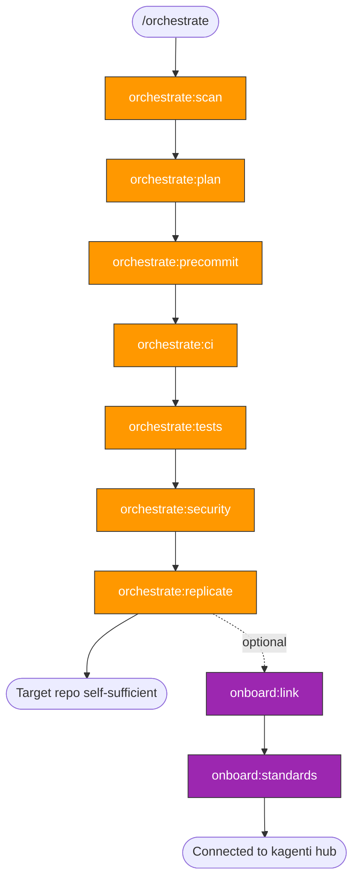

# Repo Orchestration Skills — Implementation Plan

> **For Claude:** REQUIRED SUB-SKILL: Use superpowers:executing-plans to implement this plan task-by-task.

**Goal:** Build the `orchestrate:*` and `onboard:*` skill families that bring any repository up to agentic quality standards through phased, reviewable PRs.

**Architecture:** Two-layer system. `orchestrate` is generic and self-replicating (scan → plan → precommit → ci → tests → security → replicate). `onboard` is kagenti-specific (link repo to hub, apply conventions). Skills live in `.claude/skills/` and follow existing kagenti patterns (mermaid diagrams, copy-paste commands, sandbox classification).

**Tech Stack:** Claude Code skills (SKILL.md files), Bash, Git, GitHub CLI

**Reference:** `docs/plans/2026-02-14-repo-orchestration-design.md`

---

### Task 1: Scaffold directories and gitignore

**Files:**
- Modify: `.gitignore`
- Create: `.repos/.gitkeep`

**Step 1: Add .repos/ to gitignore**

Add to `.gitignore`:
```
# Orchestration target repos (cloned, not committed)
.repos/
```

**Step 2: Create .repos/ directory with .gitkeep**

```bash
mkdir -p .repos
touch .repos/.gitkeep
```

Note: `.gitkeep` is tracked so the directory concept is visible, but contents are ignored.

**Step 3: Commit**

```bash
git add .gitignore .repos/.gitkeep
git commit -s -m "🔧 Add .repos/ directory for orchestration targets"
```

---

### Task 2: Create `orchestrate` router skill

**Files:**
- Create: `.claude/skills/orchestrate/SKILL.md`

**Step 1: Write the router skill**

This is the parent/router skill that directs to the right phase. Follow the `tdd/SKILL.md` pattern: mermaid flowchart at top, decision routing, sub-skill references.

```yaml
---
name: orchestrate
description: Enhance any repository with CI, tests, skills, and security through phased PRs - self-replicating
---
```

**Content requirements:**
- Mermaid flowchart showing: START → scan → plan → precommit → ci → tests → security → replicate → DONE
- Decision diamond: "Has scan report?" → yes: skip to plan, no: run scan
- Decision diamond: "Has plan?" → yes: pick next phase, no: run plan
- Entry point routing for `/orchestrate <repo-path>` and `/orchestrate <phase>`
- Phase status tracking using `/tmp/kagenti/orchestrate/<target>/`
- List of sub-skills with one-line descriptions
- Related Skills section

**Target length:** 120-180 lines

**Step 2: Validate structure**

Verify: frontmatter name matches directory, has mermaid diagram, has Related Skills, single commands per code block.

**Step 3: Commit**

```bash
git add .claude/skills/orchestrate/SKILL.md
git commit -s -m "✨ Add orchestrate router skill"
```

---

### Task 3: Create `orchestrate:scan` skill

**Files:**
- Create: `.claude/skills/orchestrate:scan/SKILL.md`

**Step 1: Write the scan skill**

```yaml
---
name: orchestrate:scan
description: Scan and assess a target repository - tech stack, CI gaps, test coverage, security posture
---
```

**Content requirements:**
- Mermaid flowchart: START → detect tech → check CI → check tests → check security → check claude → report
- Technology detection table (marker file → language → tools)
- CI gap analysis checklist
- Test coverage assessment
- Security posture checklist
- Claude Code readiness check (.claude/, skills, settings, CLAUDE.md)
- Output format: structured markdown report to `/tmp/kagenti/orchestrate/<target>/scan-report.md`
- All scan commands are read-only (sandbox classification)
- Copy-pasteable commands: `ls`, `find`, `grep` patterns for each check

**Commands (all sandbox/read-only):**
```bash
ls .repos/<target>/go.mod .repos/<target>/pyproject.toml .repos/<target>/package.json 2>/dev/null
```
```bash
ls .repos/<target>/.github/workflows/ 2>/dev/null
```
```bash
find .repos/<target> -type d -name "tests" -o -name "test" -o -name "__tests__" 2>/dev/null
```
```bash
ls .repos/<target>/.claude/skills/ 2>/dev/null
```
```bash
ls .repos/<target>/CODEOWNERS .repos/<target>/.github/dependabot.yml 2>/dev/null
```

**Target length:** 150-200 lines

**Step 2: Commit**

```bash
git add .claude/skills/orchestrate:scan/SKILL.md
git commit -s -m "✨ Add orchestrate:scan skill - repo assessment"
```

---

### Task 4: Create `orchestrate:plan` skill

**Files:**
- Create: `.claude/skills/orchestrate:plan/SKILL.md`

**Step 1: Write the plan skill**

```yaml
---
name: orchestrate:plan
description: Brainstorm and create phased enhancement plan for a target repo - PR sizing, phase selection, task breakdown
---
```

**Content requirements:**
- Prerequisite: scan report must exist
- Process: read scan → present findings → brainstorm with developer → determine phases → size PRs → write plan
- Phase applicability matrix (which phases for which repo types)
- PR sizing rules: target 600-700 lines, split if >700, merge if <300
- Plan output format with checkbox tasks per phase
- Output to `/tmp/kagenti/orchestrate/<target>/plan.md`
- Uses AskUserQuestion to brainstorm with developer (not automated)
- Template for plan document

**Target length:** 100-150 lines

**Step 2: Commit**

```bash
git add .claude/skills/orchestrate:plan/SKILL.md
git commit -s -m "✨ Add orchestrate:plan skill - phased planning"
```

---

### Task 5: Create `orchestrate:precommit` skill

**Files:**
- Create: `.claude/skills/orchestrate:precommit/SKILL.md`

**Step 1: Write the precommit skill**

```yaml
---
name: orchestrate:precommit
description: Add pre-commit hooks, linting, CLAUDE.md, and foundational .claude/ setup to a target repo
---
```

**Content requirements:**
- Prerequisite: plan exists with precommit phase
- Language-specific pre-commit hook templates:
  - Python: ruff, ruff-format, mypy, trailing-whitespace, end-of-file-fixer
  - Go: golangci-lint, gofmt, govet
  - Node: eslint, prettier
  - Ansible: ansible-lint, yamllint
- Linting config templates per language
- Makefile targets: `make lint`, `make fmt`
- CLAUDE.md template (repo overview, commands, structure)
- `.claude/settings.json` template (read-only auto-approve)
- Skills to push alongside: `repo:commit` (adapted from kagenti pattern)
- Branch creation and PR workflow
- PR size check: count lines before committing

**Management skill** (creates files, branches, PRs in target repo)

**Target length:** 180-250 lines

**Step 2: Commit**

```bash
git add .claude/skills/orchestrate:precommit/SKILL.md
git commit -s -m "✨ Add orchestrate:precommit skill - code quality baseline"
```

---

### Task 6: Create `orchestrate:ci` skill

**Files:**
- Create: `.claude/skills/orchestrate:ci/SKILL.md`

**Step 1: Write the CI skill**

```yaml
---
name: orchestrate:ci
description: Add GitHub Actions CI workflows to a target repo - lint, test, build adapted to tech stack
---
```

**Content requirements:**
- Prerequisite: plan exists with CI phase
- Workflow templates per language:
  - Python: lint (ruff), test (pytest), build (uv build)
  - Go: lint (golangci-lint), test (go test), build (go build)
  - Node: lint (eslint), test (jest/vitest), build (npm build)
  - Ansible: lint (ansible-lint), test (molecule)
- Common workflow patterns: PR triggers, caching, matrix builds
- Skills to push alongside: `ci:status`, `rca:ci` (minimal versions)
- PR workflow with size check

**Management skill**

**Target length:** 150-200 lines

**Step 2: Commit**

```bash
git add .claude/skills/orchestrate:ci/SKILL.md
git commit -s -m "✨ Add orchestrate:ci skill - CI workflow generation"
```

---

### Task 7: Create `orchestrate:tests` skill

**Files:**
- Create: `.claude/skills/orchestrate:tests/SKILL.md`

**Step 1: Write the tests skill**

```yaml
---
name: orchestrate:tests
description: Add test infrastructure and initial test coverage to a target repo
---
```

**Content requirements:**
- Prerequisite: plan exists with tests phase
- Test framework setup per language:
  - Python: pytest, conftest.py, fixtures
  - Go: testing package, testify
  - Node: jest/vitest config
- Strategy for initial tests: identify critical paths from scan, test API endpoints, core logic, integration points
- Test directory structure conventions
- Skills to push alongside: `test:write`, `tdd:ci` (minimal versions)
- PR workflow with size check

**Management skill**

**Target length:** 120-160 lines

**Step 2: Commit**

```bash
git add .claude/skills/orchestrate:tests/SKILL.md
git commit -s -m "✨ Add orchestrate:tests skill - test infrastructure"
```

---

### Task 8: Create `orchestrate:security` skill

**Files:**
- Create: `.claude/skills/orchestrate:security/SKILL.md`

**Step 1: Write the security skill**

```yaml
---
name: orchestrate:security
description: Add security hardening to a target repo - CODEOWNERS, dependency scanning, scorecard, gitignore audit
---
```

**Content requirements:**
- Prerequisite: plan exists with security phase
- CODEOWNERS template
- Dependabot config template (`.github/dependabot.yml`)
- OpenSSF Scorecard workflow template
- `.gitignore` audit checklist (secrets patterns: .env, *.key, credentials.*)
- Branch protection documentation (can't auto-apply via CLI without admin)
- PR workflow with size check

**Management skill**

**Target length:** 120-160 lines

**Step 2: Commit**

```bash
git add .claude/skills/orchestrate:security/SKILL.md
git commit -s -m "✨ Add orchestrate:security skill - security hardening"
```

---

### Task 9: Create `orchestrate:replicate` skill

**Files:**
- Create: `.claude/skills/orchestrate:replicate/SKILL.md`

**Step 1: Write the replicate skill**

```yaml
---
name: orchestrate:replicate
description: Bootstrap orchestrate skills into a target repo - making it self-sufficient for orchestrating its own related repos
---
```

**Content requirements:**
- Copy orchestrate:* skills from kagenti/kagenti to target repo's `.claude/skills/`
- Adapt paths and references (replace kagenti-specific references)
- Update target repo's CLAUDE.md to reference orchestration capability
- Verify skills validate (run skills:validate checks)
- This is the "fractal" step — explain the replication concept
- PR workflow

**Management skill**

**Target length:** 80-120 lines

**Step 2: Commit**

```bash
git add .claude/skills/orchestrate:replicate/SKILL.md
git commit -s -m "✨ Add orchestrate:replicate skill - self-replication"
```

---

### Task 10: Create `onboard` router and sub-skills

**Files:**
- Create: `.claude/skills/onboard/SKILL.md`
- Create: `.claude/skills/onboard:link/SKILL.md`
- Create: `.claude/skills/onboard:standards/SKILL.md`

**Step 1: Write `onboard` router**

```yaml
---
name: onboard
description: Connect an orchestrated repo to kagenti/kagenti as the hub - clone, configure, apply standards
---
```

Mermaid flowchart: START → link → standards → DONE
Small router, ~60-80 lines.

**Step 2: Write `onboard:link`**

```yaml
---
name: onboard:link
description: Clone target repo into .repos/ and verify skill discovery works
---
```

Steps: clone repo, verify .claude/skills/ discoverable, add to .repos/README.md inventory.
~60-80 lines.

**Step 3: Write `onboard:standards`**

```yaml
---
name: onboard:standards
description: Apply kagenti-specific conventions to an onboarded repo - commit format, PR template, issue templates
---
```

Steps: apply commit format (emoji prefixes, sign-off), add PR template, add issue templates, cross-reference kagenti skills.
~80-100 lines.

**Step 4: Commit**

```bash
git add .claude/skills/onboard/SKILL.md .claude/skills/onboard:link/SKILL.md .claude/skills/onboard:standards/SKILL.md
git commit -s -m "✨ Add onboard skill family - kagenti hub integration"
```

---

### Task 11: Update settings.json with orchestrate patterns

**Files:**
- Modify: `.claude/settings.json`

**Step 1: Add auto-approve patterns for orchestrate scan commands**

Add to the `allow` array in settings.json:
```json
"Bash(ls .repos/*)",
"Bash(find .repos/*)",
"Bash(cat .repos/*)",
"Bash(wc -l .repos/*)"
```

These are read-only scan operations on target repos.

**Step 2: Commit**

```bash
git add .claude/settings.json
git commit -s -m "🔧 Add orchestrate auto-approve patterns to settings.json"
```

---

### Task 12: Update skills README

**Files:**
- Modify: `.claude/skills/README.md`

**Step 1: Add orchestrate and onboard to the skill tree**

Add new categories to the Complete Skill Tree section:
```
├── orchestrate/           # Repo enhancement - self-replicating
│   ├── orchestrate:scan   # Assess target repo
│   ├── orchestrate:plan   # Brainstorm + phased plan
│   ├── orchestrate:precommit # Pre-commit hooks + linting
│   ├── orchestrate:ci     # CI workflows
│   ├── orchestrate:tests  # Test infrastructure
│   ├── orchestrate:security # Security hardening
│   └── orchestrate:replicate # Bootstrap skills into target
├── onboard/               # Kagenti hub integration
│   ├── onboard:link       # Clone into .repos/
│   └── onboard:standards  # Apply kagenti conventions
```

**Step 2: Add orchestration workflow mermaid diagram**

Add a new workflow diagram section showing the orchestrate flow:


**Step 3: Add to auto-approve policy table**

Add orchestrate row to the policy table.

**Step 4: Commit**

```bash
git add .claude/skills/README.md
git commit -s -m "📝 Add orchestrate and onboard skills to README"
```

---

### Task 13: Validate all new skills

**Step 1: Run validation checks**

For each new skill directory, verify:
- Frontmatter `name:` matches directory name
- Has mermaid diagram (router skills)
- Has Related Skills section
- Commands use single-command format (sandbox skills)
- Length within 80-300 lines

```bash
for f in .claude/skills/orchestrate*/SKILL.md .claude/skills/onboard*/SKILL.md; do
  dir=$(basename $(dirname "$f"))
  name=$(grep '^name:' "$f" | sed 's/name: //')
  lines=$(wc -l < "$f")
  echo "$dir | name=$name | lines=$lines"
done
```

**Step 2: Fix any validation issues found**

**Step 3: Final commit if fixes needed**

```bash
git add .claude/skills/
git commit -s -m "🔧 Fix skill validation issues"
```

---

## Execution Order

Tasks 1-13 are sequential. Each task builds on the previous. The critical path is:

1. **Task 1** (scaffold) — enables all others
2. **Tasks 2-9** (orchestrate skills) — core capability, build in order
3. **Task 10** (onboard skills) — kagenti-specific layer
4. **Task 11** (settings.json) — auto-approve for scan
5. **Task 12** (README) — documentation
6. **Task 13** (validation) — quality gate

Total estimated new files: 11 SKILL.md files + .gitkeep + modifications to 2 existing files.
