# Kagenti Sandbox Platform — System Design

> Architecture design for the AI agent sandbox platform.
> Research reference: [2026-02-23-sandbox-agent-research.md](2026-02-23-sandbox-agent-research.md)
> Coordination: [2026-03-01-multi-session-passover.md](2026-03-01-multi-session-passover.md)

---

## 1. System Context (C4 Level 1)

Who uses the system and what external systems does it connect to.

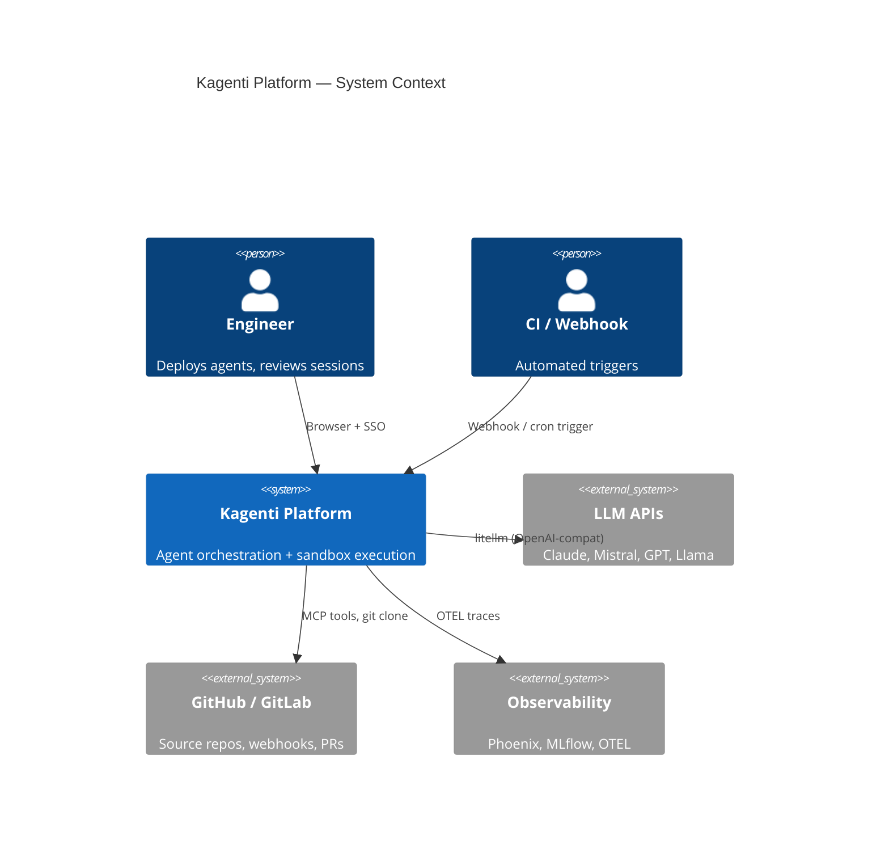

---

## 2. Platform Containers (C4 Level 2)

Internal services that make up the platform.

```mermaid
graph LR
    subgraph UI["UI (React)"]
        sessions["Sessions Page"]
        agents["Agent Catalog"]
        integrations["Integrations"]
        sandboxes["Sandboxes"]
    end

    subgraph API["Backend (FastAPI)"]
        chat["Chat Proxy"]
        sandbox_api["Session CRUD"]
        integ_api["Integration API"]
        auth_api["Auth / RBAC"]
    end

    subgraph Agents["Sandbox Agents"]
        legion["sandbox-legion"]
        hardened["sandbox-hardened"]
        basic["sandbox-basic"]
        restricted["sandbox-restricted"]
    end

    UI -->|"REST + SSE"| API
    API -->|"A2A JSON-RPC"| Agents
```

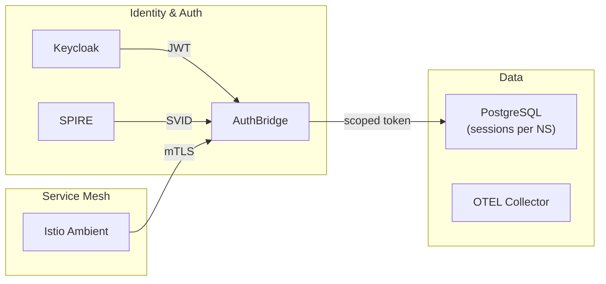

---

## 3. Session & Chat Flow

How a user message travels through the system.

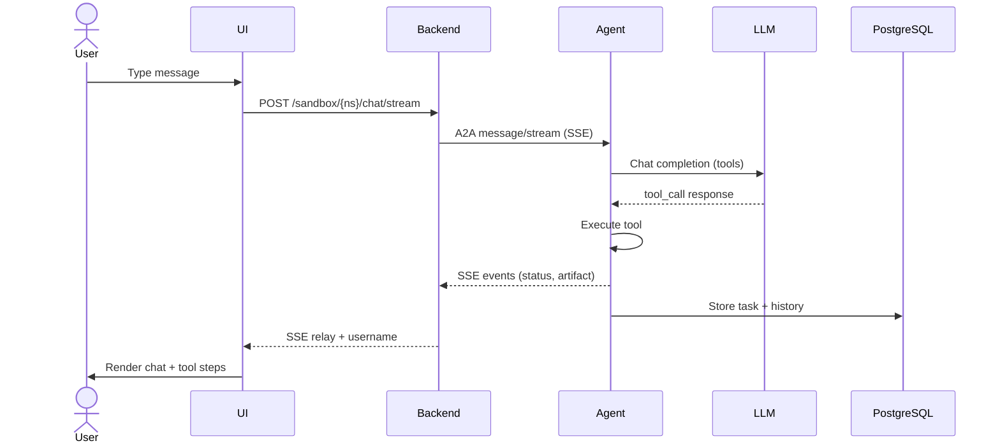

---

## 4. HITL Approval Flow

When an agent requests human approval for a risky operation.

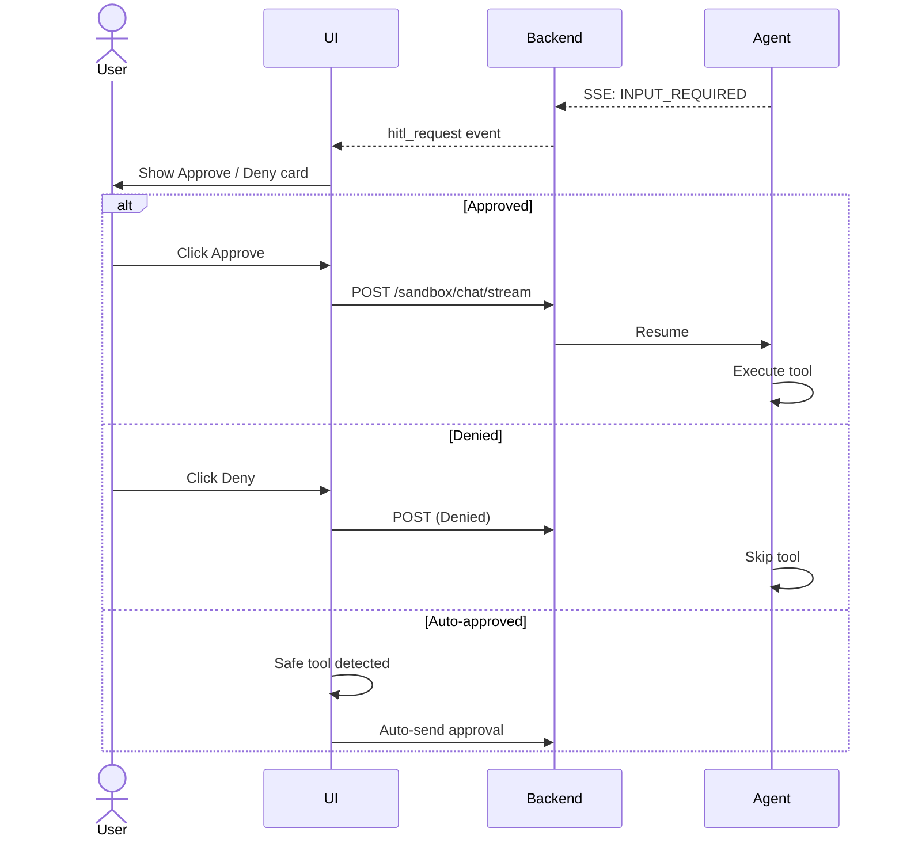

**Status:** UI cards built, auto-approve works. `graph.resume()` wiring pending (Session C).

---

## 5. Session Ownership & RBAC

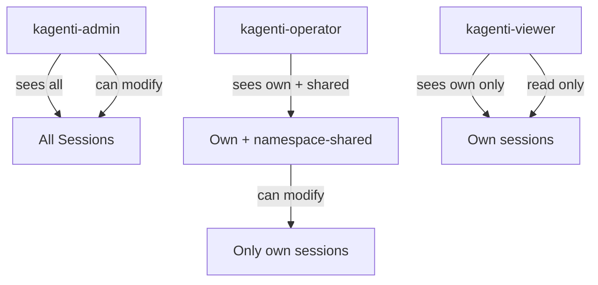

**Status:** Built and deployed. Owner column, visibility toggle (Private/Shared), actions restricted.

---

## 6. Agent Variants & Security Layers

Four agent variants with progressive hardening:

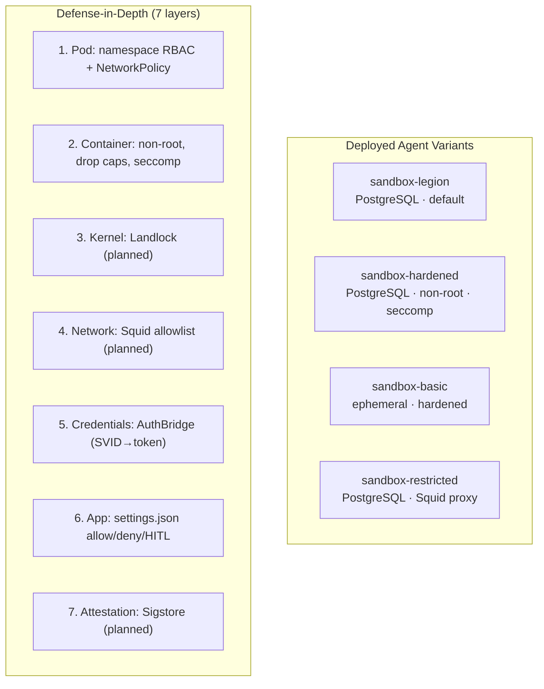

**Built:** Layers 1, 2, 5, 6. **Planned:** Layers 3, 4, 7.

---

## 7. Integrations Hub

Automated triggers that spawn sandbox agent sessions.

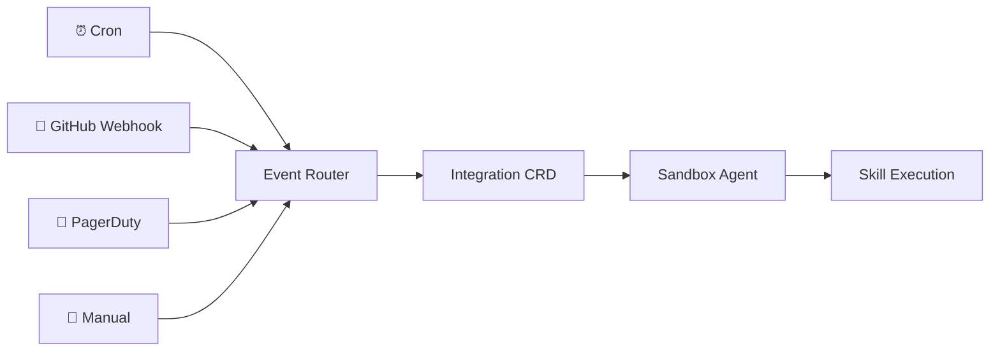

**Status:** UI pages built (24/24 tests pass). CRD + controller + webhook receiver pending.

---

## 8. Session Continuity (Passover)

Long-running agents need to hand off context when approaching token limits.

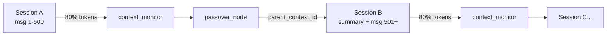

**Status:** `parent_context_id` field exists. Passover logic not implemented.

---

## 9. Tool Call Rendering Pipeline

How agent tool calls flow from execution to UI rendering.

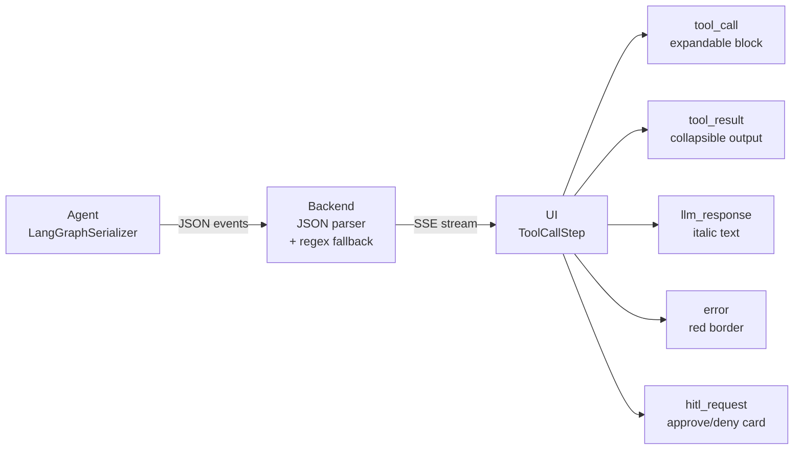

**Status:** UI components built. Agent serializer not in image (Session B blocker). History ordering fixed (timestamp-based).

---

## 10. Current Status by Work Stream

| Stream | Owner | Pass/Fail | Key Blocker |
|--------|-------|-----------|-------------|
| **Identity & Sessions** | This session | ~27 pass | Multi-user needs Keycloak users (Session D) |
| **HITL Approval** | Session C | UI done | `graph.resume()` not wired |
| **Tool Call Rendering** | Session A+B | 0/4 pass | Serializer not in agent image |
| **Integrations Hub** | Session C | 24/24 pass | CRD + controller pending |
| **Source Builds** | Session B | — | Shipwright reliability |
| **Keycloak Multi-User** | Session D | 0/4 pass | Test users not provisioned |
| **Sandboxing Fixes** | New session | — | Active |
| **Catalog Tests** | This session | ~8/21 pass | Auth added, some selectors wrong |

---

## 11. Cluster Topology

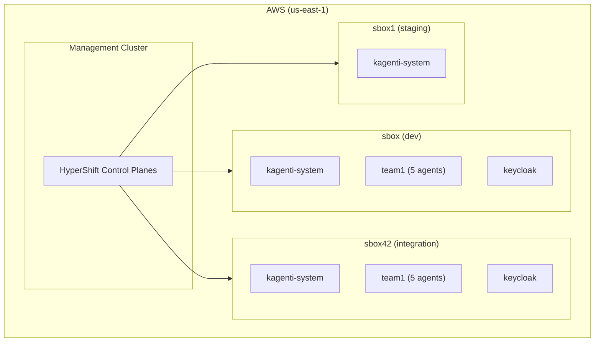

**All agents on Mistral** (mistral-small-24b-w8a8). Keycloak passwords randomized.
