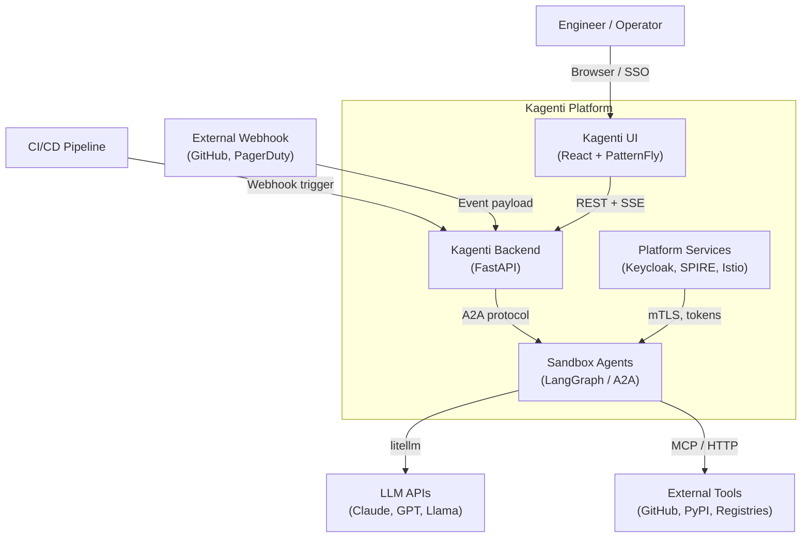
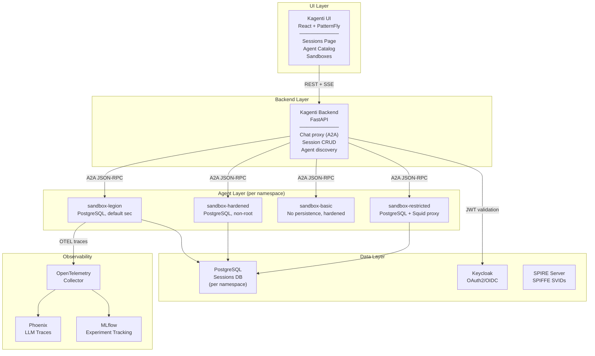
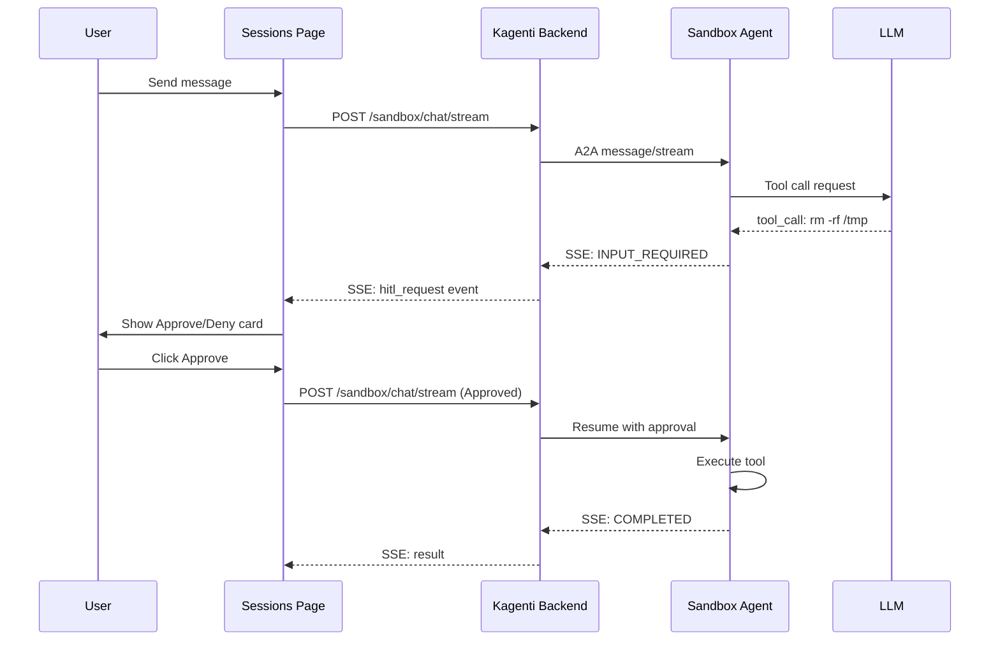
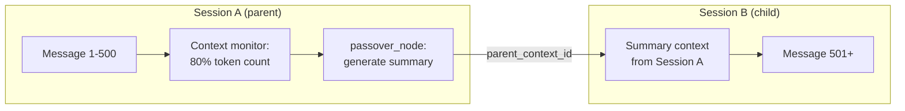
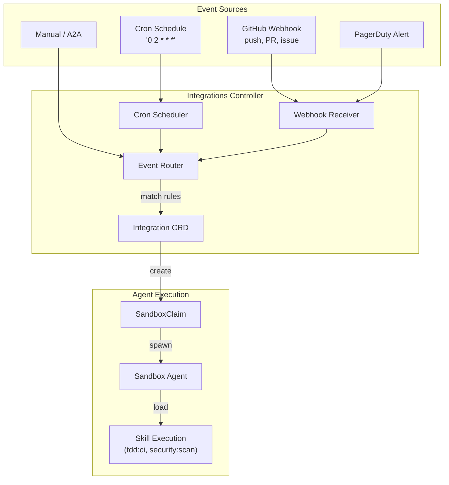
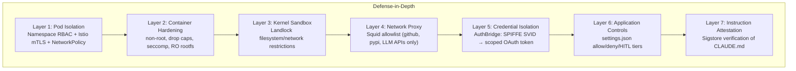

# Kagenti Sandbox Platform — System Design

> Architecture design for the AI agent sandbox platform built on Kagenti.
> Previous research: [2026-02-23-sandbox-agent-research.md](2026-02-23-sandbox-agent-research.md) (reference only)

## System Context (C4 Level 1)



## Container Diagram (C4 Level 2)



## Section 1: Multi-User Identity & Sessions

### What's Built
- Backend extracts `preferred_username` from JWT, includes in SSE payloads
- Sessions page shows `admin (you)` labels on user messages
- Session ownership stored in metadata (`owner`, `visibility` fields)
- Role-based session filtering: admin=all, operator=own+shared, viewer=own
- Visibility toggle (Private/Shared) per session
- Actions (kill/delete/rename) restricted to session owner or admin
- Session history query fixed: picks record with most complete history

### What's Left
- [ ] Multi-user within same session (two users chatting, both see each other's names)
- [ ] Second Keycloak test user for E2E multi-user testing
- [ ] Session sharing notification (when someone shares a session with your namespace)

### Tests: 10 passing
- Username on AgentChat + SandboxPage (3)
- Session ownership table columns (4)
- Sandbox chat identity + session switching (3)

---

## Section 2: HITL (Human-in-the-Loop) Approval



### What's Built
- Backend detects `INPUT_REQUIRED` state, emits `hitl_request` event type
- AgentChat: Approve/Deny buttons in EventsPanel with gold "Approval Required" label
- SandboxPage: HITL events rendered via ToolCallStep component
- Auto-approve for safe tools (`get_weather`, `search`, `get_time`, `list_items`)
- Approve/deny API endpoints wired (`approveSession`/`denySession`)

### What's Left
- [ ] Wire approve/deny to LangGraph `graph.resume()` (currently stub)
- [ ] Multi-channel HITL delivery (Slack, GitHub PR comments, PagerDuty)
- [ ] HITL timeout + escalation policy
- [ ] Configurable auto-approve list per agent (not hardcoded)

### Tests: 6 passing
- HITL card renders with Approve/Deny (1)
- Approve sends response (1)
- Deny sends response (1)
- Auto-approve skips card (1)
- HITL in sandbox streaming (1)
- Full chat flow (1)

---

## Section 3: Tool Call Rendering

### What's Built
- `LangGraphSerializer` in agent emits structured JSON events
- Backend parses JSON-first with regex fallback for legacy Python repr
- `ToolCallStep` component renders 6 event types:
  - `tool_call` — expandable block with tool name + args
  - `tool_result` — collapsible output with name
  - `llm_response` / `thinking` — italic agent reasoning
  - `error` — red bordered error display
  - `hitl_request` — approval card with buttons

### What's Left (BUG — 3 tests failing)
- [ ] **Tool call steps not rendering during streaming** — events collected in `collectedMessages` but not flushed to UI during stream. Only appear after stream ends (if at all)
- [ ] **Serializer not deployed** — Shipwright builds failing, agent still emits old Python repr format. Regex fallback partially works but misses some tool calls
- [ ] Fix `sandbox-rendering.spec.ts` tests (3 failures, all same root cause)

---

## Section 4: Session Continuity & Sub-Agents



### What's Built
- `parent_context_id` field in session metadata
- Session sidebar shows sub-session count
- UI supports hierarchical session view

### What's Left
- [ ] `delegate` tool → create SandboxClaim with `parent_context_id`
- [ ] `context_monitor` node detects token count > 80%
- [ ] `passover_node` generates summary, creates new session, chains history
- [ ] Sidebar shows child sessions indented under parent

---

## Section 5: Integrations Hub



### What's Built
- Design doc complete (`2026-02-28-integrations-hub-design.md`)
- Implementation plan written (`2026-02-28-integrations-hub-plan.md`)

### What's Left (separate session — "integrations")
- [ ] Integration CRD schema + controller
- [ ] Webhook receiver service
- [ ] Cron scheduler
- [ ] Event history + UI page
- [ ] HITL approval routing

---

## Section 6: Security & Isolation



### What's Built
- Layer 1: Namespace isolation + Istio ambient mTLS
- Layer 2: 4 agent variants with progressive hardening (non-root, drop caps, seccomp)
- Layer 5: AuthBridge (Envoy ext_proc + SPIRE + Keycloak token exchange)
- Layer 6: settings.json permission model with HITL tiers

### What's Left
- [ ] Layer 3: Landlock/nono integration (research complete)
- [ ] Layer 4: Squid proxy sidecar (paude pattern researched)
- [ ] Layer 7: Sigstore instruction attestation (design only)
- [ ] gVisor blocked by SELinux on OpenShift (Kata Containers is long-term path)

---

## Active Sessions & Coordination

| Session | Branch/Worktree | Focus | Status |
|---------|----------------|-------|--------|
| **This session** (coordinator) | `feat/sandbox-agent` / `.worktrees/sandbox-agent` | Identity, HITL, sessions, ownership | Active |
| **Source build session** | TBD | Fix Shipwright builds for UI + API from source | Active |
| **Integrations session** | TBD | Integration CRD, webhook receiver, UI pages | Active |

See [2026-03-01-multi-session-passover.md](2026-03-01-multi-session-passover.md) for coordination details.

---

## UI Screenshots

Screenshots captured during E2E test runs are in:
```
kagenti/ui-v2/test-results/
```

Key views:
- **Sessions page**: Session sidebar (left) + chat area (right) with `admin (you)` labels
- **Sessions table**: Owner column, Visibility toggle (Private/Shared), status badges
- **Agent chat**: Username labels, HITL approval cards, streaming events
- **Sandboxes**: Agent variant listing with session counts
