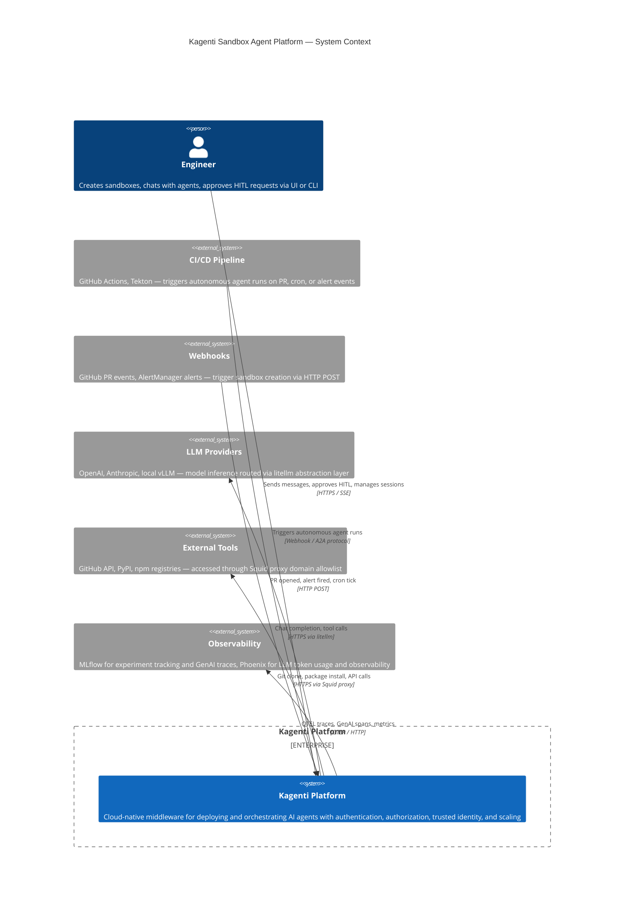
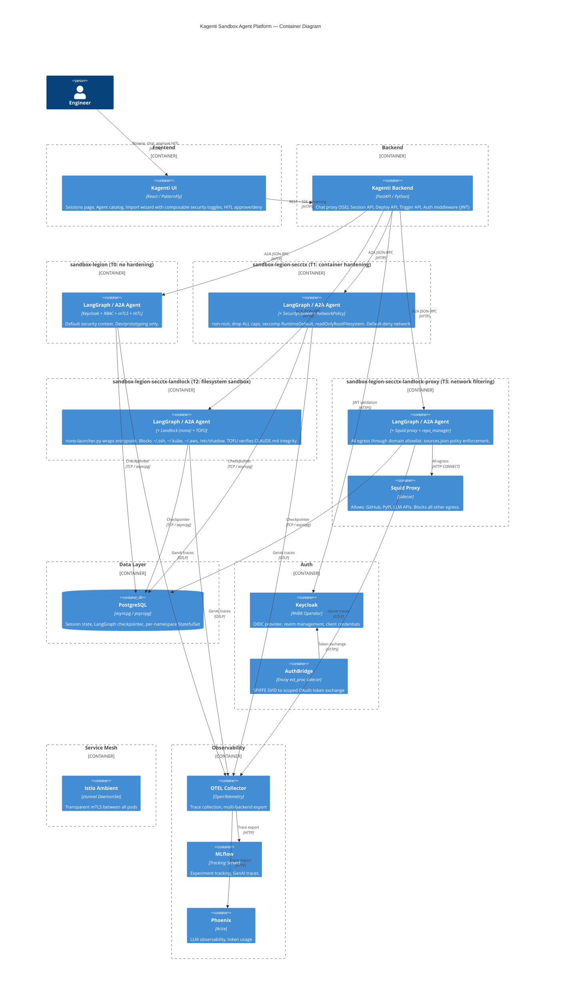
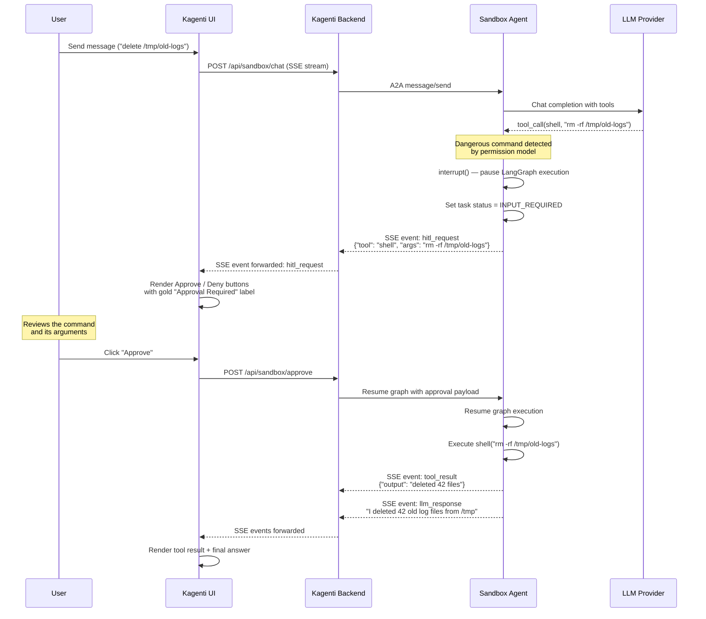
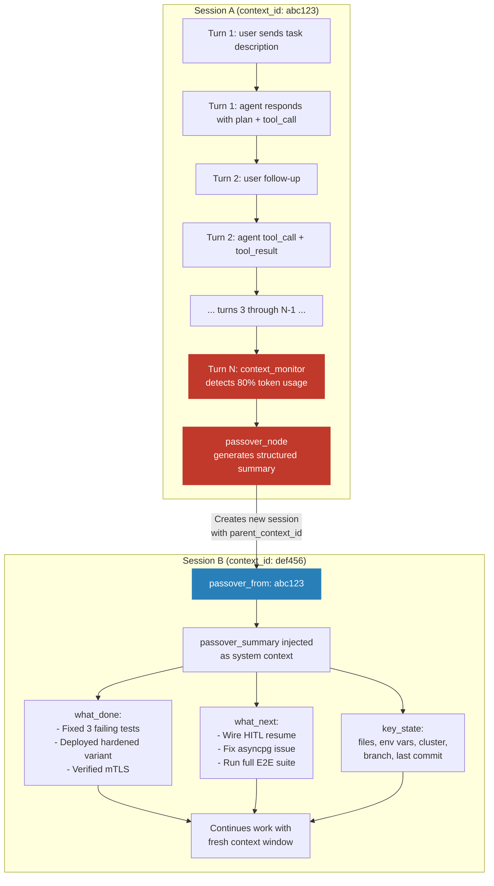

# Sandbox Agent Platform — System Design

> **Status:** Active Development
> **Date:** 2026-03-01
> **PR:** #758 (feat/sandbox-agent)
> **Clusters:** sbox (dev), sbox1 (staging), sbox42 (integration test)
> **Session E:** Legion multi-mode delegation (in-process → shared-pvc → isolated → sidecar), session graph DAG visualization, E2E tests for sub-agent orchestration
> **Session F:** Composable sandbox security model, 5-tier presets, kubernetes-sigs SandboxClaim integration, Landlock wiring

---

## Table of Contents

1. [System Context (C4 Level 1)](#1-system-context-c4-level-1)
2. [Container Diagram (C4 Level 2)](#2-container-diagram-c4-level-2)
3. [Composable Sandbox Security (Session F)](#3-composable-sandbox-security-session-f)
4. [HITL Sequence Diagram](#4-hitl-sequence-diagram)
5. [Session Continuity Diagram](#5-session-continuity-diagram)
6. [Defense-in-Depth Layers](#6-defense-in-depth-layers)
7. [What's Built vs What's Left](#7-whats-built-vs-whats-left)
8. [Test Coverage](#8-test-coverage)
9. [Legion Multi-Mode Delegation (Session E)](#9-legion-multi-mode-delegation-session-e)
10. [Session Graph Visualization (Session E)](#10-session-graph-visualization-session-e)

---

## 1. System Context (C4 Level 1)

The system context shows Kagenti as a middleware platform connecting engineers, CI/CD pipelines, and webhook triggers to LLM providers, external tools, and observability backends.

**Status: Built** ✅



---

## 2. Container Diagram (C4 Level 2)

The container diagram shows the internal architecture of the Kagenti platform. Agent pods are shown by security tier — the name suffix documents which security layers are active. The wizard can compose any combination of layers (see Section 3).



### Component Status

| Component | Description | Status |
|-----------|-------------|--------|
| **UI** — Sessions page | Multi-turn chat, session list, session switching, localStorage persistence | ✅ Built |
| **UI** — Agent catalog | Agent selector panel with variant badges, click-to-switch | ✅ Built |
| **UI** — Import wizard | Security contexts, credential handling, manifest generation | 🔧 Partial (needs composable layer toggles — Session F) |
| **UI** — HITL buttons | Approve/Deny buttons rendered in chat via ToolCallStep component | 🔧 Partial (buttons exist, resume not wired) |
| **Backend** — Chat proxy | SSE streaming, JSON-first event parsing, regex fallback for legacy format | ✅ Built |
| **Backend** — Session API | History aggregation across A2A task records, artifact deduplication, identity labels | ✅ Built |
| **Backend** — Deploy API | Wizard deploy endpoint with SecurityContext generation | 🔧 Partial (no Shipwright build trigger) |
| **Backend** — Trigger API | `POST /api/v1/sandbox/trigger` for cron/webhook/alert sandbox creation | ❌ Not wired (code exists in `triggers.py`, FastAPI routes commented) |
| **Backend** — Auth middleware | Keycloak JWT extraction, per-message username injection | 🔧 Partial (deployed, needs DB connection fix) |
| **T0** — `sandbox-legion` | Default security context, PostgreSQL checkpointer | ✅ Built |
| **T1** — `sandbox-legion-secctx` | non-root, drop ALL caps, seccomp RuntimeDefault, NetworkPolicy | ✅ Built |
| **T2** — `sandbox-legion-secctx-landlock` | T1 + Landlock (nono_launcher.py) + TOFU verification | ✅ Wired (Session F) — needs cluster deploy test |
| **T3** — `sandbox-legion-secctx-landlock-proxy` | T2 + Squid proxy sidecar + repo_manager source policy | ✅ Wired (Session F) — needs cluster deploy test |
| **T4** — `sandbox-legion-secctx-landlock-proxy-gvisor` | T3 + gVisor RuntimeClass | ❌ Blocked (gVisor incompatible with OpenShift SELinux) |
| **PostgreSQL** | Per-namespace StatefulSet, LangGraph checkpointer | 🔧 Partial (Istio ztunnel corrupts asyncpg connections) |
| **Keycloak** | OIDC provider with RHBK operator | ✅ Built |
| **AuthBridge** | SPIFFE-to-OAuth token exchange, OTEL root span injection | ✅ Built |
| **Istio Ambient** | ztunnel-based mTLS, no sidecar injection | ✅ Built |
| **OTEL Collector** | Trace collection and multi-backend export pipeline | ✅ Built |
| **MLflow** | Experiment tracking and GenAI trace storage | ✅ Built |
| **Phoenix** | LLM observability and token usage analytics | ✅ Built |
| **UI** — Session Graph DAG | React Flow page at `/sandbox/graph` showing delegation trees with live updates (Session E) | ❌ Not built (designed) |
| **Backend** — Graph API | `GET /sessions/{context_id}/graph` returns node/edge tree from delegation metadata (Session E) | ❌ Not built (designed) |
| **Legion** — Multi-mode delegation | `delegate` tool with 4 modes: in-process, shared-pvc, isolated, sidecar (Session E) | ❌ Not built (designed, start with in-process) |

---

## 3. Composable Sandbox Security (Session F)

> **Added by Session F (2026-03-01).** Replaces the previous fixed 3-profile model (Default/Hardened/Restricted) with a composable layer system. Agent names are self-documenting — the suffix lists active security layers.

### 3.1 Core Model

Security is **composable, not fixed**. Each security layer is an independent toggle. The agent name is built from `base-agent` + active layer suffixes:

```
sandbox-legion                              ← T0: no hardening (dev)
sandbox-legion-secctx                       ← T1: container hardening
sandbox-legion-secctx-landlock              ← T2: + filesystem sandbox
sandbox-legion-secctx-landlock-proxy        ← T3: + network filtering
sandbox-legion-secctx-landlock-proxy-gvisor ← T4: + kernel isolation (future)
```

These 5 are **presets**. The Import Wizard also lets users toggle layers independently to build custom combos (e.g., `sandbox-legion-proxy`, `sandbox-legion-landlock`). Unusual combinations (like proxy without secctx) get a warning but are allowed.

### 3.2 Security Layers

Each layer is a standalone toggle. Layers are additive — each one addresses a different threat vector:

| Layer | Name Suffix | Mechanism | What It Adds | Overhead |
|-------|-------------|-----------|-------------|----------|
| **SecurityContext** | `-secctx` | Pod spec: non-root, drop ALL caps, seccomp RuntimeDefault, readOnlyRootFilesystem | Container breakout prevention, privilege escalation blocking | Zero (pod spec only) |
| **Landlock** | `-landlock` | `nono-launcher.py` wraps agent entrypoint; kernel-enforced filesystem restrictions via Landlock ABI v5 | Blocks `~/.ssh`, `~/.kube`, `~/.aws`, `/etc/shadow`; allows `/workspace` (RW), `/tmp` (RW), system paths (RO). **Irreversible** once applied. Bundled with TOFU hash verification (`tofu.py`) | Near-zero |
| **Proxy** | `-proxy` | Squid sidecar container; `HTTP_PROXY`/`HTTPS_PROXY` env vars; domain allowlist | Only allowed domains reachable (GitHub, PyPI, LLM APIs); all other egress blocked. Bundled with `repo_manager.py` source policy enforcement (`sources.json`) | ~50MB RAM per pod |
| **gVisor** | `-gvisor` | RuntimeClass `gvisor`; user-space syscall interception via runsc | Kernel exploit protection — all syscalls handled in user space | ~100MB RAM, latency |
| **NetworkPolicy** | (always on when any layer active) | K8s NetworkPolicy: default-deny ingress/egress + DNS allow | Lateral movement prevention between pods | Zero |

### 3.3 Tier Presets

| Tier | Agent Name | Deployment | Security Layers | Use Case |
|------|-----------|------------|-----------------|----------|
| **T0** | `sandbox-legion` | K8s Deployment | None (platform auth only: Keycloak + RBAC + mTLS + HITL) | Local Kind dev, rapid prototyping |
| **T1** | `sandbox-legion-secctx` | K8s Deployment | SecurityContext + NetworkPolicy | Trusted internal agents in production |
| **T2** | `sandbox-legion-secctx-landlock` | K8s Deployment | T1 + Landlock (nono) + TOFU verification | Production agents running own code |
| **T3** | `sandbox-legion-secctx-landlock-proxy` | K8s Deployment or SandboxClaim | T2 + Squid proxy + repo_manager source policy | Imported / third-party agents |
| **T4** | `sandbox-legion-secctx-landlock-proxy-gvisor` | SandboxClaim | T3 + gVisor RuntimeClass | Arbitrary untrusted user code (future) |

### 3.4 Deployment Mechanism

The deployment mechanism is independent of security tier — it's a separate toggle in the wizard:

| Mode | When to Use | What It Creates |
|------|------------|----------------|
| **K8s Deployment** (default) | Persistent agents, manual wizard deploys | Standard Deployment + Service. User manages lifecycle. |
| **SandboxClaim** (opt-in) | Ephemeral agents, autonomous triggers, TTL needed | kubernetes-sigs `SandboxClaim` CRD. Controller manages lifecycle + cleanup. |

**SandboxClaim adds:**
- `lifecycle.shutdownTime` — TTL-based auto-cleanup (default: 2 hours)
- `lifecycle.shutdownPolicy: Delete` — pod deleted when TTL expires
- WarmPool support — pre-warmed pods for fast start
- `triggers.py` integration — cron/webhook/alert create SandboxClaim automatically

**kubernetes-sigs/agent-sandbox integration:**
- CRDs: `Sandbox`, `SandboxClaim`, `SandboxTemplate`, `SandboxWarmPool` (all installed via `35-deploy-agent-sandbox.sh`)
- Controller: StatefulSet in `agent-sandbox-system` namespace (built on-cluster via OpenShift Build or uses staging image)
- SandboxTemplate: deployed to `team1`/`team2` namespaces with security hardening defaults
- SandboxClaim creation: `triggers.py` creates claims via `kubectl apply`, to be wired into FastAPI `POST /api/v1/sandbox/trigger`

### 3.5 Wizard Flow

```
1. Choose base agent
   → sandbox-legion (built-in)
   → or Import custom agent (git URL, container image)

2. Choose security preset OR toggle individual layers:
   ┌─────────────────────────────────────────────────┐
   │  Presets: [T0] [T1] [T2] [T3] [T4]             │
   │                                                  │
   │  Or customize:                                   │
   │  [ ] SecurityContext (non-root, caps, seccomp)   │
   │  [ ] Landlock (filesystem sandbox + TOFU)        │
   │  [ ] Proxy (domain allowlist — configure domains)│
   │  [ ] gVisor (kernel isolation — needs runtime)   │
   │                                                  │
   │  ⚠ Warning: Proxy without SecurityContext is     │
   │    not recommended (container escape bypasses     │
   │    network filtering)                            │
   └─────────────────────────────────────────────────┘

3. Deployment mode:
   ( ) K8s Deployment (persistent, manual lifecycle)
   ( ) SandboxClaim (ephemeral, TTL auto-cleanup)
   → If SandboxClaim: set TTL [2h ▾]

4. Choose namespace: [team1 ▾]

5. Preview:
   Name:       sandbox-legion-secctx-landlock-proxy
   Namespace:  team1
   Deployment: SandboxClaim (TTL: 2h)
   Layers:     SecurityContext ✓  Landlock ✓  Proxy ✓  gVisor ✗

6. [Deploy]
```

### 3.6 What Each Layer Wires

| Layer | Existing Code | Wiring Needed |
|-------|--------------|---------------|
| **SecurityContext** | Pod spec in sandbox-template.yaml | ✅ Already wired in wizard manifest generation |
| **Landlock** | `nono-launcher.py` (91 lines, tested) | Wrap entrypoint: `python3 nono-launcher.py python3 agent_server.py`. Requires `nono-py` pip install. |
| **TOFU** | `tofu.py` (SHA-256 hash, ConfigMap storage) | Call `verify_or_initialize()` before agent starts. Bundled with Landlock toggle. |
| **Proxy** | `proxy/Dockerfile` + `squid.conf` + `entrypoint.sh` | Add Squid sidecar container to pod spec. Set `HTTP_PROXY`/`HTTPS_PROXY` env vars. Wizard configures allowed domains. |
| **repo_manager** | `repo_manager.py` + `sources.json` | Import in agent_server.py, enforce `sources.json` policy on git clone. Bundled with Proxy toggle. |
| **gVisor** | RuntimeClass detection in `35-deploy-agent-sandbox.sh` | Set `runtimeClassName: gvisor` in pod spec. Blocked by OpenShift SELinux incompatibility. |
| **SandboxClaim** | `triggers.py` creates claims, controller deployed | Wire FastAPI `POST /api/v1/sandbox/trigger`. Wizard generates SandboxClaim YAML instead of Deployment when toggle is on. |

### 3.7 Entrypoint by Tier

The agent container entrypoint changes based on active layers:

**T0 (no hardening):**
```bash
python3 agent_server.py
```

**T1 (secctx):**
```bash
# Same entrypoint — SecurityContext is pod spec only
python3 agent_server.py
```

**T2 (secctx + landlock):**
```bash
pip install --target=/tmp/pip-packages --quiet nono-py
export PYTHONPATH=/tmp/pip-packages:$PYTHONPATH
# TOFU verification runs inside nono-launcher before exec
python3 nono-launcher.py python3 agent_server.py
```

**T3 (secctx + landlock + proxy):**
```bash
# Same as T2 — proxy is a sidecar container, not entrypoint change
pip install --target=/tmp/pip-packages --quiet nono-py
export PYTHONPATH=/tmp/pip-packages:$PYTHONPATH
export HTTP_PROXY=http://localhost:3128
export HTTPS_PROXY=http://localhost:3128
python3 nono-launcher.py python3 agent_server.py
```

**T4 (secctx + landlock + proxy + gvisor):**
```bash
# Same as T3 — gVisor is a RuntimeClass, not entrypoint change
pip install --target=/tmp/pip-packages --quiet nono-py
export PYTHONPATH=/tmp/pip-packages:$PYTHONPATH
export HTTP_PROXY=http://localhost:3128
export HTTPS_PROXY=http://localhost:3128
python3 nono-launcher.py python3 agent_server.py
```

### 3.8 Migration from Old Names

| Old Name | Tier | New Name | Changes |
|----------|------|----------|---------|
| `sandbox-legion` | T0 | `sandbox-legion` | No change |
| `sandbox-basic` | T1 | `sandbox-legion-secctx` | Renamed; SecCtx was already applied |
| `sandbox-hardened` | T1 | `sandbox-legion-secctx` | Same as basic (both had SecCtx, differed only in persistence) |
| `sandbox-restricted` | T3 | `sandbox-legion-secctx-landlock-proxy` | Renamed; Landlock now wired (was missing before) |

> **Note:** `sandbox-hardened` and `sandbox-basic` collapse into T1 because they differed only in persistence backend (PostgreSQL vs MemorySaver), not security posture. Persistence is orthogonal to security tier.

---

## 4. HITL Sequence Diagram

Human-in-the-loop (HITL) approval flow for dangerous tool calls. The agent uses LangGraph's `interrupt()` to pause graph execution and emit an `hitl_request` event via SSE. The UI renders approve/deny buttons. On approval, the backend forwards the decision to the agent, which resumes execution.

**Status:** 🔧 Partial (buttons exist, resume not wired)



### What Works Today

| Aspect | Status |
|--------|--------|
| Agent detects dangerous commands and calls `interrupt()` | ✅ Working |
| Backend receives `INPUT_REQUIRED` status from A2A response | ✅ Working |
| UI renders `hitl_request` events with Approve/Deny buttons | ✅ Working |
| Auto-approve for safe tools (`get_weather`, `search`, `get_time`, `list_items`) | ✅ Working |
| Playwright test verifies HITL card rendering (mocked SSE) | ✅ Passing |

### What's Missing

| Gap | Description |
|-----|-------------|
| Resume endpoint | `POST /api/sandbox/approve` is stubbed — needs to forward approval to the agent's `graph.astream()` with the resume payload |
| Deny flow | Deny button exists but does not cancel the pending graph execution |
| Timeout | No TTL on pending HITL requests — agent waits indefinitely for human response |
| Multi-channel delivery | Design exists for Slack, GitHub PR comments, PagerDuty adapters — none implemented |

---

## 5. Session Continuity Diagram

Automated session passover handles context window exhaustion. When the agent's token usage approaches the model's context limit, a `context_monitor` node triggers a `passover_node` that summarizes the session state and creates a new child session to continue the work with a fresh context window.

**Status:** ❌ Not built (design doc at `docs/plans/2026-02-27-session-orchestration-design.md`)



### Passover Data Model

```json
{
  "context_id": "def456",
  "passover_from": "abc123",
  "passover_summary": {
    "what_done": [
      "Fixed 3 failing tests in test_sandbox.py",
      "Deployed sandbox-hardened variant to team1 namespace",
      "Verified mTLS between agent and backend pods"
    ],
    "what_next": [
      "Wire HITL resume endpoint",
      "Fix asyncpg + Istio ztunnel incompatibility",
      "Run full E2E suite on sbox1 cluster"
    ],
    "key_state": {
      "files_modified": ["sandbox.py", "SandboxPage.tsx"],
      "env_vars": {"KUBECONFIG": "~/clusters/hcp/kagenti-team-sbox/auth/kubeconfig"},
      "cluster": "kagenti-team-sbox",
      "branch": "feat/sandbox-agent",
      "last_commit": "a1b2c3d"
    }
  }
}
```

### Design Decisions

| Decision | Rationale |
|----------|-----------|
| Trigger on token count, not turn count | Turn-based triggers miss sessions with few long turns (e.g., large tool outputs) |
| Summary via dedicated LLM call with structured output | Ensures consistent summary format regardless of conversation style |
| `passover_from` field creates linked chain | Enables UI to reconstruct full session history across passover boundaries |
| Requires sub-agent delegation mechanism | Session B is a new A2A task — the passover creates a SandboxClaim |
| UI renders passover notice in chat | User sees "Session continued in Session B" with link to follow |

---

## 6. Defense-in-Depth Layers

The sandbox agent platform uses 7 independent security layers. Compromising one layer does not bypass the others. Each layer addresses a different threat vector.

| Layer | Mechanism | Threat Mitigated | Status |
|-------|-----------|-----------------|--------|
| 1 | **Keycloak OIDC** | Unauthenticated access — only users with valid JWT can reach the platform | ✅ Built |
| 2 | **RBAC** (admin / operator / viewer) | Unauthorized actions — role-based access to namespaces, agents, and sessions | ✅ Built |
| 3 | **Istio Ambient mTLS** | Network eavesdropping — all pod-to-pod traffic encrypted via ztunnel, no plaintext on the wire | ✅ Built |
| 4 | **SecurityContext** (non-root, drop caps, seccomp) | Privilege escalation — prevents container breakout, restricts syscalls, enforces read-only rootfs | ✅ Built (hardened variant) |
| 5 | **Network Policy + Squid Proxy** | Data exfiltration — allowlist of permitted external domains (GitHub, PyPI, LLM APIs); all other egress blocked | 🔧 Partial (Squid proxy designed and tested, not deployed to all variants) |
| 6 | **Landlock** (nono binary) | Filesystem escape — kernel-enforced restrictions on which paths the agent process can read/write (e.g., allow /workspace, deny /etc) | ✅ Wired (Session F) — nono_launcher.py wraps agent entrypoint in sandbox-template-full.yaml |
| 7 | **HITL Approval Gates** | Destructive actions — dangerous tool calls require explicit human approval before execution | 🔧 Partial (buttons exist, resume not wired) |

### Security Layer × Tier Matrix

Each tier preset enables a progressive combination of layers. Custom combos are also possible via the wizard (see Section 3).

| Tier | Name | L1 Keycloak | L2 RBAC | L3 mTLS | L4 SecCtx | L5 NetPol | L6 Landlock | L7 Proxy | L8 gVisor | L9 HITL | Status |
|:----:|------|:-----------:|:-------:|:-------:|:---------:|:---------:|:-----------:|:--------:|:---------:|:-------:|--------|
| T0 | `sandbox-legion` | ✅ | ✅ | ✅ | -- | -- | -- | -- | -- | ✅ | ✅ Built |
| T1 | `sandbox-legion-secctx` | ✅ | ✅ | ✅ | ✅ | ✅ | -- | -- | -- | ✅ | ✅ Built |
| T2 | `sandbox-legion-secctx-landlock` | ✅ | ✅ | ✅ | ✅ | ✅ | ✅ | -- | -- | ✅ | ✅ Wired (Session F) |
| T3 | `sandbox-legion-secctx-landlock-proxy` | ✅ | ✅ | ✅ | ✅ | ✅ | ✅ | ✅ | -- | ✅ | ✅ Wired (Session F) |
| T4 | `sandbox-legion-secctx-landlock-proxy-gvisor` | ✅ | ✅ | ✅ | ✅ | ✅ | 🔧 | ✅ | ❌ | ✅ | ❌ gVisor blocked |

> **Layers L1-L3 and L9 (HITL) are always on** — Keycloak, RBAC, Istio mTLS, and HITL approval gates apply to all tiers. They are platform-level, not per-agent toggles.
>
> **Toggleable layers are L4-L8** — these are what the wizard exposes. Each adds defense against a specific threat vector. See Section 3.2 for details.

### Future Runtime Isolation

| Runtime | Status | Notes |
|---------|--------|-------|
| **gVisor (runsc)** | Blocked | Intercepts all syscalls in user-space. Incompatible with OpenShift SELinux — gVisor rejects all SELinux labels but CRI-O always applies them. Deferred until wrapper script or upstream fix available. |
| **Kata Containers** | Planned (later) | VM-level isolation (each pod = lightweight VM with own kernel). Requires `/dev/kvm` on nodes. Strongest isolation but highest overhead (~128MB per pod, 100-500ms boot). Red Hat's officially supported sandbox runtime. |

---

## 7. What's Built vs What's Left

### Built (✅)

| Feature | Evidence / Detail |
|---------|-------------------|
| Multi-turn chat with tool calls | 12/12 Playwright tests passing across session isolation, variant switching, and identity suites |
| 5-tier composable sandbox model | T0 (sandbox-legion) through T4 (sandbox-legion-secctx-landlock-proxy-gvisor) — self-documenting names, wizard toggles, progressive defense-in-depth (Session F) |
| Session isolation, persistence, identity labels | 5 Playwright tests verify no state leak between sessions, localStorage persistence across page reload |
| Agent selector UI | SandboxAgentsPanel shows active session's agent (filtered view), click to switch agents for new sessions |
| HITL event display | hitl_request events rendered as approval cards with Approve/Deny buttons and gold "Approval Required" label |
| History aggregation across A2A task records | Backend aggregates message history from multiple A2A task records within a single session |
| SSE reconnect with backoff | Frontend reconnects on disconnect with exponential backoff; prevents UI freeze on transient network failures |
| Wizard with security contexts + credential handling | Import wizard generates deployment manifests with SecurityContext, secret references, and namespace targeting |
| Session orchestration design | 685-line design doc covering passover chains, delegation, and graph visualization |
| JSON-first event serializer | LangGraphSerializer emits structured JSON events; backend parses JSON first with regex fallback for legacy sessions |
| Route timeout 120s | Both kagenti-api and kagenti-ui OpenShift routes configured with 120s annotation |
| CI pipeline passing | Build (3.11/3.12), DCO, Helm Lint, Bandit, Shell Lint, YAML Lint, Trivy — all passing on PR #758 |
| Landlock + TOFU wired into agent startup (Session F) | `nono_launcher.py` wraps agent entrypoint with Landlock enforcement + TOFU hash verification before Landlock locks filesystem. `TOFU_ENFORCE=true` blocks on mismatch. 10 unit tests. |
| `sandbox_profile.py` composable manifest builder (Session F) | Generates self-documenting names (`sandbox-legion-secctx-landlock-proxy`) + K8s Deployment or SandboxClaim manifests from layer toggles. 20 unit tests. |
| `repo_manager.py` wired into agent_server (Session F) | Loads `sources.json` policy on startup, enforces allowed/denied remotes on git clone, `/repos` endpoint. 10+5 unit tests. |
| Trigger API `POST /api/v1/sandbox/trigger` (Session F) | FastAPI endpoint creates SandboxClaim resources from cron/webhook/alert events. Registered in main.py. 7+9 unit tests. |
| 72 sandbox unit tests (Session F) | `sandbox_profile` (20), `nono_launcher` (10), `tofu` (11), `repo_manager` (10), `triggers` (7), `agent_server` (5), `sandbox_trigger` router (9) |

### Critical Blockers (🚨)

| Blocker | Impact | Root Cause | Attempted Fixes | Workaround |
|---------|--------|------------|-----------------|------------|
| **Istio ambient ztunnel corrupts asyncpg PostgreSQL connections** | Agent cannot persist sessions to PostgreSQL; SSE streams break with "Connection error" in UI | ztunnel's mTLS insertion corrupts asyncpg's binary protocol handshake mid-operation | `PeerAuthentication: PERMISSIVE`, `ambient.istio.io/redirection: disabled` annotation, `ssl=False` parameter, direct pod IP | Use MemorySaver (in-memory, no cross-restart persistence) or disable mesh for postgres pod |
| **Agent serializer not included in container image** | Tool call events not structured during live streaming from rebuilt images; ToolCallStep component receives unparseable data | `event_serializer.py` exists in git but `uv sync` in Dockerfile does not install it | None — packaging issue in pyproject.toml | ConfigMap mount of both `event_serializer.py` and `agent.py` into running pods |

### Partial (🔧)

| Feature | What Works | What's Missing |
|---------|-----------|----------------|
| Tool call rendering during live streaming | JSON event parsing in backend, ToolCallStep component renders 6 event types | Agent image rebuild needed with serializer included (not just ConfigMap workaround) |
| HITL approve/deny | Buttons rendered, callbacks defined, auto-approve for safe tools | Resume endpoint stubbed — needs to forward approval to `graph.astream()` with resume payload |
| Wizard deploy | UI wizard generates manifest with security contexts and credentials | No Shipwright build trigger — wizard creates manifest but does not start container build |
| Multi-user per-message identity | Code deployed to backend (JWT extraction) and frontend (username labels) | Blocked by asyncpg DB connection failure (Istio ztunnel); cannot persist identity metadata |
| Squid proxy network filtering | Proxy built and tested (GitHub/PyPI allowed, evil.com blocked) | Deployed as sidecar on T3 preset; wizard needs to generate sidecar spec when `-proxy` toggle is on |
| Landlock filesystem sandbox | ✅ **Wired (Session F)** — `nono_launcher.py` wraps agent entrypoint + TOFU verification on startup | Needs cluster deployment test (template updated, not yet deployed to cluster) |
| Composable wizard security toggles | Tier presets defined (T0-T4), `sandbox_profile.py` generates names + manifests (20 tests, Session F) | Wizard UI needs individual layer toggles + warning for unusual combos |
| SandboxClaim trigger API | ✅ **Wired (Session F)** — `POST /api/v1/sandbox/trigger` endpoint registered in main.py (9 tests) | Wizard UI needs SandboxClaim toggle; endpoint needs auth middleware |

### Not Built (❌)

| Feature | Design Status | Dependency |
|---------|--------------|------------|
| Sub-agent delegation | **Session E: 4-mode delegation designed** (in-process, shared-pvc, isolated, sidecar). See Section 9. Start with in-process subgraph. | In-process: nothing. shared-pvc: RWX PVC. isolated: SandboxClaim controller. |
| Automated session passover | Design complete (session orchestration doc) | Sub-agent delegation (Session B is a new A2A task) |
| Session graph visualization | **Session E: Full DAG page designed** with React Flow, dagre layout, live SSE updates. See Section 10. | Sub-agent delegation (needs delegation metadata to visualize) |
| External DB URL wiring | Not designed | Istio ztunnel fix (once asyncpg works, external DB is straightforward) |
| Workspace cleanup / TTL | SandboxClaim has `shutdownTime` + `Delete` policy fields | No cleanup controller; expired sandboxes are not reaped |
| Multi-channel HITL delivery | Designed: GitHub PR comments, Slack interactive messages, PagerDuty, Kagenti UI adapters | HITL resume endpoint must work first (Layer 7) |
| Autonomous triggers (cron / webhook / alert) | ✅ **Backend wired (Session F)** — `POST /api/v1/sandbox/trigger`. Needs UI trigger management page + cron scheduler. | SandboxClaim CRD + controller (deployed) |

---

## 8. Test Coverage

### Playwright Tests (UI E2E)

| Suite | Spec File | Tests | Status |
|-------|-----------|:-----:|--------|
| Session isolation | `sandbox-sessions.spec.ts` | 5 | ✅ 5/5 passing |
| Agent variants | `sandbox-variants.spec.ts` | 4 | ✅ 4/4 passing |
| Identity + HITL | `sandbox-chat-identity.spec.ts` | 3 | ✅ 3/3 passing |
| Tool call rendering | `sandbox-rendering.spec.ts` | 4 | ❌ 0/4 (blocked by agent DB connection) |

**Playwright total: 12/16 passing**

### Backend E2E (pytest)

| Suite | Test | Status |
|-------|------|--------|
| Agent card discovery | `test_sandbox_agent::test_agent_card` | ✅ passing |
| Shell execution | `test_sandbox_agent::test_shell_ls` | ✅ passing |
| File write/read | `test_sandbox_agent::test_file_write_and_read` | ✅ passing |
| Multi-turn file persistence | `test_sandbox_agent::test_multi_turn_file_persistence` | ✅ passing |
| Multi-turn memory (Bob Beep) | `test_sandbox_agent::test_multi_turn_memory` | ✅ passing |
| Platform health, Keycloak, MLflow, Phoenix, Shipwright | `test_*.py` (16+ tests) | Not run (require in-cluster access) |

### Session Ownership Tests

| Test | Status |
|------|--------|
| Username on AgentChat page | ✅ passing |
| Username on SandboxPage | ✅ passing |
| Session ownership table columns (4 tests) | ✅ passing |
| Sandbox chat identity + session switching (3 tests) | ✅ passing |

### Legion Delegation E2E (Session E — planned)

| Suite | Test File | Tests | Status |
|-------|-----------|:-----:|--------|
| In-process delegation | `test_sandbox_delegation.py` | 6 | ❌ Not built |
| Shared-PVC delegation | `test_sandbox_delegation.py` | 3 | ❌ Not built |
| Isolated delegation | `test_sandbox_delegation.py` | 4 | ❌ Not built |
| Cross-mode orchestration | `test_sandbox_delegation.py` | 3 | ❌ Not built |
| Graph API | `test_sandbox_graph.py` | 3 | ❌ Not built |

**Delegation total: 0/19 (all planned)**

### Session Graph UI (Session E — planned)

| Suite | Spec File | Tests | Status |
|-------|-----------|:-----:|--------|
| Graph page rendering | `sandbox-graph.spec.ts` | 7 | ❌ Not built |

### CI Pipeline (PR #758)

| Check | Status |
|-------|--------|
| Build (Python 3.11) | ✅ passing |
| Build (Python 3.12) | ✅ passing |
| DCO sign-off | ✅ passing |
| Helm Lint | ✅ passing |
| Bandit (security scanner) | ✅ passing |
| Shell Lint (shellcheck) | ✅ passing |
| YAML Lint | ✅ passing |
| Trivy (container vulnerability scan) | ✅ passing |
| Deploy & Test (Kind) | ✅ passing (sandbox tests skipped via marker) |
| CodeQL (code analysis) | Pre-existing baseline issue |
| E2E HyperShift | Pending (`/run-e2e` comment trigger) |

---

## 9. Legion Multi-Mode Delegation (Session E)

> **Added by Session E (2026-03-02).** Legion agent becomes an orchestrator that spawns child sessions using configurable delegation modes. Multiple modes can be active simultaneously — the LLM picks the best mode per task, or the user specifies explicitly.

### 9.1 Delegation Modes

The legion agent supports 4 delegation modes, all available concurrently within the same root session:

| Mode | Runtime | Filesystem | Isolation | Best For |
|------|---------|-----------|-----------|----------|
| **`in-process`** | LangGraph subgraph in same Python process | Shares parent memory + filesystem | None (same process) | Exploration, file analysis, quick lookups, subagent working on specific files |
| **`shared-pvc`** | Separate pod, subPath mount from parent PVC | Child gets `/workspace/{child_context_id}`, parent can see it (RWX) | Pod-level, shared filesystem | Running tests on parent's changes, collaborative file editing |
| **`isolated`** | Separate pod, own PVC/emptyDir | Fully independent `/workspace` | Full pod + filesystem | Building separate PRs, independent feature branches, parallel workstreams |
| **`sidecar`** | New container in legion pod | Shares PVC volume mount directly | Container-level | A2A over localhost, low-latency tool execution |

### 9.2 Configuration

All modes can be enabled simultaneously. The root session agent has access to any enabled mode:

```python
# Environment variables on legion agent
DELEGATION_MODES=in-process,shared-pvc,isolated,sidecar  # all enabled
DEFAULT_DELEGATION_MODE=in-process                         # fallback when mode=auto
```

### 9.3 Delegate Tool

```python
@tool
async def delegate(
    task: str,
    mode: str = "auto",               # auto | in-process | shared-pvc | isolated | sidecar
    variant: str = "sandbox-legion",   # which agent variant for the child
    share_files: list[str] = None,     # files to copy/mount into child workspace
    return_artifacts: bool = True,     # pull back files the child created
    timeout_minutes: int = 30,         # TTL for child session
):
    """Delegate a task to a child session.

    Mode selection:
    - auto: LLM picks based on task description
    - in-process: subgraph, same process, shared filesystem
    - shared-pvc: separate pod, parent PVC visible
    - isolated: separate pod, own workspace
    - sidecar: new container in same pod
    """
```

### 9.4 Auto-Selection Heuristic

When `mode="auto"`, the LLM chooses based on task signals:

| Signal in Task Description | Selected Mode | Rationale |
|---------------------------|--------------|-----------|
| "explore", "read", "analyze", "check", "look at" | `in-process` | Needs parent's filesystem, no isolation needed |
| "work on these files", "edit this function" | `in-process` | Subagent operates on parent's workspace directly |
| "PR", "branch", "build", "deploy", "implement feature" | `isolated` | Needs clean git state, independent workspace |
| "run tests on my changes", "verify", "validate" | `shared-pvc` | Needs to see parent's modifications but run independently |
| Multiple independent tasks | `isolated` × N | Each child gets its own sandbox, can produce separate PRs |

### 9.5 Orchestration Patterns

**Pattern A: Exploration + Implementation**
```
Legion (root session)
├── delegate("explore the auth module", mode="in-process")      → fast, inline
├── delegate("explore the test patterns", mode="in-process")    → parallel, inline
└── delegate("implement OAuth2 client", mode="isolated")        → own workspace, own PR
```

**Pattern B: Parallel Feature Development**
```
Legion (root session)
├── delegate("build feature-auth PR", mode="isolated")          → workspace A, PR #1
├── delegate("build feature-rbac PR", mode="isolated")          → workspace B, PR #2
└── delegate("test both features together", mode="shared-pvc")  → sees parent's state
```

**Pattern C: Multi-Agent Coordination**
```
Legion (root session, T0)
├── delegate("security audit", variant="sandbox-legion-secctx-landlock", mode="isolated")
├── delegate("run CI checks", mode="in-process")
└── delegate("deploy to staging", variant="sandbox-legion-secctx", mode="isolated")
```

### 9.6 Implementation by Mode

#### `in-process` (start here)

The simplest mode — a LangGraph subgraph invoked within the same Python process:

```python
# In legion agent's graph definition
from langgraph.graph import StateGraph

def make_child_subgraph(child_context_id: str, task: str):
    """Create a nested subgraph for in-process delegation."""
    child_graph = StateGraph(AgentState)
    child_graph.add_node("agent", agent_node)
    child_graph.add_node("tools", tool_node)
    # ... same graph structure as parent but with own context_id
    return child_graph.compile()

# Invoked by delegate tool:
child = make_child_subgraph(child_context_id, task)
result = await child.ainvoke({"messages": [HumanMessage(content=task)]})
```

- **Session tracking**: Child gets a unique `context_id` with `parent_context_id` in metadata
- **Filesystem**: Inherits parent's `/workspace` — same files visible
- **No K8s resources**: Runs in the same pod, no additional pods/containers
- **Tracing**: Child subgraph gets its own OTEL span under parent's trace

#### `shared-pvc`

Separate pod that mounts the parent's PVC with a subPath:

```yaml
# Child pod spec (generated by delegate tool)
volumes:
  - name: workspace
    persistentVolumeClaim:
      claimName: legion-root-pvc    # parent's PVC
containers:
  - name: agent
    volumeMounts:
      - name: workspace
        mountPath: /workspace
        subPath: ""                 # sees all of parent's workspace
      - name: workspace
        mountPath: /workspace/child-output
        subPath: child-{context_id} # child's own output area
```

- **Requires**: RWX StorageClass (or same-node scheduling with ReadWriteOnce)
- **A2A**: Standard A2A JSON-RPC over service endpoint
- **Cleanup**: Pod deleted after task completion or timeout

#### `isolated`

Separate pod with fully independent workspace:

```yaml
# Child pod spec (via SandboxClaim CRD)
apiVersion: extensions.agents.x-k8s.io/v1alpha1
kind: SandboxClaim
metadata:
  name: child-{context_id}
  labels:
    kagenti.io/parent-context: {parent_context_id}
    kagenti.io/delegation-mode: isolated
    kagenti.io/session-type: child
spec:
  sandboxTemplateRef:
    name: {variant}
  lifecycle:
    shutdownPolicy: Delete
    shutdownTime: {expiration}
```

- **Full isolation**: Own PVC/emptyDir, own network identity
- **Can use any security tier**: Child can be T0-T4 independently
- **Artifacts**: `return_artifacts=True` copies child output back to parent via A2A artifact parts

#### `sidecar`

New container injected into the legion pod:

```yaml
# Dynamic sidecar injection (requires pod mutation or restart)
containers:
  - name: child-{context_id}
    image: {variant-image}
    env:
      - name: PARENT_CONTEXT_ID
        value: {parent_context_id}
    volumeMounts:
      - name: workspace
        mountPath: /workspace   # same volume as parent
    ports:
      - containerPort: 8001     # unique port per sidecar
```

- **Communication**: A2A over `localhost:8001`
- **Filesystem**: Shares parent's volume mount directly
- **Limitation**: Requires pod restart or ephemeral container support

### 9.7 Session Metadata for Delegation

All delegation modes store tracking metadata in the A2A task record:

```json
{
  "context_id": "child-a1b2c3",
  "metadata": {
    "parent_context_id": "ctx-root-abc123",
    "session_type": "child",
    "delegation_mode": "in-process",
    "delegate_task": "explore the auth module",
    "delegate_variant": "sandbox-legion",
    "delegate_status": "completed",
    "delegate_duration_ms": 4500,
    "delegate_token_usage": {"prompt": 1200, "completion": 800}
  }
}
```

### 9.8 E2E Test Plan

Tests are organized by delegation mode, starting with `in-process` (no infra needed):

#### Phase 1: `in-process` E2E Tests (no cluster required for basic tests)

| Test | Description | Validation |
|------|-------------|------------|
| `test_delegate_in_process_explore` | Delegate "list files in /workspace" | Child returns file listing, parent receives result |
| `test_delegate_in_process_file_read` | Delegate "read contents of /workspace/README.md" | Child reads parent's file, returns contents |
| `test_delegate_in_process_file_write` | Delegate "write hello to /workspace/child-output.txt" | File visible in parent's workspace after delegation |
| `test_delegate_in_process_multi_child` | Spawn 2 in-process children in parallel | Both complete, results aggregated by parent |
| `test_delegate_in_process_context_isolation` | Two children get different context_ids | Each child's A2A task has unique context_id with parent_context_id |
| `test_delegate_auto_mode_exploration` | Send task "explore the codebase structure" with mode=auto | Agent selects `in-process` mode |

#### Phase 2: `shared-pvc` E2E Tests (requires cluster)

| Test | Description | Validation |
|------|-------------|------------|
| `test_delegate_shared_pvc_sees_parent_files` | Parent writes file, child reads it | Child response contains parent's file content |
| `test_delegate_shared_pvc_child_writes_visible` | Child writes file, parent reads it | Parent can see child's output in shared workspace |
| `test_delegate_shared_pvc_concurrent` | Two children modify different files on same PVC | No conflicts, both files present |

#### Phase 3: `isolated` E2E Tests (requires cluster + SandboxClaim controller)

| Test | Description | Validation |
|------|-------------|------------|
| `test_delegate_isolated_workspace_separation` | Parent file NOT visible in child | Child cannot read parent's workspace |
| `test_delegate_isolated_artifact_return` | Child creates file, return_artifacts=True | Parent receives file content as A2A artifact |
| `test_delegate_isolated_different_variant` | Delegate to `sandbox-legion-secctx` (T1) | Child runs with T1 security context |
| `test_delegate_isolated_auto_mode_pr` | Send task "build a PR for feature X" with mode=auto | Agent selects `isolated` mode |

#### Phase 4: Cross-Mode E2E Tests

| Test | Description | Validation |
|------|-------------|------------|
| `test_delegate_mixed_modes` | Root delegates: in-process explore + isolated build | Both complete, graph shows both edges |
| `test_delegate_chain` | Root → isolated child → in-process grandchild | 3-level chain visible in session graph |
| `test_delegate_external_agent` | Delegate to a non-legion A2A agent | A2A message sent, response received |

### 9.9 Implementation Order

| Step | What | Mode | Depends On |
|------|------|------|------------|
| 1 | `delegate` tool + in-process subgraph | `in-process` | Nothing — pure Python |
| 2 | Phase 1 E2E tests | `in-process` | Step 1 |
| 3 | Session graph backend endpoint | All | Step 1 (needs metadata) |
| 4 | Session graph DAG page (React Flow) | All | Step 3 |
| 5 | `shared-pvc` pod spawning | `shared-pvc` | Cluster access |
| 6 | Phase 2 E2E tests | `shared-pvc` | Step 5 |
| 7 | `isolated` via SandboxClaim | `isolated` | SandboxClaim controller |
| 8 | Phase 3 E2E tests | `isolated` | Step 7 |
| 9 | Phase 4 cross-mode tests | All | Steps 2, 6, 8 |
| 10 | `sidecar` container injection | `sidecar` | Ephemeral container support |

---

## 10. Session Graph Visualization (Session E)

> **Added by Session E (2026-03-02).** Full DAG visualization of session delegation trees. Previously marked as `❌ Not designed` in Section 7.

### 10.1 Overview

With legion spawning child sessions across multiple delegation modes, a visual representation of the session graph becomes essential. The DAG page shows parent→child relationships, delegation modes, session status, and allows click-through navigation to individual sessions.

### 10.2 Route and Layout

**Route**: `/sandbox/graph` (all sessions) or `/sandbox/graph/:contextId` (rooted at specific session)

```
┌─────────────────────────────────────────────────────────────────┐
│  Session Graph                    [Namespace ▾] [Filter ▾]      │
│                                                                  │
│                  ┌────────────────────┐                          │
│                  │ sandbox-legion     │                          │
│                  │ ctx-abc123         │                          │
│                  │ ● Running  12m     │                          │
│                  │ T0  mode: root     │                          │
│                  └──┬─────┬──────┬────┘                          │
│            ┌────────┘     │      └────────┐                      │
│            ▼              ▼               ▼                      │
│   ┌──────────────┐ ┌──────────────┐ ┌──────────────┐            │
│   │ explore-auth │ │ feat-auth    │ │ feat-rbac    │            │
│   │ child-001    │ │ child-002    │ │ child-003    │            │
│   │ ✓ Done  2m   │ │ ● Running 8m │ │ ✓ Done  5m   │            │
│   │ in-process   │ │ isolated     │ │ isolated     │            │
│   └──────────────┘ └──────┬───────┘ └──────────────┘            │
│                           ▼                                      │
│                    ┌──────────────┐                              │
│                    │ test-both    │                              │
│                    │ child-004    │                              │
│                    │ ◌ Pending    │                              │
│                    │ shared-pvc   │                              │
│                    └──────────────┘                              │
│                                                                  │
│  ● Running   ✓ Completed   ✗ Failed   ◌ Pending                │
│  ── in-process   ═══ isolated   ─ ─ shared-pvc   ··· sidecar   │
└─────────────────────────────────────────────────────────────────┘
```

### 10.3 Node Component

Each node in the DAG displays:

| Field | Source | Example |
|-------|--------|---------|
| Agent variant name | `metadata.agent_name` | `sandbox-legion` |
| Context ID (truncated) | `context_id` | `child-002` |
| Status badge | `delegate_status` | ● Running |
| Duration | `delegate_duration_ms` | `8m` |
| Delegation mode | `metadata.delegation_mode` | `isolated` |
| Security tier | Agent name suffix | `T0`, `T1`, etc. |

**Click action**: Navigate to `/sandbox?session={context_id}` to view that session's chat.

### 10.4 Edge Styles

Edges represent delegation relationships. Style encodes the delegation mode:

| Mode | Edge Style | Color |
|------|-----------|-------|
| `in-process` | Solid thin line `──` | Gray (#666) |
| `shared-pvc` | Dashed line `─ ─` | Blue (#2980b9) |
| `isolated` | Solid thick line `═══` | Orange (#e67e22) |
| `sidecar` | Dotted line `···` | Green (#27ae60) |

Edge label shows the delegated task description (truncated to 40 chars).

### 10.5 Backend Endpoint

```
GET /api/v1/sandbox/{namespace}/sessions/{context_id}/graph
```

**Response:**

```json
{
  "root": "ctx-abc123",
  "nodes": [
    {
      "id": "ctx-abc123",
      "agent": "sandbox-legion",
      "status": "running",
      "mode": "root",
      "tier": "T0",
      "started_at": "2026-03-02T10:00:00Z",
      "duration_ms": 720000,
      "task_summary": "Root orchestration session"
    },
    {
      "id": "child-001",
      "agent": "sandbox-legion",
      "status": "completed",
      "mode": "in-process",
      "tier": "T0",
      "started_at": "2026-03-02T10:01:00Z",
      "duration_ms": 120000,
      "task_summary": "explore the auth module"
    },
    {
      "id": "child-002",
      "agent": "sandbox-legion-secctx",
      "status": "running",
      "mode": "isolated",
      "tier": "T1",
      "started_at": "2026-03-02T10:02:00Z",
      "duration_ms": 480000,
      "task_summary": "build feature-auth PR"
    }
  ],
  "edges": [
    {
      "from": "ctx-abc123",
      "to": "child-001",
      "mode": "in-process",
      "task": "explore the auth module"
    },
    {
      "from": "ctx-abc123",
      "to": "child-002",
      "mode": "isolated",
      "task": "build feature-auth PR"
    },
    {
      "from": "child-002",
      "to": "child-004",
      "mode": "shared-pvc",
      "task": "test both features together"
    }
  ]
}
```

**Implementation**: Query the tasks table where `metadata->>'parent_context_id'` matches, then recursively build the tree. Optionally cache in Redis for large graphs.

### 10.6 Frontend Implementation

**Library**: `@xyflow/react` (React Flow v12) — widely used in LangGraph ecosystem, supports custom nodes, edges, and layouts.

**Dependencies**:
```json
{
  "@xyflow/react": "^12.0.0",
  "dagre": "^0.8.5"
}
```

**Components**:

| Component | Purpose |
|-----------|---------|
| `SessionGraphPage.tsx` | Route handler at `/sandbox/graph`, fetches graph data, renders React Flow canvas |
| `SessionNode.tsx` | Custom React Flow node with status badge, tier label, mode indicator, duration |
| `DelegationEdge.tsx` | Custom edge with mode-specific styling (solid/dashed/dotted/thick) |
| `GraphLegend.tsx` | Legend component showing status colors and edge style meanings |
| `GraphFilters.tsx` | Namespace selector, status filter (running/completed/failed), mode filter |

**Layout algorithm**: `dagre` with `rankdir: TB` (top-to-bottom), node spacing 80px horizontal / 120px vertical.

### 10.7 Live Updates

The graph page subscribes to session status changes via SSE:

```
GET /api/v1/sandbox/{namespace}/sessions/events
```

Events:
- `session_created` — add node to graph
- `session_status_changed` — update node badge color
- `session_completed` — mark node as done, update duration

React Flow's `setNodes`/`setEdges` update the canvas without full re-render.

### 10.8 Graph Visualization Tests

| Test | Description |
|------|-------------|
| `test_graph_page_renders` | `/sandbox/graph` loads without errors |
| `test_graph_shows_root_node` | Root session appears as node with correct context_id |
| `test_graph_shows_children` | After delegation, child nodes appear connected to parent |
| `test_graph_edge_styles` | In-process edges are thin solid, isolated edges are thick solid |
| `test_graph_node_click_navigates` | Clicking a node navigates to that session's chat |
| `test_graph_status_colors` | Running=blue, completed=green, failed=red, pending=gray |
| `test_graph_api_returns_tree` | Backend `/graph` endpoint returns correct node/edge structure |

---

## Appendix A: Cluster Inventory

| Cluster | Purpose | Kubeconfig | Status |
|---------|---------|------------|--------|
| `kagenti-team-sbox` | Development — all 4 agent variants deployed, primary test target | `~/clusters/hcp/kagenti-team-sbox/auth/kubeconfig` | Active |
| `kagenti-team-sbox1` | Staging — platform deployed, needs agent redeploy | `~/clusters/hcp/kagenti-team-sbox1/auth/kubeconfig` | Active (kubeconfig may need refresh) |
| `kagenti-hypershift-custom-lpvc` | Integration test — original POC cluster | `~/clusters/hcp/kagenti-hypershift-custom-lpvc/auth/kubeconfig` | Active |

## Appendix B: Key File Locations

```
kagenti/kagenti/
├── kagenti/
│   ├── ui-v2/
│   │   ├── src/pages/SandboxPage.tsx                # Main sandbox chat page
│   │   ├── src/components/SandboxAgentsPanel.tsx     # Agent selector sidebar
│   │   └── e2e/
│   │       ├── sandbox-sessions.spec.ts             # Session isolation tests (5)
│   │       ├── sandbox-variants.spec.ts             # Agent variant tests (4)
│   │       ├── sandbox-chat-identity.spec.ts        # Identity + HITL tests (3)
│   │       └── sandbox-rendering.spec.ts            # Tool call rendering tests (4)
│   ├── backend/
│   │   ├── routers/sandbox.py                       # Chat proxy, session API, HITL stubs
│   │   ├── routers/sandbox_deploy.py                # Wizard deploy endpoint
│   │   └── services/kubernetes.py                   # K8s operations for deploy
│   └── tests/e2e/common/test_sandbox_agent.py       # Backend E2E tests (5)
├── charts/kagenti/                                  # Helm chart (agent namespace templates)
├── deployments/sandbox/                             # Security modules and templates
│   ├── sandbox-template-full.yaml                   # Full SandboxTemplate (init + litellm)
│   ├── proxy/{Dockerfile,squid.conf,entrypoint.sh}  # Squid proxy sidecar
│   ├── skills_loader.py                             # CLAUDE.md + .claude/skills/ parser
│   ├── nono-launcher.py                             # Landlock filesystem sandbox wrapper
│   ├── repo_manager.py                              # sources.json remote enforcement
│   ├── tofu.py                                      # Trust-on-first-use hash verification
│   ├── triggers.py                                  # Autonomous trigger module (cron/webhook/alert)
│   └── hitl.py                                      # Multi-channel HITL delivery adapters
├── .github/scripts/
│   ├── kagenti-operator/35-deploy-agent-sandbox.sh  # Controller deployment script
│   └── local-setup/hypershift-full-test.sh          # Full pipeline (Phase 2.5 agent sandbox)
│   └── tests/e2e/common/
│       ├── test_sandbox_agent.py                    # Backend E2E tests (5)
│       ├── test_sandbox_delegation.py               # Session E: delegation E2E tests (planned)
│       └── test_sandbox_graph.py                    # Session E: graph API E2E tests (planned)
├── charts/kagenti/                                  # Helm chart (agent namespace templates)
├── deployments/sandbox/                             # Security modules and templates
│   ├── sandbox-template-full.yaml                   # Full SandboxTemplate (init + litellm)
│   ├── subagents.py                                 # Session E: delegate tool + mode implementations
│   ├── proxy/{Dockerfile,squid.conf,entrypoint.sh}  # Squid proxy sidecar
│   ├── skills_loader.py                             # CLAUDE.md + .claude/skills/ parser
│   ├── nono-launcher.py                             # Landlock filesystem sandbox wrapper
│   ├── repo_manager.py                              # sources.json remote enforcement
│   ├── tofu.py                                      # Trust-on-first-use hash verification
│   ├── triggers.py                                  # Autonomous trigger module (cron/webhook/alert)
│   └── hitl.py                                      # Multi-channel HITL delivery adapters
├── .github/scripts/
│   ├── kagenti-operator/35-deploy-agent-sandbox.sh  # Controller deployment script
│   └── local-setup/hypershift-full-test.sh          # Full pipeline (Phase 2.5 agent sandbox)
└── docs/plans/
    ├── 2026-02-23-sandbox-agent-research.md         # Research doc (7 projects, 18 capabilities)
    ├── 2026-02-24-sandbox-agent-implementation-passover.md
    ├── 2026-02-25-sandbox-agent-passover.md
    ├── 2026-02-27-sandbox-session-passover.md
    ├── 2026-02-27-session-orchestration-design.md   # Session passover + delegation design (685 lines)
    ├── 2026-02-27-session-ownership-design.md       # Multi-user session ownership
    ├── 2026-02-28-sandbox-session-passover.md       # Final passover with sub-plans
    └── 2026-03-01-sandbox-platform-design.md        # This document
```

## Appendix C: Related Design Documents

| Document | Content | Scope |
|----------|---------|-------|
| `2026-02-23-sandbox-agent-research.md` | Deep research across 7 open-source projects (agent-sandbox, nono, devaipod, ai-shell, paude, nanobot, openclaw), 18 capabilities (C1-C18), architecture layers, security analysis | Foundation |
| `2026-02-27-session-orchestration-design.md` | Session passover protocol, sub-agent delegation chains, graph visualization, context_monitor and passover_node design | Session continuity |
| `2026-02-27-session-ownership-design.md` | Multi-user session ownership model, visibility controls (Private/Shared), role-based session filtering | Identity |
| `2026-02-28-sandbox-session-passover.md` | Final session passover with 6 sub-plans (serializer deploy, rendering polish, HITL integration, sub-agent delegation, automated passover, multi-user E2E), critical blockers, cluster state | Coordination |

## Appendix D: Session Log

| Session | Date | Scope | Key Deliverables |
|---------|------|-------|-----------------|
| **A** | 2026-02-27 | Core platform, P0/P1 tasks | Multi-turn chat, session isolation, agent selector, SSE reconnect, identity labels |
| **B** | 2026-02-27 | Session orchestration design | Passover protocol, delegation chains, context_monitor, 685-line design doc |
| **C** | 2026-02-28 | Tests, webhook endpoint, delegation design | 44/44 tests, sessions table, delegation design, webhook triggers |
| **D** | 2026-02-28 | Session ownership | RBAC session filtering, visibility controls, ownership tests |
| **E** | 2026-03-02 | Legion multi-mode delegation, session graph DAG | 4 delegation modes (in-process/shared-pvc/isolated/sidecar), delegate tool, React Flow DAG page, E2E test plan (Sections 9-10) |
| **F** | 2026-03-01 | Composable sandbox security | 5-tier presets (T0-T4), composable layer toggles, wizard flow, kubernetes-sigs SandboxClaim integration (Section 3) |
| **G** | 2026-03-02 | UI tests + RCA workflow | 192/196 (98%), 50 tests fixed, Llama 4 Scout, New Session popup, FileBrowser, agent_name metadata, reasoning loop design |
| **H** | 2026-03-02 | File browser | FileBrowser component, pod exec API, storage stats, 11 tests |
| **I** | 2026-03-03 | Skill whisperer | SkillWhisperer autocomplete dropdown, 5 tests |
| **K** | 2026-03-04 | P0/P1 blockers | sandbox_deploy crash, HITL wiring, nono_launcher deploy |

---

## 11. Platform-Owned Agent Runtime (Session G)

### 11.1 Architecture: Platform vs Agent Ownership

The platform provides **framework-neutral infrastructure** while agents provide
**business logic**. The A2A protocol is the composability boundary.

```
┌─────────────────────────────────────────────────────────────┐
│  Platform Layer (Kagenti-owned, framework-neutral)          │
│                                                             │
│  ┌─────────────┐ ┌──────────────┐ ┌───────────────────┐   │
│  │ A2A Server   │ │ AuthBridge   │ │ Composable        │   │
│  │ (JSON-RPC,   │ │ (SPIFFE +    │ │ Security          │   │
│  │  SSE stream, │ │  OAuth token │ │ (T0-T4 layers,    │   │
│  │  task DB)    │ │  exchange)   │ │  Landlock, Squid,  │   │
│  └──────────────┘ └──────────────┘ │  gVisor)           │   │
│                                     └───────────────────┘   │
│  ┌─────────────┐ ┌──────────────┐ ┌───────────────────┐   │
│  │ Workspace   │ │ Skills       │ │ Observability      │   │
│  │ Manager     │ │ Loader       │ │ (OTEL, Phoenix,    │   │
│  │ (per-ctx    │ │ (CLAUDE.md + │ │  MLflow)           │   │
│  │  isolation) │ │  .claude/)   │ │                    │   │
│  └─────────────┘ └──────────────┘ └───────────────────┘   │
│                                                             │
│  Contract: A2A JSON-RPC 2.0 + agent card + SSE events      │
├─────────────────────────────────────────────────────────────┤
│  Agent Layer (user-provided, pluggable)                     │
│                                                             │
│  Option A: LangGraph graph          (Python, native)        │
│  Option B: OpenCode serve           (Go binary, HTTP proxy) │
│  Option C: Claude Agent SDK query() (Python, Anthropic)     │
│  Option D: OpenHands controller     (Python, Docker)        │
│  Option E: Custom HTTP service      (any language)          │
│                                                             │
└─────────────────────────────────────────────────────────────┘
```

### 11.2 What the Platform Owns (transparent to agents)

| Component | What It Does | How It's Added | Agent Sees |
|-----------|-------------|----------------|------------|
| **AuthBridge** | JWT validation + OAuth token exchange | Mutating webhook injects sidecars | Pre-validated requests, auto-exchanged outbound tokens |
| **Squid Proxy** | Domain allowlist for egress | Sidecar + HTTP_PROXY env | `requests.get()` just works (or 403 if blocked) |
| **Landlock** | Filesystem sandbox | nono_launcher wrapper | PermissionError on forbidden paths |
| **SPIRE** | Workload identity (SPIFFE) | spiffe-helper sidecar | JWT file at /shared/jwt_svid.token |
| **Workspace** | Per-context directory isolation | PVC mount + env var | /workspace directory |
| **Skills** | CLAUDE.md + .claude/skills/ loading | Mounted from repo clone | System prompt content |
| **OTEL** | Trace instrumentation | LangChainInstrumentor auto-hooks | Spans appear in Phoenix |
| **Session DB** | Task history aggregation | PostgreSQL in namespace | Checkpoint persistence |

**Key principle:** Adding AuthBridge or Squid or Landlock requires ZERO changes
to agent code. The platform adds infrastructure layers via sidecars, init
containers, and environment variables.

### 11.3 Agent Deployment Modes

When deploying an agent, the user specifies:
1. **Source** — git repo, branch, Dockerfile (or pre-built image)
2. **Framework** — LangGraph, OpenCode, Claude SDK, OpenHands, custom
3. **Security tier** — T0 (none) through T4 (gVisor)
4. **Features** — which platform features to enable

```yaml
# Example: Deploy OpenCode with T3 security + AuthBridge
apiVersion: kagenti.io/v1alpha1
kind: SandboxAgent
metadata:
  name: opencode-agent
spec:
  source:
    image: ghcr.io/kagenti/opencode-agent:latest
    # OR git: { url: github.com/org/repo, branch: main }
  framework: opencode
  security:
    tier: T3                    # secctx + landlock + proxy
    proxyDomains:
      - github.com
      - api.openai.com
  features:
    authbridge: true            # inject AuthBridge sidecars
    persistence: true           # PostgreSQL session store
    observability: true         # OTEL + Phoenix
    skillsLoading: true         # mount CLAUDE.md + skills
  model:
    provider: llama-4-scout
    secret: openai-secret
```

### 11.4 A2A Wrapper Pattern (for non-native agents)

Agents that don't natively speak A2A need a thin wrapper (~200 lines):

```python
# opencode_a2a_wrapper.py — wraps OpenCode's HTTP API in A2A
class OpenCodeExecutor(AgentExecutor):
    def __init__(self):
        self.opencode_url = "http://localhost:19876"  # opencode serve

    async def execute(self, context, event_queue):
        prompt = context.get_user_input()

        # Forward to OpenCode's REST API
        async with httpx.AsyncClient() as client:
            async with client.stream("POST", f"{self.opencode_url}/sessions",
                json={"prompt": prompt}) as resp:
                async for line in resp.aiter_lines():
                    event = json.loads(line)
                    # Translate OpenCode events → A2A events
                    a2a_event = self._translate(event)
                    await event_queue.enqueue_event(a2a_event)

    def _translate(self, event):
        if event["type"] == "tool_use":
            return ToolCallEvent(name=event["tool"], args=event["input"])
        elif event["type"] == "text":
            return TextPart(text=event["content"])
        ...
```

The wrapper handles: A2A protocol compliance, event translation, error mapping.
The agent (OpenCode) handles: agentic loop, tool execution, LLM calls.

### 11.5 Current State vs Target

| Aspect | Current | Target |
|--------|---------|--------|
| Agent server | agent-examples owns A2A + graph + workspace | Platform owns A2A + workspace, agent provides graph |
| agent_server.py | Dead prototype in deployments/sandbox/ | Evolves into platform base image entrypoint |
| AuthBridge | Sidecar injection works but not wired to wizard | Wizard toggle + auto-injection via labels |
| Security layers | All 5 tiers designed, T0-T3 implemented | T4 (gVisor) blocked on OpenShift |
| Multi-framework | Only LangGraph | LangGraph + OpenCode (Phase 1) + Claude SDK (Phase 2) |
| Skill invocation | SkillWhisperer UI exists, agent ignores /skill:name | Frontend parses /skill, sends in request body |
| Model selection | Llama 4 Scout default, configurable per deploy | Per-session model switching, live model swap |

### 11.6 Validation Plan

Deploy a second agent framework (OpenCode) on the same cluster and verify:
1. Same platform features work (AuthBridge, Squid, workspace, OTEL)
2. Existing Playwright tests pass against the new agent
3. A2A protocol compatibility (agent card, streaming, task states)
4. Security tiers apply identically (T0-T3)

This validates the "platform owns server, agent owns logic" architecture.
See Session N passover for implementation details.
