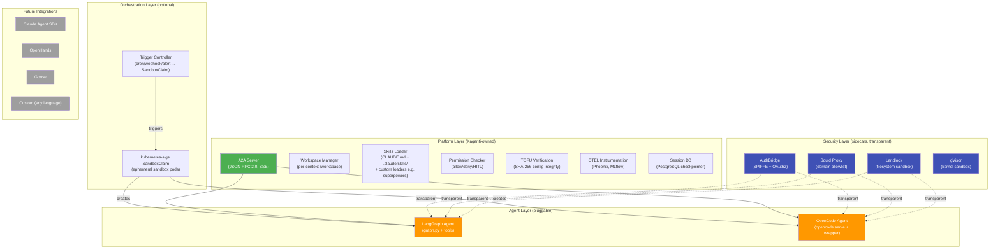
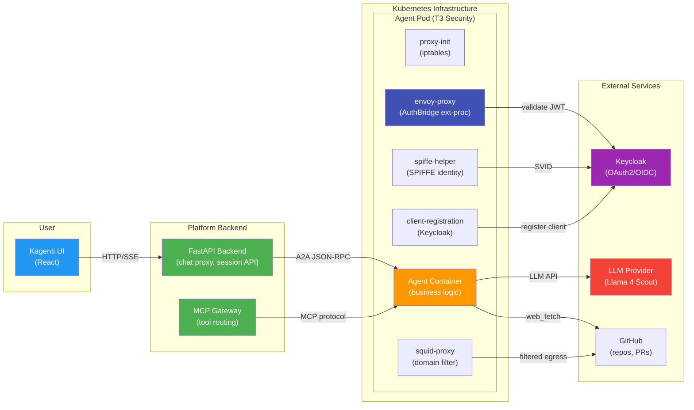
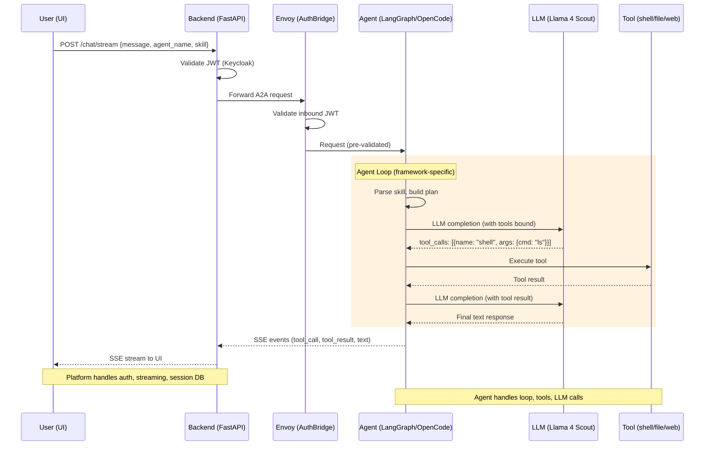
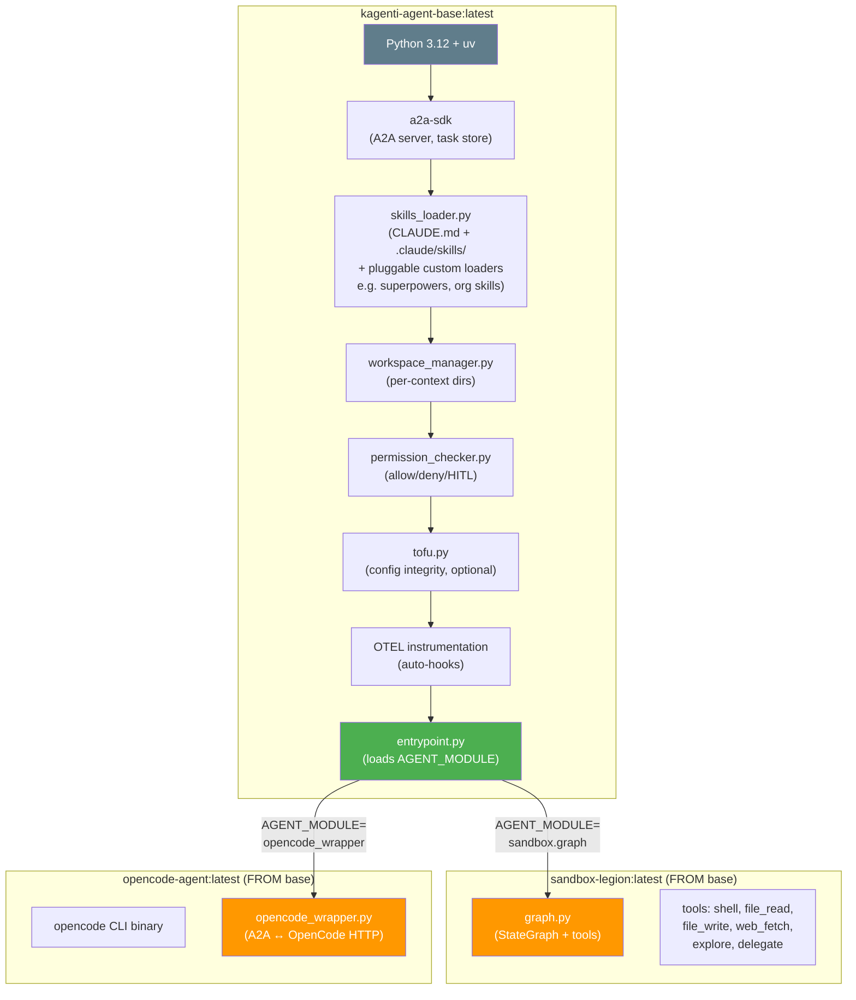
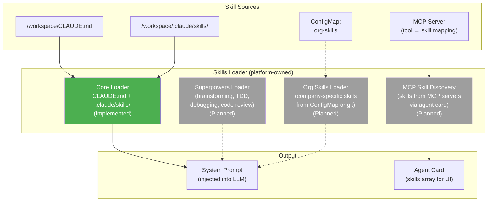
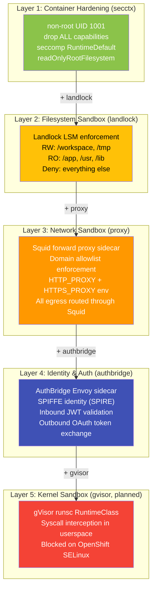
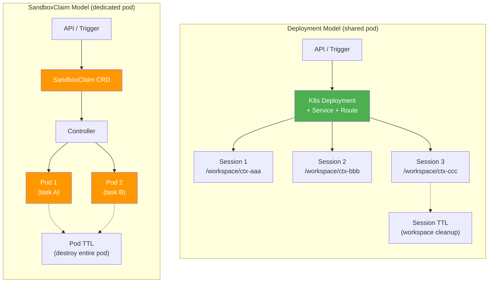
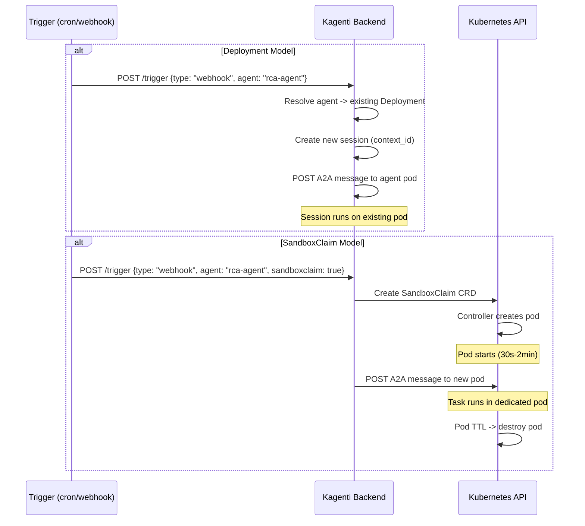
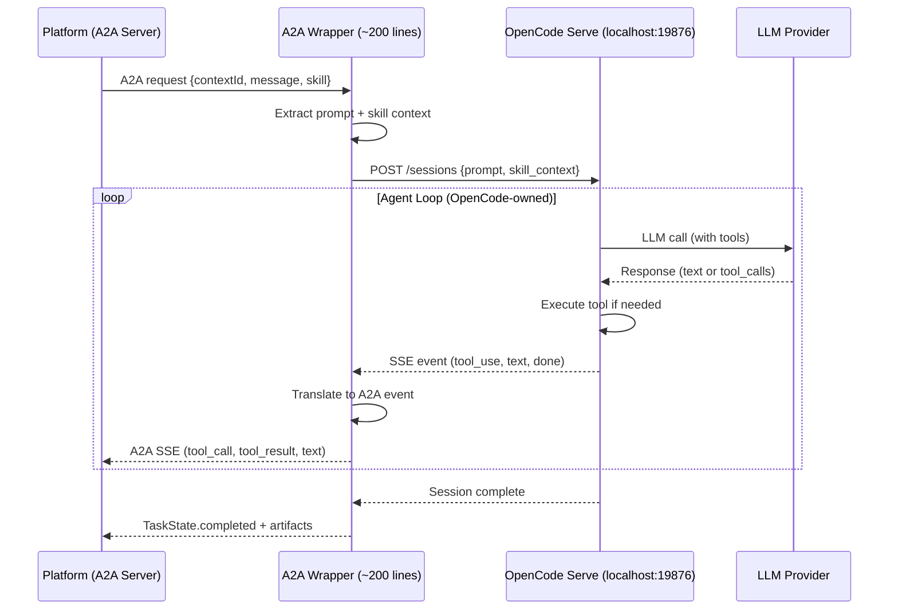

# Platform-Owned Agent Runtime — Design & Architecture

> **Date:** 2026-03-04 (design), 2026-03-09 (current)
> **Status:** Implemented (core), In Progress (sidecars, historical consistency)
> **PR:** #758 (feat/sandbox-agent)

## 1. Vision

Kagenti provides a **framework-neutral agent runtime** where the platform owns
infrastructure (A2A server, auth, security, workspace, observability) and agents
provide only their business logic (graph, tools, LLM calls).

This is validated by deploying **two different agent frameworks** on the same
platform and proving they pass the same tests with the same features.



## 2. Architecture: The A2A Boundary

The A2A protocol is the **hard contract** between platform and agent. Everything
below it is platform infrastructure. Everything above it is agent business logic.



## 3. Request Flow: End-to-End



## 4. Platform Base Image

The platform provides a base container image that handles all infrastructure
concerns. Agents extend it with their framework-specific code.



### Entrypoint Pattern

```python
# entrypoint.py (platform-owned)
import importlib, os

# Agent provides a build_graph() or build_executor() function
module_name = os.environ["AGENT_MODULE"]  # e.g., "sandbox.graph"
agent_module = importlib.import_module(module_name)

# Platform builds the A2A server around it
executor = agent_module.build_executor(
    workspace_manager=workspace_manager,
    permissions_checker=permissions_checker,
    skills_loader=skills_loader,
    sources_config=sources_config,
)

server = A2AStarletteApplication(
    agent_card=agent_module.get_agent_card(host, port),
    http_handler=DefaultRequestHandler(
        agent_executor=executor,
        task_store=PostgresTaskStore(db_url),
    ),
)
uvicorn.run(server.build(), host="0.0.0.0", port=8000)
```

## 4a. Skills Loader: Pluggable Skill Sources

The platform's Skills Loader reads skills from the workspace and injects them
into the agent's system prompt. It supports **pluggable custom loaders** for
organization-specific skill sources, though only the Core Loader is currently
implemented.



**Implementation status:**

1. **Core Loader** (Implemented) -- Reads `CLAUDE.md` + `.claude/skills/` from workspace.
   The `SkillsLoader` class in `deployments/sandbox/skills_loader.py` parses
   skill directories containing `SKILL.md` files, builds a system prompt with
   a skills index, and supports per-skill prompt injection via
   `build_full_prompt_with_skill()`.
2. **Superpowers Loader** (Planned) -- Loads brainstorming, TDD, debugging, code
   review skills from a plugin directory. Custom loader interface not yet defined.
3. **Org Skills Loader** (Planned) -- Loads company-specific skills from K8s ConfigMap
   (e.g., internal coding standards, deployment procedures).
4. **MCP Skill Discovery** (Planned) -- Reads skills from connected MCP servers' tool
   definitions and maps them to the agent card's skills array.

When a user invokes `/rca:ci #758`, the frontend parses the skill name and sends
it in the request body. The platform loads the full skill content and prepends it
to the system prompt before calling the agent's graph.

## 5. Composable Sandboxing

The deployment API allows users to compose sandbox layers independently. Each
layer adds a specific defense without requiring changes to agent code. Layers are
additive -- T3 includes all of T1 and T2.

### 5.1 Sandboxing Layers



| Layer | Toggle | What It Protects Against | Agent Impact |
|-------|--------|-------------------------|-------------|
| **secctx** | `secctx: true` | Privilege escalation, container escape | None -- standard K8s best practice |
| **landlock** | `landlock: true` | Writing outside workspace, reading secrets | PermissionError on forbidden paths |
| **proxy** | `proxy: true` | Data exfiltration, accessing blocked domains | HTTP 403 on blocked domains |
| **authbridge** | (planned) | Unauthorized API calls, identity spoofing | None -- transparent token exchange |
| **gvisor** | (planned) | Kernel exploits, syscall abuse | Blocked on OpenShift SELinux |

### 5.2 Layer Composability

Each layer is an independent toggle in the deployment API. Users can enable
any combination. The self-documenting deployment name reflects active layers:

```
sandbox-legion                              -> T0 (no hardening)
sandbox-legion-secctx                       -> L1 only
sandbox-legion-secctx-landlock              -> L1 + L2
sandbox-legion-secctx-landlock-proxy        -> L1 + L2 + L3
sandbox-legion-secctx-proxy                 -> L1 + L3 (skip landlock)
```

### 5.3 Deployment & Orchestration

Agents can run via two mechanisms. Both support all sandboxing layers, all
agent frameworks, and all trigger types. The choice is a **resource vs
isolation tradeoff**.



#### Deployment Model (shared pod, multi-session)

One pod runs continuously and serves **multiple sessions** concurrently.
Each session gets its own workspace subdirectory (`/workspace/{context_id}/`)
but shares the agent process, container filesystem, and network stack.

**How triggers work with Deployments:**
Triggers (cron, webhook, alert) create a **new session** on the existing
agent deployment via A2A API. The agent is already running -- no pod startup
delay. The session uses the agent's pre-configured sandboxing layers.

**Session TTL:** Sessions within a Deployment have application-level TTL.
The workspace manager cleans up expired session directories and DB records.
The pod itself stays running.

| Aspect | Detail |
|--------|--------|
| **Resource cost** | 1 pod x (500m CPU + 1Gi RAM) regardless of session count |
| **Startup latency** | Zero -- pod already running |
| **Session isolation** | Per-context workspace directories, same process memory |
| **Concurrent sessions** | Unlimited (bounded by pod resources) |
| **Cleanup** | Session TTL cleans workspace dirs + DB records, pod persists |
| **Triggers** | Trigger -> A2A API call -> new session on existing pod |
| **Best for** | Interactive chat, low-latency, shared team agents, development |

**Isolation gap:** Sessions share the same process. A malicious session could
theoretically read another session's memory via LangGraph state. Filesystem
isolation is per-directory but the process has access to all of `/workspace/`.

#### SandboxClaim Model (dedicated pod, full isolation)

Each task gets a **dedicated pod** with its own process, filesystem, and
network namespace. The kubernetes-sigs `SandboxClaim` CRD manages lifecycle.

**Managed lifecycle (not just ephemeral):** SandboxClaims can be:
- **Ephemeral** (TTL-based): pod auto-destroys after configured time
- **API-managed**: backend creates/destroys via K8s API, pod lives until
  explicitly deleted or task completes
- **Persistent**: pod stays until manually destroyed (like a Deployment but
  with SandboxClaim isolation guarantees)

| Aspect | Detail |
|--------|--------|
| **Resource cost** | N pods x (500m CPU + 1Gi RAM) for N concurrent tasks |
| **Startup latency** | 30s-2min (pod scheduling + image pull + init containers) |
| **Session isolation** | Full pod isolation (separate process, fs, network) |
| **Concurrent sessions** | 1 per pod (dedicated resources) |
| **Cleanup** | Pod TTL destroys entire pod + workspace, or API-managed |
| **Triggers** | Trigger -> SandboxClaim CRD -> controller -> new pod |
| **Best for** | Untrusted code, security-sensitive tasks, batch jobs, CI |

#### Comparison Matrix

| | Deployment | SandboxClaim |
|---|:---:|:---:|
| **Resources per session** | Shared (amortized) | Dedicated |
| **Startup time** | 0s | 30s-2min |
| **Process isolation** | Shared process | Separate pods |
| **Filesystem isolation** | Per-directory | Per-pod |
| **Network isolation** | Shared (same pod) | Separate NetworkPolicy |
| **Trigger support** | New session via API | New pod via CRD |
| **Session TTL** | App-level cleanup | Pod-level destruction |
| **Interactive chat** | Low latency | Cold start delay |
| **Concurrent tasks** | Many on one pod | One pod per task |
| **Cost at scale** | O(1) pods | O(N) pods |
| **Sandboxing layers** | All supported | All supported |
| **AuthBridge** | Per-pod identity | Per-pod identity |

#### Hybrid: pod-per-session with Deployment

The **isolation mode** selector offers a middle ground:

```
Isolation Mode:
  shared         -> one pod, multiple sessions (Deployment model)
  pod-per-session -> new pod per session (uses SandboxClaim under the hood)
```

With `pod-per-session`, the Kagenti operator creates a SandboxClaim for each
new session. The user gets the UI experience of a Deployment (click agent,
start chatting) with the isolation guarantees of a SandboxClaim (separate
pod per session).

**Performance tradeoff:** `pod-per-session` has a 30s-2min cold start on
first message (pod scheduling). Subsequent messages in the same session
are fast (pod already running).

#### Trigger Flow for Both Models



**Key:** Both mechanisms use the **same container image** with the **same
sandboxing layers**. The choice is purely about resource consumption vs
isolation strength. All agent frameworks work identically with both.

## 6. Full Platform Component Map

```mermaid
graph TB
    subgraph "Kagenti Platform"
        direction TB

        subgraph "UI Layer"
            UI["Kagenti UI<br/>(React + PatternFly)"]
            SW["SkillWhisperer<br/>(/ autocomplete)"]
            FB["FileBrowser<br/>(pod filesystem)"]
            SG["SessionGraph<br/>(DAG visualization)"]
            ALC["AgentLoopCard<br/>(expandable reasoning)"]
            HITLC["HitlApprovalCard<br/>(approve/deny actions)"]
            SUBP["SubSessionsPanel<br/>(child session nav)"]
            MSUI["ModelSwitcher<br/>(per-session cog popover)"]
        end

        subgraph "Backend Layer"
            API["FastAPI Backend"]
            CHAT["Chat Proxy<br/>(SSE streaming)"]
            SESS["Session API<br/>(history aggregation)"]
            DEPLOY["Deploy API<br/>(manifest builder)"]
            FILES["Files API<br/>(pod exec)"]
            TRIG["Trigger API<br/>(cron/webhook)"]
            TOKAPI["Token Usage API<br/>(LiteLLM spend proxy)"]
            MODAPI["Models API<br/>(LiteLLM model list, cached)"]
        end

        subgraph "Sidecar Agents (in-process)"
            SMGR["SidecarManager<br/>(lifecycle, event queues)"]
            LOOP["Looper<br/>(auto-continue kicker)"]
            HALL["Hallucination Observer<br/>(fake path detection)"]
            CGUARD["Context Guardian<br/>(token usage monitoring)"]
        end

        subgraph "Gateway Layer"
            MCPGW["MCP Gateway<br/>(tool routing)"]
            AIGW["AI Gateway<br/>(model routing)"]
            GWPOL["Gateway Policies<br/>(rate limits)"]
        end

        subgraph "Infrastructure Layer"
            KC["Keycloak<br/>(OAuth2/OIDC)"]
            SPIRE["SPIRE<br/>(workload identity)"]
            ISTIO["Istio Ambient<br/>(mTLS mesh)"]
            SHIP["Shipwright<br/>(container builds)"]
            PHX["Phoenix<br/>(LLM observability)"]
            OTELC["OTEL Collector<br/>(trace pipeline)"]
            MLF["MLflow<br/>(experiment tracking)"]
            LITE["LiteLLM Proxy<br/>(model routing, spend tracking)"]
        end

        subgraph "Operator Layer"
            OP["Kagenti Operator<br/>(CRD controller)"]
            WH["Mutating Webhook<br/>(AuthBridge injection)"]
        end
    end

    subgraph "Agent Pods (namespace: team1)"
        SL["sandbox-legion<br/>(LangGraph)"]
        SB["sandbox-basic<br/>(LangGraph, no persist)"]
        SH["sandbox-hardened<br/>(T2 security)"]
        SR["sandbox-restricted<br/>(T3 security)"]
        OCA["opencode-agent<br/>(OpenCode serve)"]
        WS["weather-service<br/>(MCP tools)"]
    end

    UI --> API
    API --> CHAT
    API --> SESS
    API --> DEPLOY
    API --> FILES
    API --> TRIG
    API --> TOKAPI
    API --> MODAPI

    CHAT -->|"A2A"| SL
    CHAT -->|"A2A"| OCA
    CHAT -->|"A2A"| WS
    CHAT -->|"events"| SMGR
    SMGR --> LOOP
    SMGR --> HALL
    SMGR --> CGUARD
    MCPGW -->|"MCP"| WS
    WH -->|"inject sidecars"| SL
    WH -->|"inject sidecars"| OCA
    OP -->|"manage CRDs"| SL
    OTELC --> PHX
    OTELC --> MLF
    TOKAPI --> LITE
    MODAPI --> LITE

    style UI fill:#2196F3,color:white
    style API fill:#4CAF50,color:white
    style MCPGW fill:#4CAF50,color:white
    style KC fill:#9C27B0,color:white
    style SL fill:#FF9800,color:white
    style OCA fill:#FF9800,color:white
    style OP fill:#607D8B,color:white
    style WH fill:#3F51B5,color:white
    style SMGR fill:#00897B,color:white
    style LITE fill:#E91E63,color:white
```



## 7. A2A Wrapper Pattern for Non-Native Agents



## 8. Validation Plan

### Phase 1: Platform Base Image

```
Files to create:
  deployments/sandbox/platform_base/
  ├── Dockerfile.base          # Platform base image
  ├── entrypoint.py            # Plugin loader (AGENT_MODULE)
  ├── requirements.txt         # a2a-sdk, langchain, otel
  └── test_entrypoint.py       # Unit tests
```

### Phase 2: Sandbox Legion on Platform Base

```
Changes:
  - Extract graph.py from agent-examples container into deployments/sandbox/
  - Create Dockerfile.legion (FROM kagenti-agent-base)
  - Set AGENT_MODULE=sandbox_agent.graph
  - Build + deploy on isolated cluster
  - Run existing 192 Playwright tests -> must pass
```

### Phase 3: OpenCode on Platform Base

```
Files to create:
  deployments/sandbox/opencode/
  ├── Dockerfile.opencode      # FROM base + opencode binary
  ├── opencode_wrapper.py      # A2A <-> OpenCode HTTP adapter
  └── test_wrapper.py          # Unit tests

Deploy as new variant -> run Playwright tests
```

### Phase 4: Feature Parity Matrix

| Feature | Test File | Legion | OpenCode |
|---------|-----------|:------:|:--------:|
| A2A agent card | agent-catalog.spec.ts | Yes | Yes |
| Chat streaming | sandbox-sessions.spec.ts | Yes | Yes |
| Tool execution | sandbox-walkthrough.spec.ts | Yes | Yes |
| File browser | sandbox-file-browser.spec.ts | Yes | Yes |
| Session persist | sandbox-sessions.spec.ts | Yes | Yes |
| HITL approval | sandbox-hitl.spec.ts | Yes | Yes |
| Security tiers | sandbox-variants.spec.ts | Yes | Yes |
| Skills loading | agent-rca-workflow.spec.ts | Yes | Yes |
| Multi-user auth | agent-chat-identity.spec.ts | Yes | Yes |

## 9. Agent Deployment API

The deployment API (`sandbox_deploy.py`) is an API-driven Kubernetes manifest
builder. Rather than a step-by-step UI wizard, it exposes a single
`POST /sandbox/{namespace}/deploy` endpoint that accepts a `SandboxCreateRequest`
body and generates the full Deployment + Service + Route manifests.

The request body captures all configuration dimensions:

| Field Group | Fields | Purpose |
|-------------|--------|---------|
| **Source** | `name`, `repo`, `branch`, `context_dir`, `base_agent` | Agent identity and git source |
| **Security** | `secctx`, `landlock`, `proxy`, `gvisor`, `proxy_domains` | Composable sandbox layers (boolean toggles) |
| **Model** | `model`, `llm_api_key`, `llm_key_source`, `llm_secret_name` | LLM provider configuration |
| **Lifecycle** | `isolation_mode` (shared/pod-per-session), `managed_lifecycle`, `ttl_hours` | Deployment vs SandboxClaim |
| **Persistence** | `enable_persistence`, `workspace_size` | PostgreSQL session store and PVC size |
| **Skills** | `skill_packs` | Skill pack names from skill-packs.yaml |

The `SandboxProfile` class (from `deployments/sandbox/sandbox_profile.py`)
translates security toggles into Kubernetes pod spec patches. The deployment
name is self-documenting and reflects active layers
(e.g., `sandbox-legion-secctx-landlock-proxy`).

## 10. MAAS Model Compatibility

Tested 2026-03-03 on Red Hat AI Services:

| Model | tool_choice=auto | Recommended For |
|-------|:----------------:|-----------------|
| **Llama 4 Scout 17B-16E** (109B MoE) | 10/10 | Tool-calling agents (default) |
| Mistral Small 3.1 24B | 0/10 | Chat-only (no structured tool_calls with auto) |
| DeepSeek R1 Qwen 14B | No | Reasoning tasks (no tool support) |
| Llama 3.2 3B | No | Too small for function calling |

All clusters use **Llama 4 Scout** for sandbox agents, routed through
LiteLLM proxy.

## 11. Streaming and Chat Architecture

The platform uses a hybrid streaming architecture: real-time SSE during active
requests, with polling fallback for idle sessions.

### SSE Streaming (active requests)

The `POST /chat/stream` endpoint opens a request-scoped SSE connection that
remains active for the duration of the agent's A2A response. The backend SSE
proxy (`_proxy_agent_sse` in `sandbox.py`) performs several transformations:

1. **Parses JSON lines** from the agent's raw SSE stream
2. **Detects `loop_id`** fields and wraps events in `loop_event` envelopes
3. **Forwards events** to the frontend in real-time
4. **Captures loop events** for persistence (new-type events only, excluding
   legacy `llm_response` duplicates)

The SSE connection closes when the agent completes or errors. There is no
persistent SSE connection per session.

### Polling Fallback (idle sessions)

A 5-second `setInterval` in `SandboxPage.tsx` polls
`GET /sessions/{id}/history` with `limit: 5` when:
- A `contextId` is set (session is active)
- `isStreaming` is false (no active SSE connection)

Polling deduplicates messages by their `_index` field.

### Historical Load

`GET /sessions/{id}/history` supports pagination via `limit` and `offset`
parameters. It returns message history from the tasks table alongside
`loop_events` from task metadata, enabling full frontend reconstruction
of AgentLoopCard components on session reload.

### Loop Event Persistence

Loop events are persisted to task metadata in a `finally` block within the
SSE proxy generator. This atomic write ensures events are saved even if the
stream is interrupted. The persistence combines agent name metadata and
loop events into a single DB update to avoid race conditions.

### Frontend Reconstruction

On session reload, the frontend iterates persisted `loop_events` from the
history response and reconstructs `AgentLoop` objects using the same state
reducer as the live SSE handler. This enables AgentLoopCard rendering for
historical sessions.

### Future: WebSocket Upgrade

A WebSocket design exists for multi-user session updates and delegation
callbacks. See [WebSocket / SSE Session Updates Design](2026-03-06-websocket-session-updates-design.md).

## 12. Event Pipeline

The agent event pipeline provides typed, structured events from graph nodes
through to the frontend.

### Pipeline stages

```
Agent graph node (planner, executor, reflector, reporter)
  -> event_serializer.py (LangGraphSerializer)
    -> Backend SSE proxy (sandbox.py: _proxy_agent_sse)
      -> Frontend SSE handler (SandboxPage.tsx)
        -> AgentLoop state reducer
          -> AgentLoopCard render
```

### Event types

The `LangGraphSerializer` emits distinct event types per graph node:

| Graph Node | Event Type(s) | Content |
|------------|---------------|---------|
| `planner` | `plan` | Plan steps array, iteration number, reasoning text |
| `executor` | `plan_step`, `tool_call`, `tool_result` | Step index, tool invocations, tool outputs |
| `reflector` | `reflection` | Done flag, current step, assessment text |
| `reporter` | `llm_response` (with `loop_id`) | Final answer text |
| (any node) | `budget_update` | Token usage, wall clock time |
| (HITL) | `hitl_request` | Command needing approval, reason |

### Legacy compatibility

Legacy event types (`llm_response` for all nodes) are still emitted for backward
compatibility. The frontend deduplicates: when typed events with `loop_id` are
present, flat events are suppressed entirely via the `session_has_loops` flag
in the SSE proxy.

### Backend SSE proxy behavior

The proxy in `sandbox.py` performs line-by-line JSON parsing of the agent's
status messages. For each parsed event:
- If it contains a `loop_id`, it wraps the event in a `loop_event` envelope
- New-type events (non-legacy) are accumulated in a `loop_events` list
- Legacy types (`llm_response`, `tool_call`, `tool_result` without `loop_id`)
  are passed through only if no loop events have been seen in the session

### Persistence

Only new-type events are persisted to task metadata. The `loop_events` list
is written via an atomic `UPDATE tasks SET metadata = ...` in the SSE proxy's
`finally` block, merged with existing metadata (agent name, visibility) to
prevent overwrites.

## 13. Sidecar Agents

Sidecar agents are **in-process asyncio tasks** (not separate Kubernetes pods)
that run alongside sandbox sessions. They observe parent session events and
can intervene when problems are detected.

### Architecture

The `SidecarManager` (singleton in `kagenti/backend/app/services/sidecar_manager.py`)
manages sidecar lifecycle:

- **Registry:** `Dict[parent_context_id, Dict[SidecarType, SidecarHandle]]`
- **Event queues:** Per-session `asyncio.Queue` (maxsize 1000), filled by `fan_out_event()`
- **Lifecycle:** `enable()` spawns an `asyncio.Task`, `disable()` cancels it, `cleanup_session()` tears down all sidecars for a session

### Sidecar types

| Sidecar | Analyzer | Behavior |
|---------|----------|----------|
| **Looper** | `LooperAnalyzer` | Auto-continue kicker. Drains event queue, checks if agent turn completed, sends "continue" via A2A. Respects configurable counter limit; when limit reached, emits HITL observation or auto-resets (if `auto_approve` is true). |
| **Hallucination Observer** | `HallucinationAnalyzer` | SSE-driven. Validates file paths and API references in agent output against the workspace filesystem. Emits observations when suspect paths are detected. |
| **Context Guardian** | `ContextGuardianAnalyzer` | SSE-driven. Tracks token usage trajectory against configurable thresholds (`warn_threshold_pct`, `critical_threshold_pct`). Emits warning/critical observations and can trigger HITL approval for intervention. |

### Looper auto-continue mechanism

When the looper decides to auto-continue, it creates a **child session** via
A2A `message/send` with a new `context_id` and `parent_context_id` in metadata.
This keeps iterations visible in the sub-sessions panel without polluting the
parent session's context. The looper retries metadata writes (up to 5 attempts)
because the task row may not exist immediately after the A2A call.

### REST API

The sidecar REST API (`/sandbox/{namespace}/sessions/{context_id}/sidecars/...`)
provides endpoints for:
- `GET .../sidecars` -- list all sidecars for a session
- `POST .../sidecars/{type}/enable` -- spawn sidecar task
- `POST .../sidecars/{type}/disable` -- cancel sidecar task
- `PUT .../sidecars/{type}/config` -- hot-reload config
- `POST .../sidecars/{type}/reset` -- disable + re-enable (fresh analyzer)
- `GET .../sidecars/{type}/observations` -- SSE stream of observations
- `POST .../sidecars/{type}/approve/{msg_id}` -- approve HITL intervention
- `POST .../sidecars/{type}/deny/{msg_id}` -- deny HITL intervention

### UI

Compact accordion panel with per-sidecar tabs, enable/disable toggles,
auto-approve/HITL switches, and observation streams. The looper shows
iteration progress as `2/5` with a mini progress bar.

### Known issues

- Looper auto-continue is non-functional: SSE observations endpoint returns
  401 (auth not forwarded to sidecar SSE endpoint), and `fan_out_event` is
  not reliably triggering the looper's event queue
- A2A message injection (corrective messages into parent session) is stubbed
  (`approve_intervention` logs but does not inject)
- Heartbeat observations needed for test verification

## 14. Agent Loop UI

The agent loop UI renders structured reasoning events as expandable cards
instead of flat chat bubbles.

### AgentLoopCard

Each agent response renders as a single `AgentLoopCard`:
- **Final answer** (markdown) always visible at top
- **"Show reasoning" toggle** expands `LoopSummaryBar` + `LoopDetail`
- During streaming: auto-expanded (live progress). After completion: auto-collapsed.
- On history reload: all collapsed.

### LoopSummaryBar

Single-row summary displaying:
- Status icon (spinner during execution, check/cross on completion)
- Tool count, token count (formatted as "1.2k"), status text
- `ModelBadge` showing the LLM model used
- Duration in seconds
- Expand/collapse toggle

### Node type styling

Steps within the `LoopDetail` carry visual badges by event type:

| Event Type | Node | Color |
|------------|------|-------|
| `planner_output` | Planner | Blue |
| `executor_step` | Executor | Green |
| `reflector_decision` | Reflector | Orange |
| `reporter_output` | Reporter | Purple |

### Per-step token display

Each `AgentLoopStep` carries `tokens: { prompt, completion }` for per-step
token accounting. The `LoopSummaryBar` sums tokens across all steps and
displays the total alongside a `ModelBadge`.

### HITL approval

When the agent emits a `hitl_request` event, the `HitlApprovalCard` component
renders an interactive card with the command needing approval, the reason, and
Approve/Deny buttons. Once actioned, buttons are replaced with a status label.

## 15. Session Management

### Agent name resolution

`_resolve_agent_name()` in `sandbox.py` is the **single source of truth** for
determining which agent owns a session. For new sessions (no existing
`session_id`), it uses the `request_agent` field. For existing sessions, it
queries the tasks table for the DB-bound agent name, ensuring sessions remain
pinned to their original agent even if the request specifies a different one.

### Metadata merge

Session metadata is written atomically via a JSON merge pattern: the SSE proxy's
`finally` block reads existing metadata, merges in new fields (`agent_name`,
`visibility`, `loop_events`), and writes back in a single `UPDATE`. This prevents
race conditions between `_set_owner_metadata()` and loop event persistence.

### Sub-sessions

Delegation and looper auto-continue create child sessions with
`parent_context_id` in their task metadata. The `SubSessionsPanel` component
queries for child sessions via `getChildSessions(namespace, contextId)` and
renders them with status badges (green=completed, blue=working, red=failed).
Clicking a child session navigates to it.

## 16. LiteLLM Integration

LiteLLM proxy serves as the model routing layer for all sandbox agents.

### Model proxy

`GET /api/v1/models` (in `models.py`) proxies the LiteLLM `/models` endpoint
with a 5-minute in-memory cache. Returns an OpenAI-compatible list of available
model IDs.

### Token usage

`GET /api/v1/token-usage/sessions/{id}` (in `token_usage.py`) queries LiteLLM's
`/spend/logs` endpoint by `request_id`. Request IDs are stored in session task
metadata as `llm_request_ids`. The endpoint aggregates spend per model and
returns prompt/completion token counts and cost.

`GET /api/v1/token-usage/sessions/{id}/tree` extends this to session trees:
it queries child sessions (by `parent_context_id` in metadata) and merges
their usage into an aggregate.

### Model switcher

The `ModelSwitcher` component renders as a cog icon popover in the session
header. It fetches available models from the models API, displays them in a
`Select` dropdown, and fires `onModelChange` to apply a per-session model
override.

### Helm configuration

The backend reads `LITELLM_API_KEY` from a Kubernetes secret:
```yaml
- name: LITELLM_API_KEY
  valueFrom:
    secretKeyRef:
      name: litellm-proxy-secret
      key: master-key
      optional: true
```

`LITELLM_BASE_URL` defaults to `http://litellm-proxy.kagenti-system.svc:4000`.

## 17. Testing Architecture

### E2E test suites

The platform has 10 core E2E tests across 5 suites, executed in parallel with
4 Playwright workers (~1.5 minutes total):

| Test File | Tests | Coverage |
|-----------|-------|----------|
| `sandbox-sessions.spec.ts` | 3 | Session isolation, state leak prevention, persistence across reload |
| `sandbox-walkthrough.spec.ts` | 1 | Full user journey (create, chat, tools, file browser) |
| `sandbox-variants.spec.ts` | 4 | Multi-turn with tool calls across all 4 agent variants (legion, hardened, basic, restricted) |
| `agent-rca-workflow.spec.ts` | 1 | RCA agent end-to-end with skill invocation and loop verification |
| `sandbox-delegation.spec.ts` | 1 | Delegate tool spawns child session, renders in sidebar |

### Additional test suites

| Test File | Purpose | Status |
|-----------|---------|--------|
| `agent-loop-consistency.spec.ts` | Validates streaming vs historical reconstruction match | In progress (known divergence on step 5 of root cause chain) |
| `agent-resilience.spec.ts` | Validates recovery after agent pod restart mid-request | Implemented |
| `sandbox-sidecars.spec.ts` | Sidecar agent lifecycle and observations | Implemented |
| `sandbox-hitl.spec.ts` | HITL approval workflow | Implemented |

### Unit tests

94 unit tests across the `deployments/sandbox/` directory cover sandbox profile
generation, skill pack loading, repo management, agent server, triggers, nono
launcher, TOFU verification, and entrypoint loading.

### PatternFly testing workarounds

Two patterns address PatternFly component limitations in Playwright:
- **`pressSequentially`** for `TextInput`: PatternFly's controlled inputs
  require character-by-character input instead of `fill()` to trigger
  React's change handlers correctly
- **`Promise.race`** for hangs: Some PatternFly interactions (particularly
  dropdowns and popovers) can cause Playwright to hang waiting for
  navigation; `Promise.race` with a timeout prevents test deadlocks

## 18. Success Criteria

The platform agent runtime is complete when:
1. Platform base image builds and passes unit tests
2. Sandbox Legion deploys FROM base and passes Playwright tests
3. OpenCode deploys FROM base and passes core chat/session tests
4. Both agents work with AuthBridge (if deployed on T3)
5. Feature parity matrix shows identical platform feature coverage
6. Documentation updated with deployment instructions

## 19. Cross-References

| Document | Content |
|----------|---------|
| [Agent Loop UI Design](2026-03-03-agent-loop-ui-design.md) | AgentLoopCard, LoopSummaryBar, node badges, HITL approval card |
| [Sandbox Reasoning Loop Design](2026-03-03-sandbox-reasoning-loop-design.md) | Graph nodes, event types, budget, HITL checkpoints |
| [WebSocket Session Updates Design](2026-03-06-websocket-session-updates-design.md) | Polling baseline, WebSocket proposal, SSE alternative |
| [Sidecar Agents Design](2026-03-06-sidecar-agents-design.md) | Sidecar architecture, analyzer patterns, UI accordion |
| [LiteLLM Analytics Design](2026-03-08-litellm-analytics-design.md) | Token usage panels, model routing, cost tracking |
