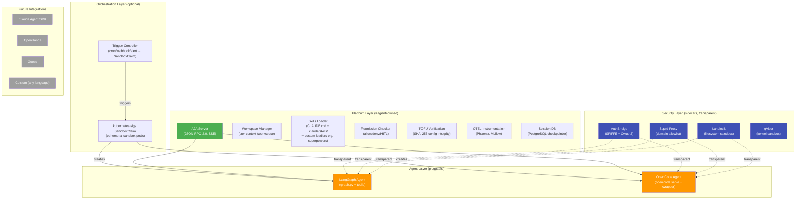
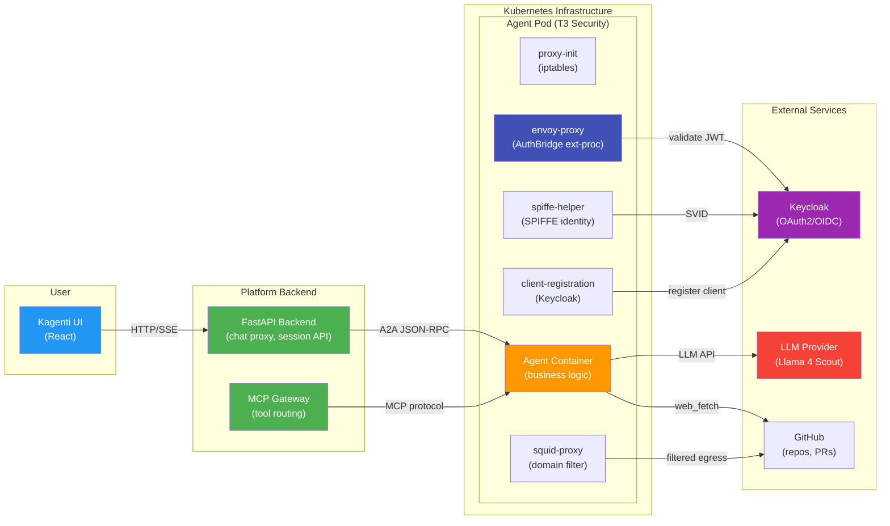
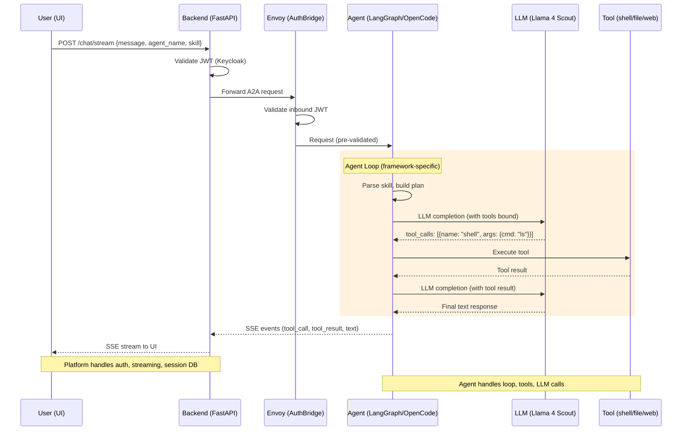
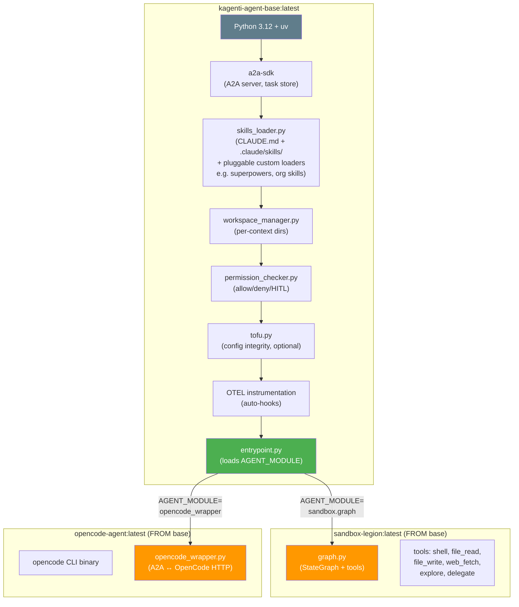
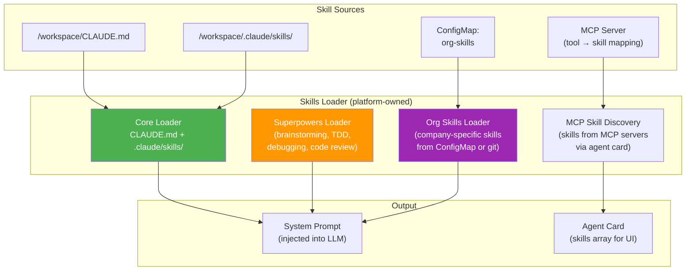
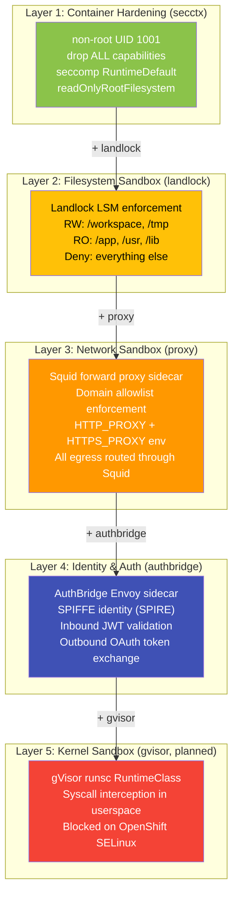
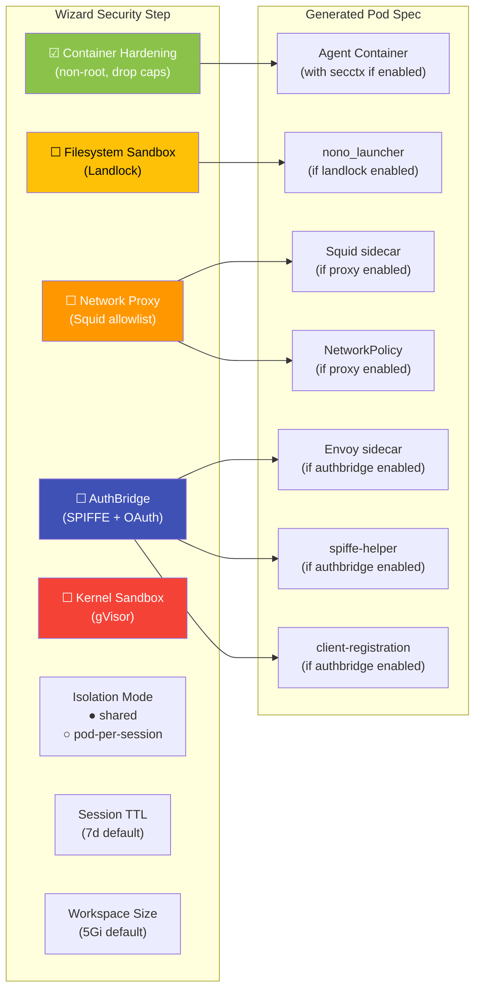
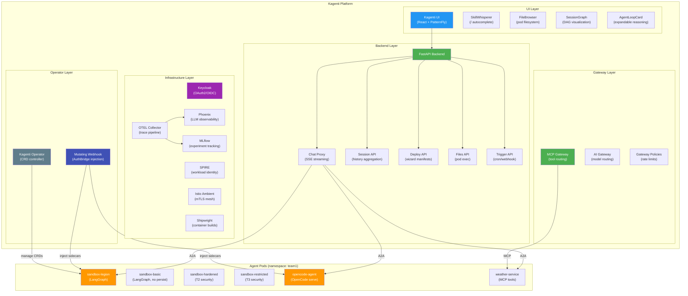
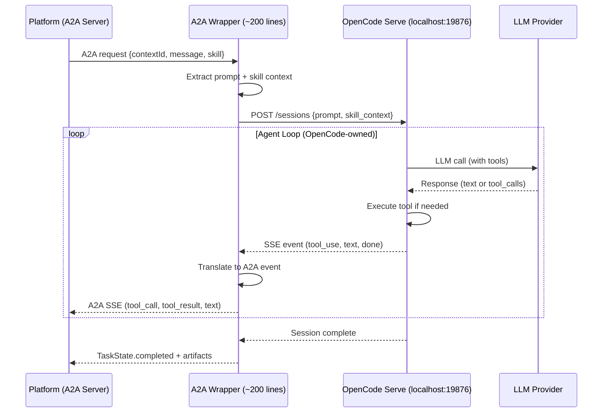
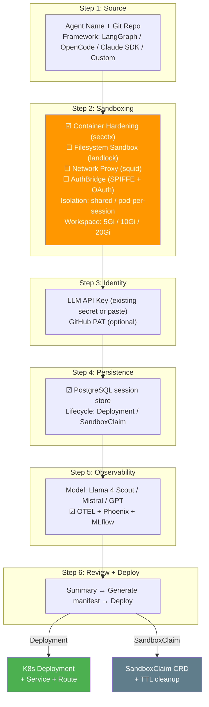

# Platform-Owned Agent Runtime — Design & Implementation Plan

> **Date:** 2026-03-04
> **Author:** Session G (design), Session N (implementation)
> **Status:** Ready for Implementation
> **PR:** #758 (feat/sandbox-agent)
> **Cluster:** Isolated HyperShift (to be created)

## 1. Vision

Kagenti provides a **framework-neutral agent runtime** where the platform owns
infrastructure (A2A server, auth, security, workspace, observability) and agents
provide only their business logic (graph, tools, LLM calls).

This is validated by deploying **two different agent frameworks** on the same
platform and proving they pass the same tests with the same features.



## 2. Architecture: The A2A Boundary

The A2A protocol is the **hard contract** between platform and agent. Everything
below it is platform infrastructure. Everything above it is agent business logic.



## 3. Request Flow: End-to-End



## 4. Platform Base Image

The platform provides a base container image that handles all infrastructure
concerns. Agents extend it with their framework-specific code.



### Entrypoint Pattern

```python
# entrypoint.py (platform-owned)
import importlib, os

# Agent provides a build_graph() or build_executor() function
module_name = os.environ["AGENT_MODULE"]  # e.g., "sandbox.graph"
agent_module = importlib.import_module(module_name)

# Platform builds the A2A server around it
executor = agent_module.build_executor(
    workspace_manager=workspace_manager,
    permissions_checker=permissions_checker,
    skills_loader=skills_loader,
    sources_config=sources_config,
)

server = A2AStarletteApplication(
    agent_card=agent_module.get_agent_card(host, port),
    http_handler=DefaultRequestHandler(
        agent_executor=executor,
        task_store=PostgresTaskStore(db_url),
    ),
)
uvicorn.run(server.build(), host="0.0.0.0", port=8000)
```

## 4a. Skills Loader: Pluggable Skill Sources

The platform's Skills Loader reads skills from the workspace and injects them
into the agent's system prompt. It supports **pluggable custom loaders** for
organization-specific skill sources.



**How it works:**

1. **Core loader** — Reads `CLAUDE.md` + `.claude/skills/` from workspace (always active)
2. **Superpowers loader** — Loads brainstorming, TDD, debugging, code review skills
   from a plugin directory (Session M adding custom loader support)
3. **Org skills loader** — Loads company-specific skills from K8s ConfigMap
   (e.g., internal coding standards, deployment procedures)
4. **MCP skill discovery** — Reads skills from connected MCP servers' tool
   definitions and maps them to the agent card's skills array

When a user invokes `/rca:ci #758`, the frontend parses the skill name and sends
it in the request body. The platform loads the full skill content and prepends it
to the system prompt before calling the agent's graph.

## 5. Composable Sandboxing

The wizard allows users to compose sandbox layers independently. Each layer
adds a specific defense without requiring changes to agent code. Layers are
additive — T3 includes all of T1 and T2.

### 5.1 Sandboxing Layers



| Layer | Toggle | What It Protects Against | Agent Impact |
|-------|--------|-------------------------|-------------|
| **secctx** | `☑ Container Hardening` | Privilege escalation, container escape | None — standard K8s best practice |
| **landlock** | `☑ Filesystem Sandbox` | Writing outside workspace, reading secrets | PermissionError on forbidden paths |
| **proxy** | `☑ Network Proxy` | Data exfiltration, accessing blocked domains | HTTP 403 on blocked domains |
| **authbridge** | `☑ AuthBridge` | Unauthorized API calls, identity spoofing | None — transparent token exchange |
| **gvisor** | `☑ Kernel Sandbox` | Kernel exploits, syscall abuse | Planned — blocked on OpenShift |

### 5.2 Wizard Composability

The wizard presents each layer as an independent toggle. Users can enable
any combination. The self-documenting deployment name reflects active layers:

```
sandbox-legion                              → T0 (no hardening)
sandbox-legion-secctx                       → L1 only
sandbox-legion-secctx-landlock              → L1 + L2
sandbox-legion-secctx-landlock-proxy        → L1 + L2 + L3
sandbox-legion-secctx-proxy                 → L1 + L3 (skip landlock)
```



### 5.3 Deployment & Orchestration

Agents can run via two mechanisms. Both support all sandboxing layers, all
agent frameworks, and all trigger types. The choice is a **resource vs
isolation tradeoff**.


#### Deployment Model (shared pod, multi-session)

One pod runs continuously and serves **multiple sessions** concurrently.
Each session gets its own workspace subdirectory (`/workspace/{context_id}/`)
but shares the agent process, container filesystem, and network stack.

**How triggers work with Deployments:**
Triggers (cron, webhook, alert) create a **new session** on the existing
agent deployment via A2A API. The agent is already running — no pod startup
delay. The session uses the agent's pre-configured sandboxing layers.

**Session TTL:** Sessions within a Deployment have application-level TTL.
The workspace manager cleans up expired session directories and DB records.
The pod itself stays running.

| Aspect | Detail |
|--------|--------|
| **Resource cost** | 1 pod × (500m CPU + 1Gi RAM) regardless of session count |
| **Startup latency** | Zero — pod already running |
| **Session isolation** | Per-context workspace directories, same process memory |
| **Concurrent sessions** | Unlimited (bounded by pod resources) |
| **Cleanup** | Session TTL cleans workspace dirs + DB records, pod persists |
| **Triggers** | Trigger → A2A API call → new session on existing pod |
| **Best for** | Interactive chat, low-latency, shared team agents, development |

**Isolation gap:** Sessions share the same process. A malicious session could
theoretically read another session's memory via LangGraph state. Filesystem
isolation is per-directory but the process has access to all of `/workspace/`.

#### SandboxClaim Model (dedicated pod, full isolation)

Each task gets a **dedicated pod** with its own process, filesystem, and
network namespace. The kubernetes-sigs `SandboxClaim` CRD manages lifecycle.

**Managed lifecycle (not just ephemeral):** SandboxClaims can be:
- **Ephemeral** (TTL-based): pod auto-destroys after configured time
- **API-managed**: backend creates/destroys via K8s API, pod lives until
  explicitly deleted or task completes
- **Persistent**: pod stays until manually destroyed (like a Deployment but
  with SandboxClaim isolation guarantees)

| Aspect | Detail |
|--------|--------|
| **Resource cost** | N pods × (500m CPU + 1Gi RAM) for N concurrent tasks |
| **Startup latency** | 30s–2min (pod scheduling + image pull + init containers) |
| **Session isolation** | Full pod isolation (separate process, fs, network) |
| **Concurrent sessions** | 1 per pod (dedicated resources) |
| **Cleanup** | Pod TTL destroys entire pod + workspace, or API-managed |
| **Triggers** | Trigger → SandboxClaim CRD → controller → new pod |
| **Best for** | Untrusted code, security-sensitive tasks, batch jobs, CI |

**Isolation advantage:** Each task runs in a completely separate pod. No
shared memory, no shared filesystem, separate network namespace. Combined
with Landlock + Squid, this provides defense-in-depth even if the agent
process is compromised.

#### Comparison Matrix

| | Deployment | SandboxClaim |
|---|:---:|:---:|
| **Resources per session** | Shared (amortized) | Dedicated |
| **Startup time** | 0s | 30s–2min |
| **Process isolation** | ❌ Shared process | ✅ Separate pods |
| **Filesystem isolation** | ⚠️ Per-directory | ✅ Per-pod |
| **Network isolation** | ⚠️ Shared (same pod) | ✅ Separate NetworkPolicy |
| **Trigger support** | ✅ New session via API | ✅ New pod via CRD |
| **Session TTL** | ✅ App-level cleanup | ✅ Pod-level destruction |
| **Interactive chat** | ✅ Low latency | ⚠️ Cold start delay |
| **Concurrent tasks** | ✅ Many on one pod | ⚠️ One pod per task |
| **Cost at scale** | ✅ O(1) pods | ⚠️ O(N) pods |
| **Sandboxing layers** | ✅ All supported | ✅ All supported |
| **AuthBridge** | ✅ Per-pod identity | ✅ Per-pod identity |

#### Hybrid: pod-per-session with Deployment

The wizard's **isolation mode** selector offers a middle ground:

```
Isolation Mode:
  ● shared         → one pod, multiple sessions (Deployment model)
  ○ pod-per-session → new pod per session (uses SandboxClaim under the hood)
```

With `pod-per-session`, the Kagenti operator creates a SandboxClaim for each
new session. The user gets the UI experience of a Deployment (click agent,
start chatting) with the isolation guarantees of a SandboxClaim (separate
pod per session).

**Performance tradeoff:** `pod-per-session` has a 30s–2min cold start on
first message (pod scheduling). Subsequent messages in the same session
are fast (pod already running). The wizard should warn about this delay.

#### Trigger Flow for Both Models


**Key:** Both mechanisms use the **same container image** with the **same
sandboxing layers**. The choice is purely about resource consumption vs
isolation strength. All agent frameworks work identically with both.

## 6. Full Platform Component Map



## 7. A2A Wrapper Pattern for Non-Native Agents



## 8. Validation Plan

### Phase 1: Platform Base Image

```
Files to create:
  deployments/sandbox/platform_base/
  ├── Dockerfile.base          # Platform base image
  ├── entrypoint.py            # Plugin loader (AGENT_MODULE)
  ├── requirements.txt         # a2a-sdk, langchain, otel
  └── test_entrypoint.py       # Unit tests
```

### Phase 2: Sandbox Legion on Platform Base

```
Changes:
  - Extract graph.py from agent-examples container into deployments/sandbox/
  - Create Dockerfile.legion (FROM kagenti-agent-base)
  - Set AGENT_MODULE=sandbox_agent.graph
  - Build + deploy on isolated cluster
  - Run existing 192 Playwright tests → must pass
```

### Phase 3: OpenCode on Platform Base

```
Files to create:
  deployments/sandbox/opencode/
  ├── Dockerfile.opencode      # FROM base + opencode binary
  ├── opencode_wrapper.py      # A2A ↔ OpenCode HTTP adapter
  └── test_wrapper.py          # Unit tests

Deploy as new variant → run Playwright tests
```

### Phase 4: Feature Parity Matrix

| Feature | Test File | Legion | OpenCode |
|---------|-----------|:------:|:--------:|
| A2A agent card | agent-catalog.spec.ts | ✓ | ✓ |
| Chat streaming | sandbox-sessions.spec.ts | ✓ | ✓ |
| Tool execution | sandbox-walkthrough.spec.ts | ✓ | ✓ |
| File browser | sandbox-file-browser.spec.ts | ✓ | ✓ |
| Session persist | sandbox-sessions.spec.ts | ✓ | ✓ |
| HITL approval | sandbox-hitl.spec.ts | ✓ | ✓ |
| Security tiers | sandbox-variants.spec.ts | ✓ | ✓ |
| Skills loading | agent-rca-workflow.spec.ts | ✓ | ✓ |
| Multi-user auth | agent-chat-identity.spec.ts | ✓ | ✓ |

## 9. Agent Wizard Integration

The wizard composes the full deployment from 6 steps:



## 10. MAAS Model Compatibility

Tested 2026-03-03 on Red Hat AI Services:

| Model | tool_choice=auto | Recommended For |
|-------|:----------------:|-----------------|
| **Llama 4 Scout 17B-16E** (109B MoE) | ✅ 10/10 | Tool-calling agents (default) |
| Mistral Small 3.1 24B | ❌ 0/10 | Chat-only (no structured tool_calls with auto) |
| DeepSeek R1 Qwen 14B | ❌ | Reasoning tasks (no tool support) |
| Llama 3.2 3B | ❌ | Too small for function calling |

All clusters use **Llama 4 Scout** for sandbox agents.

## 11. Success Criteria

Session N is complete when:
1. Platform base image builds and passes unit tests
2. Sandbox Legion deploys FROM base and passes 192/196 Playwright tests
3. OpenCode deploys FROM base and passes core chat/session tests
4. Both agents work with AuthBridge (if deployed on T3)
5. Feature parity matrix shows identical platform feature coverage
6. Documentation updated with deployment instructions

## 12. Current State (Session S)

> **Date:** 2026-03-09
> **Sessions:** G (design) → N (implementation) → S (event pipeline + UI) → T (next)
> **Cluster:** sbox42 (Llama 4 Scout via LiteLLM proxy)
> **Worktree:** `.worktrees/sandbox-agent`

### Event Pipeline

The agent event pipeline is now fully typed end-to-end:

```
Agent graph node
  → event_schema.py (typed dataclass: PlannerOutput, ExecutorStep, ReflectorDecision, ReporterOutput, BudgetUpdate)
    → event_serializer.py (SSE JSON with distinct event type per node)
      → backend SSE proxy (captures events + forwards to client)
        → frontend SSE handler (SandboxPage.tsx)
          → AgentLoop state reducer
            → AgentLoopCard render
```

Each graph node emits its own event type (`planner_output`, `executor_step`,
`reflector_decision`, `reporter_output`, `budget_update`). Legacy event types
(`llm_response` for all nodes) are still emitted for backward compatibility
but the frontend deduplicates when typed events are present.

**Backend persistence:** Loop events are persisted to task metadata via an
atomic write in a `finally` block. The history endpoint returns `loop_events`
from metadata alongside message history.

**Frontend reconstruction:** On session reload, the frontend iterates through
persisted `loop_events` and reconstructs `AgentLoop` objects using the same
state reducer as the live SSE handler.

See: [Sandbox Reasoning Loop Design](2026-03-03-sandbox-reasoning-loop-design.md) (Session S Updates section)

### Chat Architecture

| Mechanism | Status | Details |
|-----------|--------|---------|
| **Polling** | Implemented (current) | 5-second interval via `setInterval` in SandboxPage; polls `getHistory(namespace, contextId, { limit: 5 })`; deduplicates by `_index` |
| **SSE streaming** | Implemented (per-request) | Active during `/chat/stream` requests; delivers tool_call, tool_result, plan, reflection events in real-time |
| **WebSocket** | Designed, not implemented | Proposed for multi-user session updates and delegation callbacks |
| **loop_events in metadata** | Implemented | Persisted for history reconstruction; enables loop cards on reload |

The polling mechanism runs only when `contextId` is set and `isStreaming` is
false. For the WebSocket proposal and SSE session endpoint alternative, see:
[WebSocket / SSE Session Updates Design](2026-03-06-websocket-session-updates-design.md)

### Sidecar Agents

Three sidecar agents run as in-process `asyncio.Task` instances alongside
sandbox sessions:

| Sidecar | Purpose | Status |
|---------|---------|--------|
| **Looper** | Auto-continue kicker — sends "continue" on turn completion, respects counter limit and HITL | UI compact panel done; auto-continue broken (SSE auth issue, `fan_out_event` not triggering) |
| **Hallucination Observer** | Validates file paths and imports against workspace | Backend analyzer implemented, SSE-driven |
| **Context Guardian** | Tracks token trajectory, warns at thresholds | Backend analyzer implemented, SSE-driven |

**UI:** Compact accordion panel with per-sidecar tabs, enable/disable toggles,
auto-approve/HITL switches, and observation streams. Looper shows iteration
progress as `2/5` with mini progress bar.

**Known issues:**
- Looper auto-continue is broken — SSE auth and `fan_out_event` not triggering
  the looper's event queue
- A2A message injection (corrective messages into parent session) is stubbed
- Heartbeat observations needed for test verification

See: [Sidecar Agents Design](../../../docs/plans/2026-03-06-sidecar-agents-design.md)

### Test Coverage

**Core tests: 10/10 green** (1.3m with 4 parallel workers):

| Test File | Tests | Time |
|-----------|-------|------|
| sandbox-sessions | 3/3 | 1.2m |
| sandbox-walkthrough | 1/1 | 8-12s |
| sandbox-variants | 4/4 | 17-20s each |
| agent-rca-workflow | 1/1 | 1.4-1.7m |
| sandbox-delegation | 1/1 | 30-37s |

**Additional tests:**
- Loop consistency test (`agent-loop-consistency.spec.ts`) — validates
  streaming vs historical reconstruction; currently fails (by design, P0 for Session T)
- Resilience test — validates recovery from agent errors
- 69 serializer unit tests (`event_schema.py` + `event_serializer.py`)

### Remaining Work (Session T P0)

| Item | Priority | Description |
|------|----------|-------------|
| Historical ≠ streaming | P0 | Loop cards render differently on reload vs live streaming; frontend `loadInitialHistory` reconstruction breaks on step 5 of the root cause chain |
| Looper fix | P0 | SSE auth + `fan_out_event` not triggering looper; auto-continue non-functional |
| Sub-sessions | P1 | `SubSessionsPanel.tsx` renders delegate child sessions; needs integration testing |
| "continue" leak | P1 | Budget-forced termination leaks reflector's "continue" decision string into reporter output; needs message stripping before reporter invocation |
| Agent name vicious cycle | P1 | `_set_owner_metadata` race with A2A SDK task creation; frontend defaults to `sandbox-legion` when agent_name missing |

### Cross-References

| Document | Content |
|----------|---------|
| [Agent Loop UI Design](2026-03-03-agent-loop-ui-design.md) | AgentLoopCard, LoopSummaryBar, node badges, HITL approval card |
| [Sandbox Reasoning Loop Design](2026-03-03-sandbox-reasoning-loop-design.md) | Graph nodes, event types, budget, HITL checkpoints |
| [WebSocket Session Updates Design](2026-03-06-websocket-session-updates-design.md) | Polling baseline, WebSocket proposal, SSE alternative |
| [LiteLLM Analytics Design](2026-03-08-litellm-analytics-design.md) | Token usage panels, model routing, cost tracking |
| [Session T Passover](2026-03-09-session-T-passover.md) | Next session priorities, debug approach for historical view |
