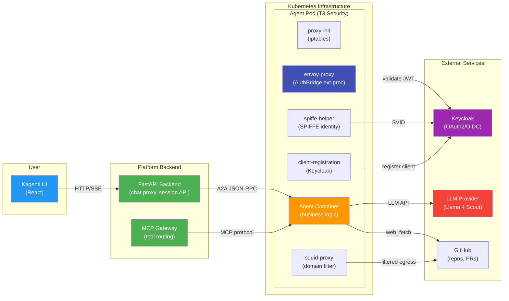
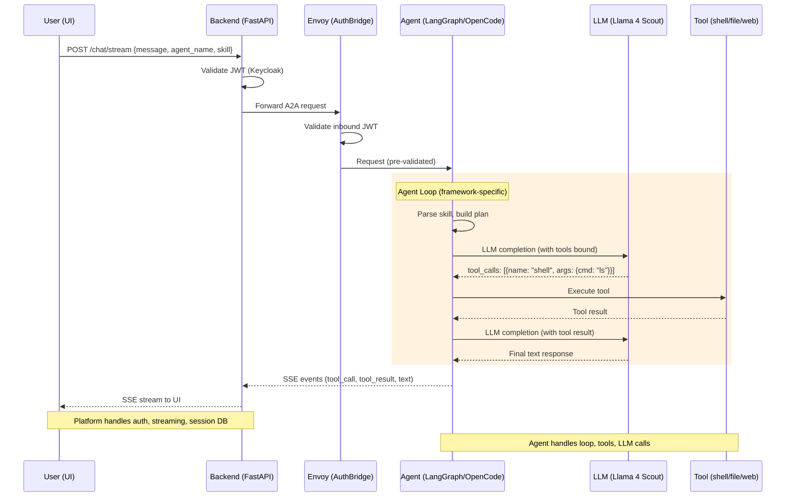
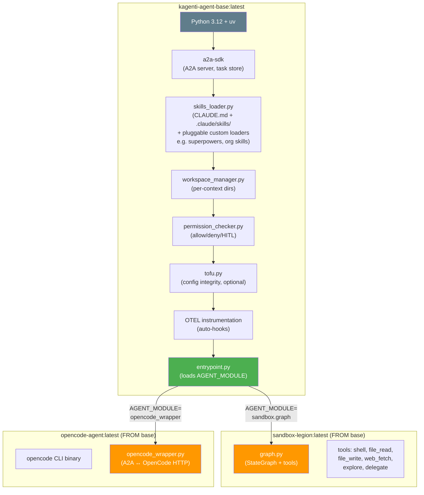
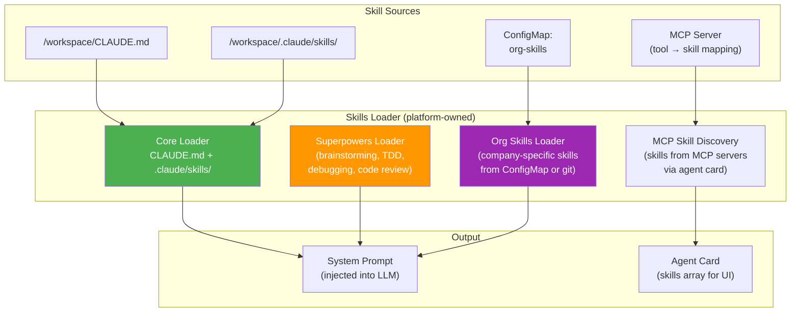
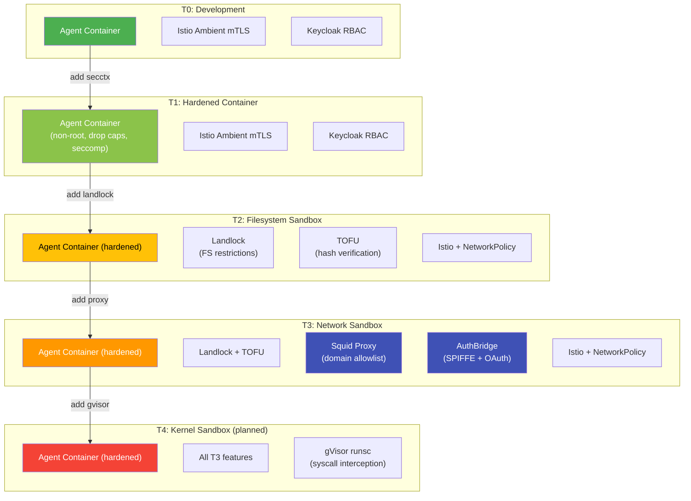
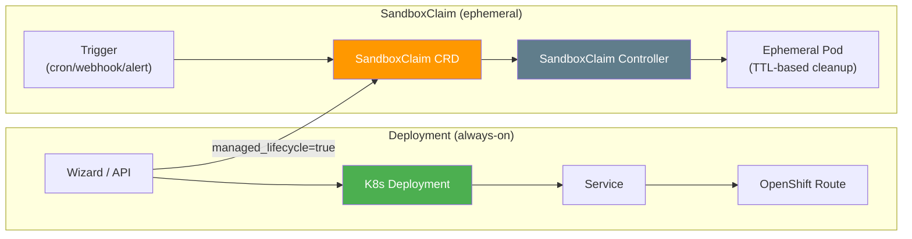
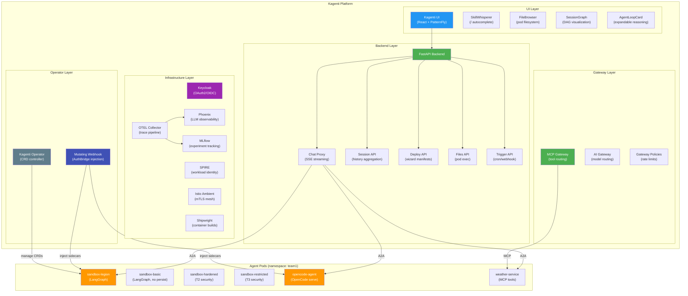
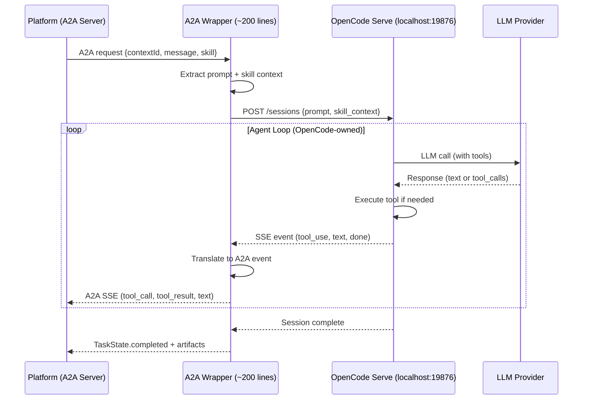
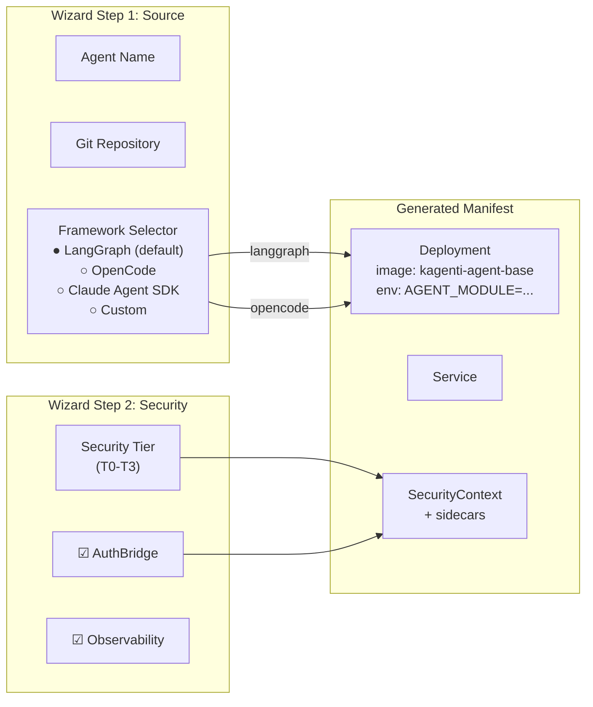

# Platform-Owned Agent Runtime — Design & Implementation Plan

> **Date:** 2026-03-04
> **Author:** Session G (design), Session N (implementation)
> **Status:** Ready for Implementation
> **PR:** #758 (feat/sandbox-agent)
> **Cluster:** Isolated HyperShift (to be created)

## 1. Vision

Kagenti provides a **framework-neutral agent runtime** where the platform owns
infrastructure (A2A server, auth, security, workspace, observability) and agents
provide only their business logic (graph, tools, LLM calls).

This is validated by deploying **two different agent frameworks** on the same
platform and proving they pass the same tests with the same features.

```mermaid
graph TB
    subgraph "Platform Layer (Kagenti-owned)"
        A2A["A2A Server<br/>(JSON-RPC 2.0, SSE)"]
        WS["Workspace Manager<br/>(per-context /workspace)"]
        SK["Skills Loader<br/>(CLAUDE.md + .claude/skills/<br/>+ custom loaders e.g. superpowers)"]
        PM["Permission Checker<br/>(allow/deny/HITL)"]
        TOFU["TOFU Verification<br/>(SHA-256 config integrity)"]
        OTEL["OTEL Instrumentation<br/>(Phoenix, MLflow)"]
        CP["Session DB<br/>(PostgreSQL checkpointer)"]
    end

    subgraph "Security Layer (sidecars, transparent)"
        AB["AuthBridge<br/>(SPIFFE + OAuth2)"]
        SQ["Squid Proxy<br/>(domain allowlist)"]
        LL["Landlock<br/>(filesystem sandbox)"]
        GV["gVisor<br/>(kernel sandbox)"]
    end

    subgraph "Orchestration Layer (optional)"
        SC["kubernetes-sigs SandboxClaim<br/>(ephemeral sandbox pods)"]
        TRIG["Trigger Controller<br/>(cron/webhook/alert → SandboxClaim)"]
    end

    SC -->|"creates"| LG
    SC -->|"creates"| OC
    TRIG -->|"triggers"| SC

    subgraph "Agent Layer (pluggable)"
        LG["LangGraph Agent<br/>(graph.py + tools)"]
        OC["OpenCode Agent<br/>(opencode serve + wrapper)"]
        CS["Claude Agent SDK<br/>(query() + wrapper)"]
        OH["OpenHands Agent<br/>(controller + wrapper)"]
    end

    A2A --> LG
    A2A --> OC
    A2A --> CS
    A2A --> OH

    AB -.->|transparent| LG
    AB -.->|transparent| OC
    SQ -.->|transparent| LG
    SQ -.->|transparent| OC
    LL -.->|transparent| LG
    LL -.->|transparent| OC

    style A2A fill:#4CAF50,color:white
    style AB fill:#3F51B5,color:white
    style SQ fill:#3F51B5,color:white
    style LL fill:#3F51B5,color:white
    style GV fill:#3F51B5,color:white
    style LG fill:#FF9800,color:white
    style OC fill:#FF9800,color:white
    style CS fill:#FF9800,color:white
    style OH fill:#FF9800,color:white
```



## 2. Architecture: The A2A Boundary

The A2A protocol is the **hard contract** between platform and agent. Everything
below it is platform infrastructure. Everything above it is agent business logic.



## 3. Request Flow: End-to-End



## 4. Platform Base Image

The platform provides a base container image that handles all infrastructure
concerns. Agents extend it with their framework-specific code.



### Entrypoint Pattern

```python
# entrypoint.py (platform-owned)
import importlib, os

# Agent provides a build_graph() or build_executor() function
module_name = os.environ["AGENT_MODULE"]  # e.g., "sandbox.graph"
agent_module = importlib.import_module(module_name)

# Platform builds the A2A server around it
executor = agent_module.build_executor(
    workspace_manager=workspace_manager,
    permissions_checker=permissions_checker,
    skills_loader=skills_loader,
    sources_config=sources_config,
)

server = A2AStarletteApplication(
    agent_card=agent_module.get_agent_card(host, port),
    http_handler=DefaultRequestHandler(
        agent_executor=executor,
        task_store=PostgresTaskStore(db_url),
    ),
)
uvicorn.run(server.build(), host="0.0.0.0", port=8000)
```

## 4b. Skills Loader: Pluggable Skill Sources

The platform's Skills Loader reads skills from the workspace and injects them
into the agent's system prompt. It supports **pluggable custom loaders** for
organization-specific skill sources.



**How it works:**

1. **Core loader** — Reads `CLAUDE.md` + `.claude/skills/` from workspace (always active)
2. **Superpowers loader** — Loads brainstorming, TDD, debugging, code review skills
   from a plugin directory (Session M adding custom loader support)
3. **Org skills loader** — Loads company-specific skills from K8s ConfigMap
   (e.g., internal coding standards, deployment procedures)
4. **MCP skill discovery** — Reads skills from connected MCP servers' tool
   definitions and maps them to the agent card's skills array

When a user invokes `/rca:ci #758`, the frontend parses the skill name and sends
it in the request body. The platform loads the full skill content and prepends it
to the system prompt before calling the agent's graph.

## 5. Security Tiers with Platform Features



**Key:** All tiers work with ANY agent framework. Adding AuthBridge or Squid
requires ZERO changes to agent code.

### Deployment Mechanisms

Agents can be deployed via two mechanisms:

| Mechanism | What | When to Use |
|-----------|------|-------------|
| **Deployment** (default) | Standard K8s Deployment + Service | Long-running agents, always-on |
| **SandboxClaim** (optional) | kubernetes-sigs ephemeral pod | Short-lived tasks, triggered by cron/webhook/alert, auto-cleanup via TTL |



SandboxClaim enables **autonomous agent spawning**: a cron job triggers an RCA
analysis every night, a webhook triggers a code review on PR creation, an alert
triggers an incident response agent. The pod auto-destroys after TTL.

## 6. Full Platform Component Map



## 7. A2A Wrapper Pattern for Non-Native Agents



## 8. Validation Plan

### Phase 1: Platform Base Image

```
Files to create:
  deployments/sandbox/platform_base/
  ├── Dockerfile.base          # Platform base image
  ├── entrypoint.py            # Plugin loader (AGENT_MODULE)
  ├── requirements.txt         # a2a-sdk, langchain, otel
  └── test_entrypoint.py       # Unit tests
```

### Phase 2: Sandbox Legion on Platform Base

```
Changes:
  - Extract graph.py from agent-examples container into deployments/sandbox/
  - Create Dockerfile.legion (FROM kagenti-agent-base)
  - Set AGENT_MODULE=sandbox_agent.graph
  - Build + deploy on isolated cluster
  - Run existing 192 Playwright tests → must pass
```

### Phase 3: OpenCode on Platform Base

```
Files to create:
  deployments/sandbox/opencode/
  ├── Dockerfile.opencode      # FROM base + opencode binary
  ├── opencode_wrapper.py      # A2A ↔ OpenCode HTTP adapter
  └── test_wrapper.py          # Unit tests

Deploy as new variant → run Playwright tests
```

### Phase 4: Feature Parity Matrix

| Feature | Test File | Legion | OpenCode |
|---------|-----------|:------:|:--------:|
| A2A agent card | agent-catalog.spec.ts | ✓ | ✓ |
| Chat streaming | sandbox-sessions.spec.ts | ✓ | ✓ |
| Tool execution | sandbox-walkthrough.spec.ts | ✓ | ✓ |
| File browser | sandbox-file-browser.spec.ts | ✓ | ✓ |
| Session persist | sandbox-sessions.spec.ts | ✓ | ✓ |
| HITL approval | sandbox-hitl.spec.ts | ✓ | ✓ |
| Security tiers | sandbox-variants.spec.ts | ✓ | ✓ |
| Skills loading | agent-rca-workflow.spec.ts | ✓ | ✓ |
| Multi-user auth | agent-chat-identity.spec.ts | ✓ | ✓ |

## 9. Agent Wizard Integration

The wizard (SandboxCreatePage) gains a **Framework** selector:



## 10. MAAS Model Compatibility

Tested 2026-03-03 on Red Hat AI Services:

| Model | tool_choice=auto | Recommended For |
|-------|:----------------:|-----------------|
| **Llama 4 Scout 17B-16E** (109B MoE) | ✅ 10/10 | Tool-calling agents (default) |
| Mistral Small 3.1 24B | ❌ 0/10 | Chat-only (no structured tool_calls with auto) |
| DeepSeek R1 Qwen 14B | ❌ | Reasoning tasks (no tool support) |
| Llama 3.2 3B | ❌ | Too small for function calling |

All clusters use **Llama 4 Scout** for sandbox agents.

## 11. Success Criteria

Session N is complete when:
1. Platform base image builds and passes unit tests
2. Sandbox Legion deploys FROM base and passes 192/196 Playwright tests
3. OpenCode deploys FROM base and passes core chat/session tests
4. Both agents work with AuthBridge (if deployed on T3)
5. Feature parity matrix shows identical platform feature coverage
6. Documentation updated with deployment instructions
