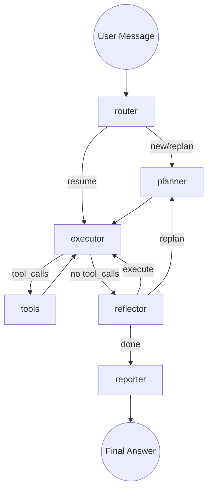

# Session X Passover — Reconfigure, Micro-Reflection, Graph Topology Fix

> **Date:** 2026-03-10
> **Previous Session:** W (passover at docs/plans/2026-03-10-session-W-passover.md)
> **Cluster:** sbox42 (Llama 4 Scout via LiteLLM proxy)
> **Worktrees:** `.worktrees/sandbox-agent` (kagenti), `.worktrees/agent-examples` (agent code)

## CRITICAL FOR SESSION Y — START HERE

### 1. Double-Send is Session Continuation
The UI sends the same message twice intentionally — the second message tests that the agent can see history from the first and continue. This is expected behavior, NOT a bug.

### 2. RCA Test Passes at Quality 3/5
The test passes consistently (1.6-2.2 min) but "Root Cause" and "Fix" sections are often missing. This is Llama 4 Scout formatting quality, not a graph issue.

### 3. loop_events NOT Persisting to DB
Every test run logs: "BUG: UI rendered loop cards but loop_events NOT persisted to DB". The `finally` block in `sandbox.py` fails silently. History fallback extraction covers the gap but is not reliable.

### 4. PVC Works on sbox42 (IRSA Fixed)
The EBS CSI IRSA issue was fixed in a parallel session (`fix-iam-roles.sh`). PVC provisioning takes ~60s. Agent pods need `fsGroup: 1001` for write access to EBS ext4 volumes.

### 5. Skills Load from Branch via SANDBOX_SKILL_REPOS
Backend env var `SANDBOX_SKILL_REPOS` is set on kagenti-backend deployment. Currently points to `Ladas/kagenti@feat/sandbox-agent`. The env var is forwarded to new agent deployments.

---

## What Session X Delivered

### UI Features (kagenti worktree)

| Change | Commit |
|--------|--------|
| **Reconfigure wizard modal** — extracted SandboxWizard, GET/PUT config endpoints | `892641c3` |
| **Reconfigure in 3 pages** — AgentCatalog kebab, SandboxesPage button, SandboxPage cog icon | `892641c3` |
| **Double-send fix** — `sendingRef` (synchronous useRef) guard | `5c531076` |
| **Tool call status** — finalize on node transition, cross-step matching | `5c531076` |
| **Stderr false-failure** — exit code detection, not keyword matching | `5c531076` |
| **PVC default** — workspace_storage defaults to pvc | `6e0159d0` |
| **fsGroup** — pod-level securityContext for EBS write access | `6ddeb069` |
| **RCA test stats wait** — wait for history load after SPA nav | `6ff28335` |
| **Portable LOG_DIR in skills** — works in sandbox agent containers | `39424f6e` |
| **SKILL_REPOS passthrough** — backend forwards to agent deployments | `ac8002b1`, `adda9140` |

### Agent Graph (agent-examples worktree)

| Change | Commit |
|--------|--------|
| **Replan loop limit** — MAX_REPLAN_COUNT with reflector context | `51b5d51` |
| **Micro-reflection executor** — one tool call at a time, 20 call limit | `c8bb72e` |
| **Skip lost+found** — EBS ext4 metadata dir in workspace cleanup | `eeac280` |
| **Stall breaker fix** — don't stall-fail after tool errors | `9b467bc` |
| **Remove force-done** — let budget handle termination | `134f072` |
| **Dedup scoped to iteration** — don't block tools from previous plan | `c5e2543` |
| **Graph topology fix** — continue→execute→executor, replan→planner | `6ee5afd`, `1d0af4a` |
| **Mermaid graph diagram** — in graph.py docstring | `aad7ca1` |

### Graph Topology Change
```
OLD (Session W):
  reflector → [continue] → planner → executor  (always replanned!)
  reflector → [replan]   → planner → executor

NEW (Session X):
  reflector → [execute]  → executor  (direct to next step)
  reflector → [replan]   → planner → executor
  reflector → [done]     → reporter → END
```

### Verified on sbox42

| Feature | Status |
|---------|--------|
| Reconfigure modal (3 locations) | Compiles, not tested on cluster |
| PVC workspace (fsGroup + IRSA fix) | Working |
| Skills from branch (SANDBOX_SKILL_REPOS) | Working |
| Micro-reflection executor | Deployed |
| Graph topology (execute vs replan) | Deployed |
| RCA test | PASSED (1.6m, quality 3/5) |

---

## Architecture Reference

### Agent Graph (router → plan → execute → reflect)


### Micro-Reflection Execution Model
```
executor → LLM (1 tool call) → tools → executor → LLM (see result, decide next)
                                                  → reflector (if no more tools needed)
```

### Skill Loading Flow
```
Backend SANDBOX_SKILL_REPOS env var
  → forwarded to agent pods as SKILL_REPOS
  → agent clones at startup: git clone --depth 1 --branch <branch> <repo>
  → skills available at /workspace/.claude/skills/
  → loaded when user sends /skill:name prefix
```

---

## Remaining Issues (P0 for Session Y)

### 1. RCA Quality 3/5
"Root Cause" and "Fix" sections still missing. Likely Llama 4 Scout prompt following. The reporter prompt may need stronger formatting instructions.

### 2. loop_events Not Persisting to DB
Every session shows this bug. The `finally` block in `sandbox.py` sometimes fails. Need to investigate the async race condition.

### 3. Per-Session UID Isolation
Currently all sessions share UID 1001 on the PVC. Need per-session UID mapping (from passover W item #5).

### 4. tdd:ui-hypershift Skill Needs Genericization
Contains hardcoded worktree paths (`sandbox-agent`). Should use variables.

### 5. Wizard Reconfigure Not Tested on Cluster
The reconfigure feature compiles and has all endpoints but wasn't deployed/tested on sbox42 yet.

### 6. Agent Ends After Few Steps
The agent sometimes ends after 1-2 steps despite having more plan steps. May be related to how the executor handles the transition from tool results back to reasoning. Need to verify the graph topology fix resolved this.

### 7. Budget Controls in UI
Add a button/panel (in session detail or wizard) to view and change the agent budget (max iterations, max tokens, wall clock limit). Currently only configurable via `SANDBOX_*` env vars.

### 8. Agent Redeploy E2E Test
New Playwright test that:
1. Deploys agent via wizard with specific security/config settings
2. Changes settings via reconfigure modal (e.g., toggle proxy, change model)
3. Asserts agent reaches Ready state on the agents page
4. Continues a session — verifies the agent remembers previous context
5. Tests workspace persistence (file created in session history is still readable after redeploy)

### 9. Message Queue + Cancel Button
When the agent loop is running, any new messages sent should be **queued** (not sent immediately). The UI should show:
- A **cancel button** on the agent loop card (top right) to abort the running loop
- Queued messages shown as pending below the active loop
- After cancel or completion, queued messages are sent in order
- This prevents the double-send issue and gives users control over long-running loops

---

## Key Files

| File | Purpose |
|------|---------|
| `agent-examples/.../reasoning.py` | Router, planner, executor, reflector, reporter, route_reflector |
| `agent-examples/.../graph.py` | Graph topology with execute/replan/done routing |
| `agent-examples/.../workspace.py` | Workspace cleanup with lost+found skip |
| `kagenti/backend/.../sandbox_deploy.py` | fsGroup, SKILL_REPOS passthrough, cfg annotations |
| `kagenti/ui-v2/src/components/SandboxWizard.tsx` | Extracted reusable wizard component |
| `kagenti/ui-v2/src/components/LoopDetail.tsx` | Tool call status, stderr detection |
| `kagenti/ui-v2/src/utils/loopBuilder.ts` | Node transition finalization, cross-step matching |
| `kagenti/ui-v2/src/pages/SandboxPage.tsx` | sendingRef double-send guard, reconfigure modal |
| `.claude/skills/rca:ci/SKILL.md` | Portable LOG_DIR (and 12 other skills) |
| `.claude/skills/tdd:ui-hypershift/SKILL.md` | Level 4/5 agent+full deploy workflows |

## Deploy Commands (sbox42)

```bash
export KUBECONFIG=~/clusters/hcp/kagenti-team-sbox42/auth/kubeconfig

# Push both worktrees
cd .worktrees/sandbox-agent && git push origin feat/sandbox-agent && cd -
cd .worktrees/agent-examples && git push origin feat/sandbox-agent && cd -

# Trigger builds
oc start-build kagenti-ui -n kagenti-system
oc start-build kagenti-backend -n kagenti-system
oc start-build sandbox-agent -n team1

# Wait for builds (~1-2 min each)
for ns_build in "kagenti-system/kagenti-ui" "kagenti-system/kagenti-backend" "team1/sandbox-agent"; do
  ns=${ns_build%/*}; bc=${ns_build#*/}
  ver=$(oc -n $ns get bc $bc -o jsonpath='{.status.lastVersion}')
  while ! oc -n $ns get build ${bc}-${ver} -o jsonpath='{.status.phase}' 2>/dev/null | grep -qE 'Complete|Failed'; do sleep 10; done
  echo "  $bc: $(oc -n $ns get build ${bc}-${ver} -o jsonpath='{.status.phase}')"
done

# Rollout
oc rollout restart deploy/kagenti-ui deploy/kagenti-backend -n kagenti-system
oc rollout restart deploy/rca-agent -n team1

# Clear stale skill cache (if SKILL_REPOS changed)
kubectl exec deploy/rca-agent -n team1 -c agent -- rm -rf /workspace/.claude/skills /workspace/.skill-repos
oc rollout restart deploy/rca-agent -n team1

# Run RCA test
cd .worktrees/sandbox-agent/kagenti/ui-v2
export KEYCLOAK_PASSWORD=$(kubectl get secret kagenti-test-users -n keycloak -o jsonpath='{.data.admin-password}' | base64 -d)
export KAGENTI_UI_URL=https://kagenti-ui-kagenti-system.apps.kagenti-team-sbox42.octo-emerging.redhataicoe.com
export KEYCLOAK_USER=admin CI=true
npx playwright test e2e/agent-rca-workflow.spec.ts --reporter=list --timeout=600000
```

## Commits (kagenti worktree — session X only)
```
adda9140  fix: SKILL_REPOS auto-detect from kagenti source repo + branch
ac8002b1  feat: pass SKILL_REPOS env var to agent deployments
39424f6e  fix: portable LOG_DIR in skills — works in sandbox agent containers
6ff28335  fix: RCA test stats assertion — wait for history load after SPA nav
6ddeb069  fix: add fsGroup to agent pod spec for PVC write access
6e0159d0  fix: default workspace_storage to pvc (storage provisioner working)
5c531076  fix: double-send guard, tool call status, and stderr false-failure
892641c3  feat: reconfigure sandbox agent — wizard modal + GET/PUT config endpoints
```

## Commits (agent-examples worktree — session X only)
```
aad7ca1   docs: add mermaid graph diagram to agent code
1d0af4a   fix: rename continue→execute in reflector routing
6ee5afd   fix: route reflector continue→executor, replan→planner
c5e2543   fix: scope dedup to current plan iteration only
134f072   fix: remove force-done overrides — let budget handle termination
9b467bc   fix: don't stall-fail executor after tool errors with micro-reflection
eeac280   fix: skip lost+found in workspace cleanup (EBS ext4 metadata)
c8bb72e   feat: micro-reflection executor — one tool call at a time
51b5d51   fix: replan loop — max replan limit, state tracking, reflector context
```
