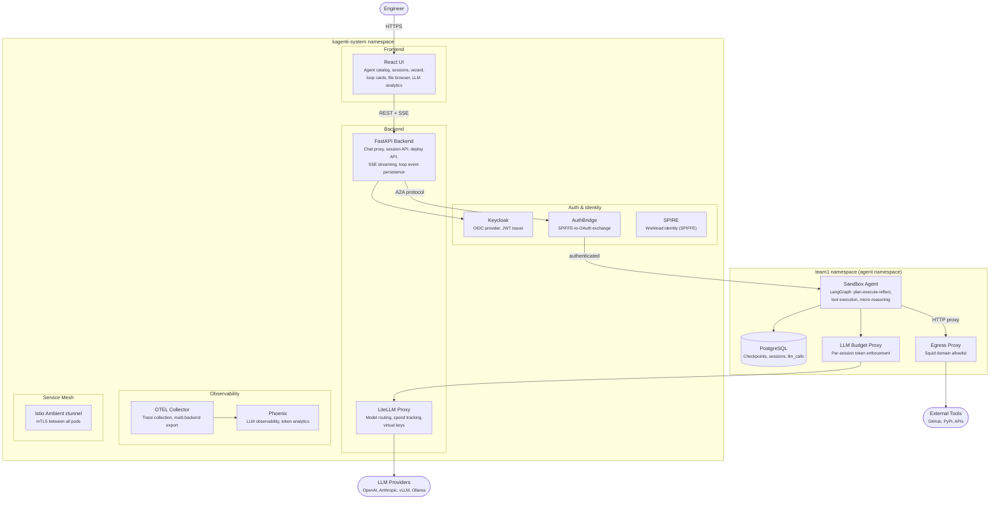
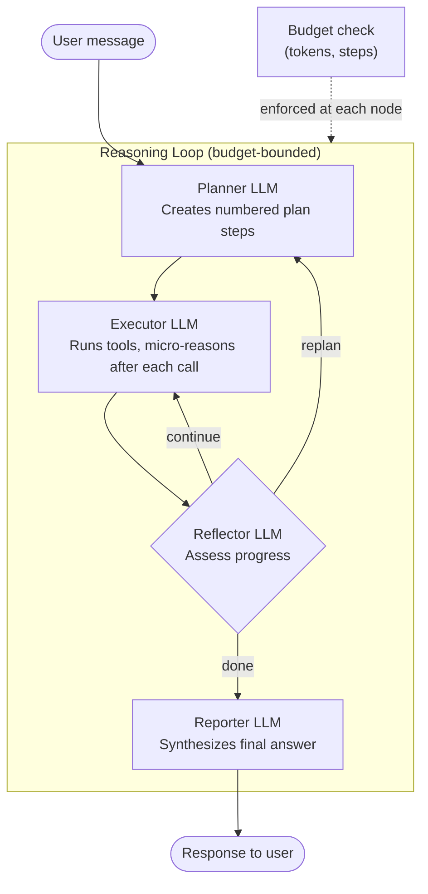
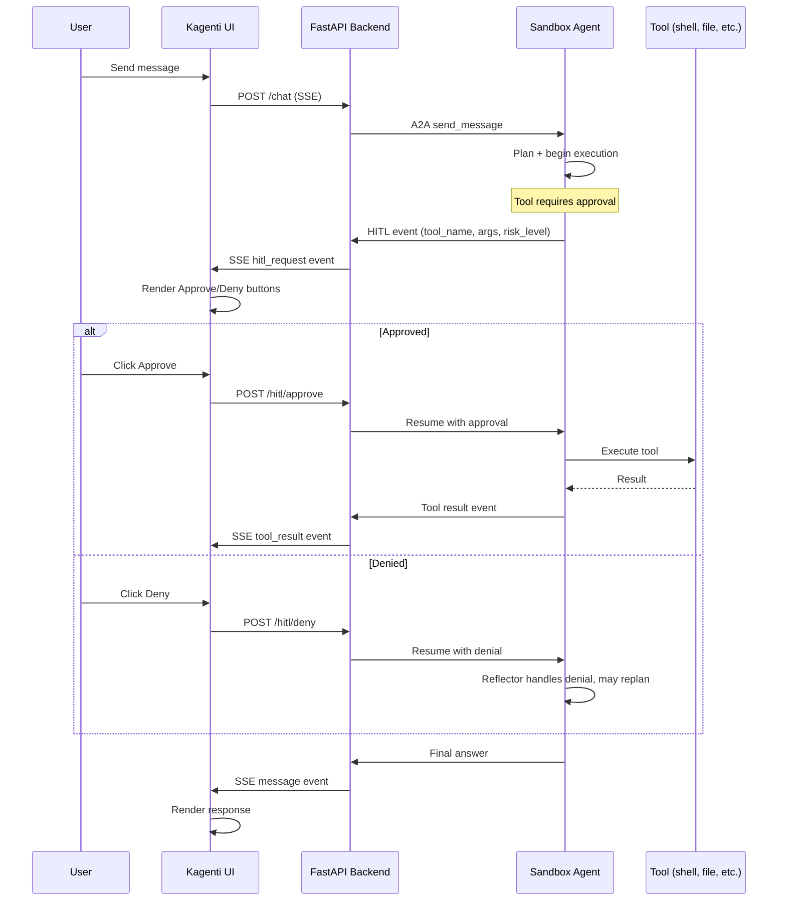
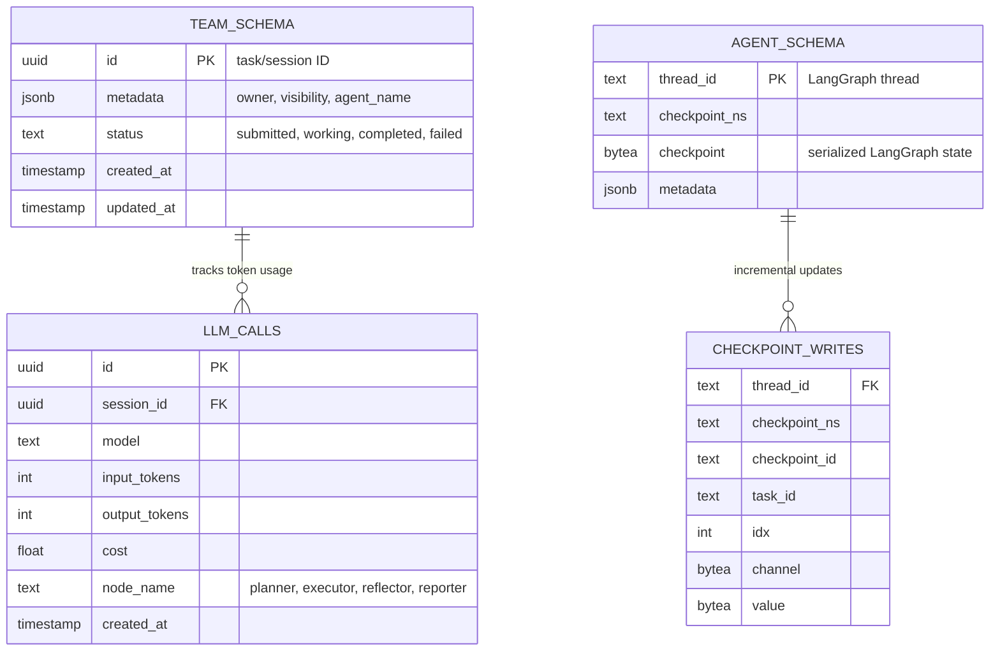
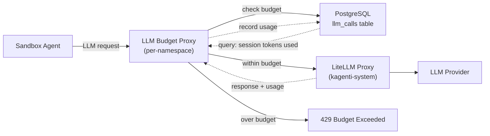

# Sandbox Agent Platform — System Design (v2)

> **Status:** Active Development
> **Date:** 2026-03-01 (rewritten 2026-03-12)
> **PR:** #758 (feat/sandbox-agent)
> **Branch:** `feat/sandbox-agent`

The sandbox agent platform extends Kagenti with secure, isolated environments
for running AI coding agents. Agents operate in Kubernetes pods with composable
security layers, persistent workspaces, and human-in-the-loop approval gates.

---

## Table of Contents

1. [Architecture](#1-architecture-c4-container)
2. [Component Status](#2-component-status)
3. [Security Model](#3-security-model)
4. [Agent Reasoning Architecture](#4-agent-reasoning-architecture)
5. [Human-in-the-Loop Flow](#5-human-in-the-loop-flow)
6. [Database Architecture](#6-database-architecture)
7. [LLM Budget Enforcement](#7-llm-budget-enforcement)
8. [Sidecar Agents](#8-sidecar-agents)
9. [Event Pipeline](#9-event-pipeline)
10. [Multi-Framework Agent Runtime](#10-multi-framework-agent-runtime)
11. [Planned Work](#11-planned-work)
12. [Sub-Design Document Index](#12-sub-design-document-index)

---

## 1. Architecture (C4 Container)



**Key architectural decisions:**

| Area | Design | Rationale |
|------|--------|-----------|
| Egress proxy | Separate Deployment (`{agent}-egress-proxy`) | Decouples proxy lifecycle from agent; enables shared proxy per namespace |
| LLM routing | LiteLLM in `kagenti-system`, shared across namespaces | Centralizes model config, spend tracking, and virtual keys |
| LLM budget | Per-namespace proxy between agent and LiteLLM | Enforces per-session and per-agent token budgets at the network layer |
| DB isolation | Schema-per-agent, team schema for shared tables | Agents cannot read each other's checkpoints; sessions and llm_calls are shared |
| Agent profiles | `legion`, `basic`, `hardened`, `restricted` | Replaces composable suffixes with named presets; wizard still allows custom combos |
| Reasoning | Plan-execute-reflect with micro-reasoning | Reflector LLM decides termination; micro-reasoning catches tool errors early |

See [LLM Budget Proxy](./2026-03-12-llm-budget-proxy-design.md)
and [DB Multi-Tenancy](./2026-03-12-db-multi-tenancy-design.md) for detailed designs.

---

## 2. Component Status

| Component | Status | Design Doc | Notes |
|-----------|--------|------------|-------|
| **React UI -- Sessions** | Built | -- | Multi-turn chat, session list, switching, tabbed view |
| **React UI -- Agent catalog** | Built | -- | Agent selector with variant badges |
| **React UI -- Import wizard** | Partial | [Platform Runtime](./2026-03-04-platform-agent-runtime-design.md) | Needs Shipwright build trigger, model selector |
| **React UI -- HITL buttons** | Partial | -- | Approve/Deny rendered, resume partially wired |
| **React UI -- Loop cards** | Built | [Agent Loop UI](./2026-03-03-agent-loop-ui-design.md) | Plan steps, tool calls, reflection, token tracking |
| **React UI -- File browser** | Built | [File Browser](./2026-03-02-sandbox-file-browser-design.md) | Read-only workspace browser with syntax highlighting |
| **React UI -- Tabbed layout** | Built | [Tabbed Session View](./2026-03-05-tabbed-session-view-design.md) | Chat, Stats, LLM Usage, Files tabs |
| **React UI -- LLM analytics** | Built | [LiteLLM Analytics](./2026-03-08-litellm-analytics-design.md) | Per-session/model token and cost breakdown |
| **React UI -- Session graph** | Not built | [Visualizations](./2026-03-10-visualizations-design.md) | DAG visualization of session delegation |
| **FastAPI -- Chat proxy** | Built | -- | SSE streaming, JSON event parsing |
| **FastAPI -- Session API** | Built | -- | History aggregation, artifact deduplication |
| **FastAPI -- Deploy API** | Partial | [Platform Runtime](./2026-03-04-platform-agent-runtime-design.md) | Wizard deploy, no Shipwright build trigger |
| **FastAPI -- Loop events** | Built | [Event Pipeline](./2026-03-09-loop-event-pipeline-design.md) | SSE forwarding, persistence, recovery polling |
| **FastAPI -- Auth middleware** | Partial | -- | Keycloak JWT extraction, per-message username |
| **Agent -- Reasoning loop** | Built | [Reasoning Loop](./2026-03-03-sandbox-reasoning-loop-design.md) | Plan-execute-reflect, micro-reasoning, budget tracking |
| **Agent -- Sidecar agents** | Partial | -- | Looper exists (0 observations), Observer/Guardian not built |
| **LiteLLM Proxy** | Built | [LiteLLM Proxy](./2026-03-07-litellm-proxy-design.md) | Model routing in kagenti-system |
| **LLM Budget Proxy** | Not built | [LLM Budget Proxy](./2026-03-12-llm-budget-proxy-design.md) | Per-session token enforcement, designed |
| **DB multi-tenancy** | Not built | [DB Multi-Tenancy](./2026-03-12-db-multi-tenancy-design.md) | Schema-per-agent, designed |
| **Egress Proxy** | Built | -- | Separate Squid Deployment per agent |
| **PostgreSQL** | Built | -- | Per-namespace StatefulSet, LangGraph checkpointer |
| **Keycloak** | Built | -- | OIDC provider with RHBK operator |
| **AuthBridge** | Built | -- | SPIFFE-to-OAuth token exchange |
| **Istio Ambient** | Built | -- | ztunnel mTLS, no sidecar injection |
| **OTEL Collector** | Built | -- | Trace collection, multi-backend export |
| **Phoenix** | Built | -- | LLM observability, token analytics |
| **SPIRE** | Built | -- | SPIFFE workload identity |
| **Session ownership** | Partial | [Session Ownership](./2026-02-27-session-ownership-design.md) | Per-user visibility, role-based access |
| **Session orchestration** | Not built | [Session Orchestration](./2026-02-27-session-orchestration-design.md) | Automated passover, session continuity |
| **Skill packs** | Partial | [Skill Packs](./2026-03-04-skill-packs-design.md) | Skill loading from git repos |

### Test Status

| Suite | Count | Status |
|-------|-------|--------|
| Playwright UI E2E | ~160 | Passing |
| RCA workflow | 1 | Passing |
| Agent resilience | 1 | Passing |
| Budget enforcement | 2 | Failing (needs LLM proxy) |
| Import wizard | 3 | Failing (model selector timeout) |
| HITL events | 5 | Failing (textarea not found) |
| Sidecars/looper | 1 | Failing (0 observations) |
| Session persist | 1 | Failing |

---

## 3. Security Model

### Defense-in-Depth Layers

| Layer | Mechanism | Threat Addressed | Overhead |
|-------|-----------|-----------------|----------|
| L1 Keycloak | OIDC JWT authentication | Unauthorized access | Zero |
| L2 RBAC | Kubernetes RBAC per namespace | Privilege escalation across namespaces | Zero |
| L3 mTLS | Istio Ambient ztunnel | Network eavesdropping, spoofing | Zero (ambient) |
| L4 SecurityContext | non-root, drop ALL caps, seccomp, readOnlyRootFilesystem | Container breakout, privilege escalation | Zero |
| L5 NetworkPolicy | Default-deny + DNS allow | Lateral movement between pods | Zero |
| L6 Landlock | Kernel filesystem restrictions via `nono_launcher.py` | Access to `~/.ssh`, `~/.kube`, `/etc/shadow` | Near-zero |
| L7 Egress Proxy | Squid domain allowlist (separate Deployment) | Data exfiltration, unauthorized API calls | ~50MB RAM |
| L8 HITL | Approval gates for dangerous operations | Unchecked agent autonomy | Human latency |

> **L1-L3 and L8 are always on** for all agents. L4-L7 are composable toggles
> exposed through the import wizard.

### Agent Profiles

Profiles replace the old composable-suffix naming (`-secctx-landlock-proxy`):

| Profile | Layers | Use Case |
|---------|--------|----------|
| `legion` | L1-L3, L8 | Local dev, rapid prototyping |
| `basic` | L1-L5, L8 | Trusted internal agents |
| `hardened` | L1-L8 | Production agents running own code |
| `restricted` | L1-L8 + source policy | Imported / third-party agents |

> **gVisor (T4)** was removed. It is incompatible with OpenShift SELinux policies
> and would require a different RuntimeClass approach for multi-platform support.

---

## 4. Agent Reasoning Architecture

Sandbox agents use a **plan-execute-reflect** loop implemented in LangGraph.
Each iteration plans work, executes tool calls, then reflects on progress.



**Key design decisions:**

- **Micro-reasoning:** After each tool call, the executor runs a lightweight LLM
  call to interpret the result before deciding the next tool. This catches errors
  early and reduces wasted tool calls.
- **Reflector decides termination:** No hardcoded stall detection. The reflector
  LLM evaluates remaining plan steps and decides continue/replan/done.
- **Budget enforcement:** Token and step budgets are checked at every node
  transition. Currently in-memory; moving to LLM proxy (see
  [Section 7](#7-llm-budget-enforcement)).
- **Reporter always runs LLM:** Even for single-step results, the reporter
  synthesizes through its own LLM call to avoid leaking reflector reasoning.

See [Reasoning Loop Design](./2026-03-03-sandbox-reasoning-loop-design.md) for
full LangGraph graph structure, state schema, and prompt templates.

---

## 5. Human-in-the-Loop Flow

HITL gates allow users to approve or deny dangerous operations (shell commands,
file writes, network calls) before the agent executes them.



**Current status:**
- Approve/Deny buttons render in chat via `ToolCallStep` component
- Backend HITL endpoints exist and forward to agent
- Resume after approval is partially wired (works for shell commands)
- Sidecar agents can trigger HITL requests (planned)

---

## 6. Database Architecture

Each agent namespace has its own PostgreSQL StatefulSet. Database isolation uses
a **schema-per-agent** model to separate checkpoint data while sharing session
metadata within a team.



**Design decisions:**
- **Team schema** (`team1`): Holds `a2a_tasks` (session records) and `llm_calls`
  (token tracking). Shared across all agents in the namespace.
- **Agent schema** (`sandbox_legion`, `sandbox_hardened`, ...): Holds LangGraph
  checkpoint tables. One schema per agent deployment. The wizard creates/drops
  schemas on agent deploy/undeploy.
- **Connection management:** Each agent gets a dedicated DB user with access only
  to its own schema plus read access to the team schema.

See [DB Multi-Tenancy Design](./2026-03-12-db-multi-tenancy-design.md) for
schema creation SQL, connection string templating, and wizard integration.

---

## 7. LLM Budget Enforcement

Budget enforcement prevents runaway token consumption. The current in-memory
approach is being replaced by a dedicated LLM budget proxy.



**Three enforcement layers:**

| Layer | Scope | Mechanism | Status |
|-------|-------|-----------|--------|
| Session budget | Per-session token cap | LLM proxy checks `llm_calls` before forwarding | Designed |
| Agent monthly | Per-agent monthly spend | LiteLLM virtual keys with budget limits | Designed |
| In-memory fallback | Per-loop step/token cap | `add_tokens()` at each LangGraph node | Built (current) |

**Error visibility:** When budget is exceeded, the proxy returns a structured
error. The agent emits a `budget_update` event, and the UI displays budget
status in the `LoopSummaryBar`.

See [LLM Budget Proxy Design](./2026-03-12-llm-budget-proxy-design.md) for
proxy architecture, API contract, and phased implementation plan. See also
[Budget Limits Design](./2026-03-12-budget-limits-design.md) for naming
conventions (recursion vs cycles vs steps).

---

## 8. Sidecar Agents

Sidecar agents run alongside the primary sandbox agent and observe or augment
its behavior without modifying the agent code.

| Sidecar | Purpose | Status |
|---------|---------|--------|
| **Looper** | Auto-continue: detects when agent paused mid-task and sends follow-up messages | Partial (exists, 0 observations -- debugging) |
| **Hallucination Observer** | Monitors tool call results for signs of hallucinated paths, APIs, or commands | Not built |
| **Context Guardian** | Tracks context window usage, triggers passover when approaching limits | Not built |

Sidecar agents are managed by the backend's `SidecarManager`. They subscribe to
the same SSE event stream as the UI and can trigger HITL requests or inject
messages into the session.

---

## 9. Event Pipeline

The event pipeline streams reasoning loop events from agent to UI in real-time
and persists them for historical reconstruction.

**Five-stage pipeline:**

1. **LangGraph events** -- Agent emits typed events (plan, tool_call, reflection,
   budget_update, hitl_request) during graph execution
2. **SSE forwarding** -- Backend receives A2A streaming events and forwards via
   Server-Sent Events to the UI
3. **Loop event persistence** -- Background task writes events to `loop_events`
   table (immune to GeneratorExit)
4. **Historical reconstruction** -- On session reload, backend queries persisted
   events and replays them in the same format as live SSE
5. **Recovery polling** -- UI polls for missed events on reconnect, merging with
   live stream

See [Loop Event Pipeline Design](./2026-03-09-loop-event-pipeline-design.md) for
event schema, streaming vs history parity, and recovery protocol.

---

## 10. Multi-Framework Agent Runtime

The platform is **framework-neutral**. It owns infrastructure (A2A server, auth,
security, workspace, observability) while agents provide only business logic.
The A2A protocol is the composability boundary — any agent that speaks A2A
JSON-RPC 2.0 gets the full platform feature set for free.

```
+---------------------------------------------------------------+
|  Platform Layer (Kagenti-owned, transparent to agents)         |
|                                                                |
|  A2A Server    AuthBridge     Composable Security (L1-L8)     |
|  Workspace     Skills Loader  OTEL Instrumentation            |
|  Session DB    LLM Budget     Egress Proxy                    |
+---------------------------------------------------------------+
|  A2A JSON-RPC 2.0 + agent card + SSE events                  |
+---------------------------------------------------------------+
|  Agent Layer (pluggable, user-provided)                       |
|                                                                |
|  LangGraph      OpenCode       Claude Agent SDK               |
|  OpenHands      OpenClaw       Custom HTTP service            |
+---------------------------------------------------------------+
```

Non-native agents use a thin **A2A wrapper** (~200 lines) that translates
between the agent's protocol and A2A JSON-RPC:

| Framework | Language | Integration | Wrapper |
|-----------|----------|-------------|---------|
| **LangGraph** | Python | Native A2A, runs as graph inside platform base image | None needed |
| **OpenCode** | Go | `opencode serve` exposes HTTP API, wrapper translates events | `opencode_wrapper.py` |
| **Claude Agent SDK** | Python | `query()` calls wrapped in A2A executor | `claude_sdk_wrapper.py` |
| **OpenHands** | Python | Docker-based controller, wrapper proxies events | `openhands_wrapper.py` |
| **OpenClaw** | Python | HTTP API, wrapper translates events | `openclaw_wrapper.py` |
| **Custom** | Any | Any HTTP service exposing a streaming endpoint | Custom wrapper |

**Key principle:** Adding AuthBridge, Squid proxy, Landlock, or any platform
feature requires **zero changes** to agent code. The platform adds layers via
sidecars, init containers, and environment variables.

See [Platform Runtime Design](./2026-03-04-platform-agent-runtime-design.md)
for the base image architecture, plugin contract, and A2A wrapper examples.
See [Platform Runtime Implementation](./2026-03-04-platform-agent-runtime-impl.md)
for the phased rollout plan starting with OpenCode.

---

## 11. Planned Work

### Beta -- LLM Budget Proxy + DB Schemas
- Implement LLM budget proxy per namespace
- Schema-per-agent DB isolation with wizard integration
- See [Beta Passover](./2026-03-12-session-beta-passover.md)

### Gamma -- UI Polish + Remaining P0s
- Step numbering format (`Step 2 [5]`, `Step 2a [7]` for replans)
- Reflector early-termination prompt hardening
- Executor event ordering guards
- Page load overlay (no blank flash on session switch)
- See [Gamma Passover](./2026-03-12-session-gamma-passover.md)

### Delta -- Infrastructure
- Kiali ambient mesh labels for LiteLLM + egress proxy
- Phoenix OTEL trace export
- DB metadata race condition fix
- Agent crash recovery (LangGraph `ainvoke(None, config)`)

### Epsilon -- Advanced Features
- Session graph DAG visualization
- Message queue + cancel button
- Per-session UID isolation
- Context window management UI

---

## 12. Sub-Design Document Index

### Design Documents

| Document | Status | Topic |
|----------|--------|-------|
| [Reasoning Loop](./2026-03-03-sandbox-reasoning-loop-design.md) | Built | Plan-execute-reflect with micro-reasoning |
| [Agent Loop UI](./2026-03-03-agent-loop-ui-design.md) | Built | Loop cards, step sections, prompt inspector |
| [LiteLLM Proxy](./2026-03-07-litellm-proxy-design.md) | Built | Centralized model routing in kagenti-system |
| [LiteLLM Analytics](./2026-03-08-litellm-analytics-design.md) | Built | Per-session/model token and cost breakdown |
| [Loop Event Pipeline](./2026-03-09-loop-event-pipeline-design.md) | Built | SSE forwarding, persistence, recovery |
| [File Browser](./2026-03-02-sandbox-file-browser-design.md) | Built | Workspace file browser with syntax highlighting |
| [Tabbed Session View](./2026-03-05-tabbed-session-view-design.md) | Built | Chat, Stats, LLM Usage, Files tabs |
| [Platform Runtime Design](./2026-03-04-platform-agent-runtime-design.md) | Partial | Multi-framework agent runtime, A2A wrappers, base image |
| [Platform Runtime Impl](./2026-03-04-platform-agent-runtime-impl.md) | Partial | Phased rollout: LangGraph, OpenCode, Claude SDK |
| [Session Ownership](./2026-02-27-session-ownership-design.md) | Partial | Per-user session visibility, role-based access |
| [Skill Packs](./2026-03-04-skill-packs-design.md) | Partial | Versioned skill loading from git repos |
| [LLM Budget Proxy](./2026-03-12-llm-budget-proxy-design.md) | Designed | Per-session token enforcement via proxy |
| [DB Multi-Tenancy](./2026-03-12-db-multi-tenancy-design.md) | Designed | Schema-per-agent isolation |
| [Budget Limits](./2026-03-12-budget-limits-design.md) | Reference | Naming: recursion vs cycles vs steps |
| [Visualizations](./2026-03-10-visualizations-design.md) | Planned | Session graph DAG, timeline, token waterfall |
| [Session Orchestration](./2026-02-27-session-orchestration-design.md) | Planned | Automated passover, session continuity |

### Session Passover Chain

| Session | Passover | Focus |
|---------|----------|-------|
| [Alpha](./2026-03-12-session-alpha-passover.md) | Completed | Polling fix, budget events, reporter, stall detection |
| [Beta](./2026-03-12-session-beta-passover.md) | Next | LLM budget proxy, DB schemas |
| [Gamma](./2026-03-12-session-gamma-passover.md) | Planned | UI polish, step naming, event ordering |
| [Delta](./2026-03-12-session-delta-passover.md) | Planned | Infrastructure: mesh labels, OTEL, crash recovery |
| [Epsilon](./2026-03-12-session-epsilon-passover.md) | Planned | Advanced: visualizations, message queue, context UI |
| [Y](./2026-03-11-session-Y-passover.md) | Reference | Event pipeline, micro-reasoning |
| [Z](./2026-03-11-session-Z-passover.md) | Reference | Subscribe, budget wizard, step naming |
