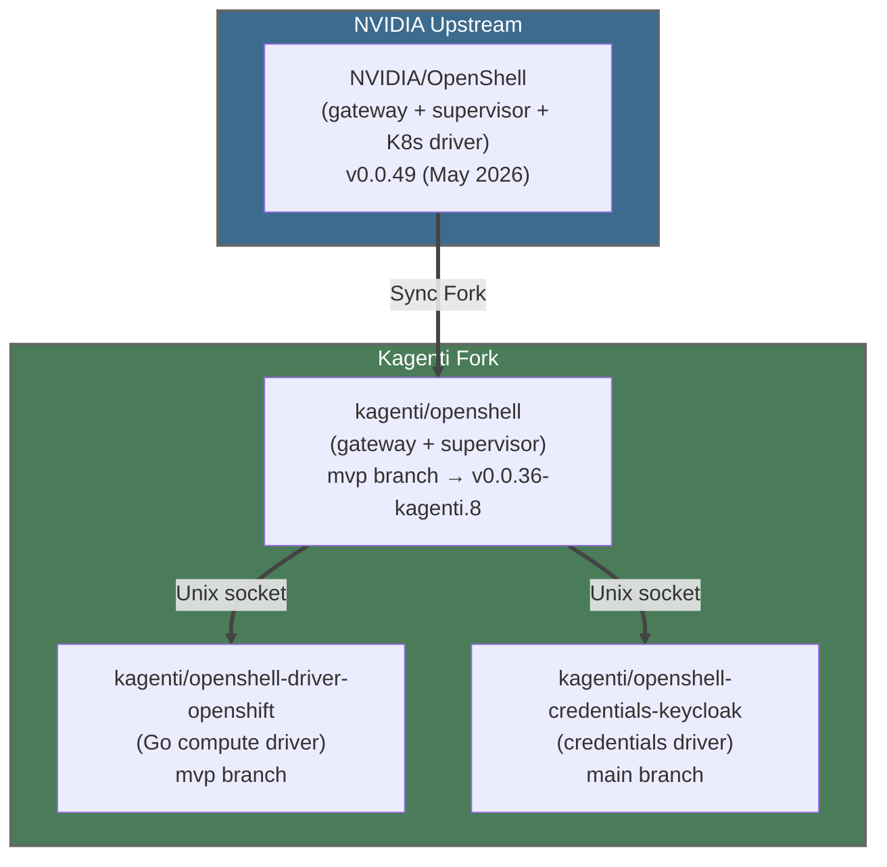

# Kagenti OpenShell Fork: Architecture, Patches, and Upgrade Path

*Comprehensive analysis of how Kagenti maintains and extends the
NVIDIA/OpenShell fork, what custom patches exist, and the plan for
syncing with upstream v0.0.49+.*

---

## Fork Architecture

Kagenti maintains three repositories forked from the OpenShell ecosystem:



### Branch Strategy

| Repo | Main Branch | Build Branch | Relationship |
|------|-------------|-------------|--------------|
| kagenti/openshell | `main` (synced with NVIDIA) | `mvp` (32 commits ahead) | `main` = upstream mirror, `mvp` = kagenti patches |
| kagenti/openshell-driver-openshift | `main` | `mvp` | Kagenti-specific, no upstream equivalent |
| kagenti/openshell-credentials-keycloak | `main` | `main` | Kagenti-specific, no upstream equivalent |

### How Builds Work

1. **Sync Fork**: GitHub "Sync Fork" button syncs `kagenti/openshell:main` with `NVIDIA/OpenShell:main`
2. **Rebase mvp**: Claude Code rebases the `mvp` branch onto the updated `main`
3. **Evaluate patches**: Check if kagenti-specific PRs on `mvp` are still needed (some may have been fixed upstream)
4. **Tag release**: Create `v0.0.XX-kagenti.N` tag from the rebased `mvp`
5. **Build images**: CI builds gateway + supervisor multi-arch images from the tagged commit

### Current Image Tags

| Component | Image | Tag | Source |
|-----------|-------|-----|--------|
| Gateway | `ghcr.io/kagenti/openshell/gateway` | `v0.0.36-kagenti.8` | mvp branch |
| Supervisor | `ghcr.io/kagenti/openshell/supervisor` | `v0.0.36-kagenti.8` | mvp branch |
| Compute Driver | `ghcr.io/kagenti/openshell-driver-openshift/compute-driver` | `mvp-a5f33f4` | mvp branch |
| Credentials Driver | `ghcr.io/kagenti/openshell-credentials-keycloak/credentials-driver` | `main-d7d8306` | main branch |

---

## Custom Patches on mvp Branch

These PRs were merged into the kagenti/openshell `mvp` branch and represent
our divergence from upstream:

### Gateway Patches

| PR | Title | Still needed? |
|----|-------|---------------|
| #1 | Gateway fork: `--compute-driver-socket` and `--credentials-driver-socket` flags with OIDC | **Yes** — upstream K8s driver is in-process Rust, ours is out-of-process Go via Unix socket |
| #2 | Multi-arch supervisor images (linux/amd64 + linux/arm64) | **Maybe not** — upstream v0.0.49 ships multi-arch binaries |
| #3 | Remove NVIDIA self-hosted CI runners | **Yes** — CI infrastructure difference |
| #4 | Custom Kagenti CI workflows for gateway/supervisor publishing | **Yes** — our GHCR registry |
| #5 | OpenShell CLI release workflow | **Maybe not** — depends on whether we ship the CLI |
| #6 | Sandbox fixes: SSH permissions, `/tmp` writability | **Check** — may be fixed upstream |
| #7 | Inference routing on Kind (sandbox-system route) | **Check** — upstream may handle differently |

### Compute Driver Patches (openshell-driver-openshift)

| PR | Title | Still needed? |
|----|-------|---------------|
| #1 | Namespace flags + tenant labels | **Yes** — multi-tenancy, not in upstream K8s driver |
| #2 | Scoped RBAC (namespace Role, not cluster-admin) | **Yes** — security, not in upstream |
| #3 | mTLS + inference routing | **Yes** — Kagenti-specific wiring |
| #4 | Sandbox image pull policy configuration | **Yes** — Kind/HyperShift compatibility |

### Credentials Driver (openshell-credentials-keycloak)

Entirely Kagenti-specific — exchanges OIDC tokens via Keycloak for sandbox
authentication. No upstream equivalent exists.

---

## Known Issues in Current Fork

### Issue #1647: OPA Wildcard Matching

**Symptom**: `*.svc.cluster.local` in policy doesn't match actual hostnames.

**Root cause**: OPA rego uses `glob.match()` with `.` as delimiter. Single `*`
matches one DNS label only. `*.svc.cluster.local` matches `foo.svc.cluster.local`
but NOT `litellm-model-proxy.team1.svc.cluster.local` (two labels before `.svc`).

**Status**: Upstream v0.0.49 rego uses `**` for cross-label matching. Our v0.0.36
may not have this. The rego file itself supports `**` — the issue is that our
**policy-data.yaml files** use `*` instead of `**`.

**Fix in PR #1689**: Replaced wildcard policies with explicit service endpoints
(e.g., `litellm-model-proxy.team1.svc.cluster.local:4000`).

### Issue #1669: port vs ports Normalization

**Symptom**: Policy submitted with `ports: [8335]` (plural) reads back as
`port: 8335` (singular) from `openshell sandbox get --policy-only`.

**Root cause**: The proto defines both `port` (field 2, uint32, backwards compat)
and `ports` (field 9, repeated uint32). The gateway's response serialization
normalizes `ports` back to `port` — a **gateway serialization bug**.

**Status**: The rego evaluator correctly uses `endpoint.ports[_]` (plural).
The normalization from `port` → `ports` happens on input. But the **inverse
normalization on output** strips the list back to scalar. This may be fixed in
upstream v0.0.49 but needs verification after fork sync.

### Issue: glibc Compatibility

**Symptom**: Supervised agents crash with `GLIBC_2.38/2.39 not found`.

**Root cause**: Supervisor binary built against Ubuntu 24.04 (glibc 2.39),
agent Dockerfiles used `python:3.12-slim` (Debian bookworm, glibc 2.36).

**Fixed in PR #1689**: Upgraded to `python:3.13-slim` (Debian trixie, glibc 2.40).

---

## Upstream K8s Driver vs Our Compute Driver

The colleague's question: "do we still need openshell-driver-openshift now
that the kubernetes driver is in openshell upstream?"

| Feature | Upstream K8s Driver | kagenti/openshell-driver-openshift |
|---------|--------------------|------------------------------------|
| Language | Rust (in-process with gateway) | Go (out-of-process via Unix socket) |
| CRD | `agents.x-k8s.io/v1alpha1` Sandbox | Same |
| Multi-tenancy | Single namespace | Per-tenant namespace isolation |
| RBAC | Cluster-level | Namespace-scoped Roles |
| Tenant labels | None | `openshell.ai/tenant`, `kagenti.io/team` |
| PVC persistence | Workspace PVC per sandbox | Same |
| GPU support | Yes (preflighting) | Not tested |
| Image pull policy | Default | Configurable (IfNotPresent for Kind) |
| dtach injection | Unknown | Yes (session persistence) |
| OpenShift SCCs | No | Yes (anyuid, privileged for supervisor) |

**Verdict**: We still need our driver for **multi-tenancy** (namespace isolation,
tenant labels, scoped RBAC) and **OpenShift support** (SCCs). The upstream
driver could replace ours if we upstream the multi-tenancy features.

---

## Upgrade Plan

### Immediate (v0.6.0 stabilization window)

Per colleague's request, **hold the fork sync** until v0.6.0 RC is stable.
Current work continues on the existing `v0.0.36-kagenti.8` images.

### Step 1: Sync Fork (after v0.6.0)

```bash
# On kagenti/openshell — Sync Fork button on GitHub
# Then rebase mvp:
git fetch origin main
git checkout mvp
git rebase origin/main
# Resolve conflicts in kagenti-specific patches
```

### Step 2: Evaluate Patches

For each PR on `mvp`, check if upstream v0.0.49 includes the fix:
- SSH permissions → likely fixed
- Multi-arch builds → upstream ships multi-arch now
- Socket flags → still needed (our Go driver is out-of-process)
- CI workflows → still needed (our GHCR)

### Step 3: Test

1. Build new images from rebased `mvp`
2. Deploy to Kind with updated Helm chart tags
3. Run T7 teleport tests (12 tests)
4. Test policy normalization (#1669)
5. Test wildcard matching (#1647)
6. Verify glibc compatibility

### Step 4: Evaluate Compute Driver Migration

If upstream K8s driver gains multi-tenancy features, we can deprecate
`openshell-driver-openshift`. Key upstream PRs to track:
- Namespace isolation per tenant
- Scoped RBAC (not cluster-admin)
- OpenShift SCC support

---

## Hermes Agent Integration

### Current State (v0.15.1)

Hermes is an autonomous agent framework by Nous Research. v0.15.1 supports
`custom_providers` config but has a bug where the model name isn't forwarded
to the API request body (model= empty).

### Integration Path: ACP Adapter

Hermes has a built-in ACP adapter (`hermes acp`) that needs `[acp]` pip extras:

```dockerfile
RUN pip install --no-cache-dir \
    "hermes-agent[acp] @ https://github.com/NousResearch/hermes-agent/archive/refs/tags/v2026.5.29.tar.gz"
```

This exposes hermes as an ACP-compatible agent that the Kagenti backend can
communicate with via the ExecSandbox gRPC path or direct ACP WebSocket.

### LiteLLM Integration

Hermes needs to be configured to use our LiteLLM proxy for model routing.
The correct config for v0.15.1 uses `custom_providers`:

```yaml
model:
  name: claude-sonnet-4-20250514
  provider: kagenti-litellm

custom_providers:
  - name: kagenti-litellm
    base_url: http://litellm-model-proxy.team1.svc:4000/v1
    api_key: <litellm-virtual-key>
    models:
      - claude-sonnet-4-20250514
      - vertex-claude-sonnet
      - llama-scout-17b
```

**Known bug**: Model name not forwarded to API request body. Workaround:
file upstream issue on NousResearch/hermes-agent.

---

## Vertex AI Integration

LiteLLM routes Claude models through Vertex AI using application default
credentials (ADC). Setup requires:

1. K8s Secret with ADC credentials mounted into LiteLLM pod
2. LiteLLM config with `vertex_ai/` model prefix and project/location

```yaml
# LiteLLM model config
- model_name: "claude-sonnet-4-20250514"
  litellm_params:
    model: "vertex_ai/claude-sonnet-4@20250514"
    vertex_project: "<project-id>"
    vertex_location: "us-east5"
    vertex_credentials: "/vertex-creds/credentials.json"
```

The sandbox agent only sees the LiteLLM virtual key — real Vertex AI
credentials never leave the LiteLLM pod.

---

*This document tracks the state of Kagenti's OpenShell fork as of May 2026.
Update after each fork sync or patch evaluation.*
