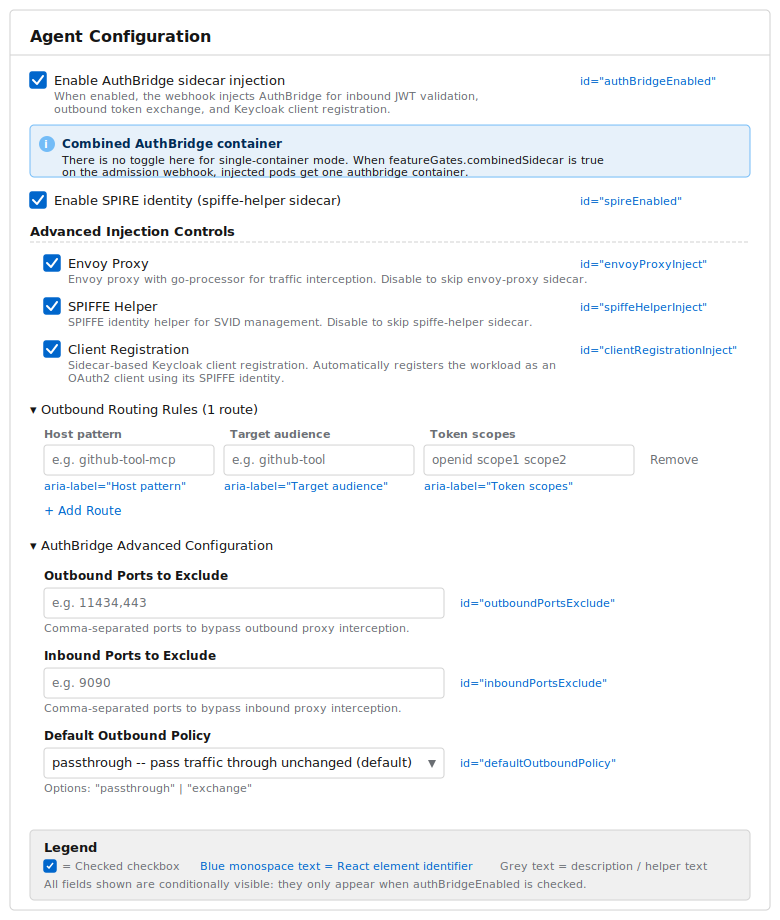
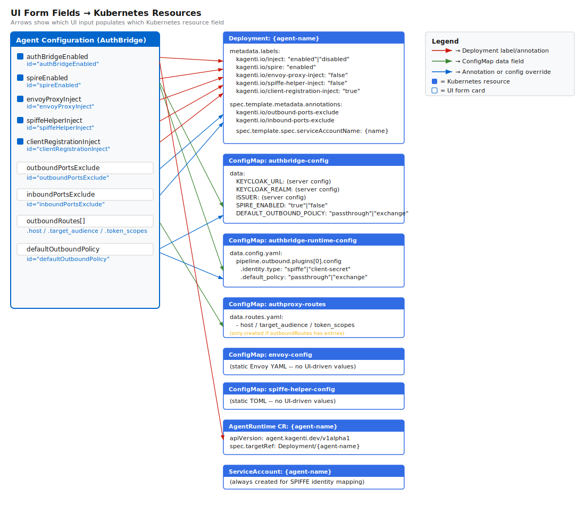
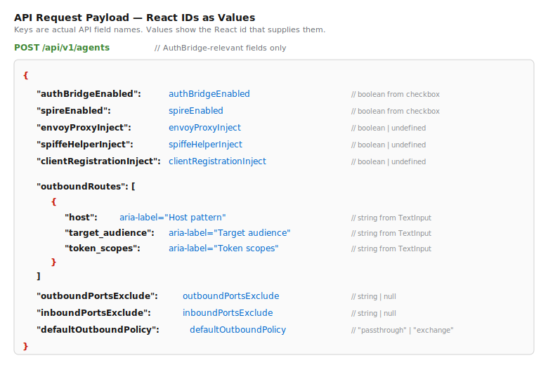
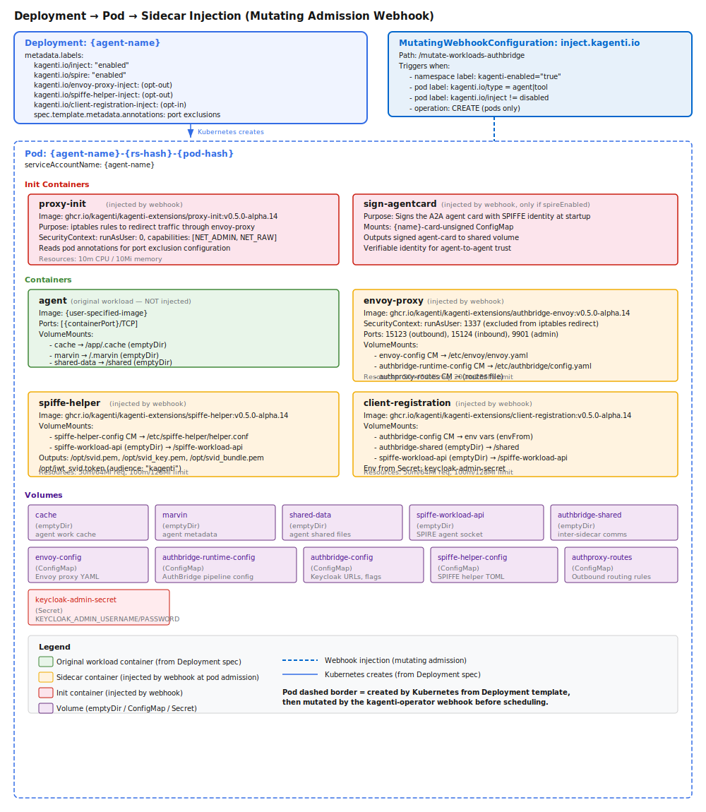
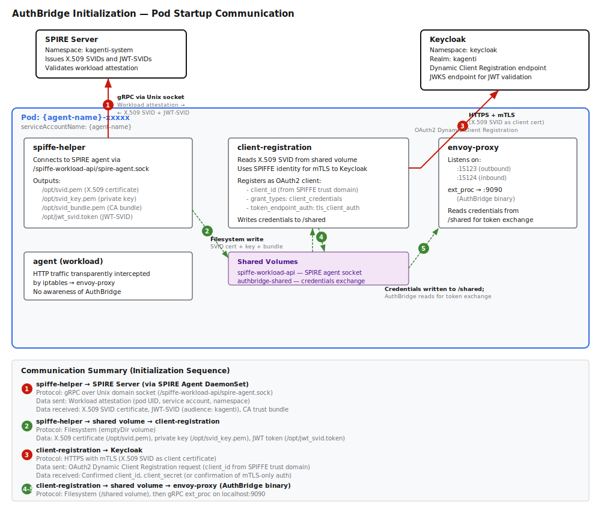

# AuthBridge Data Flow: UI to Running Sidecar

This document illustrates how data flows from the Agent Configuration Card in the
Kagenti UI through Kubernetes resources to the running AuthBridge sidecar.

---

## Illustration 1: Agent Configuration Card — AuthBridge Fields

This depicts the AuthBridge section of the Agent Configuration Card as it appears
in the UI, with each manipulatable element labeled by its React ID.

---

## Illustration 2: UI Elements → Kubernetes Resources Mapping

This diagram shows how each UI input maps to a specific Kubernetes resource
created when the operator clicks "Build & Deploy Agent."

---

## Illustration 3: API Request Payload — YAML with React IDs as Values

This shows the JSON payload sent to `POST /api/v1/agents`, with keys having their
actual names but values replaced by the React ID that supplies the value.

---

## Illustration 4: Deployment → Pod → Sidecar Injection

This diagram shows how the Kagenti Operator attaches AuthBridge sidecars to agent
pods via a Mutating Admission Webhook.

---

## Illustration 5: AuthBridge Initialization — Pod Startup Communication

This diagram shows what happens when an agent pod starts: the AuthBridge sidecars
contact external services to establish identity and register as an OAuth2 client.

---

## Description of Illustrations

### Illustration 1: Agent Configuration Card — AuthBridge Fields

This depicts the AuthBridge portion of the Agent Configuration Card as rendered in
the Kagenti UI (`ImportAgentPage.tsx`). It includes all form elements from the
`authBridgeEnabled` checkbox through the AuthBridge Advanced Configuration
expandable section. Each interactive element is annotated with its React `id`
attribute. The card has three logical groups:

1. **Top-level toggles** — `authBridgeEnabled`, `spireEnabled`
2. **Advanced Injection Controls** — `envoyProxyInject`, `spiffeHelperInject`,
   `clientRegistrationInject` (only visible when AuthBridge is enabled)
3. **Expandable sections** — "Outbound Routing Rules" (a dynamic list of
   host/audience/scopes rows) and "AuthBridge Advanced Configuration"
   (`outboundPortsExclude`, `inboundPortsExclude`, `defaultOutboundPolicy`)

### Illustration 2: UI Elements → Kubernetes Resources Mapping

This shows the relationship between every manipulatable UI element and the
Kubernetes resources that element influences when "Build & Deploy Agent" is
clicked. Arrows trace from each UI field to the specific resource field it
populates. The resources created are:

| Resource | Name | Condition |
|----------|------|-----------|
| Deployment | `{agent-name}` | Always (for workloadType=deployment) |
| ConfigMap | `authbridge-config` | `authBridgeEnabled=true` |
| ConfigMap | `authbridge-runtime-config` | `authBridgeEnabled=true` |
| ConfigMap | `envoy-config` | `authBridgeEnabled=true` |
| ConfigMap | `spiffe-helper-config` | `authBridgeEnabled=true` |
| ConfigMap | `authproxy-routes` | `outboundRoutes.length > 0` |
| ConfigMap | `{name}-card-unsigned` | `spireEnabled=true` |
| AgentRuntime CR | `{agent-name}` | `authBridgeEnabled=true` |
| ServiceAccount | `{agent-name}` | Always |
| RoleBinding | `agent-authbridge-scc` | `authBridgeEnabled=true` + OpenShift |

The **Deployment labels** (`kagenti.io/inject`, `kagenti.io/spire`, etc.) are what
the admission webhook reads at pod creation time to decide which sidecars to
inject. The **pod annotations** (`kagenti.io/outbound-ports-exclude`, etc.) are
read by the `proxy-init` init container to configure iptables rules.

### Illustration 3: API Request Payload

This shows the exact JSON structure sent to `POST /api/v1/agents`, limited to
AuthBridge-relevant fields. Keys are the literal API field names; values are
replaced by the React element IDs that supply them. This makes it clear that
the API is a direct serialization of the form state with no intermediate
transformation — the React state variables map 1:1 to API request fields.

### Illustration 4: Deployment → Pod → Sidecar Injection

This shows the complete anatomy of an agent pod after the Kagenti admission
webhook has mutated it. The webhook (`inject.kagenti.io`) fires on pod CREATE
when the namespace has `kagenti-enabled: "true"` and the pod has the correct
labels. It injects:

- **Init container**: `proxy-init` — sets up iptables to redirect traffic through
  Envoy (runs as root with NET_ADMIN)
- **Init container**: `sign-agentcard` — signs the A2A agent card with SPIFFE
  identity (only if `spireEnabled`)
- **Sidecar**: `envoy-proxy` — L7 proxy that intercepts all inbound/outbound HTTP
  traffic (runs as UID 1337 to avoid iptables loops)
- **Sidecar**: `spiffe-helper` — manages SPIFFE SVID lifecycle (certificate
  rotation)
- **Sidecar**: `client-registration` — registers the workload as a Keycloak
  OAuth2 client

All sidecars mount namespace-scoped ConfigMaps and share data through emptyDir
volumes. The `keycloak-admin-secret` Secret provides credentials for the
client-registration sidecar.

### Illustration 5: AuthBridge Initialization — Pod Startup Communication

This shows the initialization sequence when an agent pod starts:

1. **SPIFFE identity acquisition**: The `spiffe-helper` sidecar connects to the
   local SPIRE agent (via a Unix domain socket from a hostPath or CSI volume) and
   performs workload attestation. The SPIRE server validates the pod's identity
   (namespace, service account, pod UID) and issues an X.509 SVID and JWT-SVID.

2. **Certificate materialization**: The `spiffe-helper` writes certificate files
   to a shared emptyDir volume where `client-registration` can read them.

3. **Keycloak client registration**: The `client-registration` sidecar uses the
   X.509 SVID for mTLS authentication to Keycloak's Dynamic Client Registration
   endpoint. It registers the workload as an OAuth2 client with
   `tls_client_auth` authentication. The resulting credentials are written to
   `/shared` where the AuthBridge binary (running inside envoy-proxy) reads them
   for outbound token exchange operations.

After initialization, all HTTP traffic flows through `envoy-proxy`, which calls
the AuthBridge binary via gRPC ext_proc (port 9090) to perform inbound JWT
validation and outbound token exchange transparently to the agent workload.
