# Docs Link Graph

Auto-generated map of Markdown-to-Markdown links inside `docs/`.
Each node is a `.md` file; each arrow is a relative-path link from one file to another.
External links (`http://`, `https://`, `mailto:`), anchors (`#section`), and links to
non-Markdown assets (PDFs, images) are excluded.

- **Files scanned:** 94
- **Files with at least one outgoing link:** 44
- **Files referenced by another file:** 56
- **Files involved (have ≥ 1 incoming or outgoing edge):** 66
- **Edges:** 122

The root `README.md` is highlighted in blue. Files with no incoming or outgoing
links to/from other Markdown are omitted from the graph.

## How to regenerate

```bash
python3 /tmp/kagenti/docs-graph/build.py > /tmp/kagenti/docs-graph/edges.tsv
python3 /tmp/kagenti/docs-graph/render.py > docs/snible/docs-link-graph.md
```

(Scripts live under `/tmp/kagenti/docs-graph/` — move them into the repo if you want
this to be reproducible.)

## Diagram

```mermaid
graph LR
  %% Auto-generated from markdown links in docs/
  classDef root fill:#e3f2fd,stroke:#1976d2,stroke-width:2px;
  classDef dir fill:#f5f5f5,stroke:#616161;

  subgraph sg_root["docs/ (root)"]
    n_README_md["README.md"]
    n_components_md["components.md"]
    n_dev_guide_md["dev-guide.md"]
    n_gateway_md["gateway.md"]
    n_hypershift_auto_cleanup_md["hypershift-auto-cleanup.md"]
    n_identity_guide_md["identity-guide.md"]
    n_install_md["install.md"]
    n_local_models_md["local-models.md"]
    n_new_agent_md["new-agent.md"]
    n_new_tool_md["new-tool.md"]
    n_release_sop_md["release-sop.md"]
    n_releasing_md["releasing.md"]
    n_sandbox_guide_md["sandbox-guide.md"]
    n_skills_md["skills.md"]
    n_tech_details_md["tech-details.md"]
    n_troubleshooting_md["troubleshooting.md"]
    n_use_case_types_md["use-case-types.md"]
    n_user_stories_md["user-stories.md"]
  end

  subgraph sg_agentic-runtime["docs/agentic-runtime/"]
    n_agentic_runtime_agents_README_md["README.md"]
    n_agentic_runtime_agents_adk_agent_md["adk-agent.md"]
    n_agentic_runtime_agents_claude_sdk_agent_md["claude-sdk-agent.md"]
    n_agentic_runtime_agents_nemoclaw_hermes_md["nemoclaw-hermes.md"]
    n_agentic_runtime_agents_nemoclaw_openclaw_md["nemoclaw-openclaw.md"]
    n_agentic_runtime_agents_openshell_claude_md["openshell-claude.md"]
    n_agentic_runtime_agents_openshell_opencode_md["openshell-opencode.md"]
    n_agentic_runtime_agents_weather_supervised_md["weather-supervised.md"]
    n_agentic_runtime_conversation_and_hitl_md["conversation-and-hitl.md"]
    n_agentic_runtime_e2e_test_matrix_md["e2e-test-matrix.md"]
    n_agentic_runtime_openshell_integration_md["openshell-integration.md"]
    n_agentic_runtime_questions_md["questions.md"]
    n_agentic_runtime_sandboxing_layers_md["sandboxing-layers.md"]
    n_agentic_runtime_sandboxing_models_md["sandboxing-models.md"]
    n_agentic_runtime_tests_01_platform_health_md["01-platform-health.md"]
    n_agentic_runtime_tests_02_a2a_connectivity_md["02-a2a-connectivity.md"]
    n_agentic_runtime_tests_03_credential_security_md["03-credential-security.md"]
    n_agentic_runtime_tests_04_sandbox_lifecycle_md["04-sandbox-lifecycle.md"]
    n_agentic_runtime_tests_05_multiturn_conversation_md["05-multiturn-conversation.md"]
    n_agentic_runtime_tests_06_conversation_resume_md["06-conversation-resume.md"]
    n_agentic_runtime_tests_07_skill_execution_md["07-skill-execution.md"]
    n_agentic_runtime_tests_08_supervisor_enforcement_md["08-supervisor-enforcement.md"]
    n_agentic_runtime_tests_09_hitl_policy_md["09-hitl-policy.md"]
    n_agentic_runtime_tests_10_workspace_persistence_md["10-workspace-persistence.md"]
    n_agentic_runtime_tests_README_md["README.md"]
  end

  subgraph sg_authbridge["docs/authbridge/"]
    n_authbridge_README_md["README.md"]
    n_authbridge_demos_md["demos.md"]
    n_authbridge_deployment_guide_md["deployment-guide.md"]
    n_authbridge_roadmap_md["roadmap.md"]
    n_authbridge_security_model_md["security-model.md"]
  end

  subgraph sg_demos["docs/demos/"]
    n_demos_README_md["README.md"]
    n_demos_demo_file_organizer_agent_md["demo-file-organizer-agent.md"]
    n_demos_demo_generic_agent_skill_md["demo-generic-agent-skill.md"]
    n_demos_demo_generic_agent_md["demo-generic-agent.md"]
    n_demos_demo_image_agent_md["demo-image-agent.md"]
    n_demos_demo_slack_research_agent_md["demo-slack-research-agent.md"]
  end

  subgraph sg_developer["docs/developer/"]
    n_developer_README_md["README.md"]
    n_developer_claude_code_daily_commands_md["claude-code-daily-commands.md"]
    n_developer_claude_code_md["claude-code.md"]
    n_developer_hypershift_md["hypershift.md"]
    n_developer_kind_md["kind.md"]
  end

  subgraph sg_diagrams["docs/diagrams/"]
    n_diagrams_README_md["README.md"]
  end

  subgraph sg_ocp["docs/ocp/"]
    n_ocp_openshift_install_md["openshift-install.md"]
  end

  subgraph sg_plans["docs/plans/"]
    n_plans_migrate_agent_crd_to_workloads_md["migrate-agent-crd-to-workloads.md"]
    n_plans_migrate_tool_mcpserver_to_workloads_md["migrate-tool-mcpserver-to-workloads.md"]
  end

  subgraph sg_superpowers["docs/superpowers/"]
    n_superpowers_specs_2026_04_21_agent_sandbox_workload_type_design_md["2026-04-21-agent-sandbox-workload-type-design.md"]
    n_superpowers_specs_2026_04_30_adr_sandbox_direct_vs_claim_md["2026-04-30-adr-sandbox-direct-vs-claim.md"]
    n_superpowers_specs_2026_04_30_agent_sandbox_upstream_issues_md["2026-04-30-agent-sandbox-upstream-issues.md"]
  end

  %% Links
  n_README_md --> n_demos_README_md
  n_README_md --> n_dev_guide_md
  n_README_md --> n_developer_README_md
  n_README_md --> n_gateway_md
  n_README_md --> n_identity_guide_md
  n_README_md --> n_install_md
  n_README_md --> n_new_agent_md
  n_README_md --> n_new_tool_md
  n_README_md --> n_tech_details_md
  n_README_md --> n_use_case_types_md
  n_README_md --> n_user_stories_md
  n_agentic_runtime_agents_README_md --> n_agentic_runtime_agents_adk_agent_md
  n_agentic_runtime_agents_README_md --> n_agentic_runtime_agents_claude_sdk_agent_md
  n_agentic_runtime_agents_README_md --> n_agentic_runtime_agents_openshell_claude_md
  n_agentic_runtime_agents_README_md --> n_agentic_runtime_agents_openshell_opencode_md
  n_agentic_runtime_agents_README_md --> n_agentic_runtime_agents_weather_supervised_md
  n_agentic_runtime_agents_README_md --> n_agentic_runtime_openshell_integration_md
  n_agentic_runtime_agents_adk_agent_md --> n_agentic_runtime_agents_README_md
  n_agentic_runtime_agents_adk_agent_md --> n_agentic_runtime_openshell_integration_md
  n_agentic_runtime_agents_claude_sdk_agent_md --> n_agentic_runtime_agents_README_md
  n_agentic_runtime_agents_claude_sdk_agent_md --> n_agentic_runtime_openshell_integration_md
  n_agentic_runtime_agents_nemoclaw_hermes_md --> n_agentic_runtime_agents_README_md
  n_agentic_runtime_agents_nemoclaw_hermes_md --> n_agentic_runtime_openshell_integration_md
  n_agentic_runtime_agents_nemoclaw_openclaw_md --> n_agentic_runtime_agents_README_md
  n_agentic_runtime_agents_nemoclaw_openclaw_md --> n_agentic_runtime_openshell_integration_md
  n_agentic_runtime_agents_openshell_claude_md --> n_agentic_runtime_agents_README_md
  n_agentic_runtime_agents_openshell_claude_md --> n_agentic_runtime_openshell_integration_md
  n_agentic_runtime_agents_openshell_opencode_md --> n_agentic_runtime_agents_README_md
  n_agentic_runtime_agents_openshell_opencode_md --> n_agentic_runtime_openshell_integration_md
  n_agentic_runtime_agents_weather_supervised_md --> n_agentic_runtime_agents_README_md
  n_agentic_runtime_agents_weather_supervised_md --> n_agentic_runtime_openshell_integration_md
  n_agentic_runtime_conversation_and_hitl_md --> n_agentic_runtime_openshell_integration_md
  n_agentic_runtime_e2e_test_matrix_md --> n_agentic_runtime_openshell_integration_md
  n_agentic_runtime_openshell_integration_md --> n_agentic_runtime_agents_README_md
  n_agentic_runtime_openshell_integration_md --> n_agentic_runtime_conversation_and_hitl_md
  n_agentic_runtime_openshell_integration_md --> n_agentic_runtime_e2e_test_matrix_md
  n_agentic_runtime_openshell_integration_md --> n_agentic_runtime_questions_md
  n_agentic_runtime_openshell_integration_md --> n_agentic_runtime_sandboxing_layers_md
  n_agentic_runtime_openshell_integration_md --> n_agentic_runtime_sandboxing_models_md
  n_agentic_runtime_openshell_integration_md --> n_agentic_runtime_tests_README_md
  n_agentic_runtime_questions_md --> n_agentic_runtime_e2e_test_matrix_md
  n_agentic_runtime_questions_md --> n_agentic_runtime_openshell_integration_md
  n_agentic_runtime_questions_md --> n_agentic_runtime_sandboxing_layers_md
  n_agentic_runtime_sandboxing_layers_md --> n_agentic_runtime_openshell_integration_md
  n_agentic_runtime_sandboxing_models_md --> n_agentic_runtime_openshell_integration_md
  n_agentic_runtime_tests_README_md --> n_agentic_runtime_e2e_test_matrix_md
  n_agentic_runtime_tests_README_md --> n_agentic_runtime_openshell_integration_md
  n_agentic_runtime_tests_README_md --> n_agentic_runtime_tests_01_platform_health_md
  n_agentic_runtime_tests_README_md --> n_agentic_runtime_tests_02_a2a_connectivity_md
  n_agentic_runtime_tests_README_md --> n_agentic_runtime_tests_03_credential_security_md
  n_agentic_runtime_tests_README_md --> n_agentic_runtime_tests_04_sandbox_lifecycle_md
  n_agentic_runtime_tests_README_md --> n_agentic_runtime_tests_05_multiturn_conversation_md
  n_agentic_runtime_tests_README_md --> n_agentic_runtime_tests_06_conversation_resume_md
  n_agentic_runtime_tests_README_md --> n_agentic_runtime_tests_07_skill_execution_md
  n_agentic_runtime_tests_README_md --> n_agentic_runtime_tests_08_supervisor_enforcement_md
  n_agentic_runtime_tests_README_md --> n_agentic_runtime_tests_09_hitl_policy_md
  n_agentic_runtime_tests_README_md --> n_agentic_runtime_tests_10_workspace_persistence_md
  n_authbridge_README_md --> n_authbridge_demos_md
  n_authbridge_README_md --> n_authbridge_deployment_guide_md
  n_authbridge_README_md --> n_authbridge_roadmap_md
  n_authbridge_README_md --> n_authbridge_security_model_md
  n_authbridge_README_md --> n_identity_guide_md
  n_authbridge_demos_md --> n_authbridge_deployment_guide_md
  n_authbridge_security_model_md --> n_identity_guide_md
  n_components_md --> n_demos_README_md
  n_components_md --> n_gateway_md
  n_components_md --> n_identity_guide_md
  n_components_md --> n_install_md
  n_components_md --> n_new_agent_md
  n_components_md --> n_new_tool_md
  n_components_md --> n_tech_details_md
  n_demos_README_md --> n_demos_demo_file_organizer_agent_md
  n_demos_README_md --> n_demos_demo_generic_agent_md
  n_demos_README_md --> n_demos_demo_image_agent_md
  n_demos_README_md --> n_demos_demo_slack_research_agent_md
  n_demos_README_md --> n_tech_details_md
  n_demos_demo_file_organizer_agent_md --> n_install_md
  n_demos_demo_file_organizer_agent_md --> n_local_models_md
  n_demos_demo_file_organizer_agent_md --> n_troubleshooting_md
  n_demos_demo_generic_agent_skill_md --> n_demos_demo_generic_agent_md
  n_demos_demo_generic_agent_skill_md --> n_install_md
  n_demos_demo_generic_agent_skill_md --> n_local_models_md
  n_demos_demo_generic_agent_skill_md --> n_skills_md
  n_demos_demo_generic_agent_md --> n_install_md
  n_demos_demo_generic_agent_md --> n_local_models_md
  n_demos_demo_generic_agent_md --> n_troubleshooting_md
  n_demos_demo_image_agent_md --> n_local_models_md
  n_demos_demo_slack_research_agent_md --> n_install_md
  n_demos_demo_slack_research_agent_md --> n_troubleshooting_md
  n_developer_README_md --> n_components_md
  n_developer_README_md --> n_dev_guide_md
  n_developer_README_md --> n_developer_claude_code_daily_commands_md
  n_developer_README_md --> n_developer_claude_code_md
  n_developer_README_md --> n_developer_hypershift_md
  n_developer_README_md --> n_developer_kind_md
  n_developer_README_md --> n_install_md
  n_developer_claude_code_daily_commands_md --> n_developer_claude_code_md
  n_developer_claude_code_md --> n_developer_hypershift_md
  n_developer_claude_code_md --> n_developer_kind_md
  n_developer_kind_md --> n_developer_README_md
  n_diagrams_README_md --> n_identity_guide_md
  n_hypershift_auto_cleanup_md --> n_developer_hypershift_md
  n_install_md --> n_identity_guide_md
  n_install_md --> n_local_models_md
  n_install_md --> n_troubleshooting_md
  n_new_agent_md --> n_install_md
  n_new_tool_md --> n_components_md
  n_new_tool_md --> n_gateway_md
  n_new_tool_md --> n_install_md
  n_new_tool_md --> n_new_agent_md
  n_ocp_openshift_install_md --> n_local_models_md
  n_plans_migrate_tool_mcpserver_to_workloads_md --> n_plans_migrate_agent_crd_to_workloads_md
  n_release_sop_md --> n_releasing_md
  n_sandbox_guide_md --> n_ocp_openshift_install_md
  n_skills_md --> n_components_md
  n_skills_md --> n_install_md
  n_skills_md --> n_troubleshooting_md
  n_superpowers_specs_2026_04_30_adr_sandbox_direct_vs_claim_md --> n_superpowers_specs_2026_04_21_agent_sandbox_workload_type_design_md
  n_superpowers_specs_2026_04_30_adr_sandbox_direct_vs_claim_md --> n_superpowers_specs_2026_04_30_agent_sandbox_upstream_issues_md
  n_superpowers_specs_2026_04_30_agent_sandbox_upstream_issues_md --> n_superpowers_specs_2026_04_30_adr_sandbox_direct_vs_claim_md
  n_use_case_types_md --> n_user_stories_md
  n_user_stories_md --> n_use_case_types_md

  class n_README_md root;
```


